# mana-lite — Big Picture

Para quien llega hoy. Qué hace el sistema, por qué tiene la forma que tiene, y
qué tenés que entender antes de tocar nada.

Documento conceptual. El detalle de implementación está en
[ARCHITECTURE.md](ARCHITECTURE.md); el detalle por subsistema, en `docs/wiki/`.

---

## Qué hace

Toma video de una cámara IP y produce **estados clínicos**: "la habitación está
vacía", "hay una persona", "hay más de una", "la cara está dentro de la zona de
la cama". No produce detecciones para que las mire un humano: produce
afirmaciones sobre las que otro sistema puede actuar.

Esa diferencia gobierna todo el diseño. Un detector puede equivocarse en un
cuadro y no pasa nada. Un estado clínico que parpadea es un sistema que no sirve.

## Las dos velocidades

El sistema tiene dos ritmos, y son distintos a propósito.

**Percepción** corre al ritmo del video. La cámara entrega un keyframe cuando se
le da la gana —- típicamente uno por segundo, pero eso depende del encoder, de la
escena y de la red. Decodificar y correr los modelos ocurre cuando llega un
frame, no antes.

**Control** corre a cadencia fija: un *scan* cada 200 ms, 5 Hz. Siempre, haya
llegado un frame o no.

Por qué separarlos: la política clínica se expresa en tiempo real. Cuando la
configuración dice

```toml
single_confirm_ms = 3000    # 3 segundos con una persona para confirmar
```

tienen que ser **3 segundos de reloj**. Si esa regla contara keyframes, su
significado cambiaría con el encoder: 3 frames son 3 segundos con una cámara y 0,7
con otra. La misma configuración clínica querría decir cosas distintas según el
hardware. Eso es inaceptable en un sistema que decide sobre personas.

Por eso el control tiene su propio reloj y su propia cadencia, y la percepción le
entrega observaciones cuando puede. Es la lógica de un PLC: el ciclo manda.

> **Consecuencia práctica.** Nunca expreses una regla clínica en cantidad de
> frames, detecciones o ciclos. Si te encontrás escribiendo "después de 3
> detecciones", parás: eso pertenece al dominio de percepción, no al de control.

## Los dos dominios

```mermaid
flowchart LR

    subgraph P["Percepción — ritmo del video"]
        direction TB
        IN["RetinaReader<br/>RTSP + H.264"]
        DEC["decode"]
        INF["InferEngine<br/>cascada YOLO"]
        IN --> DEC --> INF
    end

    subgraph PORT["Puerto"]
        direction TB
        PI["ProcessImage"]
    end

    subgraph C["Control — cadencia fija 5 Hz"]
        direction TB
        SC["scan()"]
        TR["Track (Kalman)"]
        ZO["ZoneEngine"]
        FS["FsmEngine"]
        SC --> TR --> ZO --> FS
    end

    subgraph O["Observabilidad"]
        direction TB
        JS["JSONL"]
        RR["Rerun"]
    end

    INF --> PI --> SC
    FS -.-> O
    INF -.-> O

    classDef perc fill:#FFFFFF,stroke:#65B86B,stroke-width:2px,color:#222;
    classDef port fill:#FFFFFF,stroke:#5B9BEA,stroke-width:2px,color:#222;
    classDef ctrl fill:#FFFFFF,stroke:#F0B429,stroke-width:2px,color:#222;
    classDef obs  fill:#FFFFFF,stroke:#A56DE2,stroke-width:2px,color:#222;

    class IN,DEC,INF perc;
    class PI port;
    class SC,TR,ZO,FS ctrl;
    class JS,RR obs;

    style P fill:#F5FBF5,stroke:#65B86B,stroke-width:2px,color:#222;
    style PORT fill:#F5F9FF,stroke:#5B9BEA,stroke-width:2px,color:#222;
    style C fill:#FFFAF0,stroke:#F0B429,stroke-width:2px,color:#222;
    style O fill:#FAF5FF,stroke:#A56DE2,stroke-width:2px,color:#222;
```



**Percepción** no sabe nada de zonas, estados ni política clínica. Entrega qué
vio y con cuánta confianza.

**Control** no sabe nada de ONNX, de cascadas ni de crops. Consume observaciones
y produce estados.

**El puerto entre ellos** (`ProcessImage`) es lo que hace que esa separación sea
real y no un comentario. Percepción escribe ahí; control lee de ahí. Ninguno de
los dos toca los tipos internos del otro.

**Observabilidad** es el tercer subsistema —- y hasta hoy era el único **sin
puerto declarado**. Esa omisión no es cosmética: es la causa directa de que la
visualización pudiera frenar el control. Ver ARCHITECTURE.md → *La costura*.

## Cómo se configura

Tres capas, de lo general a lo específico:

| Capa | Archivo | Qué decide |
|---|---|---|
| Despliegue | `config/mana.toml` | cámara, transporte, qué etapas están prendidas, política clínica |
| Perfil | `config/blueprints/<nombre>/blueprint.toml` | qué modelos, qué cascada, qué FSM |
| Modelos | `models.toml` + overlay del blueprint | umbrales, ROIs, tamaños de entrada |

`mana.toml` distingue explícitamente dos clases de valor, y la distinción
importa:

- **Mecanismo de despliegue** — cambia con el hardware. Resolución, transporte,
  timeouts, direcciones.
- **Política clínica** — expresa intención del protocolo y es agnóstica de
  cámara. `single_confirm_ms`, `empty_confirm_ms`, los `dwell` del FSM.

No se multiplican los tiempos clínicos para compensar una frecuencia de I-frame
distinta. Si el sistema no confirma a tiempo con una cámara más lenta, el
problema es la cámara o la ingesta, no el protocolo.

## El vocabulario

Todo lo que cruza fronteras usa identificadores tipados (`ModelId`, `ClassName`,
`StateId`, `ZoneId`, `SignalTag`), no `String`. Es lo que impide que un typo en
un TOML se convierta en una comparación que siempre da falso.

Las **señales** merecen mención aparte. El FSM ya no tiene un guard por concepto
clínico; tiene un guard genérico `signal` que compara contra un catálogo
versionado de nueve etiquetas:

```toml
guards = [{ type = "signal", tag = "ocupacion.cardinalidad", op = "==", value = "single" }]
```

El catálogo declara el tipo de cada señal (`Bool`, `Count`, `Ratio`, `Label`) y,
para las etiquetadas, su conjunto cerrado de valores. Todo eso se valida al
arrancar: una guarda que no podría evaluarse nunca se rechaza con diagnóstico en
vez de aceptarse en silencio.

Ese principio —- **un knob que se declara tiene que gobernar algo** —- aparece
repetido en el código y es la regla cultural más importante del proyecto. Una
configuración que se acepta y se ignora es una mentira, y este sistema no puede
permitirse mentiras sobre su propia configuración.

## Qué leer después

1. [ARCHITECTURE.md](ARCHITECTURE.md) — hilos, relojes, puertos e invariantes.
   Léelo antes de tocar el loop principal.
2. `workshop/README.md` — cómo se prueba una capa por vez, y por qué.
3. `docs/wiki/` — referencia por subsistema.
