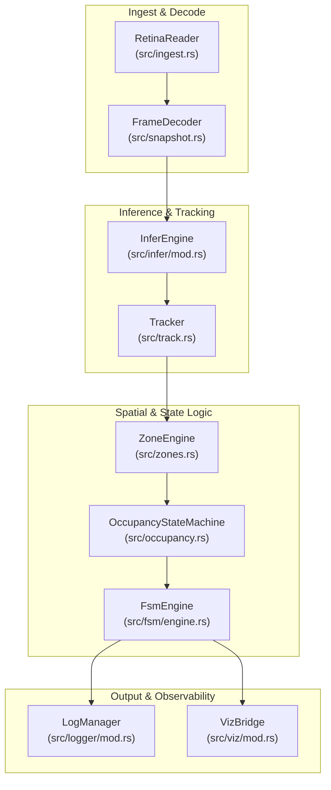
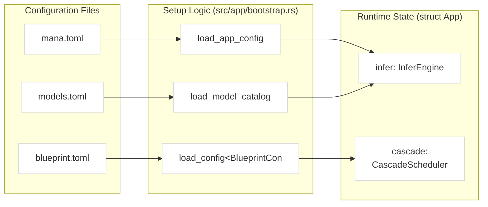

# Overview

Relevant source files

- [](.gitignore)
- [](README.md?plain=1)
- [](src/lib.rs)
- [](src/app/mod.rs)

The `mana-lite` system is a high-performance, real-time room presence and face-detection pipeline. It is designed to ingest RTSP video streams and execute a multi-stage computer vision pipeline including object detection, pose estimation, segmentation, and depth analysis. The system tracks individuals across frames, evaluates spatial occupancy within defined zones, and drives a finite state machine (FSM) to determine complex room states such as occupancy cardinality and specific behavioral events (e.g., "in bed" or "exiting").

[README.md1-6](README.md?plain=1#L1-L6)

## System Architecture

The application is structured as a linear pipeline managed by
[`App`](src/app/mod.rs). The lifecycle of a video frame involves ingestion,
decoding, inference, and sequential logic processing.

### Data Flow Overview

1. **Ingest**: [`IngestEngine`](src/ingest.rs) uses [`RetinaReader`](src/ingest.rs) to capture H.264 Annex-B streams from RTSP sources.
2. **Inference**: [`InferEngine`](src/infer/mod.rs) executes models defined in a central `ModelCatalog`. It supports cascading models, where a primary detection (e.g., a person) triggers secondary crops for higher-resolution analysis (e.g., a face).
3. **Tracking & Spatial Logic**: Detections are fed into [`Tracker`](src/track.rs) (using Kalman filters and Hungarian assignment). The resulting tracks are evaluated against [`ZoneEngine`](src/zones.rs) to determine spatial presence.
4. **State Evaluation**: [`OccupancyStateMachine`](src/occupancy.rs) and [`FsmEngine`](src/fsm/engine.rs) consume presence and depth data to transition between high-level application states.
5. **Observability**: Data is simultaneously published via `VizBridge` to Rerun.io and logged as structured JSONL by [`LogManager`](src/logger/mod.rs).

**Sources:** [`App`](src/app/mod.rs), [README.md](README.md?plain=1)

### Code Entity Mapping: Pipeline Logic

The following diagram maps the logical stages of the pipeline to the primary Rust structs and modules responsible for their execution.


**Sources:** [`App`](src/app/mod.rs), [`InferEngine`](src/infer/mod.rs), [`FsmEngine`](src/fsm/engine.rs)

## Workspace Layout

The project is organized as a Cargo workspace to separate core logic from reusable utility crates located in the `std/` directory.

|Component|Path|Description|
|---|---|---|
|**Application**|`src/`|The main binary logic, including the `App` loop and pipeline orchestration.|
|**mana-types**|`std/mana-types`|Shared primitives like `RawFrameV1` and `PixelFormat`.|
|**mana-geometry**|`std/mana-geometry`|Spatial math, `CompactMask` (RLE), and polygon operations.|
|**mana-video**|`std/mana-video`|Video decoding utilities and `BufferPool` management.|
|**mana-rtsp**|`std/mana-rtsp`|Low-level H.264 Annex-B and RTSP stream utilities.|
|**mana-viz**|`std/mana-viz`|The bridge for logging data to the Rerun.io visualization engine.|

For a detailed breakdown of these crates, see [Workspace Crates (#1.2)](Workspace%20Crates%20\(#1.2\))

**Sources:** [README.md8-21](README.md?plain=1#L8-L21)

## Building and Running

The system is written in Rust (Edition 2024). Configuration is managed through a layered approach using `.toml` files and environment variables.

### Build Requirements

- **Rust Toolchain**: Edition 2024.
- **Dependencies**: The project relies on `tokio` for the async runtime and `ultralytics-inference` for model execution.

```
cargo build --release
```

### Execution Flow

The binary loads `AppConfig`, then [`bootstrap`](src/app/bootstrap.rs)
initializes [`App`](src/app/mod.rs), validating the model catalog and
blueprints before the main processing loop starts.

For detailed setup and environment variable configuration (e.g., `MANA_SOURCE_USERNAME`), see [Getting Started (#1.1)](Getting%20Started%20\(#1.1\))

**Sources:** [README.md](README.md?plain=1), [`bootstrap`](src/app/bootstrap.rs), [`App`](src/app/mod.rs)

### Code Entity Mapping: Configuration & Setup

This diagram illustrates how configuration files and environment variables are ingested into the system's internal state.



**Sources:** [`bootstrap`](src/app/bootstrap.rs), [`App`](src/app/mod.rs)

## Child Pages

- **[Getting Started](https://deepwiki.com/ernestovisiona-netizen/kik8/1.1-getting-started)**: Environment setup, `mana.toml` configuration, and RTSP stream authentication.
- **[Workspace Crates](https://deepwiki.com/ernestovisiona-netizen/kik8/1.2-workspace-crates)**: Technical details on the supporting library crates in `std/`.


### On this page

- [Overview](https://deepwiki.com/ernestovisiona-netizen/kik8/1-overview#overview)
- [System Architecture](https://deepwiki.com/ernestovisiona-netizen/kik8/1-overview#system-architecture)
- [Data Flow Overview](https://deepwiki.com/ernestovisiona-netizen/kik8/1-overview#data-flow-overview)
- [Code Entity Mapping: Pipeline Logic](https://deepwiki.com/ernestovisiona-netizen/kik8/1-overview#code-entity-mapping-pipeline-logic)
- [Workspace Layout](https://deepwiki.com/ernestovisiona-netizen/kik8/1-overview#workspace-layout)
- [Building and Running](https://deepwiki.com/ernestovisiona-netizen/kik8/1-overview#building-and-running)
- [Build Requirements](https://deepwiki.com/ernestovisiona-netizen/kik8/1-overview#build-requirements)
- [Execution Flow](https://deepwiki.com/ernestovisiona-netizen/kik8/1-overview#execution-flow)
- [Code Entity Mapping: Configuration & Setup](https://deepwiki.com/ernestovisiona-netizen/kik8/1-overview#code-entity-mapping-configuration-setup)
- [Child Pages](https://deepwiki.com/ernestovisiona-netizen/kik8/1-overview#child-pages)
