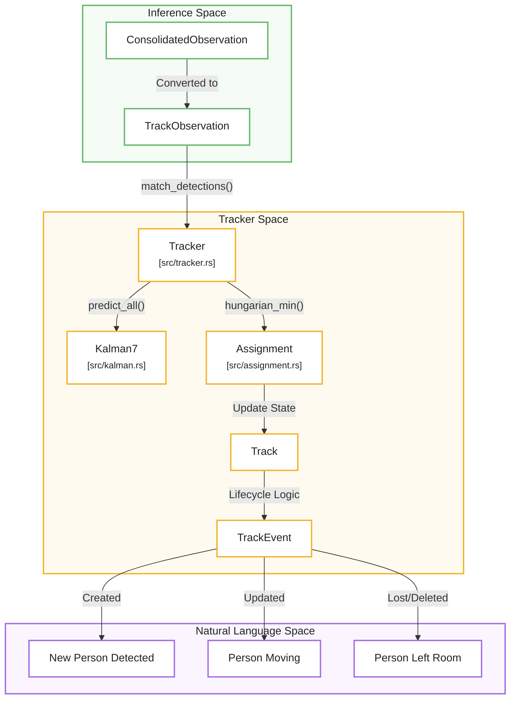
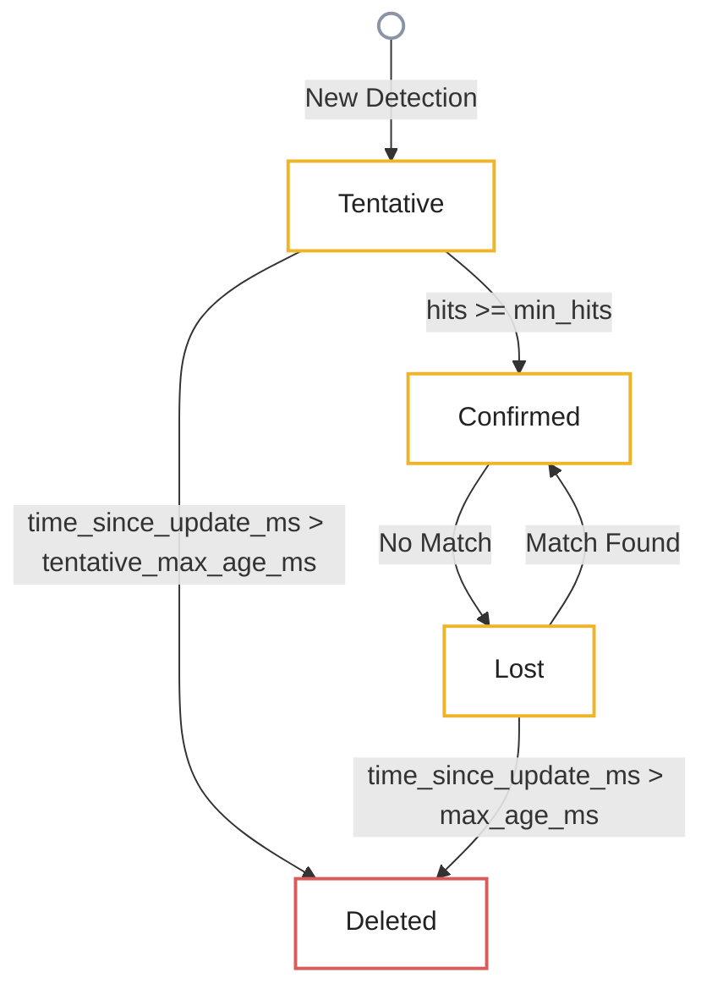

# Multi-Object Tracking

Relevant source files

- 
- 
- 

Multi-Object Tracking (MOT) in `mana-lite` is responsible for maintaining temporal consistency of detected objects across video frames. It transforms discrete detections from the inference engine into persistent `Track` entities, each with a unique ID and a motion model. The system uses a SORT-inspired approach (Simple Online and Realtime Tracking) combining a Kalman Filter for motion estimation and the Hungarian Algorithm for optimal data association.

### System Architecture

The tracking logic is encapsulated in the `Tracker` struct, which manages a collection of `Track` objects. The pipeline follows a predict-match-update cycle for every processed frame.

#### Data Flow and Code Entities

The following diagram illustrates how raw detections are transformed into tracked objects through the primary internal structures.

**Tracking Data Flow**

**Sources:** [src/track.rs9-23](src/track.rs#L9-L23) [src/track.rs49-55](src/track.rs#L49-L55) [src/track.rs93-100](src/track.rs#L93-L100) [src/track.rs119-140](src/track.rs#L119-L140)

---

### Motion Model: Kalman7

The system implements a 7-dimensional Kalman Filter (`Kalman7`) to model object motion. It assumes a constant velocity model where the transition matrix `F` is parameterized by the real elapsed time (`dt` in seconds) between processed keyframes — the pipeline measures it (`keyframe_gap_ms`) and passes it down to every `predict(dt_s)`. A stalled stream therefore extrapolates over the full gap instead of moving one fixed step.

**State Vector (`x`):** `[cx, cy, s, r, dcx, dcy, ds]`

- `cx, cy`: Center coordinates of the bounding box.
- `s`: Scale (area = width * height).
- `r`: Aspect ratio (width / height).
- `dcx, dcy, ds`: First derivatives (velocities) of center and scale.

**Implementation Details:**

- **Prediction:** The `predict(dt_s)` function projects the state forward with the time-parameterized transition matrix `transition(dt)`, clamping stale deltas to `MAX_DT_S = 2 s` and scaling the process noise `Q` by `dt / NOMINAL_DT_S` (nominal step `0.2 s`) [src/kalman.rs15-34](src/kalman.rs#L15-L34) [src/kalman.rs82-97](src/kalman.rs#L82-L97)
- **Observation:** The system observes `[cx, cy, s, r]`. The `update()` function calculates the innovation (residual) and applies the Kalman gain to correct the state [src/kalman.rs100-149](src/kalman.rs#L100-L149)
- **Stability:** A small epsilon (`1e-3`) is used when calculating scale and aspect ratio to prevent division by zero [src/kalman.rs160-161](src/kalman.rs#L160-L161)
- **Units:** velocities live in `px/s`. The initial velocity covariance (`P0`) and process noise (`Q`) are rescaled by `1 / NOMINAL_DT_S²` on the velocity rows so behavior at the nominal step matches the original per-frame calibration.

**Sources:** [src/kalman.rs1-12](src/kalman.rs#L1-L12) [src/kalman.rs15-34](src/kalman.rs#L15-L34) [src/kalman.rs82-97](src/kalman.rs#L82-L97) [src/kalman.rs159-182](src/kalman.rs#L159-L182)

---

### Data Association (Hungarian Algorithm)

To associate new detections with existing tracks, the system uses the **Hungarian Algorithm** (Kuhn-Munkres) implemented in `src/assignment.rs`.

1. **Cost Matrix:** A matrix is built where `cost[i][j] = 1.0 - IoU(track_i, detection_j)` [src/track.rs207-215](src/track.rs#L207-L215)
2. **Constraints:** Pairs with different object classes (e.g., a "person" track and a "face" detection) are assigned an infinite cost to prevent illegal matching [src/track.rs210-212](src/track.rs#L210-L212)
3. **Optimal Matching:** `hungarian_min` finds the global minimum cost assignment with $O(n^3)$ complexity [src/assignment.rs13-16](src/assignment.rs#L13-L16)
4. **Gating:** Matches with a cost exceeding `1.0 - iou_threshold` (default 0.2 IoU) are rejected [src/track.rs217-218](src/track.rs#L217-L218)

**Sources:** [src/assignment.rs1-16](src/assignment.rs#L1-L16) [src/track.rs88-89](src/track.rs#L88-L89) [src/track.rs200-226](src/track.rs#L200-L226)

---

### Track Lifecycle

Tracks transition through several states based on detection evidence and time.

|State|Condition|Behavior|
|---|---|---|
|**Tentative**|Created from an unmatched detection.|`is_confirmed = false`. Not reported to FSM.|
|**Confirmed**|Reaches `min_hits` (default 2).|`is_confirmed = true`. Active for occupancy/FSM.|
|**Lost**|No matching detection in current keyframe.|`misses` incremented and `time_since_update_ms` accumulates real time (dt of each cycle).|
|**Deleted**|`time_since_update_ms > max_age_ms` (confirmed) or `> tentative_max_age_ms` (tentative).|Track is removed from memory by elapsed time, not by frame count. Defaults 4000 ms / 600 ms.|

**Track State Machine**

**Sources:** [src/track.rs22-23](src/track.rs#L22-L23) [src/track.rs82-91](src/track.rs#L82-L91) [src/track.rs134-137](src/track.rs#L134-L137)

---

### Advanced Features

#### Single-Person Reacquisition

When the system expects only one person (e.g., in a private room), it can use `update_single_person`. If a detection is unmatched by IoU, the tracker attempts to reacquire the most recently seen confirmed track regardless of distance, provided it is the only candidate. This prevents ID-switches during brief occlusions or detector dropouts; it remains relevant in the window where the clamp `MAX_DT_S = 2 s` is reached but the track is still under `max_age_ms` (2-4 s) [src/track.rs157-165](src/track.rs#L157-L165)

#### Evidence Merging

Each `Track` maintains a `Vec<DetectionEvidence>`. When a track is updated or enriched, the `merge_evidence` function combines new detection metadata (like classification confidence or sub-component masks) into the track. If a model provides higher confidence for the same evidence type, the track's record is updated [src/track.rs163-191](src/track.rs#L163-L191)

**Sources:** [src/track.rs10-23](src/track.rs#L10-L23) [src/track.rs227-250](src/track.rs#L227-L250)

### On this page

- [Multi-Object Tracking](https://deepwiki.com/ernestovisiona-netizen/kik8/2.3-multi-object-tracking#multi-object-tracking)
- [System Architecture](https://deepwiki.com/ernestovisiona-netizen/kik8/2.3-multi-object-tracking#system-architecture)
- [Data Flow and Code Entities](https://deepwiki.com/ernestovisiona-netizen/kik8/2.3-multi-object-tracking#data-flow-and-code-entities)
- [Motion Model: Kalman7](https://deepwiki.com/ernestovisiona-netizen/kik8/2.3-multi-object-tracking#motion-model-kalman7)
- [Data Association (Hungarian Algorithm)](https://deepwiki.com/ernestovisiona-netizen/kik8/2.3-multi-object-tracking#data-association-hungarian-algorithm)
- [Track Lifecycle](https://deepwiki.com/ernestovisiona-netizen/kik8/2.3-multi-object-tracking#track-lifecycle)
- [Advanced Features](https://deepwiki.com/ernestovisiona-netizen/kik8/2.3-multi-object-tracking#advanced-features)
- [Single-Person Reacquisition](https://deepwiki.com/ernestovisiona-netizen/kik8/2.3-multi-object-tracking#single-person-reacquisition)
- [Evidence Merging](https://deepwiki.com/ernestovisiona-netizen/kik8/2.3-multi-object-tracking#evidence-merging)
