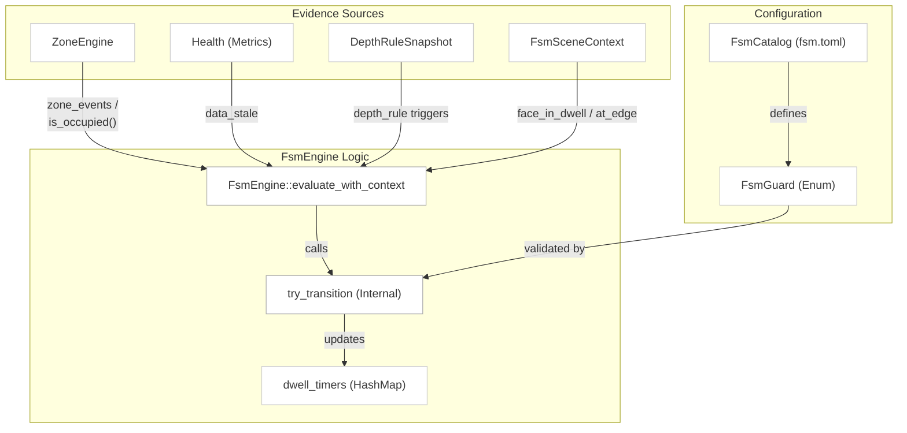
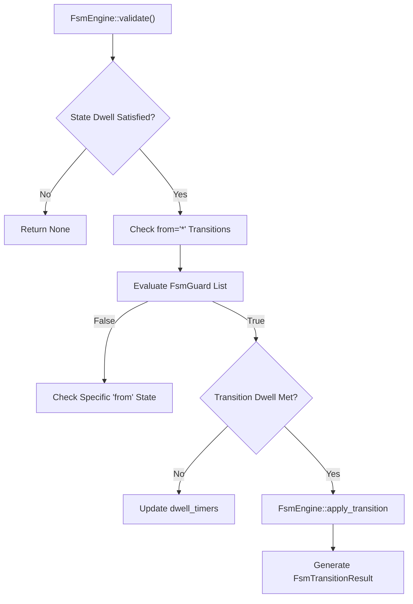
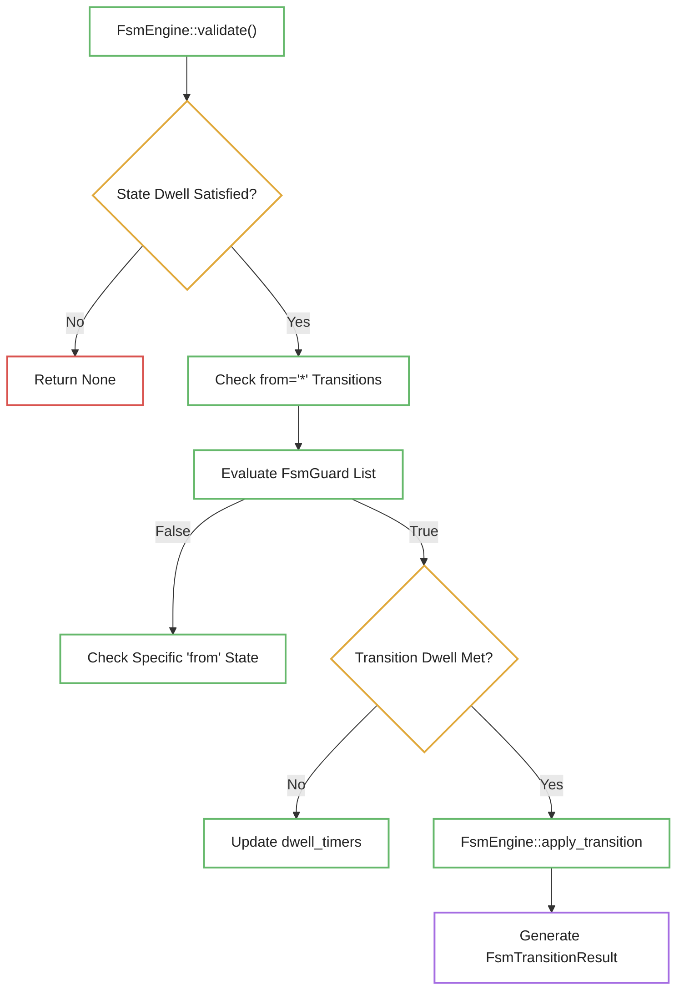

# FSM Guards and Transitions

Relevant source files

- 
- 
- 
- 
- 
- 
- 

The Finite State Machine (FSM) subsystem evaluates scene context and frame-level evidence to manage state transitions. The `FsmEngine` uses a set of configurable `FsmGuard` types to determine when a transition should trigger based on occupancy, depth rules, health status, and specialized face-tracking signals.

## FSM Architecture and Data Flow

[`FsmEngine`](src/fsm/engine.rs) is a stateful processor that consumes evidence
from `ZoneEngine`, `Health`, `DepthRuleSnapshot`, and
[`FsmSceneContext`](src/fsm/engine.rs). It maintains `current_state` and
temporal `dwell_timers`.

### FSM Context Mapping

This diagram bridges the high-level FSM configuration concepts to the specific Rust structs and engines that provide the underlying data.

"FSM Context to Code Mapping"

**Sources:** [`FsmEngine::evaluate_with_context`](src/fsm/engine.rs), [`FsmSceneContext`](src/fsm/engine.rs), [`FsmGuard`](src/config/fsm.rs)

---

## FSM Guards Reference

Guards are defined in the `FsmGuard` enum [src/config/fsm.rs37-102](src/config/fsm.rs#L37-L102) Every transition in the `fsm.toml` file contains a list of guards; all guards in the list must evaluate to `true` for the transition to fire.

### Occupancy Guards

These guards rely on the `ZoneEngine` which processes track intersections with defined `zones.toml` regions [src/zones.rs64-114](src/zones.rs#L64-L114)

|Guard Type|Logic|Configuration Parameters|
|---|---|---|
|`zone_present`|Returns true if the zone is currently occupied [src/config/fsm.rs43](src/config/fsm.rs#L43-L43)|`zone`: Name of the zone.|
|`zone_occupied`|Edge-triggered: True if a `ZoneEvent::Occupied` occurred for this zone [src/config/fsm.rs45-51](src/config/fsm.rs#L45-L51)|`zone`, `min_confidence`, `min_duration_ms`.|
|`zone_vacated`|Edge-triggered: True if a `ZoneEvent::Vacated` occurred for this zone [src/config/fsm.rs53-59](src/config/fsm.rs#L53-L59)|`zone`, `min_confidence`, `min_duration_ms`.|
|`all_zones_vacant`|True if `ZoneEngine::all_vacant()` returns true [src/config/fsm.rs60-64](src/config/fsm.rs#L60-L64)|`min_duration_ms`.|

### Spatial and Depth Guards

|Guard Type|Logic|Configuration Parameters|
|---|---|---|
|`depth_rule`|Evaluates a named rule from `DepthRuleSnapshot` [src/config/fsm.rs70-75](src/config/fsm.rs#L70-L75)|`rule`: Rule name, `triggered`: Boolean.|
|`face_in_dwell`|Checks if `FsmSceneContext.face_in_dwell` is true [src/config/fsm.rs90-91](src/config/fsm.rs#L90-L91)|N/A|
|`face_at_edge`|Checks if `FsmSceneContext.at_edge` is true [src/config/fsm.rs94-95](src/config/fsm.rs#L94-L95)|N/A|
|`face_was_inside`|Checks a latch in `FsmEngine` that tracks if a face was previously in the dwell zone [src/config/fsm.rs98-99](src/config/fsm.rs#L98-L99)|N/A|

### System and Health Guards

|Guard Type|Logic|Configuration Parameters|
|---|---|---|
|`data_stale`|True if `Health` is not `Healthy` (e.g., `Stale` or `Blind`) [src/config/fsm.rs65-66](src/config/fsm.rs#L65-L66)|N/A|

**Sources:** [`FsmGuard`](src/config/fsm.rs), [`eval_guard`](src/fsm/guard.rs), [`ZoneEngine`](src/zones.rs)

---

## Dwell Timers and Wildcards

### Dwell Timer Mechanics

The FSM supports two types of temporal constraints:

1. **State Dwell (`dwell_min_ms`)**: A minimum time the FSM must remain in a state before _any_ transition out is permitted. See [`FsmState`](src/config/fsm.rs) and [`FsmEngine::state_dwell_satisfied`](src/fsm/engine.rs).
2. **Transition Dwell (`dwell`)**: A duration a transition's guards must be continuously satisfied before the transition fires. See [`FsmTransition`](src/config/fsm.rs) and [`try_transition`](src/fsm/guard.rs).

When guards are met, `FsmEngine` records the start time in `dwell_timers`. If
the guards fail in a subsequent frame, [`try_transition`](src/fsm/guard.rs)
removes the timer.

### Wildcard Transitions

Transitions defined with `from = "*"` are evaluated on every frame, regardless of the current state [src/config/fsm.rs27-30](src/config/fsm.rs#L27-L30) These are typically used for global error handling, such as moving to a `blind` state when the camera signal is lost [config/fsm.toml26-29](config/fsm.toml#L26-L29)

"Transition Evaluation Logic"

**Sources:** [`FsmEngine::evaluate_wildcard_with_context`](src/fsm/engine.rs), [`FsmEngine::evaluate_with_context`](src/fsm/engine.rs), [`try_transition`](src/fsm/guard.rs)

---

## Face Dwell Specialization

For blueprints like `detect-room-face`, the FSM uses the `FsmSceneContext` to track specific face-related evidence.

- **Face Latching**: `FsmEngine` maintains a `face_was_inside` boolean. [`FsmEngine::update_face_latch`](src/fsm/engine.rs) updates it from the configured state semantics and the current face evidence, allowing the FSM to retain relevant scene history if the face is momentarily lost.
- **Edge Detection**: The `face_at_edge` guard [src/config/fsm.rs94](src/config/fsm.rs#L94-L94) is used to distinguish between a person moving deeper into a room versus a person exiting the frame.

**Sources:** [`FsmEngine::update_face_latch`](src/fsm/engine.rs), [`FsmGuard`](src/config/fsm.rs), [`zones.toml`](config/zones.toml)
