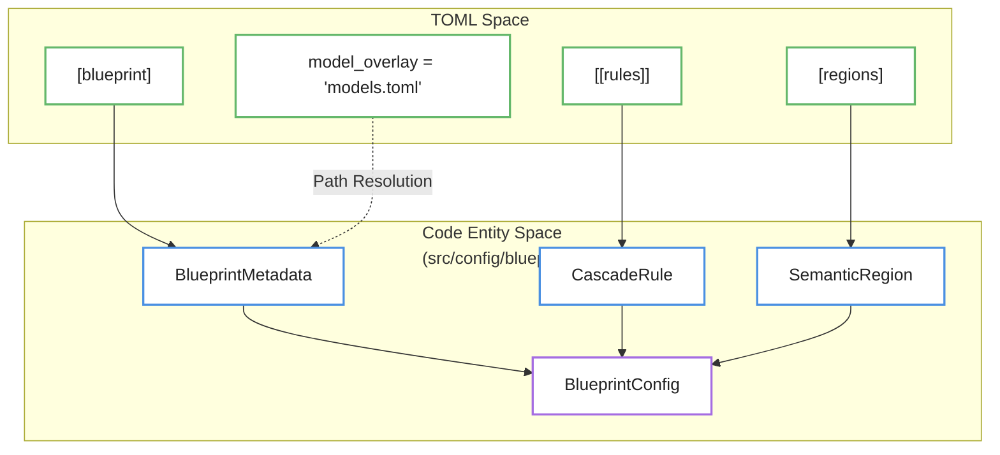

# Blueprints

Relevant source files

- 
- 
- 
- 
- 
- 
- 
- 
- 
- 
- 

Blueprints define the high-level operational profile of the `mana-lite` pipeline. A blueprint acts as a deployment manifest that selects a subset of models from the `ModelCatalog`, defines the hierarchical relationship (cascade) between them, and specifies system-level requirements such as tracking or occupancy logic.

By utilizing `blueprint.toml` files, the system can switch between lightweight calibration modes and full clinical monitoring profiles without changing the underlying binary or the global model definitions.

### Sources:

- [config/blueprints/detect-face-pose-seg/blueprint.toml1-35](config/blueprints/detect-face-pose-seg/blueprint.toml#L1-L35)
- [src/config/blueprint.rs5-12](src/config/blueprint.rs#L5-L12)

---

## Blueprint Architecture and Data Structures

The configuration is parsed into the `BlueprintConfig` struct, which contains metadata, the model list, and the execution rules.

### Core Structures

|Struct|Role|File|
|---|---|---|
|`BlueprintConfig`|Root container for the blueprint configuration.|[src/config/blueprint.rs6-12](src/config/blueprint.rs#L6-L12)|
|`BlueprintMetadata`|Defines the `primary_model`, `requires_tracking`, and `model_overlay` path.|[src/config/blueprint.rs15-26](src/config/blueprint.rs#L15-L26)|
|`CascadeRule`|Defines when a child model should execute based on a parent's detections.|[src/config/blueprint.rs29-45](src/config/blueprint.rs#L29-L45)|
|`SemanticRegion`|Defines spatial gates (rectangles) used by `CascadeRule`.|[src/config/blueprint.rs48-53](src/config/blueprint.rs#L48-L53)|

### The Cascade Mechanism

The pipeline uses a "Parent-Child" relationship defined in `CascadeRule`. A child model (e.g., `face-yolo`) will only run if its `requires` parent (e.g., `detect-fast`) produces a detection that meets specific criteria:

- **`requires_class`**: The parent detection must be a specific class (e.g., "person"). [src/config/blueprint.rs32](src/config/blueprint.rs#L32-L32)
- **`requires_exact_count`**: Executes only if exactly $N$ detections exist. [src/config/blueprint.rs34](src/config/blueprint.rs#L34-L34)
- **`requires_min_confidence`**: The parent detection must exceed this score. [src/config/blueprint.rs38](src/config/blueprint.rs#L38-L38)
- **`same_frame`**: If `true`, the child runs on the current frame's detections. If `false`, it can use tracked history. [src/config/blueprint.rs36](src/config/blueprint.rs#L36-L36)

### Blueprint to Code Mapping

This diagram shows how the TOML configuration maps to the internal engine structures.

**Blueprint Configuration Mapping**

### Sources:

- [src/config/blueprint.rs1-61](src/config/blueprint.rs#L1-L61)
- [config/blueprints/detect-room-face/blueprint.toml1-22](config/blueprints/detect-room-face/blueprint.toml#L1-L22)

---

## Built-in Blueprints

The system provides four standard blueprints, each optimized for different hardware constraints or clinical requirements.

### 1. `detect-room-raw`

A calibration-only profile. It disables tracking and child models to allow for raw detector performance analysis and occupancy timer tuning.

- **Primary Model**: `detect-fast`
- **Tracking**: Required `false`.
- **Use Case**: Testing raw detector confidence and ROI placement.
- **Sources**: [config/blueprints/detect-room-raw/blueprint.toml1-12](config/blueprints/detect-room-raw/blueprint.toml#L1-L12) [config/blueprints/detect-room-raw/README.md1-23](config/blueprints/detect-room-raw/README.md?plain=1#L1-L23)

### 2. `detect-face`

A lightweight profile for single-person environments.

- **Hierarchy**: `detect-fast` -> `face-yolo`.
- **Gate**: Requires exactly 1 person.
- **Tracking**: Required `true`.
- **Sources**: [config/blueprints/detect-face/blueprint.toml1-19](config/blueprints/detect-face/blueprint.toml#L1-L19) [config/blueprints/detect-face/README.md1-23](config/blueprints/detect-face/README.md?plain=1#L1-L23)

### 3. `detect-room-face`

A production-grade profile for clinical rooms. It uses a **Dynamic Crop** where the `face-yolo` model is executed on a 320x320 crop centered on the top half of a tracked person.

- **Special Feature**: `same_frame = false`. This allows the child model to use the confirmed person track even if the detector has a single-frame dropout.
- **Model Overlay**: Overrides `face-yolo` confidence to `0.10` for higher recall in clinical settings.
- **Sources**: [config/blueprints/detect-room-face/blueprint.toml1-22](config/blueprints/detect-room-face/blueprint.toml#L1-L22) [config/blueprints/detect-room-face/models.toml1-12](config/blueprints/detect-room-face/models.toml#L1-L12) [config/blueprints/detect-room-face/README.md1-104](config/blueprints/detect-room-face/README.md?plain=1#L1-L104)

### 4. `detect-face-pose-seg`

A heavy profile for full enrichment (Face, Pose, and Segmentation).

- **Hierarchy**: One parent (`detect-fast`) triggers three parallel children.
- **Constraints**: All children require a confirmed, visible track and exactly 1 person in the scene.
- **Sources**: [config/blueprints/detect-face-pose-seg/blueprint.toml1-35](config/blueprints/detect-face-pose-seg/blueprint.toml#L1-L35) [config/blueprints/detect-face-pose-seg/README.md1-25](config/blueprints/detect-face-pose-seg/README.md?plain=1#L1-L25)

---

## Model Overlays

Blueprints can optionally include a `model_overlay` file. This allows the blueprint to override specific parameters of a model (defined in the global `models.toml`) without modifying the global catalog.

For example, in `detect-room-face`, the overlay is used to lower the detection threshold specifically for that blueprint:

- Global `face-yolo` might require `0.50` confidence.
- Blueprint `detect-room-face` overrides this to `0.10` via its local `models.toml`.

**Overlay Resolution Flow**

### Sources:

- [config/blueprints/detect-room-face/blueprint.toml8](config/blueprints/detect-room-face/blueprint.toml#L8-L8)
- [config/blueprints/detect-room-face/models.toml1-12](config/blueprints/detect-room-face/models.toml#L1-L12)
- [src/config/blueprint.rs25](src/config/blueprint.rs#L25-L25)

---

## Standalone Cascade Configuration

While blueprints are the preferred method for deployment, the system also supports a standalone `cascade.toml` format. This format is primarily used for defining `SemanticRegion` gates that are not tied to a specific named blueprint.

### Semantic Regions

Unlike clinical zones (defined in `zones.toml`), `SemanticRegion` entries in a cascade/blueprint are used strictly as **Eligibility Gates** for inference. If a detection's bounding box does not overlap with the defined `rect` by the `requires_region_coverage` percentage, the child model will not be triggered.

|Parameter|Type|Description|
|---|---|---|
|`rect`|`[f32; 4]`|`[x1, y1, x2, y2]` in original frame coordinates.|
|`requires_region`|`String`|The name of the region defined in the `regions` map.|
|`requires_region_coverage`|`f32`|Minimum IoU/Overlap required to trigger child.|

### Sources:

- [config/cascade.toml1-35](config/cascade.toml#L1-L35)
- [src/config/blueprint.rs48-60](src/config/blueprint.rs#L48-L60)
