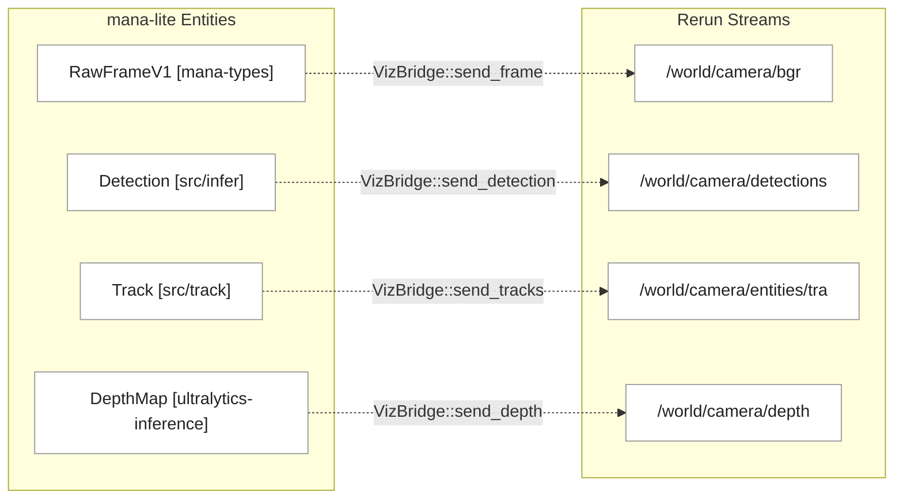

# Observability and Metrics

Relevant source files

- 
- 
- 
- 

The `mana-lite` system provides a multi-layered observability stack designed for real-time monitoring, long-term forensic analysis, and performance tuning. The system partitions observability into three distinct subsystems: structured event logging for audit trails, periodic metrics for health and throughput monitoring, and high-bandwidth visualization for spatial debugging.

### Subsystem Overview

The observability architecture is managed through the `LogSink` and `LogHandler` traits, allowing the pipeline to emit domain events without coupling to specific storage or network backends [src/logger/mod.rs16-30](src/logger/mod.rs#L16-L30)

|Subsystem|Primary Crate/Module|Output Format|Purpose|
|---|---|---|---|
|**Event Logging**|`src/logger/`|JSONL|Detailed records of detections, FSM transitions, and depth evaluations.|
|**Performance Metrics**|`src/metrics.rs`|Text / JSONL|Periodic aggregation of inference latency, ingest drops, and model throughput.|
|**Rerun Visualization**|`src/viz.rs`|Rerun.io gRPC|Real-time visual debugging of frames, bounding boxes, masks, and ROI crops.|

### System Architecture Diagram

The following diagram illustrates how domain events flow from the core pipeline through the `LogManager` to various output handlers.

**Observability Data Flow**

Sources: [src/logger/mod.rs32-52](src/logger/mod.rs#L32-L52) [src/metrics.rs222-237](src/metrics.rs#L222-L237) [src/viz.rs31-41](src/viz.rs#L31-L41)

---

## 5.1 Event Logging (JSONL)

The logging subsystem provides a structured audit trail of every significant event in the system. Events are defined in the `Event` enum [src/logger/event.rs12-40](src/logger/event.rs#L12-L40) and include detections, presence changes, FSM state transitions, and health updates.

The `JsonlHandler` manages file rotation based on the `Rotate` configuration (Hourly, Daily, or Never) [src/logger/mod.rs147-174](src/logger/mod.rs#L147-L174) It uses a `MetricsJsonlConfig` to filter which event types are persisted to disk, minimizing I/O overhead for high-frequency data like raw detections [config/metrics.toml20-31](config/metrics.toml#L20-L31)

For details, see [Event Logging (JSONL)](https://deepwiki.com/ernestovisiona-netizen/kik8/5.1-event-logging-\(jsonl\)).

Sources: [src/logger/mod.rs37-42](src/logger/mod.rs#L37-L42) [src/logger/event.rs12-40](src/logger/event.rs#L12-L40) [config/metrics.toml20-31](config/metrics.toml#L20-L31)

---

## 5.2 Performance Metrics

The `MetricsEngine` tracks the internal health and throughput of the pipeline. It aggregates data over a configurable `report_interval_s` (default 5s) [config/metrics.toml2](config/metrics.toml#L2-L2)

Key metrics include:

- **Ingest Health:** Tracking `keyframes_dropped`, `ssrc_changes`, and `reconnect_attempts` [src/metrics.rs99-123](src/metrics.rs#L99-L123)
- **Inference Performance:** Per-model latency (min/max/avg) and skip rates [src/metrics.rs54-72](src/metrics.rs#L54-L72)
- **Health State:** The system monitors for "Blind" cycles where no frames are processed, triggering recovery logic if the stream stalls [src/metrics.rs139-144](src/metrics.rs#L139-L144)

For details, see [Performance Metrics](https://deepwiki.com/ernestovisiona-netizen/kik8/5.2-performance-metrics).

Sources: [src/metrics.rs222-245](src/metrics.rs#L222-L245) [config/metrics.toml1-18](config/metrics.toml#L1-L18)

---

## 5.3 Rerun Visualization

The `VizBridge` acts as a gateway to the Rerun.io visualization engine. It translates internal pipeline state into spatial primitives for real-time viewing.

**Code-to-Entity Mapping**

The bridge handles connection management with exponential backoff [src/viz.rs106-107](src/viz.rs#L106-L107) and publishes data across multiple timelines, including `frame_nr` and `frame_time`, to allow synchronized playback of video and metadata [src/viz.rs51-52](src/viz.rs#L51-L52)

For details, see [Rerun Visualization](https://deepwiki.com/ernestovisiona-netizen/kik8/5.3-rerun-visualization).

Sources: [src/viz.rs31-64](src/viz.rs#L31-L64) [src/viz.rs159-183](src/viz.rs#L159-L183)

