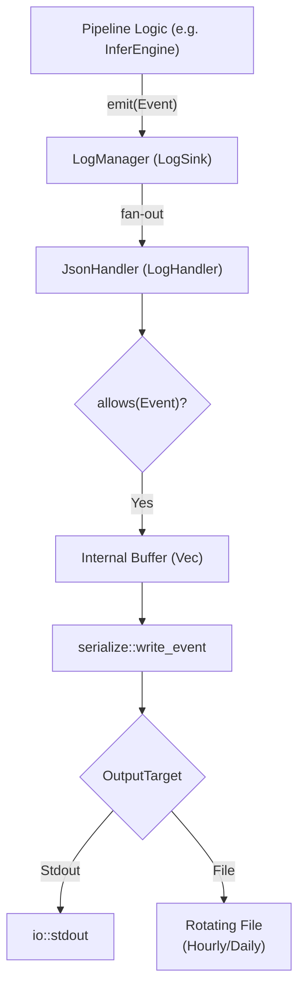
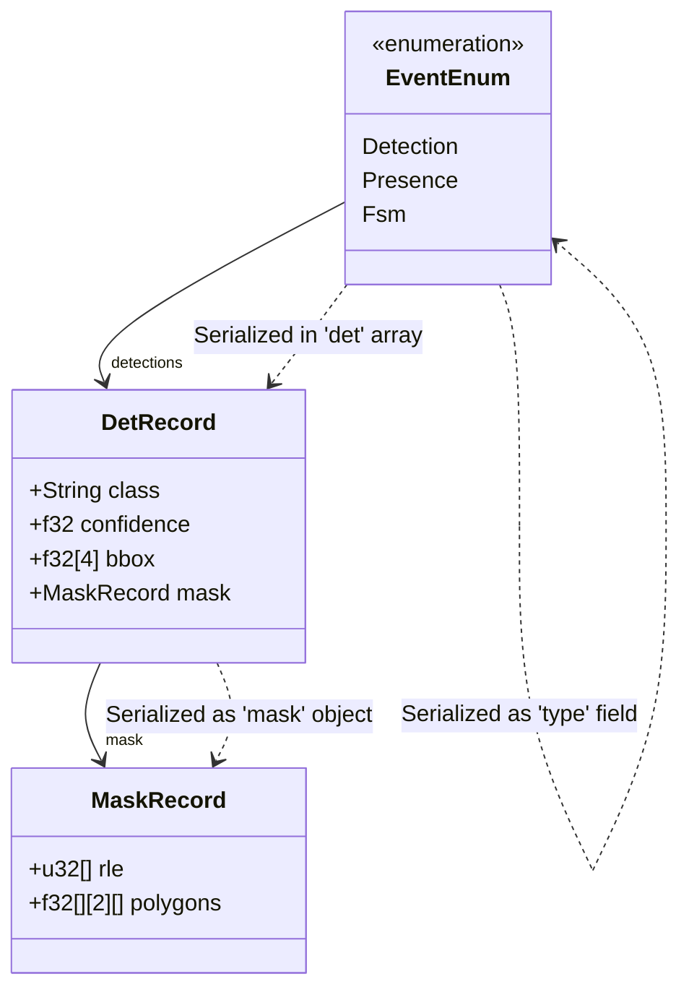

# Event Logging (JSONL)

Relevant source files

- [](config/metrics-face-dwell-transition.toml)
- [](config/metrics-room-transition.toml)
- [](config/metrics.toml)
- [](src/logger/event.rs)
- [](src/logger/mod.rs)
- [](src/logger/serialize.rs)

The Event Logging system provides a high-performance, structured telemetry pipeline for recording domain events, inference results, and system health. It uses the **JSON Lines (JSONL)** format to ensure each event is a standalone, valid JSON object, facilitating easy parsing by external log aggregators or diagnostic scripts.

## Architecture

The logging subsystem is built on a decoupled architecture where the pipeline code interacts with a generic `LogSink` trait, while the concrete implementation and file management are handled by `LogManager` and `LogHandler`.

### Component Roles

- **LogSink**: A trait that defines the interface for emitting events, flushing buffers, and shutting down. It allows the pipeline to remain agnostic of the output backend [src/logger/mod.rs16-20](src/logger/mod.rs#L16-L20)
- **LogManager**: The primary implementation of `LogSink`. It acts as a dispatcher, fanning out a single `Event` to one or more `LogHandler` implementations [src/logger/mod.rs32-35](src/logger/mod.rs#L32-L35)
- **LogHandler**: A trait for specific output backends. The primary implementation is `JsonlHandler`, which handles serialization and file rotation [src/logger/mod.rs24-30](src/logger/mod.rs#L24-L30)
- **JsonlHandler**: Manages an internal buffer of events, applies filtering based on `JsonlLevel` and `MetricsJsonlConfig`, and writes to an `OutputTarget` [src/logger/mod.rs37-42](src/logger/mod.rs#L37-L42)

### Data Flow Diagram

The following diagram illustrates the flow of an event from the processing pipeline to the final storage target.

**Event Dispatch Pipeline**

```mermaid
flowchart TB

    pipeline["Pipeline Logic (e.g. InferEngine)"]
    manager["LogManager (LogSink)"]
    handler["JsonHandler (LogHandler)"]
    allowed{"allows(Event)?"}
    buffer["Internal Buffer (Vec)"]
    serialize["serialize::write_event"]
    target{"OutputTarget"}
    stdout["io::stdout"]
    file["Rotating File<br/>(Hourly/Daily)"]

    pipeline -->|emit(Event)| manager
    manager -->|fan-out| handler
    handler -->|Unsupported markdown list| allowed

    allowed -->|Yes| buffer
    buffer -->|Unsupported markdown list| serialize
    serialize -->|Unsupported markdown list| target

    target -->|Stdout| stdout
    target -->|File| file
```


**Sources:** [src/logger/mod.rs91-102](src/logger/mod.rs#L91-L102) [src/logger/mod.rs176-180](src/logger/mod.rs#L176-L180) [src/logger/mod.rs182-195](src/logger/mod.rs#L182-L195)

## Event Variants

The system uses a single `Event` enum to represent all loggable data points. This ensures type safety and a unified serialization path.

|Variant|Description|Key Data Fields|
|---|---|---|
|`Meta`|System lifecycle events (startup, shutdown, model loaded).|`event`, `detail`, `attrs`|
|`Health`|Heartbeats and component health status.|`frame_id`, `cycle_us`, `message`|
|`Frame`|Metadata for every decoded frame.|`frame_id`, `is_keyframe`, `decode_ms`|
|`Detection`|Raw inference results from models.|`model`, `detections (DetRecord)`, `crop`|
|`Depth`|Global depth map statistics.|`min_depth_m`, `max_depth_m`, `valid_ratio`|
|`DepthRegion`|Evaluation of a specific depth rule against a region.|`rule`, `triggered`, `value`|
|`Presence`|State transitions of the `PresenceFilter`.|`state`, `poi_state`, `confirmed_count`|
|`Fsm`|Finite State Machine transitions.|`from`, `to`, `trigger`, `dwell_ms`|
|`FaceDwell`|Specialized state for face-dwell logic.|`state`, `face_present`, `active_timers`|
|`Metrics`|Periodic aggregate reports.|`MetricsReport`|

**Sources:** [src/logger/event.rs8-133](src/logger/event.rs#L8-L133)

## Filtering and Configuration

Logging verbosity is controlled through two mechanisms: `JsonlLevel` and `MetricsJsonlConfig`.

### JsonlLevel

Events are assigned a minimum level (Debug, Info, or Quiet) [src/logger/event.rs135-140](src/logger/event.rs#L135-L140)

- **Quiet**: Only critical system events (Meta, Health, Fsm, Metrics).
- **Info**: Standard operational events.
- **Debug**: High-volume data (Detection, Frame, Depth, Zone) [src/logger/event.rs158-174](src/logger/event.rs#L158-L174)

### MetricsJsonlConfig

This configuration allows fine-grained toggling of specific event types, typically defined in `metrics.toml`.

```
[metrics.jsonl]frame_events = falsedetection_events = truepresence_events = truefsm_events = truedepth_events = true
```

**Sources:** [config/metrics.toml20-32](config/metrics.toml#L20-L32) [src/logger/mod.rs177](src/logger/mod.rs#L177-L177)

## File Rotation

The `JsonlHandler` supports automatic file rotation to prevent log files from consuming excessive disk space. Rotation is handled within `OutputTarget::Rotating` [src/logger/mod.rs46-51](src/logger/mod.rs#L46-L51)

- **Hourly**: Files are named by year, month, day, and hour (`%Y%m%dT%H`).
- **Daily**: Files are named by year, month, and day (`%Y%m%d`).
- **Never**: A single file named `all.jsonl` is used.

The rotation check occurs during the `write_buf` call by comparing the current system time against the `current_hour` or `current_day` stored in the handler [src/logger/mod.rs209-222](src/logger/mod.rs#L209-L222)

**Sources:** [src/logger/mod.rs147-174](src/logger/mod.rs#L147-L174) [src/logger/mod.rs203-235](src/logger/mod.rs#L203-L235)

## Complex Data Serialization

The system uses a custom, manual JSON serializer in `src/logger/serialize.rs` instead of a generic library like `serde_json` to minimize allocations and maximize performance during high-frequency detection logging.

### Masks and Polygons

For segmentation models, the `Detection` event includes a `MaskRecord`. This record contains:

- **RLE (Run-Length Encoding)**: Column-major counts of the mask crop [src/logger/event.rs207](src/logger/event.rs#L207-L207)
- **Polygons**: Vector contours generated from the mask, normalized to the full frame coordinates [src/logger/event.rs211](src/logger/event.rs#L211-L211)

The serializer iterates through these structures, writing raw bytes directly to the buffer [src/logger/serialize.rs121-167](src/logger/serialize.rs#L121-L167)

### Mapping Code Entities to JSON

The following diagram bridges the internal Rust structures to the resulting JSONL fields.

**Serialization Mapping**

**Sources:** [src/logger/event.rs26-36](src/logger/event.rs#L26-L36) [src/logger/event.rs178-186](src/logger/event.rs#L178-L186) [src/logger/event.rs206-212](src/logger/event.rs#L206-L212) [src/logger/serialize.rs65-171](src/logger/serialize.rs#L65-L171)


