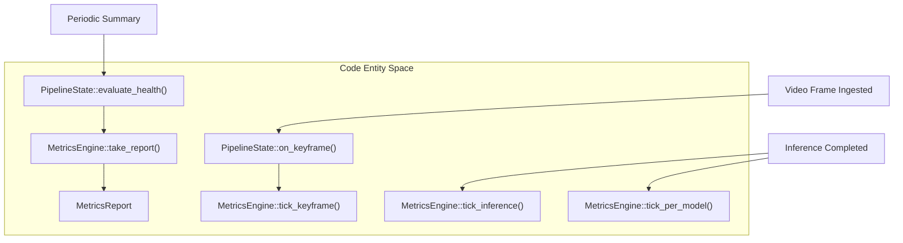
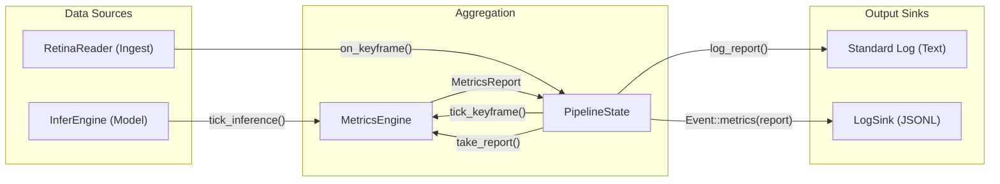

# Performance Metrics

Relevant source files

- 
- 
- 

The performance metrics system in `mana-lite` provides high-resolution observability into the video pipeline's health, throughput, and inference efficiency. It utilizes a tick-based aggregation engine that summarizes system behavior over sliding temporal windows, typically defaulting to 5 seconds.

### MetricsEngine and Aggregation

The `MetricsEngine` is the central coordinator for performance data. It maintains a `Metrics` struct representing the current accumulation window and produces a `MetricsReport` when the configured interval elapses.

- **Tick Mechanism**: The engine is updated via explicit "tick" methods called by the `App` loop and `PipelineState`.
    - `tick_cycle()`: Increments the total application loop iterations [src/metrics.rs239-241](src/metrics.rs#L239-L241)
    - `tick_keyframe()`: Records a successfully decoded H.264 keyframe [src/metrics.rs243-247](src/metrics.rs#L243-L247)
    - `tick_decode(us)`: Adds microsecond latency for frame decoding [src/metrics.rs253-255](src/metrics.rs#L253-L255)
- **Report Generation**: The `take_report()` function checks if `report_interval_s` has passed since `window_start`. If so, it clones the current metrics into a `MetricsReport`, resets the counters, and returns the report for logging [src/metrics.rs328-344](src/metrics.rs#L328-L344)

**Entity Mapping: Metrics Aggregation Flow**

Sources: [src/metrics.rs222-255](src/metrics.rs#L222-L255) [src/pipeline.rs36-64](src/pipeline.rs#L36-L64) [src/pipeline.rs66-90](src/pipeline.rs#L66-L90)

---

### Per-Model Metrics

Because `mana-lite` often runs multiple models in a cascade (e.g., a general detector followed by a specialized face detector), metrics are tracked individually per model using the `PerModelMetrics` struct [src/metrics.rs54-72](src/metrics.rs#L54-L72)

|Metric|Description|
|---|---|
|`inferences`|Total number of times this specific model was invoked.|
|`infer_total_us`|Cumulative microsecond latency for this model.|
|`skips`|Number of times the model was skipped due to cascade logic or ROIs.|
|`empty`|Number of inferences that resulted in zero detections.|
|`roi`|The specific [x1, y1, x2, y2] crop coordinates used for the last inference.|
|`depth_frames`|Count of depth maps generated (if applicable).|

Sources: [src/metrics.rs54-72](src/metrics.rs#L54-L72) [src/metrics.rs271-314](src/metrics.rs#L271-L314)

---

### Health State Machine

The system monitors the "freshness" of the data pipeline using a health state machine defined in `Health`. This tracks whether the `RetinaReader` is successfully delivering frames and if the `InferEngine` is processing them.

**Health States**:

1. **Blind**: No frames have been received for a significant period (e.g., stream disconnect).
2. **Stale**: Frames are arriving, but a specific component (like Inference) is not processing them fast enough.
3. **Recovered**: The transition from Blind/Stale back to a healthy state.

The `evaluate()` function determines transitions based on the time elapsed since the last `touch()` (called on every keyframe) [src/metrics.rs444-473](src/metrics.rs#L444-L473)

**Health State Transitions**

Sources: [src/metrics.rs411-473](src/metrics.rs#L411-L473) [src/pipeline.rs66-90](src/pipeline.rs#L66-L90)

---

### Text-Format Metrics Log Lines

When a report is generated, the `PipelineState` invokes `log_report`, which outputs structured text to the standard log. This is controlled by `MetricsTextConfig` [src/config/observability.rs156-165](src/config/observability.rs#L156-L165)

#### 1. Ingest Line

Summarizes the RTSP stream health and decoder throughput.

- **Format**: `ingest: [Hz] — [count] keyframes processed | decode [avg]ms avg | cycles [count] | [flags]`
- **Flags**: Includes `pframes` (skipped), `dup` (duplicate keyframes), `kf_dropped`, `timeouts`, and `reconnect` attempts [src/pipeline.rs105-145](src/pipeline.rs#L105-L145)

#### 2. Inference Summary

Summarizes the aggregate performance of all models.

- **Format**: `infer: [Hz] — [calls] in [window]s | [avg] ([min-max])ms | [total_dets] dets`
- **Flags**: `skips` and `empty` [src/pipeline.rs147-176](src/pipeline.rs#L147-L176)

#### 3. Per-Model Lines

If `per_model_lines` is enabled, each model outputs its own performance row.

- **Example**: `yolov8n_person: 1.0 Hz | 5 calls | 12ms (10-15ms) | 2/5fr | roi:[0,0 640,480]` [src/pipeline.rs187-232](src/pipeline.rs#L187-L232)

Sources: [src/pipeline.rs105-232](src/pipeline.rs#L105-L232) [src/config/observability.rs178-215](src/config/observability.rs#L178-L215)

---

### Data Flow for Metrics Generation

The following diagram illustrates how raw events from the pipeline are aggregated into the final log output and JSONL events.

**Metrics Data Flow**

Sources: [src/pipeline.rs36-64](src/pipeline.rs#L36-L64) [src/pipeline.rs86-90](src/pipeline.rs#L86-L90) [src/metrics.rs156-192](src/metrics.rs#L156-L192)

