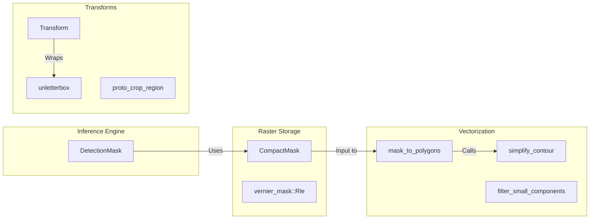

# Masks and Polygons

Relevant source files

- 
- 
- 
- 

The `mana-geometry` crate provides the spatial primitives and transformation logic required to handle instance segmentation masks and vector contours. The system optimizes for memory efficiency by using Run-Length Encoding (RLE) for raster masks and provides robust polygonization utilities to convert these rasters into simplified vector shapes for downstream logic like zone intersection or visualization.

## Compact Mask Storage (RLE)

The `CompactMask` struct is the primary transport format for segmentation masks within the pipeline [std/mana-geometry/src/compact_mask.rs65-69](std/mana-geometry/src/compact_mask.rs#L65-L69) Instead of storing a full-frame bitmask (which would be $O(H \times W)$), it stores a column-major RLE representation scoped to the object's bounding box [std/mana-geometry/src/compact_mask.rs4-5](std/mana-geometry/src/compact_mask.rs#L4-L5)

### Data Structure and Layout

A `CompactMask` contains a batch of one or more masks, each associated with an offset into the full image frame [std/mana-geometry/src/compact_mask.rs65-69](std/mana-geometry/src/compact_mask.rs#L65-L69)

|Field|Type|Description|
|---|---|---|
|`rles`|`Vec<Rle>`|Column-major run-length counts (via `vernier-mask`) [std/mana-geometry/src/compact_mask.rs66](std/mana-geometry/src/compact_mask.rs#L66-L66)|
|`offsets`|`Vec<(u32, u32)>`|`(x, y)` pixel coordinates of the mask's top-left corner in the full frame [std/mana-geometry/src/compact_mask.rs67](std/mana-geometry/src/compact_mask.rs#L67-L67)|
|`image_shape`|`(u32, u32)`|The `(height, width)` of the original full image [std/mana-geometry/src/compact_mask.rs68](std/mana-geometry/src/compact_mask.rs#L68-L68)|

### Key Operations

- **`from_dense`**: Converts a raw `u8` crop buffer (row-major) into a compressed `CompactMask` [std/mana-geometry/src/compact_mask.rs79-113](std/mana-geometry/src/compact_mask.rs#L79-L113)
- **`area`**: Returns the foreground pixel count for a specific mask index [std/mana-geometry/src/compact_mask.rs166-169](std/mana-geometry/src/compact_mask.rs#L166-L169)
- **`encode_iceoryx2_payload`**: Serializes the mask into a native-endian byte stream for zero-copy IPC transport [std/mana-geometry/src/compact_mask.rs199-204](std/mana-geometry/src/compact_mask.rs#L199-L204)

**Sources:** [std/mana-geometry/src/compact_mask.rs1-204](std/mana-geometry/src/compact_mask.rs#L1-L204)

---

## Polygonization and Simplification

The system converts raster masks into vector polygons to support spatial rules and efficient visualization. This process involves contour following followed by the Ramer-Douglas-Peucker (RDP) algorithm for simplification.

### The Polygonization Pipeline

The function `mask_to_polygons` implements the following flow [std/mana-geometry/src/polygonize.rs37-45](std/mana-geometry/src/polygonize.rs#L37-L45):

1. **Thresholding**: Converts a probability mask (`f32`) into a binary `GrayImage` [std/mana-geometry/src/polygonize.rs50-62](std/mana-geometry/src/polygonize.rs#L50-L62)
2. **Contour Detection**: Uses the Suzuki-Abe border following algorithm (`imageproc::contours::find_contours`) to find raw pixel boundaries [std/mana-geometry/src/polygonize.rs64-67](std/mana-geometry/src/polygonize.rs#L64-L67)
3. **Simplification**: Applies RDP via `simplify_contour` to reduce vertex count based on an `approximation_percentage` [std/mana-geometry/src/polygonize.rs93](std/mana-geometry/src/polygonize.rs#L93-L93)
4. **Filtering**: Optionally removes polygons that are too small or too large relative to the total mask area [std/mana-geometry/src/polygonize.rs98-110](std/mana-geometry/src/polygonize.rs#L98-L110)
5. **Normalization**: Maps pixel coordinates to a normalized `0.0..1.0` range [std/mana-geometry/src/polygonize.rs114-118](std/mana-geometry/src/polygonize.rs#L114-L118)

### Component Filtering

For noisy masks, `filter_small_components` uses 8-connectivity to identify and remove disconnected foreground islands that fall below a specified area ratio [std/mana-geometry/src/polygonize.rs131-195](std/mana-geometry/src/polygonize.rs#L131-L195)

### Polygon Geometry Logic Entities

|Function|Purpose|
|---|---|
|`polygon_center`|Calculates the signed-area weighted centroid (shoelace method) [std/mana-geometry/src/polygon.rs10-45](std/mana-geometry/src/polygon.rs#L10-L45)|
|`polygon_area`|Calculates the absolute shoelace area of a polygon [std/mana-geometry/src/polygon.rs48-61](std/mana-geometry/src/polygon.rs#L48-L61)|
|`polygon_to_xyxy`|Computes the axis-aligned bounding box (AABB) of a polygon [std/mana-geometry/src/polygon.rs66-84](std/mana-geometry/src/polygon.rs#L66-L84)|
|`cross_product`|Determines point orientation relative to a line segment [std/mana-geometry/src/polygon.rs91-104](std/mana-geometry/src/polygon.rs#L91-L104)|

**Sources:** [std/mana-geometry/src/polygonize.rs1-200](std/mana-geometry/src/polygonize.rs#L1-L200) [std/mana-geometry/src/polygon.rs1-104](std/mana-geometry/src/polygon.rs#L1-L104)

---

## Coordinate Transformations

Inference results (boxes, masks, keypoints) are initially generated in "Model Space" (often letterboxed). The `Transform` struct provides the math to map these back to the "Original Image Space".

### Letterbox Handling

When an image is resized to fit a model input (e.g., 640x640), padding is often added to maintain aspect ratio. The `unletterbox` function reverses this: `(raw_coord - pad) / scale` [std/mana-geometry/src/transform.rs17-19](std/mana-geometry/src/transform.rs#L17-L19)

### Transform Implementation

The `Transform` struct stores the necessary parameters for a specific inference pass [std/mana-geometry/src/transform.rs23-30](std/mana-geometry/src/transform.rs#L23-L30):

- `orig_shape`: `(H, W)` of the source frame.
- `scale`: The multiplier used during resize.
- `padding`: `(top, left)` offsets in pixels.

_Diagram 1: Data flow from raw model output to image-space coordinates via `Transform` [std/mana-geometry/src/transform.rs42-74](std/mana-geometry/src/transform.rs#L42-L74)_

### Mask Crop Region

For segmentation models, the `proto_crop_region` function calculates the specific sub-region of a prototype mask that corresponds to the actual image content, effectively discarding the letterbox padding before the mask is upscaled [std/mana-geometry/src/transform.rs103-133](std/mana-geometry/src/transform.rs#L103-L133)

**Sources:** [std/mana-geometry/src/transform.rs1-133](std/mana-geometry/src/transform.rs#L1-L133)

---

## System Integration Map

The following diagram bridges the high-level geometry concepts to the specific implementation entities used in the codebase.

_Diagram 2: Association of geometry entities with the processing pipeline [std/mana-geometry/src/compact_mask.rs65](std/mana-geometry/src/compact_mask.rs#L65-L65) [std/mana-geometry/src/polygonize.rs37](std/mana-geometry/src/polygonize.rs#L37-L37) [std/mana-geometry/src/transform.rs23](std/mana-geometry/src/transform.rs#L23-L23)_

**Sources:** [std/mana-geometry/src/compact_mask.rs1-10](std/mana-geometry/src/compact_mask.rs#L1-L10) [std/mana-geometry/src/polygonize.rs1-6](std/mana-geometry/src/polygonize.rs#L1-L6) [std/mana-geometry/src/transform.rs1-6](std/mana-geometry/src/transform.rs#L1-L6)

