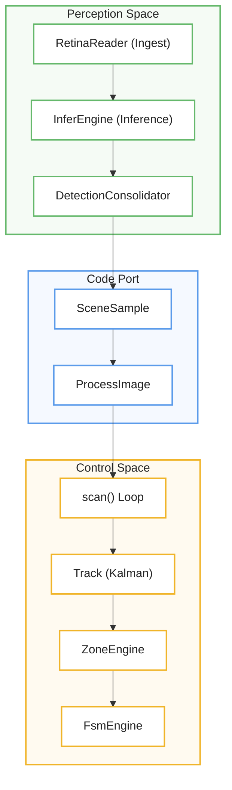
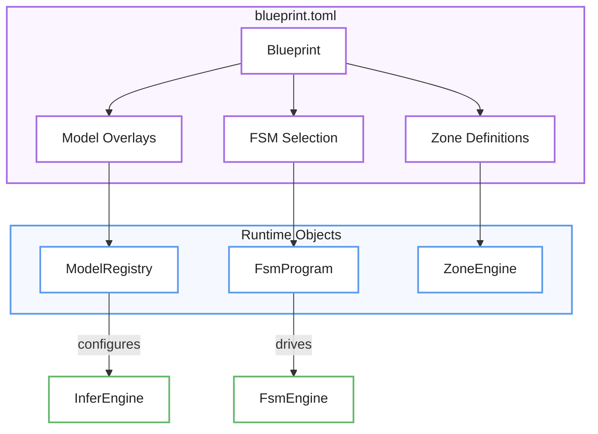

# Overview

La plataforma **mana-lite** se presenta como una infraestructura avanzada de **visión computacional de alto rendimiento** diseñada para transformar transmisiones de video en vivo en datos analíticos procesables. El sistema opera mediante una división clara entre la **percepción**, que gestiona la decodificación y el análisis mediante redes neuronales, y el **control**, que estabiliza la información para ejecutar una lógica de negocio basada en estados. Para garantizar la precisión técnica, el software emplea un **vocabulario de dominio estricto** y un sistema de identificadores que previenen errores en la categorización de objetos o zonas espaciales. Finalmente, la flexibilidad del motor reside en sus **blueprints o planos de configuración**, los cuales permiten orquestar modelos de inteligencia artificial en cascada para monitorear comportamientos complejos de forma automática y determinista.

Relevant source files [ https://__deepwiki.com/kerrvisiona-sudo/endeli ]

- 
- 
- 
- 
- 
- 
- 
- 
- 

`mana-lite` is a high-performance computer vision pipeline designed for real-time video analysis, entity tracking, and spatial state monitoring. It integrates multi-stage YOLO inference with a robust control system to derive high-level semantic states (e.g., room occupancy, patient behavior) from raw RTSP streams.

The system is architected as a single binary composed of several specialized crates and modules, balancing low-latency perception with deterministic state-machine logic [lib.rs1-5](https://github.com/kerrvisiona-sudo/endeli/blob/ad24740d/lib.rs#L1-L5)

## System Architecture

The codebase is divided into two primary domains: **Perception** and **Control**. Perception handles the heavy lifting of video decoding and neural network execution, while Control manages temporal stabilization and business logic.

### Core Subsystems

- **Ingest Engine**: Manages RTSP connectivity, H.264 decoding, and frame buffering [lib.rs21](https://github.com/kerrvisiona-sudo/endeli/blob/ad24740d/lib.rs#L21-L21)
- **Infer Engine**: Executes the model cascade, handling dynamic crops (e.g., extracting a face from a detected person) and coordinate normalization [lib.rs20](https://github.com/kerrvisiona-sudo/endeli/blob/ad24740d/lib.rs#L20-L20)
- **Control System (`mana-control`)**: A fixed-cadence engine that consumes "observations" to update Kalman filters, evaluate spatial zones, and drive Finite State Machines (FSM) [core/mana-control/src/lib.rs1-16](https://github.com/kerrvisiona-sudo/endeli/blob/ad24740d/core/mana-control/src/lib.rs#L1-L16)
- **Observability**: A unified logging and visualization layer that supports JSONL event streams and real-time Rerun integration [lib.rs23-24](https://github.com/kerrvisiona-sudo/endeli/blob/ad24740d/lib.rs#L23-L24) [lib.rs33-34](https://github.com/kerrvisiona-sudo/endeli/blob/ad24740d/lib.rs#L33-L34)

### Data Flow and Code Entities

The following diagram illustrates how raw data transforms into semantic signals, mapping conceptual stages to specific code entities.

**Perception to Control Bridge**

**Sources:** [core/mana-control/src/lib.rs44-52](https://github.com/kerrvisiona-sudo/endeli/blob/ad24740d/core/mana-control/src/lib.rs#L44-L52) [core/mana-control/src/lib.rs86-91](https://github.com/kerrvisiona-sudo/endeli/blob/ad24740d/core/mana-control/src/lib.rs#L86-L91) [lib.rs25-29](https://github.com/kerrvisiona-sudo/endeli/blob/ad24740d/lib.rs#L25-L29)

## Domain Vocabulary

To ensure type safety across the pipeline, `mana-lite` uses a domain-specific identifier system built on the `mana-id` crate. This prevents string-matching errors when referring to models, classes, or states [domain.rs1-9](https://github.com/kerrvisiona-sudo/endeli/blob/ad24740d/domain.rs#L1-L9)

|Entity Type|Code Symbol|Purpose|
|---|---|---|
|**Model**|`ModelId`|Unique key in `models.toml` (e.g., "detect-fast") [core/mana-control/src/domain.rs12](https://github.com/kerrvisiona-sudo/endeli/blob/ad24740d/core/mana-control/src/domain.rs#L12-L12)|
|**Class**|`ClassName`|Detection label (e.g., "person", "face") [core/mana-control/src/domain.rs11](https://github.com/kerrvisiona-sudo/endeli/blob/ad24740d/core/mana-control/src/domain.rs#L11-L11)|
|**State**|`StateId`|FSM state name (e.g., "searching", "in_bed") [core/mana-control/src/domain.rs9](https://github.com/kerrvisiona-sudo/endeli/blob/ad24740d/core/mana-control/src/domain.rs#L9-L9)|
|**Zone**|`ZoneId`|Spatial region key (e.g., "bed", "door") [core/mana-control/src/domain.rs10](https://github.com/kerrvisiona-sudo/endeli/blob/ad24740d/core/mana-control/src/domain.rs#L10-L10)|
|**Signal**|`SignalTag`|Semantic boolean or numeric signal [core/mana-control/src/domain.rs18-20](https://github.com/kerrvisiona-sudo/endeli/blob/ad24740d/core/mana-control/src/domain.rs#L18-L20)|

**Sources:** [domain.rs15-19](https://github.com/kerrvisiona-sudo/endeli/blob/ad24740d/domain.rs#L15-L19) [core/mana-control/src/domain.rs6-20](https://github.com/kerrvisiona-sudo/endeli/blob/ad24740d/core/mana-control/src/domain.rs#L6-L20)

## Blueprints and Profiles

The system's behavior is defined by **Blueprints**. A blueprint is a configuration package that selects which models to run, how to crop frames for child models, and which FSM logic to apply.

For example, the `detect-room-face` profile orchestrates a root person detector and a secondary face detector that only runs on a dynamic crop when a single person is present [config/blueprints/detect-room-face/README.md1-10](https://github.com/kerrvisiona-sudo/endeli/blob/ad24740d/config/blueprints/detect-room-face/README.md?plain=1#L1-L10)

**Entity Relationship: Deployment Profile**

**Sources:** [domain.rs72-76](https://github.com/kerrvisiona-sudo/endeli/blob/ad24740d/domain.rs#L72-L76) [config/blueprints/detect-room-face/README.md76-86](https://github.com/kerrvisiona-sudo/endeli/blob/ad24740d/config/blueprints/detect-room-face/README.md?plain=1#L76-L86)

## Wiki Navigation

This wiki is structured to guide you from high-level configuration to deep-dive implementation details:

- **[Getting Started](https://deepwiki.com/kerrvisiona-sudo/endeli/1.1-getting-started)**: Learn how to use the CLI, configure `mana.toml`, and understand the `App::bootstrap` sequence [main.rs11-19](https://github.com/kerrvisiona-sudo/endeli/blob/ad24740d/main.rs#L11-L19)
- **[Blueprints and Deployment Profiles](https://deepwiki.com/kerrvisiona-sudo/endeli/1.2-blueprints-and-deployment-profiles)**: Detailed breakdown of available profiles like `detect-room-face` and how to customize cascades [config/blueprints/detect-room-face/README.md22-40](https://github.com/kerrvisiona-sudo/endeli/blob/ad24740d/config/blueprints/detect-room-face/README.md?plain=1#L22-L40)
- **Configuration System**: Deep dive into the TOML-based configuration for models, zones, and FSMs.
- **Inference Pipeline**: Technical details on video ingest, YOLO execution, and detection consolidation.
- **Control System**: How the `scan()` loop processes observations into stable tracks and state transitions.
- **Logging and Telemetry**: Documentation on the JSONL schema and structured event emission.
- **Visualization**: How to use the Rerun integration for real-time debugging.

**Sources:** [main.rs1-19](https://github.com/kerrvisiona-sudo/endeli/blob/ad24740d/main.rs#L1-L19) [lib.rs7-36](https://github.com/kerrvisiona-sudo/endeli/blob/ad24740d/lib.rs#L7-L36) [config/blueprints/detect-room-face/README.md1-5](https://github.com/kerrvisiona-sudo/endeli/blob/ad24740d/config/blueprints/detect-room-face/README.md?plain=1#L1-L5)

### On this page

- [Overview](https://deepwiki.com/kerrvisiona-sudo/endeli/1-overview#overview)
- [System Architecture](https://deepwiki.com/kerrvisiona-sudo/endeli/1-overview#system-architecture)
- [Core Subsystems](https://deepwiki.com/kerrvisiona-sudo/endeli/1-overview#core-subsystems)
- [Data Flow and Code Entities](https://deepwiki.com/kerrvisiona-sudo/endeli/1-overview#data-flow-and-code-entities)
- [Domain Vocabulary](https://deepwiki.com/kerrvisiona-sudo/endeli/1-overview#domain-vocabulary)
- [Blueprints and Profiles](https://deepwiki.com/kerrvisiona-sudo/endeli/1-overview#blueprints-and-profiles)
- [Wiki Navigation](https://deepwiki.com/kerrvisiona-sudo/endeli/1-overview#wiki-navigation)

