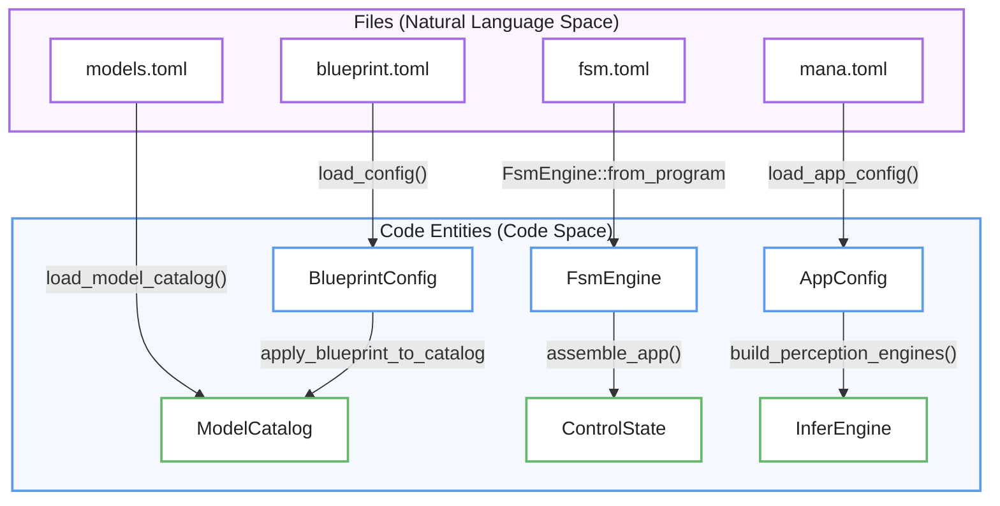
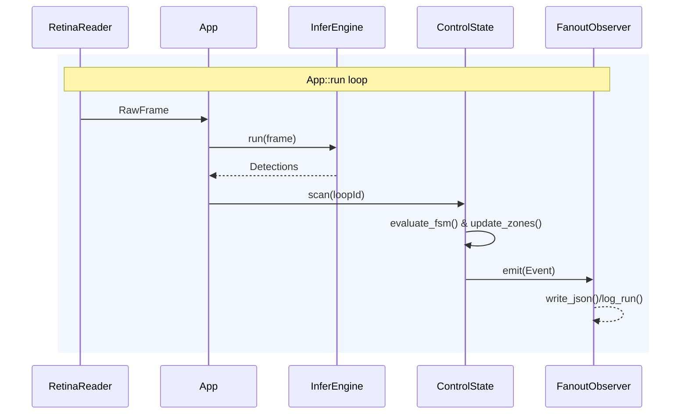

# Getting Started
Esta documentación técnica detalla el funcionamiento de **mana-lite**, una aplicación de alto rendimiento diseñada para la **inferencia de video y monitoreo espacial** en entornos clínicos. El texto describe cómo el sistema se inicializa mediante un archivo de configuración central y **variables de entorno**, activando un **proceso de bootstrap de seis etapas** que garantiza la validación de modelos, la construcción de motores de percepción y la sincronización de relojes internos. Una vez configurado, el software entra en un **bucle de ejecución principal** que coordina la ingesta de datos, el procesamiento de lógica espacial y la emisión de telemetría. En esencia, la fuente sirve como una guía estructural para transformar configuraciones estáticas en un **sistema de monitoreo activo y funcional**.

Relevant source files

- [](src/app/bootstrap/catalogs.rs)
- [](src/app/bootstrap/control.rs)
- [](src/app/bootstrap/mod.rs)
- [](src/config/env.rs)
- [](src/config/loader.rs)
- [](config/mana.toml)
- [](src/config/model_loader/mod.rs)
- [](src/config/model_loader/overlay.rs)
- [](src/lib.rs)
- [](src/main.rs)

The `mana-lite` application is a high-performance video inference and control pipeline designed for clinical and spatial monitoring. This page describes the configuration, command-line interface, and the multi-stage bootstrap sequence required to transition from a static configuration on disk to a running `App` instance.

## Build and Run

The workspace builds with `cargo build --release`. **Resolve the binary through cargo, not through a hardcoded `./target/` path.**

Cargo honours a `target-dir` override from `~/.cargo/config.toml` (or `CARGO_TARGET_DIR`), which relocates every artifact out of the repository:

```toml
[build]
target-dir = "/home/visiona/.cache/cargo-target"
```

With such an override in effect, `./target/` inside the repo is never written to again. Any `./target/release/mana-lite` predating the override survives as an orphan: `cargo build` reports `Finished` in under a second while the file on disk stays frozen at its last pre-override build.

The failure mode is misleading, because the error surfaces as a *configuration* error. A catalog authored against current code is parsed by an older binary, so valid TOML is rejected with `unknown variant` naming a guard set that no longer exists in the source tree — see the migration note in [FSM, Zone, and Cascade Configuration](2.3-fsm-zone-and-cascade-configuration#guard-set-migration).

|Invocation|Resolves `target-dir`|Verdict|
|---|---|---|
|`cargo run --release -- --config config/mana.toml`|yes|Recommended|
|`$(cargo metadata --format-version 1 \| jq -r .target_directory)/release/mana-lite`|explicit|Safe|
|`./target/release/mana-lite --config config/mana.toml`|no|Unsafe — may be an orphan|

To confirm which build you are about to run, ask cargo for the artifact path rather than assuming it:

```sh
cargo build --release --message-format=json | grep -o '"executable":"[^"]*"'
```

A `./target/` directory in the repo root under an active override holds only dead artifacts and should be removed (`rm -rf target`) so it cannot be executed by accident.

**Sources:** [main.rs12-41](src/main.rs#L12-L41) — Cargo target-dir resolution is a toolchain behaviour, not a `mana-lite` setting.

## CLI Usage

The `mana-lite` binary is a thin wrapper around the core library [main.rs1](src/main.rs#L1-L1) [lib.rs1-5](src/lib.rs#L1-L5) It accepts a primary configuration file via the `--config` flag or as a positional argument [main.rs29-35](src/main.rs#L29-L35)

| Command                               | Description                                                 |
| ------------------------------------- | ----------------------------------------------------------- |
| `mana-lite --config config/mana.toml` | Launch with specific configuration file                     |
| `mana-lite config/mana.toml`          | Shorthand launch                                            |
| `mana-lite --version`                 | Display version information [main.rs24-27](src/main.rs#L24-L27) |

**Sources:** [main.rs12-41](src/main.rs#L12-L41) [lib.rs1-5](src/lib.rs#L1-L5)

## Configuration Entry-Point: mana.toml

The `mana.toml` file serves as the root configuration object, represented in code as `AppConfig` [config/loader.rs27-28](src/config/loader.rs#L27-L28) It aggregates settings for video ingestion, inference catalogs, clinical presence policies, and observability.

### Environment Variable Overrides

The system supports overriding `mana.toml` values using environment variables. These are applied in `apply_env_overrides` during the initial load [config/loader.rs29](src/config/loader.rs#L29-L29)

|Environment Variable|Target Config Field|
|---|---|
|`MANA_SOURCE_URL`|`source.url`|
|`MANA_MODEL_CATALOG`|`inference.model_catalog`|
|`MANA_BLUEPRINT_FILE`|`inference.blueprint_file`|
|`MANA_VIZ_ENABLED`|`viz.enabled`|
|`MANA_JSONL_LEVEL`|`output.jsonl_level`|

**Sources:** [config/mana.toml1-115](config/mana.toml#L1-L115) [config/env.rs45-68](src/config/env.rs#L45-L68) [config/loader.rs27-31](src/config/loader.rs#L27-L31)

## Bootstrap Sequence

The `App::bootstrap` method initiates a 6-stage sequence to wire together perception engines, control state, and observability sinks [app/bootstrap/mod.rs24-54](src/app/bootstrap/mod.rs#L24-L54)

### 1. Catalog Loading and Blueprint Resolution

The system loads the `ModelCatalog` and applies a `BlueprintConfig` [app/bootstrap/catalogs.rs26-29](src/app/bootstrap/catalogs.rs#L26-L29) Blueprints allow for environment-specific overlays that patch the base model definitions (e.g., changing confidence thresholds for a specific room) [config/model_loader/overlay.rs9-13](src/config/model_loader/overlay.rs#L9-L13)

### 2. Validation

The `validate_bootstrap` stage ensures that the selected models, zones, and FSM programs are internally consistent—for example, verifying that the `primary_model` defined in the blueprint exists in the catalog [app/bootstrap/catalogs.rs160-165](src/app/bootstrap/catalogs.rs#L160-L165)

### 3. Perception Engine Construction

`build_perception_engines` initializes the `InferEngine`, `Tracker`, and `ZoneEngine` [app/bootstrap/mod.rs49](src/app/bootstrap/mod.rs#L49-L49) It resolves model dependencies (cascades) and prepares the `DetectionConsolidator` [app/bootstrap/mod.rs71-75](src/app/bootstrap/mod.rs#L71-L75)

### 4. Control State Initialization

`build_control_state` anchors the system clocks. It creates a `boot_wall` (UTC) and `boot_instant` (Monotonic) to ensure all subsequent telemetry is synchronized and immune to NTP jumps [app/bootstrap/control.rs33-35](src/app/bootstrap/control.rs#L33-L35) It also initializes the `FsmEngine` and `PresenceFilter` [app/bootstrap/control.rs41-61](src/app/bootstrap/control.rs#L41-L61)

### 5. Observer Wiring

Sinks for JSONL logging, Rerun visualization, and metrics reporting are instantiated and wrapped in a `FanoutObserver` [app/bootstrap/mod.rs82-85](src/app/bootstrap/mod.rs#L82-L85)

### 6. App Assembly

The final `App` struct is assembled, containing the `RetinaReader` for ingest and the `ControlState` for decision making [app/bootstrap/mod.rs57-93](src/app/bootstrap/mod.rs#L57-L93)

### Bootstrap Data Flow

The following diagram bridges the configuration files to the internal engine entities created during bootstrap.

"Bootstrap Entity Mapping"


```
             Files
       (Natural Language)
              │
       ┌──────┼──────┐
       ▼      ▼      ▼
     Config  Config  Config
       │      │      │
       ▼      ▼      ▼
       Code Entities
              │
       ┌──────┼─────────┐
       ▼      ▼         ▼
    Catalog  Control   Perception
             State     Engines
```
**Sources:** [app/bootstrap/mod.rs43-53](src/app/bootstrap/mod.rs#L43-L53) [app/bootstrap/catalogs.rs43-85](src/app/bootstrap/catalogs.rs#L43-L85) [app/bootstrap/control.rs22-45](src/app/bootstrap/control.rs#L22-L45) [config/loader.rs27-31](src/config/loader.rs#L27-L31)

## The Execution Loop: App::run

Once `App::bootstrap` completes, `app.run(&app_config)` is called [main.rs18-19](src/main.rs#L18-L19) This enters the primary execution loop which coordinates three main activities:

1. **Ingest:** `RetinaReader` polls the RTSP source for new frames [app/bootstrap/mod.rs25-32](src/app/bootstrap/mod.rs#L25-L32)
2. **Inference Pipeline:** Frames are passed to the `InferEngine`, detections are consolidated, and spatial logic (Zones/FSM) is applied.
3. **Control & Telemetry:** The `scan()` loop updates the `ControlState` at a fixed cadence [app/bootstrap/control.rs46-48](src/app/bootstrap/control.rs#L46-L48) and the `FanoutObserver` emits events to logs and visualization [app/bootstrap/mod.rs83-85](src/app/bootstrap/mod.rs#L83-L85)

"App::run Execution Sequence"


```
RetinaReader
    │
    │ RawFrame
    ▼
  App
    │
    │ run(frame)
    ▼
InferEngine
    │
    │ Detections
    ▼
  App
    │
    │ scan(loopId)
    ▼
ControlState
    │
    ├── evaluate_fsm()
    ├── update_zones()
    │
    │ emit(Event)
    ▼
FanoutObserver
    │
    └── write_json() / log_run()
```
**Sources:** [main.rs18-19](src/main.rs#L18-L19) [app/bootstrap/mod.rs64-93](src/app/bootstrap/mod.rs#L64-L93) [app/bootstrap/control.rs48-83](src/app/bootstrap/control.rs#L48-L83)


### On this page

- [Getting Started](1.1-getting-started#getting-started)
- [CLI Usage](1.1-getting-started#cli-usage)
- [Configuration Entry-Point: mana.toml](1.1-getting-started#configuration-entry-point-manatoml)
- [Environment Variable Overrides](1.1-getting-started#environment-variable-overrides)
- [Bootstrap Sequence](1.1-getting-started#bootstrap-sequence)
- [1. Catalog Loading and Blueprint Resolution](1.1-getting-started#1-catalog-loading-and-blueprint-resolution)
- [2. Validation](1.1-getting-started#2-validation)
- [3. Perception Engine Construction](1.1-getting-started#3-perception-engine-construction)
- [4. Control State Initialization](1.1-getting-started#4-control-state-initialization)
- [5. Observer Wiring](1.1-getting-started#5-observer-wiring)
- [6. App Assembly](1.1-getting-started#6-app-assembly)
- [Bootstrap Data Flow](1.1-getting-started#bootstrap-data-flow)
- [The Execution Loop: App::run](1.1-getting-started#the-execution-loop-apprun)

