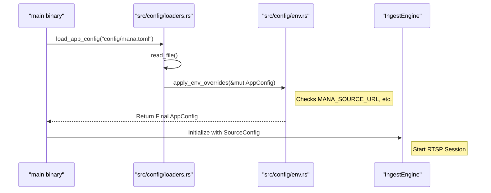

# Getting Started

Relevant source files

- [](https://github.com/ernestovisiona-netizen/kik8/blob/43a92847/.gitignore)
- [](https://github.com/ernestovisiona-netizen/kik8/blob/43a92847/README.md?plain=1)
- [](https://github.com/ernestovisiona-netizen/kik8/blob/43a92847/src/config/env.rs)
- [](https://github.com/ernestovisiona-netizen/kik8/blob/43a92847/src/config/loader.rs)

The `mana-lite` project is a real-time room presence and face-detection pipeline designed to process RTSP video streams through a multi-stage inference and tracking system. This page covers the initial setup, build process, and configuration requirements to establish a functional development environment.

### Development Environment Setup

The codebase is written in **Rust edition 2024** [README.md33](https://github.com/ernestovisiona-netizen/kik8/blob/43a92847/README.md?plain=1#L33-L33) To get started, ensure you have the Rust toolchain installed (typically via `rustup`).

#### Building the Workspace

The project is structured as a Cargo workspace containing the main application binary and several specialized crates located in the `std/` directory [README.md16-21](https://github.com/ernestovisiona-netizen/kik8/blob/43a92847/README.md?plain=1#L16-L21)

To build the entire workspace, including the core binary and all supporting crates:

```
cargo build
```

[README.md35-37](https://github.com/ernestovisiona-netizen/kik8/blob/43a92847/README.md?plain=1#L35-L37)

### Configuration Architecture

`mana-lite` utilizes a layered configuration system. The primary entry point is `config/mana.toml`, which is machine-specific and excluded from version control via `.gitignore` [README.md14-15](https://github.com/ernestovisiona-netizen/kik8/blob/43a92847/README.md?plain=1#L14-L15) [.gitignore7](https://github.com/ernestovisiona-netizen/kik8/blob/43a92847/.gitignore#L7-L7)

#### Data Flow: Configuration Loading

The configuration is resolved by loading the TOML file and then applying environment variable overrides.

1. **File Load**: `load_app_config` reads the TOML file into an `AppConfig` struct [src/config/loader.rs28-29](https://github.com/ernestovisiona-netizen/kik8/blob/43a92847/src/config/loader.rs#L28-L29)
2. **Environment Overrides**: `apply_env_overrides` is called to modify the `AppConfig` in-memory based on `MANA_*` variables [src/config/loader.rs30](https://github.com/ernestovisiona-netizen/kik8/blob/43a92847/src/config/loader.rs#L30-L30) [src/config/env.rs45-68](https://github.com/ernestovisiona-netizen/kik8/blob/43a92847/src/config/env.rs#L45-L68)

#### Natural Language to Code Entity Mapping: Configuration

|System Concept|Code Entity / Path|Role|
|---|---|---|
|**Main Config**|`config/mana.toml`|Local machine settings (RTSP, Viz, Logs)|
|**App Config Struct**|`AppConfig` [src/config/app.rs](https://github.com/ernestovisiona-netizen/kik8/blob/43a92847/src/config/app.rs)|The internal representation of all runtime settings|
|**Catalog Loader**|`load_config<T>` [src/config/loader.rs17-26](https://github.com/ernestovisiona-netizen/kik8/blob/43a92847/src/config/loader.rs#L17-L26)|Generic TOML deserializer for all config types|
|**Env Bridge**|`apply_env_overrides` [src/config/env.rs45-68](https://github.com/ernestovisiona-netizen/kik8/blob/43a92847/src/config/env.rs#L45-L68)|Maps `MANA_` environment variables to `AppConfig` fields|

### RTSP and Source Configuration

Connecting to a video source requires specifying the URL and, optionally, credentials. These can be defined in `mana.toml` or via environment variables.

#### Environment Variables for Ingest

The following variables override the `source` and `ingest` sections of the configuration:

|Variable|`AppConfig` Field|Description|
|---|---|---|
|`MANA_SOURCE_URL`|`cfg.source.url`|The full RTSP URL|
|`MANA_SOURCE_USERNAME`|`cfg.source.username`|RTSP authentication username|
|`MANA_SOURCE_PASSWORD`|`cfg.source.password`|RTSP authentication password|
|`MANA_TRANSPORT`|`cfg.source.transport`|e.g., "tcp" or "udp"|
|`MANA_KEYFRAMES_ONLY`|`cfg.source.keyframes_only`|If true, skips non-IDR frames to reduce CPU load|
|`MANA_BACKOFF_MAX_MS`|`cfg.ingest.reconnect_backoff_max_ms`|Max delay between reconnection attempts|

Sources: [src/config/env.rs46-50](https://github.com/ernestovisiona-netizen/kik8/blob/43a92847/src/config/env.rs#L46-L50) [src/config/env.rs66-67](https://github.com/ernestovisiona-netizen/kik8/blob/43a92847/src/config/env.rs#L66-L67) [README.md39-40](https://github.com/ernestovisiona-netizen/kik8/blob/43a92847/README.md?plain=1#L39-L40)

### Inference and Blueprint Setup

The pipeline's behavior is determined by the **Blueprint** and **Model Catalog**.

- **Model Catalog**: Defined in `config/models.toml` (or path in `MANA_MODEL_CATALOG`), this file lists available models (YOLO, Depth, etc.) [README.md25-27](https://github.com/ernestovisiona-netizen/kik8/blob/43a92847/README.md?plain=1#L25-L27) [src/config/env.rs51](https://github.com/ernestovisiona-netizen/kik8/blob/43a92847/src/config/env.rs#L51-L51)
- **Blueprints**: Located in `config/blueprints/`, these files select which models to run and define the end-to-end logic (e.g., `face` vs `cardinality`) [README.md27-29](https://github.com/ernestovisiona-netizen/kik8/blob/43a92847/README.md?plain=1#L27-L29)

### Observability and Visualization

For development, `mana-lite` integrates with **Rerun.io** for real-time visualization of bounding boxes, masks, and occupancy states.

- **Enable Viz**: Set `MANA_VIZ_ENABLED=true` or `1` [src/config/env.rs58](https://github.com/ernestovisiona-netizen/kik8/blob/43a92847/src/config/env.rs#L58-L58)
- **Rerun Address**: Default is usually `127.0.0.1:9876`, override with `MANA_RERUN_ADDR` [src/config/env.rs59](https://github.com/ernestovisiona-netizen/kik8/blob/43a92847/src/config/env.rs#L59-L59)

### First-Run Workflow

The following diagram illustrates the sequence from binary execution to the active processing loop.

**Initialization Sequence**


Sources: [src/config/loader.rs28-32](https://github.com/ernestovisiona-netizen/kik8/blob/43a92847/src/config/loader.rs#L28-L32) [src/config/env.rs45-68](https://github.com/ernestovisiona-netizen/kik8/blob/43a92847/src/config/env.rs#L45-L68) [README.md10-12](https://github.com/ernestovisiona-netizen/kik8/blob/43a92847/README.md?plain=1#L10-L12)

### Summary of Key Files

|File Path|Purpose|
|---|---|
|`src/config/env.rs`|Contains macros (`env_str!`, `env_parse!`) for mapping environment variables to the config struct [src/config/env.rs3-43](https://github.com/ernestovisiona-netizen/kik8/blob/43a92847/src/config/env.rs#L3-L43)|
|`src/config/loader.rs`|Provides functions to load TOML files for FSMs, Zones, and Depth rules [src/config/loader.rs34-56](https://github.com/ernestovisiona-netizen/kik8/blob/43a92847/src/config/loader.rs#L34-L56)|
|`std/mana-video`|Workspace crate providing `FrameDecoder` and `BufferPool` used during the first-run ingest [README.md19](https://github.com/ernestovisiona-netizen/kik8/blob/43a92847/README.md?plain=1#L19-L19)|
|`std/mana-viz`|Bridge for Rerun.io visualization [README.md21](https://github.com/ernestovisiona-netizen/kik8/blob/43a92847/README.md?plain=1#L21-L21)|

Sources: [README.md8-22](https://github.com/ernestovisiona-netizen/kik8/blob/43a92847/README.md?plain=1#L8-L22) [src/config/env.rs1-68](https://github.com/ernestovisiona-netizen/kik8/blob/43a92847/src/config/env.rs#L1-L68) [src/config/loader.rs1-57](https://github.com/ernestovisiona-netizen/kik8/blob/43a92847/src/config/loader.rs#L1-L57)


### On this page

- [Getting Started](https://deepwiki.com/ernestovisiona-netizen/kik8/1.1-getting-started#getting-started)
- [Development Environment Setup](https://deepwiki.com/ernestovisiona-netizen/kik8/1.1-getting-started#development-environment-setup)
- [Building the Workspace](https://deepwiki.com/ernestovisiona-netizen/kik8/1.1-getting-started#building-the-workspace)
- [Configuration Architecture](https://deepwiki.com/ernestovisiona-netizen/kik8/1.1-getting-started#configuration-architecture)
- [Data Flow: Configuration Loading](https://deepwiki.com/ernestovisiona-netizen/kik8/1.1-getting-started#data-flow-configuration-loading)
- [Natural Language to Code Entity Mapping: Configuration](https://deepwiki.com/ernestovisiona-netizen/kik8/1.1-getting-started#natural-language-to-code-entity-mapping-configuration)
- [RTSP and Source Configuration](https://deepwiki.com/ernestovisiona-netizen/kik8/1.1-getting-started#rtsp-and-source-configuration)
- [Environment Variables for Ingest](https://deepwiki.com/ernestovisiona-netizen/kik8/1.1-getting-started#environment-variables-for-ingest)
- [Inference and Blueprint Setup](https://deepwiki.com/ernestovisiona-netizen/kik8/1.1-getting-started#inference-and-blueprint-setup)
- [Observability and Visualization](https://deepwiki.com/ernestovisiona-netizen/kik8/1.1-getting-started#observability-and-visualization)
- [First-Run Workflow](https://deepwiki.com/ernestovisiona-netizen/kik8/1.1-getting-started#first-run-workflow)
- [Summary of Key Files](https://deepwiki.com/ernestovisiona-netizen/kik8/1.1-getting-started#summary-of-key-files)

