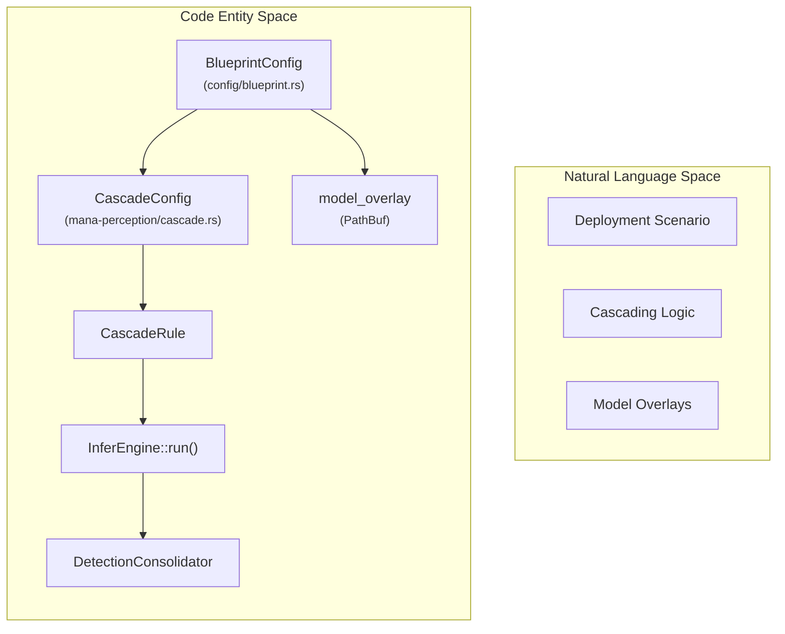
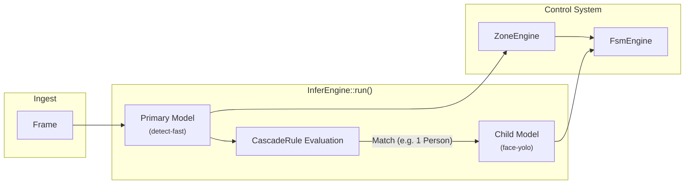

# Blueprints and Deployment Profiles
Esta fuente detalla el concepto de **Blueprints** en el sistema mana-lite, los cuales actúan como una **capa de configuración** esencial para organizar diversos escenarios de implementación sin alterar la lógica central del programa. Estos esquemas funcionan como el **pegamento del sistema**, vinculando catálogos de modelos, **máquinas de estado finito (FSM)** y reglas de cascada para determinar cómo interactúan los componentes de inteligencia artificial entre sí. El texto describe la **estructura técnica** de estos archivos y presenta perfiles específicos —desde el monitoreo clínico avanzado hasta la calibración básica— que ilustran cómo se gestionan las **reglas de dependencia** y el flujo de datos. En última instancia, el propósito del documento es explicar cómo se **orquestan las canalizaciones de percepción** para adaptar el procesamiento visual a necesidades espaciales y operativas concretas.

Relevant source files

- 
- 
- 
- 
- 
- 
- 
- 

This page explains the **Blueprint** concept in `mana-lite`: a configuration layer that orchestrates how specific deployment scenarios select models, Finite State Machines (FSM), spatial zones, and cascade rules. Blueprints allow the system to switch between lightweight detection and complex multi-model clinical monitoring without changing the core application logic.

## The Blueprint Concept

A Blueprint serves as the "glue" that binds disparate configuration catalogs into a functional pipeline. It defines which models from the `ModelCatalog` are active, how they depend on each other (cascading), and whether tracking is mandatory for the scenario.

### Blueprint Structure

The `BlueprintConfig` struct defines the schema for `blueprint.toml` files [config/blueprint.rs8-14](https://github.com/kerrvisiona-sudo/endeli/blob/ad24740d/config/blueprint.rs#L8-L14) It consists of:

- **Metadata**: Basic identity, the primary (root) model, and a list of all participating models [config/blueprint.rs17-28](https://github.com/kerrvisiona-sudo/endeli/blob/ad24740d/config/blueprint.rs#L17-L28)
- **Cascade Rules**: A list of `CascadeRule` objects that define parent-child relationships, such as running a face detector only on a detected "person" [config/blueprint.rs11](https://github.com/kerrvisiona-sudo/endeli/blob/ad24740d/config/blueprint.rs#L11-L11)
- **Semantic Regions**: Definitions for specific spatial areas of interest [config/blueprint.rs13](https://github.com/kerrvisiona-sudo/endeli/blob/ad24740d/config/blueprint.rs#L13-L13)

### Data Flow and Code Mapping

The following diagram illustrates how the `BlueprintConfig` interacts with the `InferEngine` and `CascadeConfig` to drive the perception pipeline.

**Perception Orchestration Diagram**

Sources: [config/blueprint.rs7-28](https://github.com/kerrvisiona-sudo/endeli/blob/ad24740d/config/blueprint.rs#L7-L28) [config/blueprints/detect-room-face/blueprint.toml1-22](https://github.com/kerrvisiona-sudo/endeli/blob/ad24740d/config/blueprints/detect-room-face/blueprint.toml#L1-L22)

## Built-in Deployment Profiles

The system provides several standard profiles located in `config/blueprints/`.

### 1. `detect-room-face`

This is a high-fidelity profile designed for clinical room monitoring. It stabilizes occupancy detection via tracking and performs facial analysis on a single confirmed person [config/blueprints/detect-room-face/README.md3-9](https://github.com/kerrvisiona-sudo/endeli/blob/ad24740d/config/blueprints/detect-room-face/README.md?plain=1#L3-L9)

- **Primary Model**: `detect-fast` [config/blueprints/detect-room-face/blueprint.toml5](https://github.com/kerrvisiona-sudo/endeli/blob/ad24740d/config/blueprints/detect-room-face/blueprint.toml#L5-L5)
- **Dynamic Cropping**: When the room state is `single`, `face-yolo` runs on a dynamic 320x320 crop centered on the upper half of the detected person [config/blueprints/detect-room-face/README.md7-15](https://github.com/kerrvisiona-sudo/endeli/blob/ad24740d/config/blueprints/detect-room-face/README.md?plain=1#L7-L15)
- **FSM Integration**: Uses a specialized FSM (`fsm.toml` in the blueprint dir) to track states like `searching`, `detected`, `in_bed`, and `exiting` [config/blueprints/detect-room-face/README.md28-37](https://github.com/kerrvisiona-sudo/endeli/blob/ad24740d/config/blueprints/detect-room-face/README.md?plain=1#L28-L37)
- **Configuration**: Requires `track = true`, `zones = true`, and `fsm = true` in the main `mana.toml` [config/blueprints/detect-room-face/README.md79-83](https://github.com/kerrvisiona-sudo/endeli/blob/ad24740d/config/blueprints/detect-room-face/README.md?plain=1#L79-L83)

### 2. `detect-face`

A lightweight profile that runs a primary detector and a face detector on the same frame without complex room logic [config/blueprints/detect-face/blueprint.toml1-7](https://github.com/kerrvisiona-sudo/endeli/blob/ad24740d/config/blueprints/detect-face/blueprint.toml#L1-L7)

- **Rule**: `face-yolo` requires exactly 1 `person` detection from `detect-fast` with a minimum confidence of 0.50 [config/blueprints/detect-face/blueprint.toml14-18](https://github.com/kerrvisiona-sudo/endeli/blob/ad24740d/config/blueprints/detect-face/blueprint.toml#L14-L18)

### 3. `detect-face-pose-seg`

A stable multi-model profile for full enrichment (Face, Pose, and Segmentation). It requires a confirmed, visible track to trigger child models, preventing flickers caused by isolated false positives [config/blueprints/detect-face-pose-seg/README.md1-22](https://github.com/kerrvisiona-sudo/endeli/blob/ad24740d/config/blueprints/detect-face-pose-seg/README.md?plain=1#L1-L22)

- **Children**: `face-yolo`, `pose-standard`, `seg-standard` [config/blueprints/detect-face-pose-seg/blueprint.toml6](https://github.com/kerrvisiona-sudo/endeli/blob/ad24740d/config/blueprints/detect-face-pose-seg/blueprint.toml#L6-L6)
- **Gate**: All children require `requires_min_area_ratio = 0.01` to avoid processing tiny, low-quality detections [config/blueprints/detect-face-pose-seg/blueprint.toml18-34](https://github.com/kerrvisiona-sudo/endeli/blob/ad24740d/config/blueprints/detect-face-pose-seg/blueprint.toml#L18-L34)

### 4. `detect-room-raw`

A calibration-only profile. It disables tracking and child models to allow raw observation of the detector's performance and temporal filters [config/blueprints/detect-room-raw/README.md1-7](https://github.com/kerrvisiona-sudo/endeli/blob/ad24740d/config/blueprints/detect-room-raw/README.md?plain=1#L1-L7)

- **Logic**: `requires_tracking = false` [config/blueprints/detect-room-raw/blueprint.toml8](https://github.com/kerrvisiona-sudo/endeli/blob/ad24740d/config/blueprints/detect-room-raw/blueprint.toml#L8-L8)
- **Usage**: Primarily used for tuning `presence.occupancy` timers (`single_confirm_ms`, etc.) without the influence of Kalman filter tracking [config/blueprints/detect-room-raw/README.md9-18](https://github.com/kerrvisiona-sudo/endeli/blob/ad24740d/config/blueprints/detect-room-raw/README.md?plain=1#L9-L18)

## Cascade Rules and Execution

The `rules` section in a blueprint defines the execution tree. Each `CascadeRule` determines when a child model is triggered based on the output of a parent.

|Rule Parameter|Description|
|---|---|
|`requires`|The `ModelId` of the parent model [config/blueprints/detect-room-face/blueprint.toml15](https://github.com/kerrvisiona-sudo/endeli/blob/ad24740d/config/blueprints/detect-room-face/blueprint.toml#L15-L15)|
|`requires_class`|The object class (e.g., "person") that triggers the child [config/blueprints/detect-room-face/blueprint.toml16](https://github.com/kerrvisiona-sudo/endeli/blob/ad24740d/config/blueprints/detect-room-face/blueprint.toml#L16-L16)|
|`requires_exact_count`|Triggers only if exactly N instances are found [config/blueprints/detect-room-face/blueprint.toml17](https://github.com/kerrvisiona-sudo/endeli/blob/ad24740d/config/blueprints/detect-room-face/blueprint.toml#L17-L17)|
|`same_frame`|If `false`, allows using a confirmed track from a previous frame to resolve the crop, smoothing over detector dropouts [config/blueprints/detect-room-face/blueprint.toml21](https://github.com/kerrvisiona-sudo/endeli/blob/ad24740d/config/blueprints/detect-room-face/blueprint.toml#L21-L21)|

**Blueprint Execution Flow**

Sources: [config/blueprints/detect-room-face/blueprint.toml10-22](https://github.com/kerrvisiona-sudo/endeli/blob/ad24740d/config/blueprints/detect-room-face/blueprint.toml#L10-L22) [config/blueprints/detect-room-face/README.md100-105](https://github.com/kerrvisiona-sudo/endeli/blob/ad24740d/config/blueprints/detect-room-face/README.md?plain=1#L100-L105)

## Implementation Details

- **Model Overlays**: Blueprints can provide a `model_overlay` file (usually `models.toml` inside the blueprint directory). This allows the blueprint to override global model parameters like `confidence` or `imgsz` for its specific use case [config/blueprint.rs27](https://github.com/kerrvisiona-sudo/endeli/blob/ad24740d/config/blueprint.rs#L27-L27) [config/blueprints/detect-room-face/blueprint.toml8](https://github.com/kerrvisiona-sudo/endeli/blob/ad24740d/config/blueprints/detect-room-face/blueprint.toml#L8-L8)
- **Tracking Dependency**: If `requires_tracking` is set to `true`, the `InferEngine` and `DetectionConsolidator` will prioritize `track_id` stability for child model cropping [config/blueprints/detect-room-face/blueprint.toml7-21](https://github.com/kerrvisiona-sudo/endeli/blob/ad24740d/config/blueprints/detect-room-face/blueprint.toml#L7-L21)

Sources:

- `config/blueprint.rs`
- `config/blueprints/detect-room-face/README.md`
- `config/blueprints/detect-room-face/blueprint.toml`
- `config/blueprints/detect-face/blueprint.toml`
- `config/blueprints/detect-face-pose-seg/blueprint.toml`
- `config/blueprints/detect-room-raw/blueprint.toml`
- `config/blueprints/detect-face-pose-seg/README.md`
- `config/blueprints/detect-room-raw/README.md`

### On this page

- [Blueprints and Deployment Profiles](https://deepwiki.com/kerrvisiona-sudo/endeli/1.2-blueprints-and-deployment-profiles#blueprints-and-deployment-profiles)
- [The Blueprint Concept](https://deepwiki.com/kerrvisiona-sudo/endeli/1.2-blueprints-and-deployment-profiles#the-blueprint-concept)
- [Blueprint Structure](https://deepwiki.com/kerrvisiona-sudo/endeli/1.2-blueprints-and-deployment-profiles#blueprint-structure)
- [Data Flow and Code Mapping](https://deepwiki.com/kerrvisiona-sudo/endeli/1.2-blueprints-and-deployment-profiles#data-flow-and-code-mapping)
- [Built-in Deployment Profiles](https://deepwiki.com/kerrvisiona-sudo/endeli/1.2-blueprints-and-deployment-profiles#built-in-deployment-profiles)
- [1. `detect-room-face`](https://deepwiki.com/kerrvisiona-sudo/endeli/1.2-blueprints-and-deployment-profiles#1-detect-room-face)
- [2. `detect-face`](https://deepwiki.com/kerrvisiona-sudo/endeli/1.2-blueprints-and-deployment-profiles#2-detect-face)
- [3. `detect-face-pose-seg`](https://deepwiki.com/kerrvisiona-sudo/endeli/1.2-blueprints-and-deployment-profiles#3-detect-face-pose-seg)
- [4. `detect-room-raw`](https://deepwiki.com/kerrvisiona-sudo/endeli/1.2-blueprints-and-deployment-profiles#4-detect-room-raw)
- [Cascade Rules and Execution](https://deepwiki.com/kerrvisiona-sudo/endeli/1.2-blueprints-and-deployment-profiles#cascade-rules-and-execution)
- [Implementation Details](https://deepwiki.com/kerrvisiona-sudo/endeli/1.2-blueprints-and-deployment-profiles#implementation-details)

