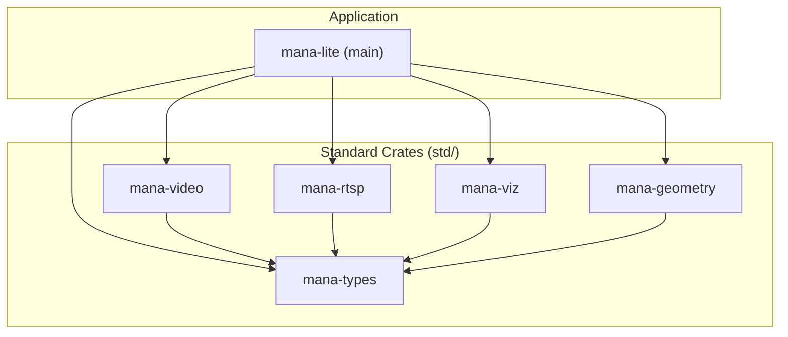
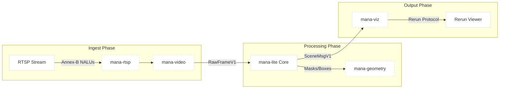

# Workspace Crates

Relevant source files

- 
- 
- 
- 
- 
- 

The `mana-lite` codebase is structured as a Cargo workspace, delegating specific domain logic to a set of standardized crates located in the `std/` directory. These crates provide the foundational types, geometric primitives, video processing utilities, and visualization bridges used by the main application binary.

### Workspace Architecture

The relationship between the core application and the `std/` crates is one of dependency inversion for types and specialization for logic. The `mana-types` crate serves as the "common language" for the entire workspace.

#### Crate Dependency Graph

"Workspace Crate Dependencies"

**Sources:** [std/mana-video/Cargo.toml8](https://github.com/ernestovisiona-netizen/kik8/blob/43a92847/std/mana-video/Cargo.toml#L8-L8) [std/mana-viz/Cargo.toml8](https://github.com/ernestovisiona-netizen/kik8/blob/43a92847/std/mana-viz/Cargo.toml#L8-L8) [std/mana-geometry/Cargo.toml1-13](https://github.com/ernestovisiona-netizen/kik8/blob/43a92847/std/mana-geometry/Cargo.toml#L1-L13)

---

### 1. mana-types

The `mana-types` crate defines the Plain Old Data (POD) structures used for Inter-Process Communication (IPC) and internal pipeline stages. It avoids complex logic, focusing on memory layout and schema versioning.

#### Key Data Structures

- **`PixelFormat`**: An enum defining supported image formats like `Rgb8`, `Nv12`, and `Yuyv`. It includes utility functions for calculating buffer sizes: `frame_byte_size(width, height)` [std/mana-types/src/lib.rs3-50](https://github.com/ernestovisiona-netizen/kik8/blob/43a92847/std/mana-types/src/lib.rs#L3-L50)
- **`RawFrameV1`**: The primary container for decoded video frames, including metadata like `frame_id`, `timestamp_ns`, and `capture_mono_ns` for latency tracking [std/mana-types/src/lib.rs55-65](https://github.com/ernestovisiona-netizen/kik8/blob/43a92847/std/mana-types/src/lib.rs#L55-L65)
- **`DetectionBatchV1`**: A fixed-size array (`MAX_DETECTIONS = 128`) of `DetectionV1` objects, used to pass inference results between the `InferEngine` and the `Tracker` [std/mana-types/src/lib.rs85-106](https://github.com/ernestovisiona-netizen/kik8/blob/43a92847/std/mana-types/src/lib.rs#L85-L106)
- **`SceneMsgV1`**: The final output of the vision pipeline, containing a list of `SceneEntityV1` (tracked objects) and `ZoneV1` (spatial regions) [std/mana-types/src/lib.rs239-254](https://github.com/ernestovisiona-netizen/kik8/blob/43a92847/std/mana-types/src/lib.rs#L239-L254)

**Sources:** [std/mana-types/src/lib.rs1-287](https://github.com/ernestovisiona-netizen/kik8/blob/43a92847/std/mana-types/src/lib.rs#L1-L287)

---

### 2. mana-geometry

This crate provides spatial primitives and algorithms for processing computer vision outputs. It bridges the gap between raw inference masks and high-level zone logic.

#### Implementation Details

- **`CompactMask`**: Uses Run-Length Encoding (RLE) via the `vernier-mask` crate to store segmentation masks efficiently [std/mana-geometry/Cargo.toml5-9](https://github.com/ernestovisiona-netizen/kik8/blob/43a92847/std/mana-geometry/Cargo.toml#L5-L9)
- **Coordinate Transforms**: Logic for mapping coordinates between different spaces:
    - **Crop Space**: Normalized coordinates (0.0 to 1.0) relative to a specific model inference crop.
    - **Frame Space**: Coordinates relative to the full 1080p/4K input frame.
- **Polygonization**: Functions to convert raster masks into vector contours (polygons) for inclusion in `SceneMsgV1` events.

**Sources:** [std/mana-geometry/Cargo.toml1-16](https://github.com/ernestovisiona-netizen/kik8/blob/43a92847/std/mana-geometry/Cargo.toml#L1-L16)

---

### 3. mana-video

`mana-video` abstracts the complexities of hardware and software video decoding. It provides a common interface for the application to consume frames regardless of the underlying codec or library (e.g., FFmpeg).

#### Key Components

- **`FrameDecoder` Trait**: A standardized interface for decoders to implement, ensuring the main pipeline receives `RawFrameV1` objects.
- **`BufferPool`**: A memory management utility that prevents frequent allocations by recycling frame buffers.
- **FFmpeg Integration**: Wraps `ffmpeg-next` to handle H.264/H.265 decoding [std/mana-video/Cargo.toml11](https://github.com/ernestovisiona-netizen/kik8/blob/43a92847/std/mana-video/Cargo.toml#L11-L11)

**Sources:** [std/mana-video/Cargo.toml1-12](https://github.com/ernestovisiona-netizen/kik8/blob/43a92847/std/mana-video/Cargo.toml#L1-L12)

---

### 4. mana-rtsp & mana-viz

These crates handle the ingress and egress of the system respectively.

- **`mana-rtsp`**: Contains utilities for handling H.264 Annex-B streams. It is responsible for parsing NAL units (Network Abstraction Layer) from RTSP packets before they are sent to the decoder [std/mana-rtsp/Cargo.toml1-5](https://github.com/ernestovisiona-netizen/kik8/blob/43a92847/std/mana-rtsp/Cargo.toml#L1-L5)
- **`mana-viz`**: A bridge to the `Rerun.io` visualization SDK. It converts `mana-types` structures into Rerun archetypes (e.g., `Boxes2D`, `Image`, `Tensor`) for real-time debugging [std/mana-viz/Cargo.toml5-9](https://github.com/ernestovisiona-netizen/kik8/blob/43a92847/std/mana-viz/Cargo.toml#L5-L9)

**Sources:** [std/mana-rtsp/Cargo.toml1-8](https://github.com/ernestovisiona-netizen/kik8/blob/43a92847/std/mana-rtsp/Cargo.toml#L1-L8) [std/mana-viz/Cargo.toml1-12](https://github.com/ernestovisiona-netizen/kik8/blob/43a92847/std/mana-viz/Cargo.toml#L1-L12)

---

### Data Flow: From Bytes to Entities

The following diagram illustrates how data flows through the workspace crates, transforming from raw network packets into structured scene messages.

"Data Transformation Flow"

**Sources:** [std/mana-types/src/lib.rs55-65](https://github.com/ernestovisiona-netizen/kik8/blob/43a92847/std/mana-types/src/lib.rs#L55-L65) [std/mana-types/src/lib.rs239-254](https://github.com/ernestovisiona-netizen/kik8/blob/43a92847/std/mana-types/src/lib.rs#L239-L254) [std/mana-video/Cargo.toml5](https://github.com/ernestovisiona-netizen/kik8/blob/43a92847/std/mana-video/Cargo.toml#L5-L5) [std/mana-viz/Cargo.toml5](https://github.com/ernestovisiona-netizen/kik8/blob/43a92847/std/mana-viz/Cargo.toml#L5-L5)

### On this page

- [Workspace Crates](https://deepwiki.com/ernestovisiona-netizen/kik8/1.2-workspace-crates#workspace-crates)
- [Workspace Architecture](https://deepwiki.com/ernestovisiona-netizen/kik8/1.2-workspace-crates#workspace-architecture)
- [Crate Dependency Graph](https://deepwiki.com/ernestovisiona-netizen/kik8/1.2-workspace-crates#crate-dependency-graph)
- [1. mana-types](https://deepwiki.com/ernestovisiona-netizen/kik8/1.2-workspace-crates#1-mana-types)
- [Key Data Structures](https://deepwiki.com/ernestovisiona-netizen/kik8/1.2-workspace-crates#key-data-structures)
- [2. mana-geometry](https://deepwiki.com/ernestovisiona-netizen/kik8/1.2-workspace-crates#2-mana-geometry)
- [Implementation Details](https://deepwiki.com/ernestovisiona-netizen/kik8/1.2-workspace-crates#implementation-details)
- [3. mana-video](https://deepwiki.com/ernestovisiona-netizen/kik8/1.2-workspace-crates#3-mana-video)
- [Key Components](https://deepwiki.com/ernestovisiona-netizen/kik8/1.2-workspace-crates#key-components)
- [4. mana-rtsp & mana-viz](https://deepwiki.com/ernestovisiona-netizen/kik8/1.2-workspace-crates#4-mana-rtsp-mana-viz)
- [Data Flow: From Bytes to Entities](https://deepwiki.com/ernestovisiona-netizen/kik8/1.2-workspace-crates#data-flow-from-bytes-to-entities)

