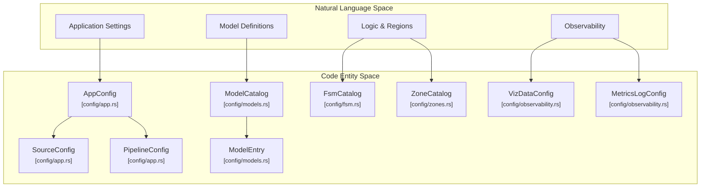
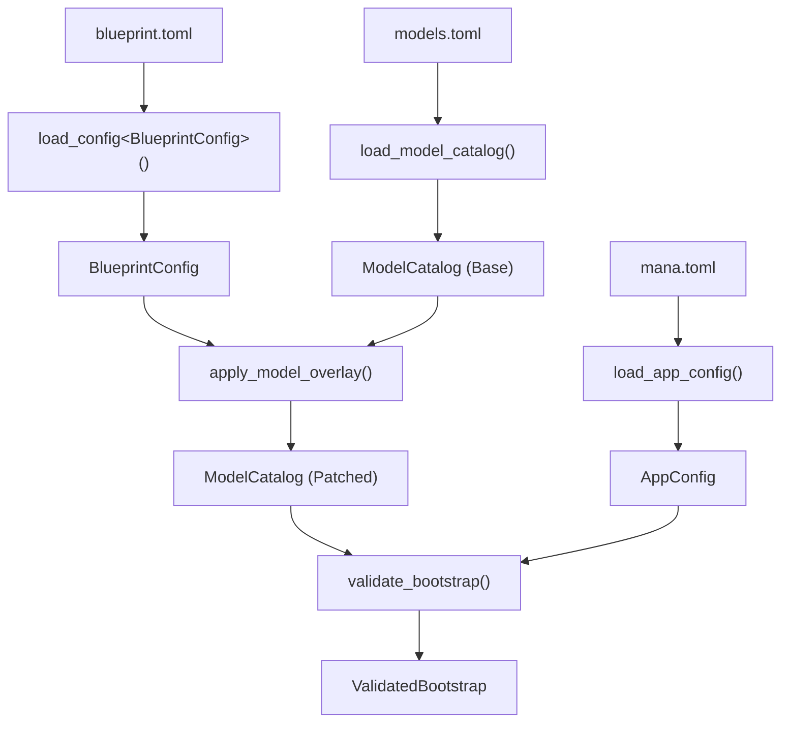

# Configuration System
El sistema de configuración de **mana-lite** emplea una **arquitectura en capas** diseñada para organizar de manera eficiente los parámetros de infraestructura, las reglas lógicas y el monitoreo del sistema. A través de archivos **TOML**, la estructura permite que un archivo central, **mana.toml**, se complemente con **Blueprints** para aplicar ajustes específicos o parches a los modelos sin alterar el catálogo base. El marco de trabajo abarca desde la gestión de transmisiones de video y políticas de presencia hasta la definición de **zonas espaciales** y máquinas de estados (**FSM**) que dictan el razonamiento de la aplicación. Finalmente, el sistema asegura la integridad operativa mediante un proceso de **validación durante el arranque**, el cual unifica los datos de configuración y los registros de observabilidad en un entorno listo para la ejecución.

Relevant source files

- 
- 
- 
- 
- 
- 
- 

The configuration system in `mana-lite` uses a layered architecture designed to separate infrastructure settings (RTSP URLs, health thresholds) from deployment-specific logic (models, FSM states, and spatial zones). The system is built on TOML files that are loaded, validated, and merged during the [bootstrap sequence](https://github.com/kerrvisiona-sudo/endeli/blob/ad24740d/bootstrap%20sequence)

### Configuration Architecture

The configuration is anchored by `mana.toml`, which acts as the entry point. It references other catalogs and can be specialized using **Blueprints** to override model parameters or FSM logic for specific use cases.

#### Configuration Entity Map

This diagram maps the conceptual configuration domains to their primary data structures in the code.

**Sources:** [config/app.rs10-41](https://github.com/kerrvisiona-sudo/endeli/blob/ad24740d/config/app.rs#L10-L41) [config/models.rs30-32](https://github.com/kerrvisiona-sudo/endeli/blob/ad24740d/config/models.rs#L30-L32) [config/observability.rs8-11](https://github.com/kerrvisiona-sudo/endeli/blob/ad24740d/config/observability.rs#L8-L11) [config/observability.rs116-119](https://github.com/kerrvisiona-sudo/endeli/blob/ad24740d/config/observability.rs#L116-L119)

---

### AppConfig and Pipeline Toggles

The `AppConfig` struct, loaded from `mana.toml`, governs the foundational behavior of the process. It includes `SourceConfig` for RTSP stream details [config/app.rs45-55](https://github.com/kerrvisiona-sudo/endeli/blob/ad24740d/config/app.rs#L45-L55) `ScanConfigSection` for the 5Hz clinical tick rate [config/app.rs117-121](https://github.com/kerrvisiona-sudo/endeli/blob/ad24740d/config/app.rs#L117-L121) and `PipelineConfig` which allows toggling entire subsystems like tracking or FSM evaluation [config/app.rs85-96](https://github.com/kerrvisiona-sudo/endeli/blob/ad24740d/config/app.rs#L85-L96)

It also defines critical policies for `PresenceConfig` (how long to wait before declaring a person "present") [config/app.rs186-195](https://github.com/kerrvisiona-sudo/endeli/blob/ad24740d/config/app.rs#L186-L195) and `OccupancyPolicy` (hysteresis for room cardinality) [config/app.rs220-231](https://github.com/kerrvisiona-sudo/endeli/blob/ad24740d/config/app.rs#L220-L231)

For details, see [AppConfig and Pipeline Toggles](https://deepwiki.com/kerrvisiona-sudo/endeli/2.1-appconfig-and-pipeline-toggles).

**Sources:** [config/app.rs10-41](https://github.com/kerrvisiona-sudo/endeli/blob/ad24740d/config/app.rs#L10-L41) [config/app.rs85-96](https://github.com/kerrvisiona-sudo/endeli/blob/ad24740d/config/app.rs#L85-L96) [config/app.rs220-231](https://github.com/kerrvisiona-sudo/endeli/blob/ad24740d/config/app.rs#L220-L231)

---

### Model Catalog and Loader

The `ModelCatalog` is a registry of all available ONNX models. Each `ModelEntry` defines the model's task (e.g., `Detect`, `Pose`, `Segment`), the path to weights, and inference parameters like `imgsz` and `confidence` [config/models.rs30-32](https://github.com/kerrvisiona-sudo/endeli/blob/ad24740d/config/models.rs#L30-L32)

The system supports a hierarchical loading process where a **Blueprint** can apply a `ModelPatch` to override specific fields (like lowering a confidence threshold for a specific deployment) without modifying the base catalog [config/model_loader/patch.rs](https://github.com/kerrvisiona-sudo/endeli/blob/ad24740d/config/model_loader/patch.rs) It also handles path rebasing via the `MANA_MODELS_HOME` environment variable to ensure portability [config/model_loader/load.rs9-16](https://github.com/kerrvisiona-sudo/endeli/blob/ad24740d/config/model_loader/load.rs#L9-L16)

For details, see [Model Catalog and Loader](https://deepwiki.com/kerrvisiona-sudo/endeli/2.2-model-catalog-and-loader).

**Sources:** [config/model_loader/load.rs18-36](https://github.com/kerrvisiona-sudo/endeli/blob/ad24740d/config/model_loader/load.rs#L18-L36) [config/model_loader/load.rs42-49](https://github.com/kerrvisiona-sudo/endeli/blob/ad24740d/config/model_loader/load.rs#L42-L49) [config/validation.rs3-23](https://github.com/kerrvisiona-sudo/endeli/blob/ad24740d/config/validation.rs#L3-L23)

---

### FSM, Zone, and Cascade Configuration

This domain handles the high-level reasoning of the system.

- **Zones:** Defined in `ZoneCatalog`, these are spatial regions (AABBs) used to trigger events [config/zones.rs39](https://github.com/kerrvisiona-sudo/endeli/blob/ad24740d/config/zones.rs#L39-L39)
- **FSM:** The `FsmCatalog` defines the state machine logic, including transitions and `FsmGuard` conditions (e.g., "is person in zone X?") [config/fsm.rs24](https://github.com/kerrvisiona-sudo/endeli/blob/ad24740d/config/fsm.rs#L24-L24)
- **Cascade:** `CascadeConfig` wires models together, defining parent-child relationships (e.g., only run the Face model on crops produced by the Person detector) [config/blueprint.rs21-23](https://github.com/kerrvisiona-sudo/endeli/blob/ad24740d/config/blueprint.rs#L21-L23)

During bootstrap, the `FsmProgram` is compiled and validated against the loaded models and zones to ensure all references are sound [app/bootstrap/validate.rs116-140](https://github.com/kerrvisiona-sudo/endeli/blob/ad24740d/app/bootstrap/validate.rs#L116-L140)

For details, see [FSM, Zone, and Cascade Configuration](https://deepwiki.com/kerrvisiona-sudo/endeli/2.3-fsm-zone-and-cascade-configuration).

**Sources:** [app/bootstrap/validate.rs116-155](https://github.com/kerrvisiona-sudo/endeli/blob/ad24740d/app/bootstrap/validate.rs#L116-L155) [config/blueprint.rs21-23](https://github.com/kerrvisiona-sudo/endeli/blob/ad24740d/config/blueprint.rs#L21-L23) [config/mod.rs47-65](https://github.com/kerrvisiona-sudo/endeli/blob/ad24740d/config/mod.rs#L47-L65)

---

### Observability Configuration

Observability is split into real-time visualization and structured logging.

- **VizDataConfig:** Controls the [Rerun.io](https://rerun.io/) integration, including `VizSendToggles` to enable/disable specific streams like segmentation masks or latency metrics [config/observability.rs44-83](https://github.com/kerrvisiona-sudo/endeli/blob/ad24740d/config/observability.rs#L44-L83)
- **MetricsLogConfig:** Configures the frequency and content of the `.jsonl` telemetry files, including toggles for frame, zone, and FSM events [config/observability.rs117-138](https://github.com/kerrvisiona-sudo/endeli/blob/ad24740d/config/observability.rs#L117-L138) [config/observability.rs227-252](https://github.com/kerrvisiona-sudo/endeli/blob/ad24740d/config/observability.rs#L227-L252)

For details, see [Observability Configuration](https://deepwiki.com/kerrvisiona-sudo/endeli/2.4-observability-configuration).

**Sources:** [config/observability.rs44-83](https://github.com/kerrvisiona-sudo/endeli/blob/ad24740d/config/observability.rs#L44-L83) [config/observability.rs227-252](https://github.com/kerrvisiona-sudo/endeli/blob/ad24740d/config/observability.rs#L227-L252)

---

### Configuration Loading Flow

The following diagram illustrates how raw files are transformed into the `ValidatedBootstrap` used by the `App`.

**BlueprintConfig + ModelCatalog(Base) → model overlay → ModelCatalog(Patched) → validate_bootstrap() ← AppConfig → ValidatedBootstrap**.

**Sources:** [config/loader.rs25-28](https://github.com/kerrvisiona-sudo/endeli/blob/ad24740d/config/loader.rs#L25-L28) [config/model_loader/load.rs18-29](https://github.com/kerrvisiona-sudo/endeli/blob/ad24740d/config/model_loader/load.rs#L18-L29) [app/bootstrap/validate.rs65-114](https://github.com/kerrvisiona-sudo/endeli/blob/ad24740d/app/bootstrap/validate.rs#L65-L114) [config/mod.rs99-116](https://github.com/kerrvisiona-sudo/endeli/blob/ad24740d/config/mod.rs#L99-L116)

### On this page

- [Configuration System](https://deepwiki.com/kerrvisiona-sudo/endeli/2-configuration-system#configuration-system)
- [Configuration Architecture](https://deepwiki.com/kerrvisiona-sudo/endeli/2-configuration-system#configuration-architecture)
- [Configuration Entity Map](https://deepwiki.com/kerrvisiona-sudo/endeli/2-configuration-system#configuration-entity-map)
- [AppConfig and Pipeline Toggles](https://deepwiki.com/kerrvisiona-sudo/endeli/2-configuration-system#appconfig-and-pipeline-toggles)
- [Model Catalog and Loader](https://deepwiki.com/kerrvisiona-sudo/endeli/2-configuration-system#model-catalog-and-loader)
- [FSM, Zone, and Cascade Configuration](https://deepwiki.com/kerrvisiona-sudo/endeli/2-configuration-system#fsm-zone-and-cascade-configuration)
- [Observability Configuration](https://deepwiki.com/kerrvisiona-sudo/endeli/2-configuration-system#observability-configuration)
- [Configuration Loading Flow](https://deepwiki.com/kerrvisiona-sudo/endeli/2-configuration-system#configuration-loading-flow)

