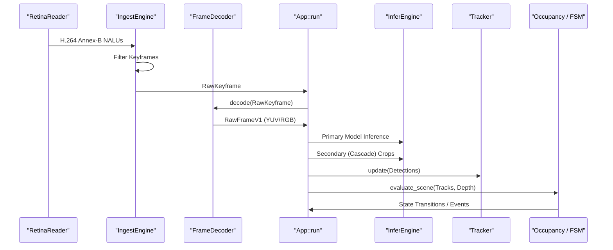
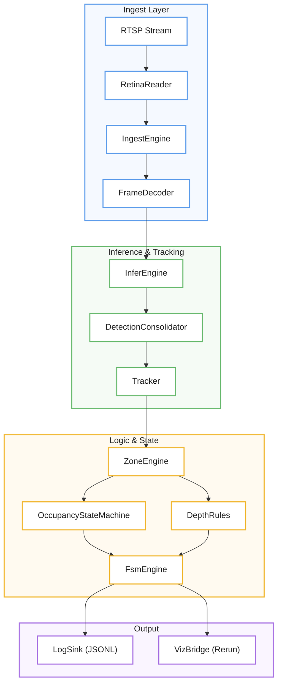

# Core Pipeline Architecture

Relevant source files

- [](src/error.rs)
- [](src/app/mod.rs)
- [](src/pipeline.rs)

The `mana-lite` system is built around a synchronous processing loop
encapsulated in [`App`](src/app/mod.rs). It transforms raw RTSP network packets
into high-level state machine transitions through a multi-stage pipeline. The
architecture prioritizes low-latency processing of keyframes, utilizing a
"cascade" model where secondary inferences are triggered by primary detections.

### High-Level Data Flow

The pipeline operates on a per-keyframe basis. While the RTSP stream may contain P-frames, the system specifically targets I-frames (keyframes) to minimize decoding overhead and ensure each processed image is self-contained.

#### Pipeline Sequence Diagram

"System Processing Loop"


**RetinaReader → IngestEngine → App::run → FrameDecoder → App::run → InferEngine / Tracker / Occupancy-FSM → App::run**.



Sources: [`App::run`](src/app/mod.rs), [`IngestEngine`](src/ingest.rs), [`FrameDecoder`](src/snapshot.rs)

### The App Struct and Main Loop

[`App`](src/app/mod.rs) is the central orchestrator, holding the state for all major subsystems including `InferEngine`, `Tracker`, `ZoneEngine`, and `FsmEngine`.

[`App::run`](src/app/mod.rs) executes an infinite loop that:

1. Polls `IngestEngine` for new `RawKeyframe` data.
2. Updates `PipelineState` and `Health` metrics.
3. Triggers `App::process_keyframe`.

Within `App::process_keyframe`, the system performs inference and state
evaluation. The method is wrapped in `catch_unwind` so a panic in one frame
does not crash the ingest service.

Sources: [`App`](src/app/mod.rs), [`App::run`](src/app/mod.rs), [`App::process_keyframe`](src/app/mod.rs)

### Pipeline Stages

The following stages define the lifecycle of a frame within the system:

#### 1. Video Ingest and Decoding

The `IngestEngine` manages the `RetinaReader`, which handles RTSP session negotiation and packetization [src/ingest.rs135-150](src/ingest.rs#L135-L150) It extracts Annex-B keyframes and passes them to the `FrameDecoder` [src/snapshot.rs21-40](src/snapshot.rs#L21-L40)

- For details, see [Video Ingest and Decoding](https://deepwiki.com/ernestovisiona-netizen/kik8/2.1-video-ingest-and-decoding).

#### 2. Inference Engine

[`InferEngine`](src/infer/mod.rs) executes YOLO models defined in the
`ModelCatalog`. `App` schedules primary full-frame models and secondary
cascade models that run on selected crops (for example, a face model on a head
crop).

- For details, see [Inference Engine](https://deepwiki.com/ernestovisiona-netizen/kik8/2.2-inference-engine).

#### 3. Multi-Object Tracking

Detections are passed to the `Tracker`, which maintains identities across frames using a Kalman filter for motion prediction and the Hungarian algorithm for data association [src/track.rs136-155](src/track.rs#L136-L155) This transforms transient detections into stable `Track` objects.

- For details, see [Multi-Object Tracking](https://deepwiki.com/ernestovisiona-netizen/kik8/2.3-multi-object-tracking).

#### 4. Presence and Occupancy

The system converts raw tracks into room-level state. The `PresenceFilter` debounces detections [src/presence.rs44-60](src/presence.rs#L44-L60) while the `OccupancyStateMachine` applies temporal hysteresis to determine if a room is `Empty`, `SingleOccupancy`, or `MultipleOccupancy` [src/occupancy.rs98-120](src/occupancy.rs#L98-L120)

- For details, see [Presence and Occupancy](https://deepwiki.com/ernestovisiona-netizen/kik8/2.4-presence-and-occupancy).

#### 5. Depth Analysis

If a depth-capable model is used, the `DepthRegionRule` evaluator compares depth map statistics (like median distance) against configured spatial regions [src/depth.rs188-210](src/depth.rs#L188-L210) This allows the system to distinguish between a person standing in a zone versus a person lying in a bed based on Z-axis data.

- For details, see [Depth Analysis](https://deepwiki.com/ernestovisiona-netizen/kik8/2.5-depth-analysis).

### Code Entity Mapping

This diagram maps high-level pipeline concepts to their specific implementations in the Rust codebase.

"Pipeline Architecture Mapping"

![[Pasted image 20260809013557.png]]


```mermaid
┌───────────────────────────────────────┐
│            Ingest Layer               │
│                                       │
│          RTSP Stream                  │
│               ↓                       │
│          RetinaReader                 │
│               ↓                       │
│          IngestEngine                 │
│               ↓                       │
│          FrameDecoder                 │
└──────────────────┬────────────────────┘
                   ↓
┌───────────────────────────────────────┐
│       Inference & Tracking             │
│                                       │
│          InferEngine                  │
│               ↓                       │
│      DetectionConsolidator            │
│               ↓                       │
│             Tracker                   │
└──────────────────┬────────────────────┘
                   ↓
┌───────────────────────────────────────┐
│            Logic & State              │
│                                       │
│             ZoneEngine                │
│              ↙       ↘                │
│ OccupancyStateMachine   DepthRules    │
│              ↘       ↙                │
│              FsmEngine                │
└───────────────┬───────────┬───────────┘
                ↓           ↓
┌───────────────────────────────────────┐
│                 Output                │
│                                       │
│   LogSink (JSONL)   VizBridge (Rerun) │
└───────────────────────────────────────┘
```
`ZoneEngine → OccupancyStateMachine` y `ZoneEngine → DepthRules` como en tu imagen, y ambos convergen en `FsmEngine`. También dejé `FSM → Output` bifurcado hacia los dos sinks.

Sources: [`App`](src/app/mod.rs), [`PipelineState`](src/pipeline.rs), [`App::process_keyframe`](src/app/mod.rs)

### Pipeline State and Health

The `PipelineState` struct tracks frame counts and timing [src/pipeline.rs6-11](src/pipeline.rs#L6-L11) while the `Health` monitor detects "blind" states (no frames received) or "stale" states (frames received but no detections) [src/metrics.rs253-270](src/metrics.rs#L253-L270) Metrics are aggregated and emitted periodically as `Event::metrics` [src/pipeline.rs86-90](src/pipeline.rs#L86-L90)

|Entity|Role|File|
|---|---|---|
|`App`|Main orchestrator and loop owner|[`App`](src/app/mod.rs)|
|`PipelineState`|Tracks frame counters and panic recovery|[src/pipeline.rs6](src/pipeline.rs#L6-L6)|
|`IngestEngine`|Manages RTSP connection and keyframe filtering|[src/ingest.rs135](src/ingest.rs#L135-L135)|
|`InferEngine`|Interface for AI model execution|[`InferEngine`](src/infer/mod.rs)|
|`FsmEngine`|Evaluates high-level business logic|[`FsmEngine`](src/fsm/engine.rs)|

Sources: [`App`](src/app/mod.rs), [`PipelineState`](src/pipeline.rs), [`Health`](src/health.rs)


### On this page

- [Core Pipeline Architecture](https://deepwiki.com/ernestovisiona-netizen/kik8/2-core-pipeline-architecture#core-pipeline-architecture)
- [High-Level Data Flow](https://deepwiki.com/ernestovisiona-netizen/kik8/2-core-pipeline-architecture#high-level-data-flow)
- [Pipeline Sequence Diagram](https://deepwiki.com/ernestovisiona-netizen/kik8/2-core-pipeline-architecture#pipeline-sequence-diagram)
- [The App Struct and Main Loop](https://deepwiki.com/ernestovisiona-netizen/kik8/2-core-pipeline-architecture#the-app-struct-and-main-loop)
- [Pipeline Stages](https://deepwiki.com/ernestovisiona-netizen/kik8/2-core-pipeline-architecture#pipeline-stages)
- [1. Video Ingest and Decoding](https://deepwiki.com/ernestovisiona-netizen/kik8/2-core-pipeline-architecture#1-video-ingest-and-decoding)
- [2. Inference Engine](https://deepwiki.com/ernestovisiona-netizen/kik8/2-core-pipeline-architecture#2-inference-engine)
- [3. Multi-Object Tracking](https://deepwiki.com/ernestovisiona-netizen/kik8/2-core-pipeline-architecture#3-multi-object-tracking)
- [4. Presence and Occupancy](https://deepwiki.com/ernestovisiona-netizen/kik8/2-core-pipeline-architecture#4-presence-and-occupancy)
- [5. Depth Analysis](https://deepwiki.com/ernestovisiona-netizen/kik8/2-core-pipeline-architecture#5-depth-analysis)
- [Code Entity Mapping](https://deepwiki.com/ernestovisiona-netizen/kik8/2-core-pipeline-architecture#code-entity-mapping)
- [Pipeline State and Health](https://deepwiki.com/ernestovisiona-netizen/kik8/2-core-pipeline-architecture#pipeline-state-and-health)

