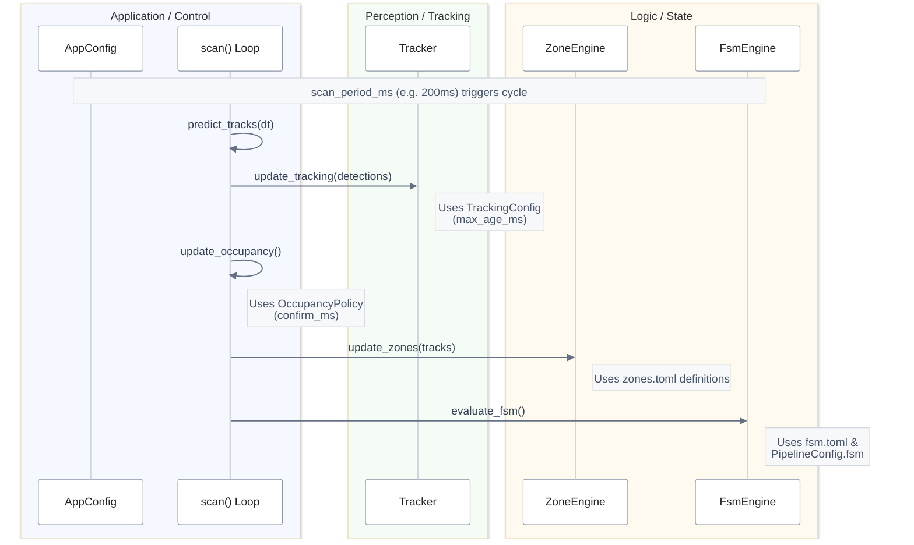

# AppConfig and Pipeline Toggles
Esta documentación técnica detalla el funcionamiento de **AppConfig**, la estructura central que gobierna el comportamiento y la lógica del sistema de visión **mana-lite**. El texto explica cómo el archivo de configuración define desde la **ingesta de video por RTSP** hasta los **interruptores de la tubería de procesamiento**, permitiendo activar o desactivar módulos como la inferencia y el seguimiento de entidades. Un pilar fundamental del documento es la **política clínica de ocupación**, la cual utiliza reglas temporales de confirmación para transformar detecciones crudas en estados precisos de presencia humana. Finalmente, se abordan los mecanismos de **salud y observabilidad**, que aseguran la integridad operativa mediante el monitoreo de la latencia de datos y la generación de métricas de rendimiento.

Relevant source files

- 
- 
- 

This page provides a detailed technical reference for the `AppConfig` structure, which serves as the central configuration authority for the `mana-lite` application. It defines how the system ingests video, executes the inference pipeline, manages entity tracking, and enforces clinical occupancy policies.

The configuration is typically loaded from a `mana.toml` file and deserialized into the `AppConfig` struct defined in [config/app.rs12-41](src/config/app.rs#L12-L41)

## System Configuration Mapping

The following diagram bridges the natural language configuration sections found in `mana.toml` to their corresponding Rust structs and the engines they initialize.

### Configuration to Entity Mapping

```mermaid
flowchart TB

    %% =========================================================
    %% mana.toml Sections
    %% =========================================================

    subgraph SECTIONS["mana.toml Sections"]
        direction LR

        INFERENCE["[inference]"]
        SOURCE["[source]"]
        INGEST["[ingest]"]
        PIPELINE["[pipeline]"]
        PRESENCE["[presence]"]
        HEALTH["[health]"]
        TRACKING["[tracking]"]
    end


    %% =========================================================
    %% Code Entities
    %% =========================================================

    subgraph CODE["Code Entities"]
        direction LR

        APP_CONFIG["struct AppConfig"]
        SOURCE_CONFIG["struct SourceConfig"]
        INGEST_CONFIG["struct IngestConfig"]
        PIPELINE_CONFIG["struct PipelineConfig"]
        PRESENCE_CONFIG["struct PresenceConfig"]
        HEALTH_CONFIG["struct HealthConfig"]
        TRACKING_CONFIG["struct TrackingConfig"]
    end


    %% =========================================================
    %% Runtime Engines
    %% =========================================================

    subgraph RUNTIME["Runtime Engines"]
        direction LR

        INGEST_ENGINE["IngestEngine<br/><small>(mana-media)</small>"]
        INFER_ENGINE["InferEngine<br/><small>(mana-perception)</small>"]
        SCAN_LOOP["scan() Loop<br/><small>(mana-control)</small>"]
        TRACKER["Tracker<br/><small>(Kalman Filter)</small>"]
    end


    %% =========================================================
    %% Configuration relationships
    %% =========================================================

    INFERENCE --> APP_CONFIG
    SOURCE --> SOURCE_CONFIG
    INGEST --> INGEST_CONFIG
    PIPELINE --> PIPELINE_CONFIG
    PRESENCE --> PRESENCE_CONFIG
    HEALTH --> HEALTH_CONFIG
    TRACKING --> TRACKING_CONFIG


    %% =========================================================
    %% Runtime relationships
    %% =========================================================

    SOURCE_CONFIG --> INGEST_ENGINE
    INGEST_CONFIG --> INGEST_ENGINE

    PIPELINE_CONFIG --> SCAN_LOOP
    PRESENCE_CONFIG --> SCAN_LOOP
    HEALTH_CONFIG --> SCAN_LOOP

    TRACKING_CONFIG --> TRACKER


    %% =========================================================
    %% Node styles — Application / Ingest
    %% =========================================================

    classDef applicationNode fill:#FFFFFF,stroke:#5B9BEA,stroke-width:2px,color:#222;

    class SOURCE,SOURCE_CONFIG applicationNode;
    class INGEST,INGEST_CONFIG,INGEST_ENGINE applicationNode;


    %% =========================================================
    %% Node styles — Inference / Tracking
    %% =========================================================

    classDef perceptionNode fill:#FFFFFF,stroke:#65B86B,stroke-width:2px,color:#222;

    class INFERENCE,APP_CONFIG,INFER_ENGINE perceptionNode;
    class TRACKING,TRACKING_CONFIG,TRACKER perceptionNode;


    %% =========================================================
    %% Node styles — Logic / State
    %% =========================================================

    classDef logicNode fill:#FFFFFF,stroke:#F0B429,stroke-width:2px,color:#222;

    class PIPELINE,PIPELINE_CONFIG,PRESENCE,PRESENCE_CONFIG,HEALTH,HEALTH_CONFIG,SCAN_LOOP logicNode;


    %% =========================================================
    %% Container styles
    %% =========================================================

    style SECTIONS fill:#F7F8FA,stroke:#8A94A6,stroke-width:1.5px,color:#222;
    style CODE fill:#F7F8FA,stroke:#8A94A6,stroke-width:1.5px,color:#222;
    style RUNTIME fill:#F7F8FA,stroke:#8A94A6,stroke-width:1.5px,color:#222;


    %% =========================================================
    %% Relationships
    %% =========================================================

    linkStyle default stroke:#8A94A6,stroke-width:1.5px;
```

**Sources:** [config/app.rs12-41](src/config/app.rs#L12-L41) [config/mana.toml10-113](config/mana.toml#L10-L113)

---

## Core Configuration Sections

### 1. Source and Ingest Configuration

The `SourceConfig` defines the connection parameters for the RTSP stream, while `IngestConfig` tunes the robustness of the network consumer.

|Field|Type|Description|
|---|---|---|
|`url`|`String`|The RTSP endpoint (e.g., `rtsp://192.168.1.6:8554/home`).|
|`transport`|`String`|RTSP transport protocol, defaults to `"tcp"`.|
|`keyframes_only`|`bool`|If true, the decoder only processes H.264 IDR frames, reducing CPU load.|
|`poll_timeout_ms`|`u64`|Maximum time to wait for a frame before the poll loop continues.|
|`error_window_size`|`u32`|Number of recent RTP packets tracked for error rate calculation.|
|`error_window_threshold`|`u32`|Max errors allowed in the window before triggering a reconnect.|

**Sources:** [config/app.rs45-55](src/config/app.rs#L45-L55) [config/app.rs412-423](src/config/app.rs#L412-L423) [config/mana.toml10-24](config/mana.toml#L10-L24)

### 2. Pipeline Toggles

The `PipelineConfig` allows for granular control over which subsystems of the perception and control loops are active. This is useful for debugging or running in "ingest-only" modes.

- `infer`: Enables/Disables the `InferEngine`.
- `track`: Enables/Disables the Kalman-filter based `Tracker`.
- `zones`: Enables/Disables spatial zone evaluation in `ZoneEngine`.
- `fsm`: Enables/Disables the Finite State Machine transitions.
- `snapshot`: Enables/Disables the periodic state snapshotting mechanism.

**Sources:** [config/app.rs85-96](src/config/app.rs#L85-L96) [config/mana.toml107-112](config/mana.toml#L107-L112)

### 3. Presence and Occupancy Policy

These settings define the "Clinical Policy"—the temporal rules that translate raw detections into room states (Empty, Single, Multiple).

#### PresencePoiPolicy

Controls the Person of Interest (POI) signal.

- `on_ms`: Real elapsed time of valid detection required to promote a track to "confirmed" [config/app.rs202-203](src/config/app.rs#L202-L203)
- `off_ms`: Time to retain a POI signal after the last valid detection before dropping it [config/app.rs204-205](src/config/app.rs#L204-L205)

#### OccupancyPolicy

Defines the hysteresis for room cardinality transitions.

- `single_confirm_ms`: Time required with exactly one confirmed track to enter `Single` occupancy [config/app.rs221-222](src/config/app.rs#L221-L222)
- `empty_confirm_ms`: Time required with zero tracks to enter `Empty` occupancy [config/app.rs223-224](src/config/app.rs#L223-L224)
- `require_confirmed_tracks`: If true, unconfirmed "tentative" tracks do not count towards occupancy totals [config/app.rs229-230](src/config/app.rs#L229-L230)

**Sources:** [config/app.rs186-231](src/config/app.rs#L186-L231) [config/mana.toml50-66](config/mana.toml#L50-L66)

---

## Data Flow: Config to Scan Loop

The `ScanConfigSection` defines the heartbeat of the control system. Unlike the camera frame rate, the `period_ms` (default 200ms) defines a fixed cadence for the `scan()` function.

### Pipeline Execution Flow

**Sources:** [config/app.rs117-142](src/config/app.rs#L117-L142) [config/mana.toml60-83](config/mana.toml#L60-L83)

---

## Health and Observability

### HealthConfig

The `HealthConfig` acts as a watchdog for the pipeline's operational integrity.

- `data_stale_ms`: The threshold at which the system declares the input data "stale" (e.g., camera freeze) [config/app.rs479-482](src/config/app.rs#L479-L482)
- `cycle_budget_ms`: The maximum allowed time for one `scan()` cycle. Overruns are reported in metrics [config/app.rs501-502](src/config/app.rs#L501-L502)
- `panic_window_cycles`: The window size for tracking internal recovery attempts [config/app.rs493-494](src/config/app.rs#L493-L494)

### Output and Metrics

The `OutputConfig` and `MetricsLogConfig` control the destination and verbosity of the system's telemetry.

- `format`: Currently supports `"jsonl"` [config/app.rs540-541](src/config/app.rs#L540-L541)
- `jsonl_level`: Controls the verbosity (`debug`, `info`, `quiet`) of the structured logs [config/app.rs550-551](src/config/app.rs#L550-L551)
- `report_interval_s`: How often the `MetricsEngine` aggregates and emits performance data [config/observability.rs132-133](src/config/observability.rs#L132-L133)

**Sources:** [config/app.rs479-505](src/config/app.rs#L479-L505) [config/app.rs539-552](src/config/app.rs#L539-L552) [config/observability.rs129-148](src/config/observability.rs#L129-L148)

### On this page

- [AppConfig and Pipeline Toggles](2.1-appconfig-and-pipeline-toggles#appconfig-and-pipeline-toggles)
- [System Configuration Mapping](2.1-appconfig-and-pipeline-toggles#system-configuration-mapping)
- [Configuration to Entity Mapping](2.1-appconfig-and-pipeline-toggles#configuration-to-entity-mapping)
- [Core Configuration Sections](2.1-appconfig-and-pipeline-toggles#core-configuration-sections)
- [1. Source and Ingest Configuration](2.1-appconfig-and-pipeline-toggles#1-source-and-ingest-configuration)
- [2. Pipeline Toggles](2.1-appconfig-and-pipeline-toggles#2-pipeline-toggles)
- [3. Presence and Occupancy Policy](2.1-appconfig-and-pipeline-toggles#3-presence-and-occupancy-policy)
- [PresencePoiPolicy](2.1-appconfig-and-pipeline-toggles#presencepoipolicy)
- [OccupancyPolicy](2.1-appconfig-and-pipeline-toggles#occupancypolicy)
- [Data Flow: Config to Scan Loop](2.1-appconfig-and-pipeline-toggles#data-flow-config-to-scan-loop)
- [Pipeline Execution Flow](2.1-appconfig-and-pipeline-toggles#pipeline-execution-flow)
- [Health and Observability](2.1-appconfig-and-pipeline-toggles#health-and-observability)
- [HealthConfig](2.1-appconfig-and-pipeline-toggles#healthconfig)
- [Output and Metrics](2.1-appconfig-and-pipeline-toggles#output-and-metrics)

