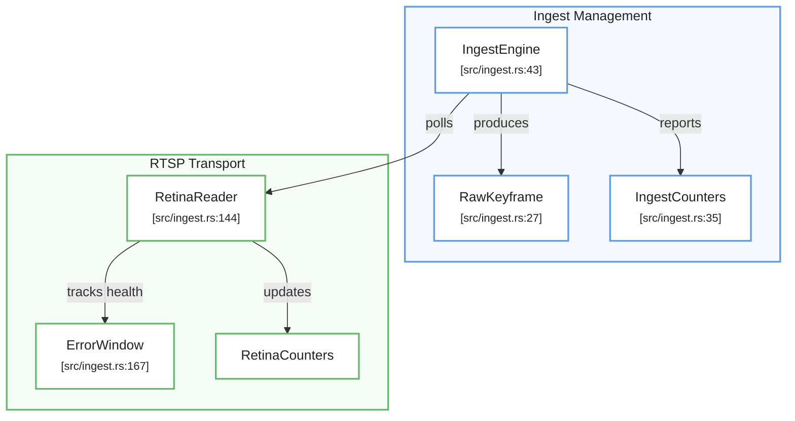
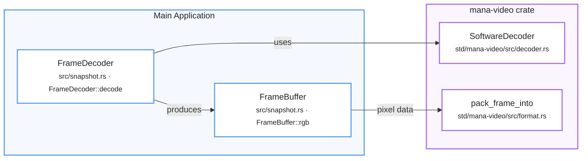

# Video Ingest and Decoding

Relevant source files

- [](src/ingest.rs)
- [](src/snapshot.rs)
- [](std/mana-rtsp/src/h264.rs)
- [](std/mana-rtsp/src/lib.rs)
- [](std/mana-video/src/decoder.rs)
- [](std/mana-video/src/format.rs)

The video ingestion and decoding subsystem is responsible for acquiring H.264 streams from RTSP sources, selecting high-quality keyframes, and decoding them into raw pixel buffers for downstream inference. The pipeline emphasizes low latency, robust reconnection logic, and memory efficiency through buffer pooling.

## Ingest Architecture

Ingestion is handled by the `IngestEngine`, which wraps a `FrameReader` (typically `RetinaReader`) to manage the raw NAL unit flow. The engine is designed to prioritize the "freshest" data, dropping intermediate frames to maintain real-time performance.

### RTSP Ingestion and Reconnection

The `RetinaReader` uses the `retina` crate to establish RTSP connections. It implements a sophisticated reconnection strategy with exponential backoff and jitter to prevent thundering herd problems when multiple cameras go offline simultaneously [src/ingest.rs144-156](src/ingest.rs#L144-L156)

Key features of the ingest logic include:

- **Error Windowing**: An `ErrorWindow` tracks the ratio of RTP errors over a sliding window of packets. If the error count exceeds a configured threshold, the connection is considered stale and a reconnect is triggered [src/ingest.rs167-201](src/ingest.rs#L167-L201)
- **Backoff Logic**: Reconnection attempts use an initial backoff (e.g., 500ms) that doubles up to a maximum (e.g., 30s), with a jitter applied via `fast_jitter` to randomize retry timing [src/ingest.rs158-245](src/ingest.rs#L158-L245)
- **Frame Filtering**: The `IngestEngine` drains all buffered frames from the reader but only returns the most recent IDR keyframe [src/ingest.rs73-94](src/ingest.rs#L73-L94)

### Keyframe Selection and Deduplication

To minimize unnecessary processing, the `IngestEngine` performs two levels of filtering:

1. **P-Frame Dropping**: Non-IDR frames are counted and discarded [src/ingest.rs88-90](src/ingest.rs#L88-L90)
2. **Deduplication**: If a new keyframe is byte-for-byte identical to the previous one, it is suppressed to avoid redundant inference cycles [src/ingest.rs100-103](src/ingest.rs#L100-L103)

**Sources:** [src/ingest.rs43-120](src/ingest.rs#L43-L120) [src/ingest.rs144-165](src/ingest.rs#L144-L165) [src/ingest.rs167-201](src/ingest.rs#L167-L201)

### System Entity Mapping: Ingest Flow

This diagram maps the natural language concept of "Stream Ingest" to the specific code entities in `src/ingest.rs`.

Title: Ingest Engine and Reader Relationship



### Y visualmente queda con la misma lógica del anterior

- 🔵 **Ingest Management** → azul
- 🟢 **RTSP Transport** → verde
- Nodos blancos con borde de color
- Relaciones con labels (`polls`, `produces`, `reports`, `tracks health`, `updates`)
- Las referencias de código quedan dentro de cada nodo
- Se conserva la separación conceptual mediante `subgraph`

Un pequeño cambio que haría respecto de la imagen original es **no intentar replicar exactamente las posiciones físicas**. Mermaid funciona mucho mejor si expresamos la arquitectura semánticamente y dejamos que el motor acomode el grafo
Si querés que todos estos diagramas formen parte de **una misma documentación técnica**, podemos además estandarizar los colores:

```text
🔵 Ingest / Transport
🟢 Inference / Tracking
🟡 Logic / State
🟣 Output
```


**Sources:** [src/ingest.rs27-53](src/ingest.rs#L27-L53) [src/ingest.rs144-172](src/ingest.rs#L144-L172)

## Decoding and Pixel Handling

Once a `RawKeyframe` is acquired, it must be decoded from H.264 Annex-B format into a pixel buffer. This is managed by the `FrameDecoder` and the underlying `SoftwareDecoder`.

### Software Decoder Configuration

The `SoftwareDecoder` wraps FFmpeg's H.264 decoder. It is specifically configured for real-time analytics:

- **Low Delay**: The `LOW_DELAY` flag is set to eliminate the internal 1-frame buffer FFmpeg usually maintains for B-frame reordering. This ensures that the very first IDR frame is returned immediately rather than requiring a second frame to "push" it out [std/mana-video/src/decoder.rs22](std/mana-video/src/decoder.rs#L22-L22)
- **Single Threaded**: Threading is disabled (`Type::None`) to ensure predictable latency and avoid the overhead of context switching for a single stream [std/mana-video/src/decoder.rs18-21](std/mana-video/src/decoder.rs#L18-L21)

### Pixel Format Conversion and Packing

Decoded frames are typically in YUV420P or NV12 format. The `yuv_to_rgb24` function utilizes `ffmpeg_next::software::scaling::Context` to convert these to packed RGB24 [src/snapshot.rs72-110](src/snapshot.rs#L72-L110)

A critical utility is `pack_frame_into`, which handles the removal of "stride" (padding bytes added by FFmpeg for SIMD alignment). It walks the frame row-by-row to produce a tightly packed `Vec<u8>` that matches the exact `width * height * channels` expected by inference engines [std/mana-video/src/format.rs43-76](std/mana-video/src/format.rs#L43-L76)

**Sources:** [std/mana-video/src/decoder.rs4-29](std/mana-video/src/decoder.rs#L4-L29) [std/mana-video/src/format.rs43-76](std/mana-video/src/format.rs#L43-L76) [src/snapshot.rs21-63](src/snapshot.rs#L21-L63)

## Memory Management: FrameBuffer Ownership

`FrameDecoder` produces a `FrameBuffer` whose `rgb` field owns the decoded
`Vec<u8>`. That owned buffer is passed through inference and visualization for
the cycle; it is not acquired from a pool.

### Ownership and Lifecycle

`FrameBuffer` owns its RGB bytes directly, so its lifetime is explicit and
bounded by the processing cycle. `BufferPool` remains an unused utility in
`mana-video`; it is not on the current decoding hot path.

**Sources:** [`FrameBuffer`](src/snapshot.rs), [`FrameDecoder::decode`](src/snapshot.rs)

### Code Entity Mapping: Decoding Pipeline

This diagram bridges the decoding process to the classes and functions in the `mana-video` crate and `snapshot.rs`.

Title: Decoding and Buffer Management



**Sources:** [`FrameBuffer`](src/snapshot.rs), [`SoftwareDecoder`](std/mana-video/src/decoder.rs), [`pack_frame_into`](std/mana-video/src/format.rs)

## Snapshot and Debugging

The `SnapshotSaver` provides a mechanism to persist frames to disk for post-mortem analysis. It performs an **atomic write** by first writing to a temporary file and then renaming it, ensuring that external tools never read a partially written file [src/snapshot.rs176-188](src/snapshot.rs#L176-L188)

When a decode fails, the system can still save the raw H.264 NAL unit, which is invaluable for debugging stream corruption issues [src/snapshot.rs131-148](src/snapshot.rs#L131-L148)

|Feature|Implementation|File Reference|
|---|---|---|
|**IDR Detection**|Scans NAL units for type 5|[std/mana-rtsp/src/h264.rs1-29](std/mana-rtsp/src/h264.rs#L1-L29)|
|**Atomic Save**|Write to `.tmp` then `rename()`|[src/snapshot.rs176-188](src/snapshot.rs#L176-L188)|
|**Stride Removal**|Row-by-row `extend_from_slice`|[std/mana-video/src/format.rs59-76](std/mana-video/src/format.rs#L59-L76)|
|**Low Latency**|`LOW_DELAY` + `threading::Type::None`|[std/mana-video/src/decoder.rs18-22](std/mana-video/src/decoder.rs#L18-L22)|

**Sources:** [src/snapshot.rs114-188](src/snapshot.rs#L114-L188) [std/mana-rtsp/src/h264.rs1-29](std/mana-rtsp/src/h264.rs#L1-L29) [std/mana-video/src/decoder.rs18-22](std/mana-video/src/decoder.rs#L18-L22)


### On this page

- [Video Ingest and Decoding](https://deepwiki.com/ernestovisiona-netizen/kik8/2.1-video-ingest-and-decoding#video-ingest-and-decoding)
- [Ingest Architecture](https://deepwiki.com/ernestovisiona-netizen/kik8/2.1-video-ingest-and-decoding#ingest-architecture)
- [RTSP Ingestion and Reconnection](https://deepwiki.com/ernestovisiona-netizen/kik8/2.1-video-ingest-and-decoding#rtsp-ingestion-and-reconnection)
- [Keyframe Selection and Deduplication](https://deepwiki.com/ernestovisiona-netizen/kik8/2.1-video-ingest-and-decoding#keyframe-selection-and-deduplication)
- [System Entity Mapping: Ingest Flow](https://deepwiki.com/ernestovisiona-netizen/kik8/2.1-video-ingest-and-decoding#system-entity-mapping-ingest-flow)
- [Decoding and Pixel Handling](https://deepwiki.com/ernestovisiona-netizen/kik8/2.1-video-ingest-and-decoding#decoding-and-pixel-handling)
- [Software Decoder Configuration](https://deepwiki.com/ernestovisiona-netizen/kik8/2.1-video-ingest-and-decoding#software-decoder-configuration)
- [Pixel Format Conversion and Packing](https://deepwiki.com/ernestovisiona-netizen/kik8/2.1-video-ingest-and-decoding#pixel-format-conversion-and-packing)
- [Memory Management: FrameBuffer Ownership](https://deepwiki.com/ernestovisiona-netizen/kik8/2.1-video-ingest-and-decoding#memory-management-framebuffer-ownership)
- [Ownership and Lifecycle](https://deepwiki.com/ernestovisiona-netizen/kik8/2.1-video-ingest-and-decoding#ownership-and-lifecycle)
- [Code Entity Mapping: Decoding Pipeline](https://deepwiki.com/ernestovisiona-netizen/kik8/2.1-video-ingest-and-decoding#code-entity-mapping-decoding-pipeline)
- [Snapshot and Debugging](https://deepwiki.com/ernestovisiona-netizen/kik8/2.1-video-ingest-and-decoding#snapshot-and-debugging)

