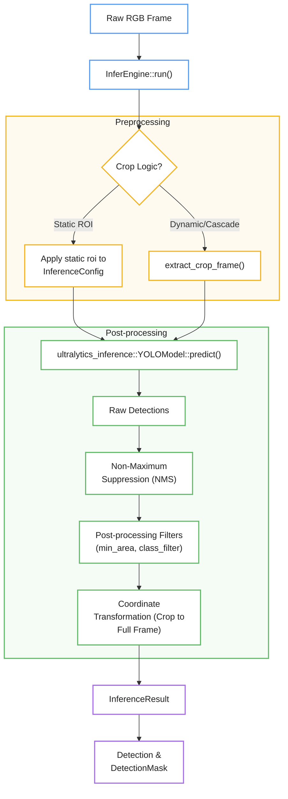
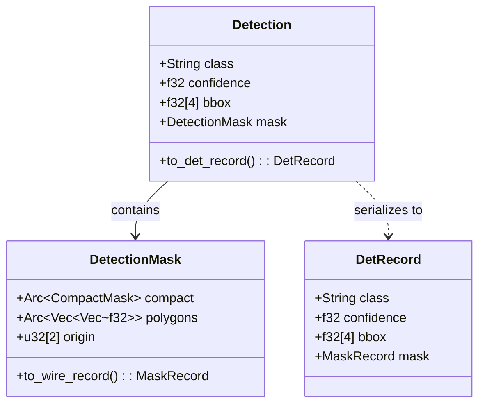

# Inference Engine

Relevant source files

- [](src/bin/depth-image-probe.rs)
- [](src/cascade.rs)
- [](src/detection.rs)
- [](src/infer.rs)

The `InferEngine` is the central component responsible for executing computer vision models on video frames. It manages the lifecycle of ONNX models, handles image preprocessing (including static and dynamic Region of Interest crops), executes inference via the `ultralytics-inference` backend, and post-processes raw model outputs into structured detections and depth maps.

## Architecture and Data Flow

The `InferEngine` operates by loading models defined in the `ModelCatalog` into `LoadedModel` instances. Each `LoadedModel` encapsulates a `YOLOModel` and its associated post-processing configuration.

### Model Loading and Configuration

During initialization, the engine iterates through the `ModelCatalog`, skipping disabled models and verifying file paths [src/infer.rs203-217](src/infer.rs#L203-L217) It converts `ModelEntry` configuration into `InferenceConfig` objects, which define parameters such as image size (`imgsz`), inference precision (FP16/half), and execution provider (CPU or CUDA) [src/infer.rs252-273](src/infer.rs#L252-L273)

### Inference Cycle

The following diagram illustrates the data flow from a raw frame to a structured `InferenceResult`.

**Diagram: Inference Processing Pipeline**



```
Raw RGB Frame
      │
      ▼
InferEngine::run()
      │
      ▼
┌──────────────────────────────────┐
│        🟡 Preprocessing          │
│                                  │
│          ◇ Crop Logic?           │
│          ╱           ╲           │
│    Static ROI       Dynamic      │
│         ╲             ╱          │
└──────────╲───────────╱───────────┘
            ▼
┌──────────────────────────────────┐
│        🟢 Post-processing        │
│                                  │
│ YOLO → Detections → NMS →        │
│ Filters → Coordinate Transform   │
└────────────────┬─────────────────┘
                 ▼
        🟣 InferenceResult
                 │
                 ▼
        Detection & DetectionMask
```


Sources: [src/infer.rs95-107](src/infer.rs#L95-L107) [src/infer.rs276-320](src/infer.rs#L276-L320) [src/infer.rs434-475](src/infer.rs#L434-L475)

## Crop Handling

The engine supports three modes of spatial focus to optimize resolution and performance:

1. **Full Frame**: The entire image is scaled to the model's `imgsz`.
2. **Static ROI**: A fixed rectangular region is defined in the configuration. The model only "sees" this area, but coordinates are automatically mapped back to the full frame space [src/infer.rs227-235](src/infer.rs#L227-L235)
3. **Dynamic Cascade Crops**: For models gated by a parent detection (e.g., a face model running on a person detection), the engine extracts a sub-buffer from the RGB frame using `extract_crop_frame` [src/infer.rs45-83](src/infer.rs#L45-L83) This cropped buffer is then passed to the model as a fresh image.

### Coordinate Space Transformation

When a model runs on a crop (static or dynamic), the resulting bounding boxes and masks are initially in "crop space." The `InferEngine` transforms these back to "frame space" by adding the crop's `x1` and `y1` offsets to the detection coordinates [src/infer.rs536-545](src/infer.rs#L536-L545)

## Post-processing and Filtering

After the raw inference call, the engine applies several layers of refinement:

- **NMS (Non-Maximum Suppression)**: Overlapping detections of the same class are suppressed based on the `nms_iou` threshold [src/infer.rs102](src/infer.rs#L102-L102)
- **Class Filtering**: Detections not present in the model's configured `class_filter` are discarded [src/infer.rs509-514](src/infer.rs#L509-L514)
- **Area Filtering**: Detections are rejected if their `area_ratio` (relative to the frame) falls below `min_area` or exceeds `max_area` [src/infer.rs516-527](src/infer.rs#L516-L527)
- **Confidence Thresholding**: Detections below the `confidence` value defined in the `ModelEntry` are filtered out by the underlying `YOLOModel` [src/infer.rs258-259](src/infer.rs#L258-L259)

## Detection and Mask Outputs

The primary output of the engine is the `InferenceResult` [src/infer.rs85-93](src/infer.rs#L85-L93) which contains:

- `detections`: A vector of `Detection` objects.
- `depth`: An optional `DepthMap` (for depth-estimation models).
- `infer_ms`: Execution time of the model call.

### Detection Masks

For segmentation models, each `Detection` may include a `DetectionMask`. This mask is stored as a `CompactMask` (using crop-RLE compression) to minimize memory usage [src/infer.rs144-150](src/infer.rs#L144-L150)

**Entity Mapping: Inference Results to Wire Records**

Sources: [src/infer.rs109-116](src/infer.rs#L109-L116) [src/infer.rs144-150](src/infer.rs#L144-L150) [src/infer.rs190-200](src/infer.rs#L190-L200)

## Cascade Scheduling

The `CascadeScheduler` determines the execution order of models when dependencies exist. If a model `requires` a parent (e.g., `face` requires `person`), the scheduler ensures the parent runs first.

- **Same-Frame Gating**: If `same_frame` is true, the child model runs immediately on the detections produced by the parent in the current cycle [src/cascade.rs189-193](src/cascade.rs#L189-L193)
- **Track-Based Gating**: If `same_frame` is false, the child model is scheduled based on confirmed tracks from previous frames [src/cascade.rs215-220](src/cascade.rs#L215-L220)

Sources: [src/cascade.rs122-126](src/cascade.rs#L122-L126) [src/cascade.rs170-183](src/cascade.rs#L170-L183)



### On this page

- [Inference Engine](https://deepwiki.com/ernestovisiona-netizen/kik8/2.2-inference-engine#inference-engine)
- [Architecture and Data Flow](https://deepwiki.com/ernestovisiona-netizen/kik8/2.2-inference-engine#architecture-and-data-flow)
- [Model Loading and Configuration](https://deepwiki.com/ernestovisiona-netizen/kik8/2.2-inference-engine#model-loading-and-configuration)
- [Inference Cycle](https://deepwiki.com/ernestovisiona-netizen/kik8/2.2-inference-engine#inference-cycle)
- [Crop Handling](https://deepwiki.com/ernestovisiona-netizen/kik8/2.2-inference-engine#crop-handling)
- [Coordinate Space Transformation](https://deepwiki.com/ernestovisiona-netizen/kik8/2.2-inference-engine#coordinate-space-transformation)
- [Post-processing and Filtering](https://deepwiki.com/ernestovisiona-netizen/kik8/2.2-inference-engine#post-processing-and-filtering)
- [Detection and Mask Outputs](https://deepwiki.com/ernestovisiona-netizen/kik8/2.2-inference-engine#detection-and-mask-outputs)
- [Detection Masks](https://deepwiki.com/ernestovisiona-netizen/kik8/2.2-inference-engine#detection-masks)
- [Cascade Scheduling](https://deepwiki.com/ernestovisiona-netizen/kik8/2.2-inference-engine#cascade-scheduling)

