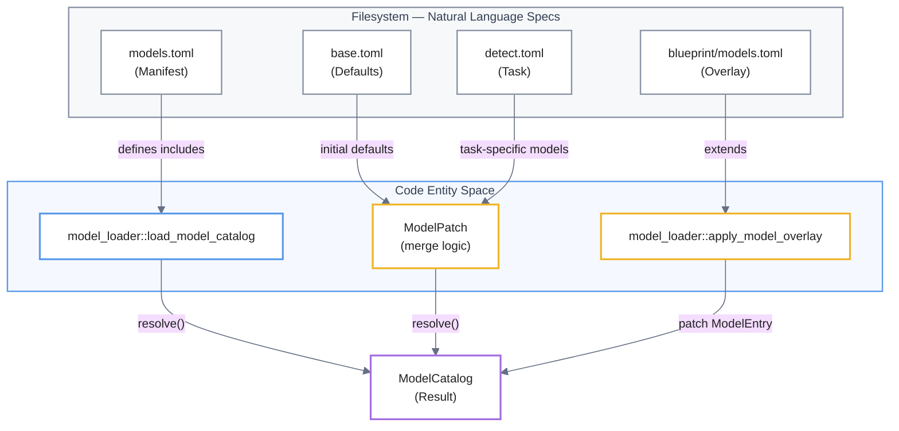
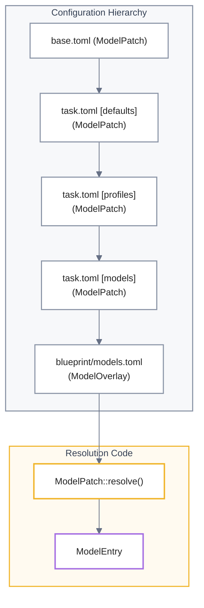

# Model Catalog and Loader
El **Catálogo de Modelos** funciona como un sofisticado sistema de configuración jerárquica diseñado para gestionar la carga y ejecución de modelos YOLO mediante una estructura de **capas de configuración**. Su propósito fundamental es separar las definiciones técnicas de base, como los pesos de los archivos ONNX, de los ajustes específicos de implementación, tales como los **umbrales de confianza** y las zonas de interés. El proceso operativo sigue una lógica de **Carga → Parcheo → Superposición**, lo que permite consolidar múltiples archivos TOML en un objeto final que define el comportamiento preciso del motor de inferencia. Esta arquitectura se rige por una **jerarquía de prioridades**, donde los ajustes de nivel superior, o "blueprints", pueden invalidar las configuraciones globales para permitir un **procesamiento posterior** y un recorte de imagen altamente personalizados según las necesidades de cada tarea.

Relevant source files

- [](config/blueprints/detect-room-face/models.toml)
- [](src/config/model_loader/load.rs)
- [](src/config/model_loader/patch.rs)
- [](src/config/model_loader/tests.rs)
- [](config/models.example.toml)
- [](config/models.toml)
- [](config/models/base.toml)
- [](config/models/depth.toml)
- [](config/models/detect.toml)
- [](config/models/example-detect.toml)
- [](config/models/pose.toml)
- [](config/models/segment.toml)
- [](src/config/validation.rs)

The **Model Catalog** is a hierarchical configuration system that defines how YOLO-based models are loaded, executed, and post-processed within the `mana-lite` pipeline. It allows for a clean separation between base model definitions (weights, image sizes) and deployment-specific tuning (confidence thresholds, regions of interest).

## Model Configuration Schema

Models are defined using a layered approach, starting from a manifest file that includes task-specific TOML files. The final resolved object is a `ModelEntry` [src/config/models.rs:45-59](src/config/models.rs#L45-L59) which contains all parameters required by the inference engine.

### ModelEntry Structure

The following table describes the primary configuration fields found in `models.toml` and its included files:

|Field|Type|Description|
|---|---|---|
|`path`|`PathBuf`|Path to the ONNX model weights.|
|`task`|`ModelTask`|One of `detect`, `pose`, `segment`, or `depth` [src/config/models.rs:8-31](src/config/models.rs#L8-L31)|
|`imgsz`|`u32`|The input resolution the model expects (e.g., 320, 640).|
|`confidence`|`f32`|Global confidence threshold for the inference provider.|
|`half`|`bool`|Enables FP16 (Half Precision) inference if supported by the provider.|
|`rect`|`bool`|Enables rectangular inference (avoids padding to square).|
|`postprocess`|`PostprocessConfig`|Filters for classes, area ratios, and NMS settings.|
|`crop`|`CropConfig`|Configuration for static or dynamic cropping.|

### PostprocessConfig

This sub-config controls how raw detections are filtered before entering the consolidation stage [src/config/models.rs:75-100](src/config/models.rs#L75-L100):

- **`allow_classes`**: A whitelist of class names (e.g., `["person", "face"]`) to retain.
- **`min_confidence`**: A secondary threshold applied after inference.
- **`min_area_ratio` / `max_area_ratio`**: Filters detections based on their size relative to the frame (0.0 to 1.0).
- **`nms_iou`**: Intersection-over-Union threshold for Non-Maximum Suppression.

### CropConfig

Defines the region of the frame the model operates on [src/config/models.rs:183-195](src/config/models.rs#L183-L195):

- **Static**: A fixed coordinate box `[x, y, w, h]` defined in `region` [config/models/detect.toml39-40](config/models/detect.toml#L39-L40)
- **Largest Class**: A dynamic crop that follows the largest instance of a specific class (e.g., cropping to the `person` to find a `face`) [config/models/detect.toml18-22](config/models/detect.toml#L18-L22)

**Sources:** [src/config/models.rs:45-195](src/config/models.rs#L45-L195) [config/models/detect.toml1-40](config/models/detect.toml#L1-L40) [config/models/base.toml1-18](config/models/base.toml#L1-L18)

---

## The Model Loader Pipeline

The loading process follows a **Load → Patch → Overlay** sequence to arrive at the final `ModelCatalog`.

### 1. Loading and Manifest Resolution

The entry point is `load_model_catalog(path)`, which reads a `models.toml` manifest containing an `include` list [config/model_loader/load.rs18-28](src/config/model_loader/load.rs#L18-L28)

- **Base Defaults**: Shared settings (like `device = "cpu"`) are loaded first [config/models/base.toml3-9](config/models/base.toml#L3-L9)
- **Task Files**: Files like `detect.toml` or `pose.toml` are merged. Each file defines a `task` which is enforced for all models within it [config/model_loader/load.rs120-132](src/config/model_loader/load.rs#L120-L132)

### 2. Patching and Merging

Configuration is merged using the `ModelPatch` struct [config/model_loader/patch.rs44-73](src/config/model_loader/patch.rs#L44-L73) A patch can override specific fields without touching others [config/model_loader/tests.rs7-33](src/config/model_loader/tests.rs#L7-L33)

- **Profiles**: Models can reference a `profile` (e.g., `profile = "face"`) to inherit common post-processing or cropping logic [config/model_loader/load.rs158-167](src/config/model_loader/load.rs#L158-L167)
- **Rebasing**: If the `MANA_MODELS_HOME` environment variable is set, relative paths to ONNX files are rebased to this directory [config/model_loader/load.rs42-49](src/config/model_loader/load.rs#L42-L49)

### 3. Blueprint Overlays

Blueprints provide a final `models.toml` that `extends` the base catalog [config/blueprints/detect-room-face/models.toml1-3](config/blueprints/detect-room-face/models.toml#L1-L3) This allows a specific deployment to tune thresholds (e.g., lowering `face` confidence) without modifying the global catalog [config/model_loader/tests.rs66-101](src/config/model_loader/tests.rs#L66-L101)

**Model Loading Data Flow**



```
Filesystem
    │
    │ configuración declarativa
    ▼
Code Entity Space
    │
    │ load / merge / overlay
    ▼
ModelCatalog
```
**Sources:** [config/model_loader/load.rs18-49](src/config/model_loader/load.rs#L18-L49) [config/model_loader/patch.rs127-178](src/config/model_loader/patch.rs#L127-L178) [config/model_loader/load.rs113-148](src/config/model_loader/load.rs#L113-L148)

---

## Hierarchy of Overrides

The resolution of a single `ModelEntry` field follows this priority (highest to lowest):

1. **Blueprint Overlay**: Specific overrides in the deployment's `models.toml`.
2. **Model Definition**: Fields defined directly under `[models.name]` in a task file.
3. **Profile**: Fields inherited via the `profile` key.
4. **Task Defaults**: The `[defaults]` section within a specific task file (e.g., `detect.toml`).
5. **Global Defaults**: The `[defaults]` section in `base.toml`.

**Implementation Mapping**



```
base.toml
    ↓
task.toml [defaults]
    ↓
task.toml [profiles]
    ↓
task.toml [models]
    ↓
blueprint/models.toml
    ↓
ModelPatch::resolve()
    ↓
ModelEntry
```
**Sources:** [config/model_loader/load.rs150-170](src/config/model_loader/load.rs#L150-L170) [config/model_loader/patch.rs180-215](src/config/model_loader/patch.rs#L180-L215) [config/model_loader/tests.rs66-101](src/config/model_loader/tests.rs#L66-L101)

