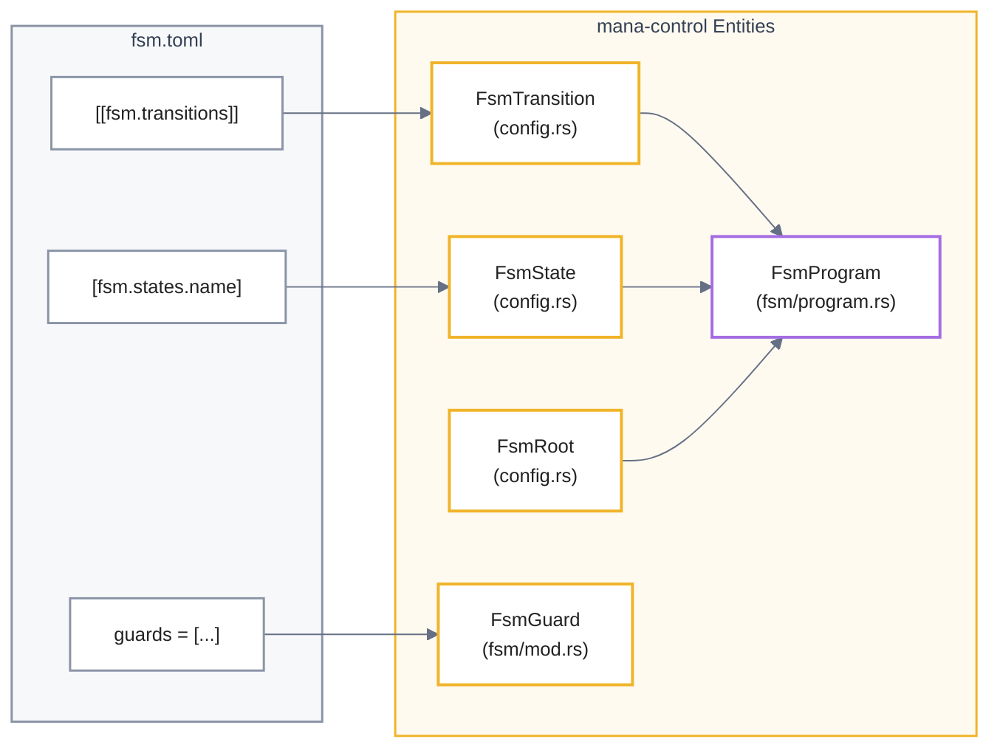
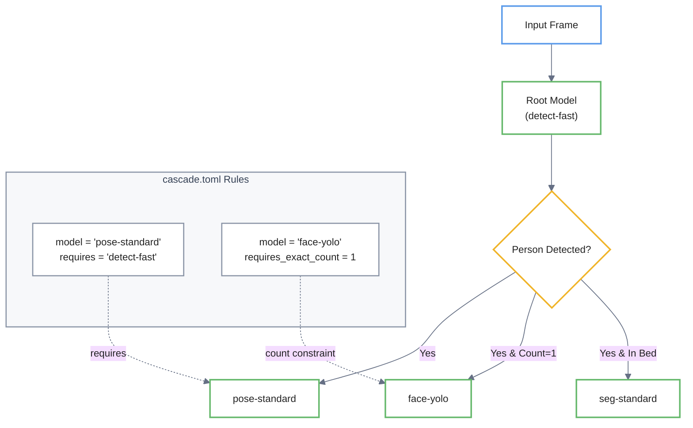

# FSM, Zone, and Cascade Configuration
Este documento técnico detalla el marco de configuración de un sistema de visión computacional organizado en tres pilares fundamentales para gestionar el razonamiento espacial y el comportamiento lógico. El **Finite State Machine (FSM)** actúa como el cerebro del sistema, coordinando las transiciones entre estados operativos mediante el uso de **guards** y periodos de permanencia para asegurar respuestas estables ante señales del entorno. Complementariamente, el sistema emplea **zones** para delimitar regiones espaciales con parámetros de histéresis y **depth rules** que integran datos tridimensionales para una detección de proximidad más precisa. Finalmente, la **cascade configuration** optimiza el rendimiento del hardware al establecer una jerarquía de ejecución, permitiendo que los modelos más complejos se activen únicamente cuando se cumplen condiciones específicas de clasificación o ubicación detectadas por modelos primarios.


Relevant source files

- [](https://github.com/kerrvisiona-sudo/endeli/blob/ad24740d/config/blueprints/detect-room-face/fsm.toml)
- [](https://github.com/kerrvisiona-sudo/endeli/blob/ad24740d/config/cascade.toml)
- [](https://github.com/kerrvisiona-sudo/endeli/blob/ad24740d/config/depth-rules.toml)
- [](https://github.com/kerrvisiona-sudo/endeli/blob/ad24740d/config/fsm.rs)
- [](https://github.com/kerrvisiona-sudo/endeli/blob/ad24740d/config/fsm.toml)
- [](https://github.com/kerrvisiona-sudo/endeli/blob/ad24740d/config/zones.toml)
- [](https://github.com/kerrvisiona-sudo/endeli/blob/ad24740d/core/mana-control/src/config.rs)

This page details the configuration and execution logic for the system's spatial reasoning, stateful behavior, and model dependency chains. The configuration is split across three primary domains: spatial regions (`zones.toml`), state transitions (`fsm.toml`), and model execution hierarchies (`cascade.toml`).

## FSM Configuration (`fsm.toml`)

The Finite State Machine (FSM) defines the high-level behavioral logic of the system. It consumes signals from the perception pipeline (e.g., occupancy, zone status, depth triggers) to transition between semantic states.

### State and Role Definitions

States are defined in the `[fsm.states]` table. Each state can specify a set of `models` that should be active while in that state, and optional flags like `face_inside` for specialized logic [config/blueprints/detect-room-face/fsm.toml7-40](https://github.com/kerrvisiona-sudo/endeli/blob/ad24740d/config/blueprints/detect-room-face/fsm.toml#L7-L40)

The FSM requires two mandatory roles defined in `[fsm.roles]`:

- **safe**: The state the FSM enters when data becomes stale (e.g., camera signal loss) [config/fsm.toml25](https://github.com/kerrvisiona-sudo/endeli/blob/ad24740d/config/fsm.toml#L25-L25)
- **reset**: The state the FSM returns to when the system is initialized or signal is restored [config/fsm.toml26](https://github.com/kerrvisiona-sudo/endeli/blob/ad24740d/config/fsm.toml#L26-L26)

### Transitions and Guards

Transitions move the system from one state to another based on a list of `guards`. Guards support various types:

- `data_stale` / `data_fresh`: Triggered by the health of the ingest pipeline [config/fsm.toml33-99](https://github.com/kerrvisiona-sudo/endeli/blob/ad24740d/config/fsm.toml#L33-L99)
- `zone_occupied` / `zone_vacated`: Based on spatial zone status [config/fsm.toml41-55](https://github.com/kerrvisiona-sudo/endeli/blob/ad24740d/config/fsm.toml#L41-L55)
- `signal`: Direct comparison of numeric or boolean values from the `SceneSignals` table (e.g., `ocupacion.cardinalidad == "single"`) [config/blueprints/detect-room-face/fsm.toml92](https://github.com/kerrvisiona-sudo/endeli/blob/ad24740d/config/blueprints/detect-room-face/fsm.toml#L92-L92)
- `depth_rule`: Triggered by depth-sensing thresholds [config/fsm.toml66](https://github.com/kerrvisiona-sudo/endeli/blob/ad24740d/config/fsm.toml#L66-L66)

Transitions can also include a `dwell` period (e.g., "500ms" or "3s"), requiring guards to remain true for the duration before the transition completes [config/blueprints/detect-room-face/fsm.toml97-131](https://github.com/kerrvisiona-sudo/endeli/blob/ad24740d/config/blueprints/detect-room-face/fsm.toml#L97-L131)

### FSM Logic Mapping

The following diagram maps the configuration fields to the internal `mana-control` types.

**Diagram: FSM Configuration to Code Entity Space**



```
                 mana-control Entities

[[fsm.transitions]] ──→ FsmTransition ──┐
                                        │
[fsm.states.name] ───→ FsmState ────────┼──→ FsmProgram
                                        │
                         FsmRoot ────────┤
                                        │
guards = [...] ───────→ FsmGuard ───────┘
```
Sources: [core/mana-control/src/config.rs4-42](https://github.com/kerrvisiona-sudo/endeli/blob/ad24740d/core/mana-control/src/config.rs#L4-L42) [config/fsm.rs1-2](https://github.com/kerrvisiona-sudo/endeli/blob/ad24740d/config/fsm.rs#L1-L2)

---

## Zone Configuration (`zones.toml`)

Zones define spatial regions of interest within the 2D frame. They are used to generate occupancy signals for the FSM and for logging presence events.

### Zone Definition

Each zone is defined by an Axis-Aligned Bounding Box (AABB) using `x1, y1, x2, y2` coordinates and a `hysteresis_ms` value [core/mana-control/src/config.rs51-60](https://github.com/kerrvisiona-sudo/endeli/blob/ad24740d/core/mana-control/src/config.rs#L51-L60) The hysteresis prevents "flickering" events when a detection oscillates at the boundary of a zone [config/zones.toml9](https://github.com/kerrvisiona-sudo/endeli/blob/ad24740d/config/zones.toml#L9-L9)

### Specialized Zones

- **Standard Zones**: Defined in the `[zones]` table (e.g., `bed`, `chair`, `door`) [config/zones.toml1-34](https://github.com/kerrvisiona-sudo/endeli/blob/ad24740d/config/zones.toml#L1-L34)
- **face_dwell**: A specialized ROI used to determine if a person's face is within a specific semantic region, often used for "in-bed" logic [config/zones.toml37-44](https://github.com/kerrvisiona-sudo/endeli/blob/ad24740d/config/zones.toml#L37-L44)

**Table: ZoneSpec Fields**

|Field|Type|Description|
|---|---|---|
|`x1, y1, x2, y2`|`u32`|Bounding box coordinates in frame space.|
|`label`|`String`|Human-readable name for logging/UI.|
|`hysteresis_ms`|`u64`|Delay before state changes (Occupied <-> Vacant).|

Sources: [core/mana-control/src/config.rs43-68](https://github.com/kerrvisiona-sudo/endeli/blob/ad24740d/core/mana-control/src/config.rs#L43-L68) [config/zones.toml1-44](https://github.com/kerrvisiona-sudo/endeli/blob/ad24740d/config/zones.toml#L1-L44)

---

## Cascade Configuration (`cascade.toml`)

The `cascade.toml` file defines the execution dependencies between models. This allows the system to optimize compute by only running expensive models (like pose or face detection) when specific conditions are met by a "parent" model.

### Cascade Rules

Rules define the criteria for triggering a model:

- **Dependency**: The `requires` field specifies the parent model [config/cascade.toml12](https://github.com/kerrvisiona-sudo/endeli/blob/ad24740d/config/cascade.toml#L12-L12)
- **Class Filtering**: `requires_class` limits execution to specific detections (e.g., only run pose if `person` is detected) [config/cascade.toml13](https://github.com/kerrvisiona-sudo/endeli/blob/ad24740d/config/cascade.toml#L13-L13)
- **Spatial Gating**: `requires_region` restricts execution to detections within a defined semantic region [config/cascade.toml16](https://github.com/kerrvisiona-sudo/endeli/blob/ad24740d/config/cascade.toml#L16-L16)
- **Count Gating**: `requires_exact_count` (e.g., only run face-yolo if exactly 1 person is in the room) [config/cascade.toml24](https://github.com/kerrvisiona-sudo/endeli/blob/ad24740d/config/cascade.toml#L24-L24)

**Diagram: Cascade Execution Flow**



```
                    cascade.toml
                         │
              ┌──────────┴──────────┐
              │                     │
        requires             count constraint
              │                     │
              ▼                     ▼
Input Frame → Root Model → Person Detected?
                              │
               ┌──────────────┼───────────────┐
               │              │               │
              Yes      Yes & Count=1     Yes & In Bed
               │              │               │
               ▼              ▼               ▼
        pose-standard     face-yolo      seg-standard
```
Sources: [config/cascade.toml7-35](https://github.com/kerrvisiona-sudo/endeli/blob/ad24740d/config/cascade.toml#L7-L35)

---

## Depth Rules (`depth-rules.toml`)

Depth rules allow the system to use 3D spatial data (from models like `depth-standard`) to trigger FSM transitions. A rule compares a robust metric (e.g., `median` distance) within a global region against a threshold in meters [config/depth-rules.toml1-6](https://github.com/kerrvisiona-sudo/endeli/blob/ad24740d/config/depth-rules.toml#L1-L6)

### Calibration

Depth thresholds are provisional until calibrated for a specific camera installation. Calibration is defined using a reference model distance vs. a physical scene measurement [config/depth-rules.toml7-12](https://github.com/kerrvisiona-sudo/endeli/blob/ad24740d/config/depth-rules.toml#L7-L12)

**Rule Example:**

- **Name**: `bed-approach`
- **Region**: `[560, 140, 1240, 820]`
- **Metric**: `median` distance `< 1.5m` [config/depth-rules.toml14-20](https://github.com/kerrvisiona-sudo/endeli/blob/ad24740d/config/depth-rules.toml#L14-L20)

Sources: [config/depth-rules.toml1-23](https://github.com/kerrvisiona-sudo/endeli/blob/ad24740d/config/depth-rules.toml#L1-L23)

