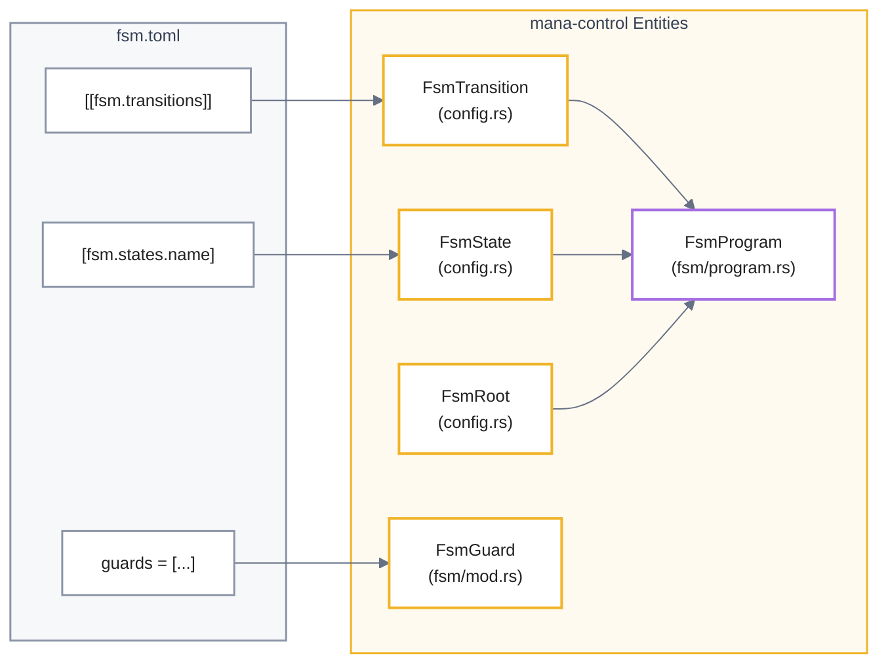
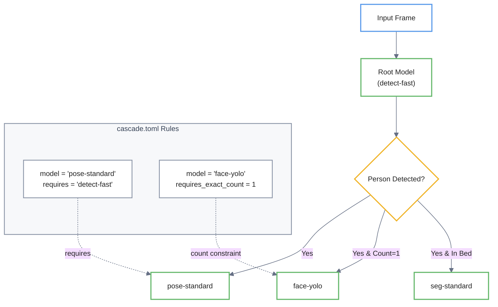

# FSM, Zone, and Cascade Configuration

> ⚠️ **Página generada, desactualizada.** Se generó contra el commit
> `ad24740d`. Divergencias conocidas al 2026-08-12, específicas de esta
> página:
>
> - **La compuerta de la cascada se borró del código.** Había una condición hardcodeada en `src/app/inference.rs` (`presence_track_count != 1`) que decidía si corría un modelo hijo. Duplicaba `requires_exact_count = 1` del blueprint contra otra fuente de datos y sin estar declarada en ningún catálogo. Desde el 2026-08-12 la condición vive **sólo** en las reglas del blueprint y la resuelve `cascade.rs`.
>
> - **`[fsm.states.idle]` de `detect-room-face` declara sólo el modelo padre.** Antes declaraba también el hijo, y la política de "con más de una persona, sólo detección base" la ejecutaba la compuerta hardcodeada que se borró. Ahora está declarada en el catálogo.
>
> No se corrige a mano: es un archivo **generado** y una corrección manual se
> pierde en la próxima regeneración, además de crear un segundo relato que
> compite con el primero. Lo que corresponde es regenerar contra `HEAD`.
>
> Fuentes autorizadas mientras tanto: [ARCHITECTURE.md](../../ARCHITECTURE.md)
> sobre ejecución, [HANDOFF.md](../../HANDOFF.md) y [`docs/adrs/`](../adrs/)
> sobre estado y decisiones, y [`workshop/MANUAL.md`](../../workshop/MANUAL.md)
> sobre cómo se opera y se lee la salida.

Este documento técnico detalla el marco de configuración de un sistema de visión computacional organizado en tres pilares fundamentales para gestionar el razonamiento espacial y el comportamiento lógico. El **Finite State Machine (FSM)** actúa como el cerebro del sistema, coordinando las transiciones entre estados operativos mediante el uso de **guards** y periodos de permanencia para asegurar respuestas estables ante señales del entorno. Complementariamente, el sistema emplea **zones** para delimitar regiones espaciales con parámetros de histéresis y **depth rules** que integran datos tridimensionales para una detección de proximidad más precisa. Finalmente, la **cascade configuration** optimiza el rendimiento del hardware al establecer una jerarquía de ejecución, permitiendo que los modelos más complejos se activen únicamente cuando se cumplen condiciones específicas de clasificación o ubicación detectadas por modelos primarios.


Relevant source files

- [](config/blueprints/detect-room-face/fsm.toml)
- [](config/cascade.toml)
- [](config/depth-rules.toml)
- [](src/config/fsm.rs)
- [](config/fsm.toml)
- [](config/zones.toml)
- [](core/mana-control/src/config.rs)

This page details the configuration and execution logic for the system's spatial reasoning, stateful behavior, and model dependency chains. The configuration is split across three primary domains: spatial regions (`zones.toml`), state transitions (`fsm.toml`), and model execution hierarchies (`cascade.toml`).

## FSM Configuration (`fsm.toml`)

The Finite State Machine (FSM) defines the high-level behavioral logic of the system. It consumes signals from the perception pipeline (e.g., occupancy, zone status, depth triggers) to transition between semantic states.

### State and Role Definitions

States are defined in the `[fsm.states]` table. Each state can specify a set of `models` that should be active while in that state, and optional flags like `face_inside` for specialized logic [config/blueprints/detect-room-face/fsm.toml7-40](config/blueprints/detect-room-face/fsm.toml#L7-L40)

The FSM requires two mandatory roles defined in `[fsm.roles]`:

- **safe**: The state the FSM enters when data becomes stale (e.g., camera signal loss) [config/fsm.toml25](config/fsm.toml#L25-L25)
- **reset**: The state the FSM returns to when the system is initialized or signal is restored [config/fsm.toml26](config/fsm.toml#L26-L26)

### Transitions and Guards

Transitions move the system from one state to another based on a list of `guards`. The `FsmGuard` enum accepts exactly **eight** `type` values — anything else is a TOML deserialization error listing the accepted set [core/mana-control/src/fsm/guard.rs22-65](core/mana-control/src/fsm/guard.rs#L22-L65)

- `zone_present`: True while the `ZoneEngine` reports the zone occupied (level, not edge)
- `zone_occupied` / `zone_vacated`: Edge-triggered on zone events; `zone_vacated` rejects `min_confidence` at compile time [config/fsm.toml41-55](config/fsm.toml#L41-L55)
- `all_zones_vacant`: True when every configured zone reports vacant
- `data_stale` / `data_fresh`: Triggered by the health of the ingest pipeline [config/fsm.toml33-99](config/fsm.toml#L33-L99)
- `depth_rule`: Triggered by depth-sensing thresholds [config/fsm.toml66](config/fsm.toml#L66-L66)
- `signal`: Typed comparison against the scene-signal table, e.g. `{ type = "signal", tag = "ocupacion.cardinalidad", op = "==", value = "multiple" }`. Tag, operator, and value are validated at boot against signal catalog v1 [config/blueprints/detect-room-face/fsm.toml60](config/blueprints/detect-room-face/fsm.toml#L60-L60)

### Guard Set Migration

All per-concept clinical guards were retired in favour of the single generic `signal` guard, which moves the vocabulary out of the enum and into the versioned signal catalog. A catalog still written against the old names — or, more commonly, a **stale binary** still expecting them — fails with `unknown variant`. If the rejected variant is `signal`, the TOML is current and the *binary* is old; rebuild and check which artifact you are running (see [Getting Started → Build and Run](1.1-getting-started#build-and-run)).

|Retired guard|Current equivalent|
|---|---|
|`cardinality { value = "single" }`|`{ tag = "ocupacion.cardinalidad", op = "==", value = "single" }`|
|`person_present` / `person_absent`|`{ tag = "persona.presente", op = "==", value = true \| false }`|
|`face_detected` / `face_absent`|`{ tag = "cara.presente", op = "==", value = true \| false }`|
|`face_in_dwell` / `face_not_in_dwell`|`{ tag = "cara.en_dwell", op = "==", value = true \| false }`|
|`face_at_edge` / `face_not_at_edge`|`{ tag = "cara.en_borde", op = "==", value = true \| false }`|
|`face_was_inside` / `face_was_not_inside`|`{ tag = "cara.estuvo_dentro", op = "==", value = true \| false }`|

Signal catalog v1 declares nine tags; `op` must suit the signal kind (`Ratio` and `Count` reject `==`/`!=`, `Label` restricts `value` to a closed set) [core/mana-control/src/signals/catalog.rs138-183](core/mana-control/src/signals/catalog.rs#L138-L183)

|Tag|Kind|Presence|
|---|---|---|
|`persona.presente`|`Bool`|Always|
|`persona.cantidad`|`Count`|Always|
|`cara.presente`|`Bool`|Always|
|`cara.confianza`|`Ratio`|WhenFaceSelected|
|`cara.en_dwell`|`Bool`|WhenDwellRoiConfigured|
|`cara.en_borde`|`Bool`|Always|
|`cara.modelo_corrio`|`Bool`|Always|
|`ocupacion.cardinalidad`|`Label` (`empty`/`single`/`multiple`)|Always|
|`cara.estuvo_dentro`|`Bool`|WhileFsmActive|

Transitions can also include a `dwell` period (e.g., "500ms" or "3s"), requiring guards to remain true for the duration before the transition completes [config/blueprints/detect-room-face/fsm.toml97-131](config/blueprints/detect-room-face/fsm.toml#L97-L131)

### FSM Logic Mapping

The following diagram maps the configuration fields to the internal `mana-control` types.

**Diagram: FSM Configuration to Code Entity Space**



```
                 mana-control Entities

[[fsm.transitions]] ──→ FsmTransition ──┐
                                        │
[fsm.states.name] ───→ FsmState ────────┼──→ FsmProgram
                                        │
                         FsmRoot ────────┤
                                        │
guards = [...] ───────→ FsmGuard ───────┘
```
Sources: [core/mana-control/src/config.rs4-42](core/mana-control/src/config.rs#L4-L42) [src/config/fsm.rs:1](src/config/fsm.rs#L1-L1)

---

## Zone Configuration (`zones.toml`)

Zones define spatial regions of interest within the 2D frame. They are used to generate occupancy signals for the FSM and for logging presence events.

### Zone Definition

Each zone is defined by an Axis-Aligned Bounding Box (AABB) using `x1, y1, x2, y2` coordinates and a `hysteresis_ms` value [core/mana-control/src/config.rs51-60](core/mana-control/src/config.rs#L51-L60) The hysteresis prevents "flickering" events when a detection oscillates at the boundary of a zone [config/zones.toml9](config/zones.toml#L9-L9)

### Specialized Zones

- **Standard Zones**: Defined in the `[zones]` table (e.g., `bed`, `chair`, `door`) [config/zones.toml1-34](config/zones.toml#L1-L34)
- **face_dwell**: A specialized ROI used to determine if a person's face is within a specific semantic region, often used for "in-bed" logic [config/zones.toml37-44](config/zones.toml#L37-L44)

**Table: ZoneSpec Fields**

|Field|Type|Description|
|---|---|---|
|`x1, y1, x2, y2`|`u32`|Bounding box coordinates in frame space.|
|`label`|`String`|Human-readable name for logging/UI.|
|`hysteresis_ms`|`u64`|Delay before state changes (Occupied <-> Vacant).|

Sources: [core/mana-control/src/config.rs43-68](core/mana-control/src/config.rs#L43-L68) [config/zones.toml1-44](config/zones.toml#L1-L44)

---

## Cascade Configuration (`cascade.toml`)

The `cascade.toml` file defines the execution dependencies between models. This allows the system to optimize compute by only running expensive models (like pose or face detection) when specific conditions are met by a "parent" model.

### Cascade Rules

Rules define the criteria for triggering a model:

- **Dependency**: The `requires` field specifies the parent model [config/cascade.toml12](config/cascade.toml#L12-L12)
- **Class Filtering**: `requires_class` limits execution to specific detections (e.g., only run pose if `person` is detected) [config/cascade.toml13](config/cascade.toml#L13-L13)
- **Spatial Gating**: `requires_region` restricts execution to detections within a defined semantic region [config/cascade.toml16](config/cascade.toml#L16-L16)
- **Count Gating**: `requires_exact_count` (e.g., only run face-yolo if exactly 1 person is in the room) [config/cascade.toml24](config/cascade.toml#L24-L24)

**Diagram: Cascade Execution Flow**



```
                    cascade.toml
                         │
              ┌──────────┴──────────┐
              │                     │
        requires             count constraint
              │                     │
              ▼                     ▼
Input Frame → Root Model → Person Detected?
                              │
               ┌──────────────┼───────────────┐
               │              │               │
              Yes      Yes & Count=1     Yes & In Bed
               │              │               │
               ▼              ▼               ▼
        pose-standard     face-yolo      seg-standard
```
Sources: [config/cascade.toml7-34](config/cascade.toml#L7-L34)

---

## Depth Rules (`depth-rules.toml`)

Depth rules allow the system to use 3D spatial data (from models like `depth-standard`) to trigger FSM transitions. A rule compares a robust metric (e.g., `median` distance) within a global region against a threshold in meters [config/depth-rules.toml1-6](config/depth-rules.toml#L1-L6)

### Calibration

Depth thresholds are provisional until calibrated for a specific camera installation. Calibration is defined using a reference model distance vs. a physical scene measurement [config/depth-rules.toml7-12](config/depth-rules.toml#L7-L12)

**Rule Example:**

- **Name**: `bed-approach`
- **Region**: `[560, 140, 1240, 820]`
- **Metric**: `median` distance `< 1.5m` [config/depth-rules.toml14-20](config/depth-rules.toml#L14-L20)

Sources: [config/depth-rules.toml1-22](config/depth-rules.toml#L1-L22)

