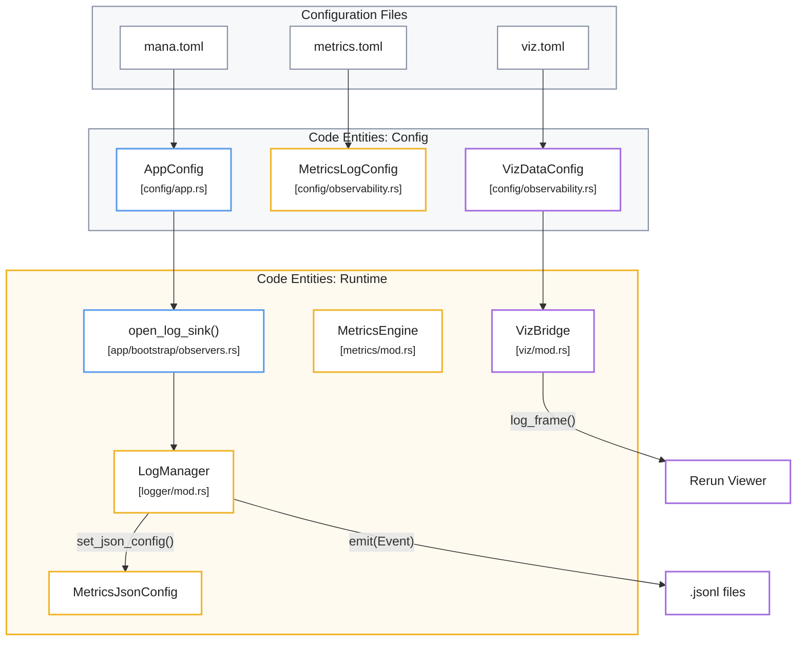
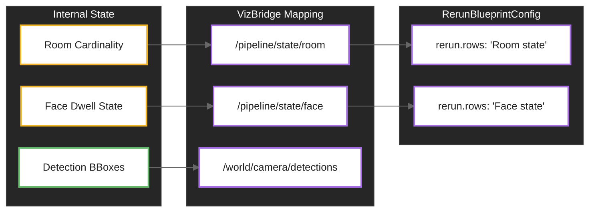

# Observability Configuration

> ⚠️ **Página generada, desactualizada.** Se generó contra el commit
> `ad24740d`. Divergencias conocidas al 2026-08-12, específicas de esta
> página:
>
> - **Cambiaron los defaults de observabilidad y hay un contador nuevo.** `fsm_events` y `zone_events` pasaron a `true` en `config/metrics.toml` (son transiciones: 2,1 y 4,6 MB/día); `face_dwell_events` sigue en `false` por costo (175 MB/día). Se agregó `infer_gated` → `apagados:N` en la línea `infer:` y `apagado:N` en la línea por modelo, para distinguir "el estado del FSM no pidió este modelo" de "la regla lo salteó". La línea por modelo pasó de `skip` a `skip:N`.
>
> No se corrige a mano: es un archivo **generado** y una corrección manual se
> pierde en la próxima regeneración, además de crear un segundo relato que
> compite con el primero. Lo que corresponde es regenerar contra `HEAD`.
>
> Fuentes autorizadas mientras tanto: [ARCHITECTURE.md](../../ARCHITECTURE.md)
> sobre ejecución, [HANDOFF.md](../../HANDOFF.md) y [`docs/adrs/`](../adrs/)
> sobre estado y decisiones, y [`workshop/MANUAL.md`](../../workshop/MANUAL.md)
> sobre cómo se opera y se lee la salida.

El sistema mana-lite emplea una **estrategia de configuración multicapa** diseñada para supervisar el rendimiento y la telemetría del sistema a través de tres pilares fundamentales: visualización en tiempo real, métricas de rendimiento y registros estructurados. Mediante el uso de estructuras como **VizDataConfig**, los operadores pueden alternar con precisión qué flujos de datos —desde cuadros de video hasta latencia de inferencia— se transmiten al servidor de visualización Rerun. El monitoreo se complementa con un **motor de métricas** que organiza la información en salidas de consola legibles para humanos y archivos JSONL procesables por máquinas, permitiendo ajustar la frecuencia de los reportes y filtrar eventos específicos según su relevancia. Finalmente, la arquitectura garantiza la integridad operativa mediante una **gestión automatizada de registros**, que incluye la rotación de archivos por tamaño y la personalización del diseño de la interfaz de usuario para facilitar el diagnóstico técnico profundo.

Relevant source files

- 
- 
- 
- 
- 
- 
- 
- 

Observability in the `mana-lite` system is managed through a multi-layered configuration strategy that controls real-time visualization (Rerun), structured event logging (JSONL), and periodic performance metrics. These settings allow operators to tune the granularity of telemetry based on deployment needs, ranging from high-performance 24/7 monitoring to narrow diagnostic tracing.

## Visualization Data Configuration

The visualization system is primarily driven by the `VizDataConfig` struct, which defines the integration with the Rerun SDK. It controls which visual elements and telemetry streams are transmitted to the Rerun server.

### VizDataConfig and VizSendToggles

The `VizDataInner` struct [config/observability.rs23-30](src/config/observability.rs#L23-L30) handles the connection state and transmission flags.

- **`enabled`**: A global toggle for the Rerun bridge [config/observability.rs25](src/config/observability.rs#L25-L25)
- **`rerun_addr`**: The IP and port of the Rerun viewer (default: `0.0.0.0:9876`) [config/app.rs79-81](src/config/app.rs#L79-L81)
- **`send`**: An instance of `VizSendToggles` that provides fine-grained control over specific data streams [config/observability.rs44-83](src/config/observability.rs#L44-L83)

|Toggle|Default|Description|
|---|---|---|
|`frames`|`true`|Full decoded video frames.|
|`boxes`|`true`|Bounding boxes for detections.|
|`masks`|`true`|Segmentation masks.|
|`crop_frames`|`false`|Sub-frames extracted for cascaded model inference.|
|`roi_rects`|`false`|Visualization of static or dynamic Regions of Interest.|
|`decode_latency`|`true`|Time taken to decode H.264 packets.|
|`infer_latency`|`true`|Per-model inference time in milliseconds.|
|`depth`|`false`|Raw depth maps or disparity visualizations.|

**Sources:** [config/observability.rs9-83](src/config/observability.rs#L9-L83) [config/app.rs63-81](src/config/app.rs#L63-L81)

## Metrics and Structured Logging

The metrics system is split between human-readable console output and machine-readable JSONL logs. The `MetricsLogConfig` struct [config/observability.rs117-119](src/config/observability.rs#L117-L119) centralizes these settings.

### MetricsInner

The `MetricsInner` struct [config/observability.rs131-138](src/config/observability.rs#L131-L138) defines the reporting cadence and sub-configs:

- **`report_interval_s`**: The frequency (in seconds) at which the `MetricsEngine` aggregates and reports telemetry (default: 5s) [config/observability.rs143](src/config/observability.rs#L143-L143)
- **`text`**: Configures the standard output lines.
- **`jsonl`**: Configures the structured events emitted to the log file.

### MetricsTextFlags

These flags control specific diagnostic counters printed to the console [config/observability.rs188-207](src/config/observability.rs#L188-L207) They allow suppressing noisy ingest events like duplicate frames (`ingest_dup`) or P-frame drops (`ingest_pframes`) while keeping critical errors like RTP timeouts (`ingest_timeouts`) visible.

### MetricsJsonlConfig

This configuration determines which event types the `LogManager` serializes into the `.jsonl` output [config/observability.rs227-252](src/config/observability.rs#L227-L252)

- **`frame_events`**: Per-frame metadata.
- **`presence_events`**: Room occupancy and presence transitions.
- **`fsm_events`**: Finite State Machine state changes.
- **`scene_signals_events`**: Periodic snapshots of all internal logic signals (Boolean/Count/Ratio).

**Sources:** [config/observability.rs117-252](src/config/observability.rs#L117-L252) [config/metrics.toml1-34](config/metrics.toml#L1-L34)

## Data Flow: Config to Runtime

The following diagram illustrates how observability configurations are loaded and applied to the runtime engines during the bootstrap sequence.

### Observability Initialization Flow

**Sources:** [app/bootstrap/observers.rs29-122](src/app/bootstrap/observers.rs#L29-L122) [config/app.rs10-41](src/config/app.rs#L10-L41)

## Log Rotation and Retention

The `LogManager` handles the physical storage of structured events. If a `save_dir` is provided in `OutputConfig`, the system initializes a rotating logger [app/bootstrap/observers.rs35-36](src/app/bootstrap/observers.rs#L35-L36)

- **`LogManager::rotating`**: Creates a sink that manages file size and backups based on the `rotate` configuration [app/bootstrap/observers.rs36](src/app/bootstrap/observers.rs#L36-L36)
- **`JsonlLevel`**: Filters logs by severity (Debug, Info, Quiet) before they hit the disk [app/bootstrap/observers.rs34](src/app/bootstrap/observers.rs#L34-L34)

**Sources:** [app/bootstrap/observers.rs29-41](src/app/bootstrap/observers.rs#L29-L41) [logger/mod.rs](src/logger/mod.rs)

## Rerun Blueprint Configuration

The `RerunBlueprintConfig` (defined in `rerun.toml`) allows the application to control the Rerun viewer's layout programmatically. This includes defining `state_timeline` rows for specific entity paths like `/pipeline/state/room` [config/rerun.toml5-9](config/rerun.toml#L5-L9)

- **`auto_views`**: When enabled, Rerun will automatically generate views for new data streams [config/rerun.toml3](config/rerun.toml#L3-L3)
- **`origin`**: Maps a UI row to a specific internal data path [config/rerun.toml8](config/rerun.toml#L8-L8)

### Code Association: Visualization Pathing

The `VizBridge` maps internal pipeline states to Rerun entity paths, allowing the configuration to target them.

**Sources:** [config/rerun.toml1-9](config/rerun.toml#L1-L9) [app/bootstrap/observers.rs89-95](src/app/bootstrap/observers.rs#L89-L95)

