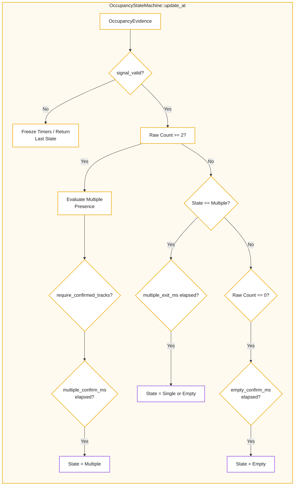
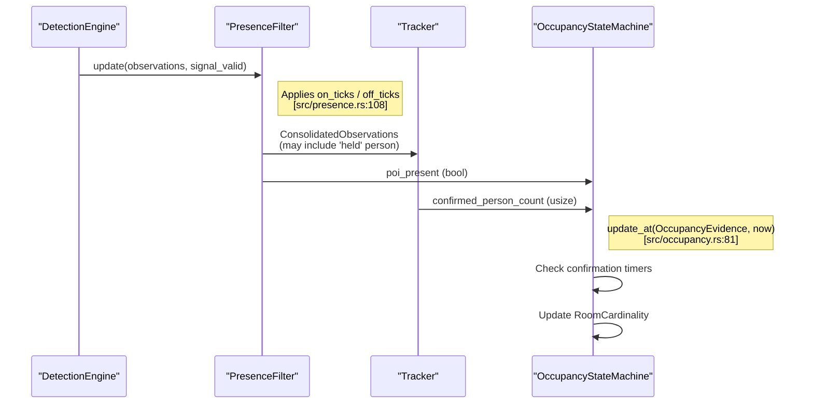

# Presence and Occupancy

Relevant source files

- 
- 

The Presence and Occupancy subsystem is responsible for transforming transient, frame-by-frame detections into stable, high-level room states. It employs a two-stage filtering process: first, the `PresenceFilter` debounces raw detections to handle sensor noise and short dropouts; second, the `OccupancyStateMachine` applies temporal hysteresis to determine the cardinality of the room (Empty, Single, or Multiple).

## Presence Filtering

The `PresenceFilter` acts as a debounce layer for a specific object class (typically "person"). Its primary role is to ensure that the "Person of Interest" (POI) signal is stable before it is used to drive room state changes or tracking logic [src/presence.rs30-38](src/presence.rs#L30-L38)

### Signal Debouncing and Holding

The filter uses a tick-based approach (based on inference frames) to transition between states:

- **On Ticks**: The number of consecutive frames a person must be detected before the state becomes `PresenceState::Present` [src/presence.rs111-113](src/presence.rs#L111-L113)
- **Off Ticks**: The number of consecutive frames a person must be missing before the state becomes `PresenceState::Absent` [src/presence.rs144-147](src/presence.rs#L144-L147)
- **Signal Holding**: If the state is `Present` but a frame is missing detections, the filter "holds" the last known observation for a duration defined by `off_ticks`. This prevents the tracker from losing continuity during momentary occlusions or inference failures [src/presence.rs127-142](src/presence.rs#L127-L142)

### Presence Logic Data Flow

|Component|Entity|Role|
|---|---|---|
|**State**|`PresenceState`|Enum representing `Absent`, `Present`, or `Ambiguous` (when >1 person detected) [src/presence.rs5-9](src/presence.rs#L5-L9)|
|**Filter**|`PresenceFilter`|Manages tick counters and the `last_person` observation [src/presence.rs30-38](src/presence.rs#L30-L38)|
|**Update**|`PresenceUpdate`|Struct returned to the pipeline containing the current state and metadata like `held` status [src/presence.rs22-27](src/presence.rs#L22-L27)|

**Sources:** [src/presence.rs5-51](src/presence.rs#L5-L51) [src/presence.rs108-158](src/presence.rs#L108-L158)

## Occupancy State Machine

The `OccupancyStateMachine` (OSM) consumes the filtered presence signals and raw track counts to determine the `RoomCardinality`. Unlike the tick-based presence filter, the OSM uses `std::time::Instant` to apply real-time millisecond-based hysteresis [src/occupancy.rs56-64](src/occupancy.rs#L56-L64)

### Room Cardinality Transitions

The system recognizes three primary states for a room:

1. **Empty**: No confirmed presence or tracks [src/occupancy.rs6](src/occupancy.rs#L6-L6)
2. **Single**: One confirmed person is present [src/occupancy.rs7](src/occupancy.rs#L7-L7)
3. **Multiple**: Two or more people are confirmed in the space [src/occupancy.rs8](src/occupancy.rs#L8-L8)

### Hysteresis and Confirmation Windows

To prevent rapid "flickering" of room states, the OSM requires conditions to be met for a configurable duration before transitioning. These durations are defined in the `OccupancyPolicy` [src/occupancy.rs57](src/occupancy.rs#L57-L57):

- **`single_confirm_ms`**: Time required to move from Empty to Single [src/occupancy.rs140-142](src/occupancy.rs#L140-L142)
- **`empty_confirm_ms`**: Time required to move from Single/Multiple to Empty [src/occupancy.rs154-157](src/occupancy.rs#L154-L157)
- **`multiple_confirm_ms`**: Time required to confirm a second person [src/occupancy.rs100-103](src/occupancy.rs#L100-L103)
- **`multiple_exit_ms`**: Time required to transition back from Multiple to Single/Empty after one person leaves [src/occupancy.rs119-126](src/occupancy.rs#L119-L126)

### Second Person State

The OSM tracks the status of a potential second occupant via `SecondPersonState`:

- `None`: No second person detected.
- `Candidate`: A second person is detected but the `multiple_confirm_ms` timer has not yet expired.
- `Confirmed`: The second person has persisted long enough to trigger the `Multiple` room state.

**Sources:** [src/occupancy.rs4-79](src/occupancy.rs#L4-L79) [src/occupancy.rs92-160](src/occupancy.rs#L92-L160)

## Implementation Diagrams

### Occupancy State Transition Logic

This diagram illustrates how `OccupancyStateMachine::update_at` processes `OccupancyEvidence` to update the internal `RoomCardinality`.

**Sources:** [src/occupancy.rs81-160](src/occupancy.rs#L81-L160)

### Presence to Occupancy Pipeline

This diagram bridges the conceptual "Detection" to the "Room State" by showing the interaction between the `PresenceFilter` and the `OccupancyStateMachine`.

**Sources:** [src/presence.rs55-59](src/presence.rs#L55-L59) [src/occupancy.rs39-44](src/occupancy.rs#L39-L44) [src/occupancy.rs81-82](src/occupancy.rs#L81-L82)

## Summary of Key Types

|Type|File|Description|
|---|---|---|
|`PresenceFilter`|[src/presence.rs30](src/presence.rs#L30-L30)|Debounces raw detections into stable presence ticks.|
|`PresenceState`|[src/presence.rs5](src/presence.rs#L5-L5)|`Absent`, `Present`, or `Ambiguous`.|
|`OccupancyStateMachine`|[src/occupancy.rs56](src/occupancy.rs#L56-L56)|Manages room state transitions using temporal hysteresis.|
|`RoomCardinality`|[src/occupancy.rs5](src/occupancy.rs#L5-L5)|`Empty`, `Single`, or `Multiple`.|
|`OccupancyEvidence`|[src/occupancy.rs39](src/occupancy.rs#L39-L39)|The input data for an occupancy update (counts, presence, validity).|
|`OccupancyUpdate`|[src/occupancy.rs47](src/occupancy.rs#L47-L47)|The output snapshot containing the new state and active timer values.|

**Sources:** [src/presence.rs1-51](src/presence.rs#L1-L51) [src/occupancy.rs1-79](src/occupancy.rs#L1-L79)
