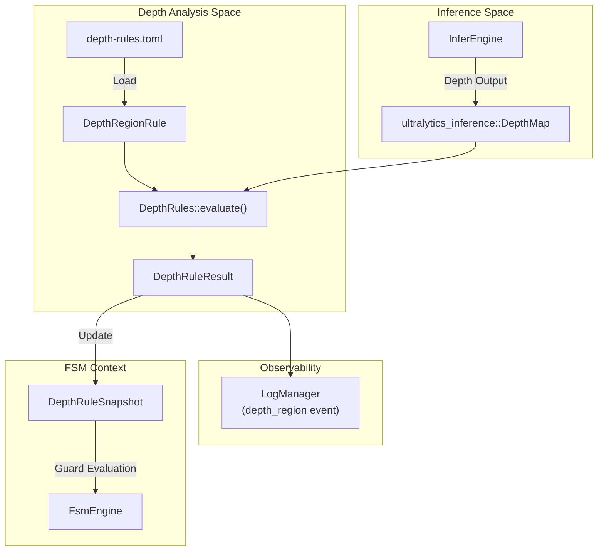
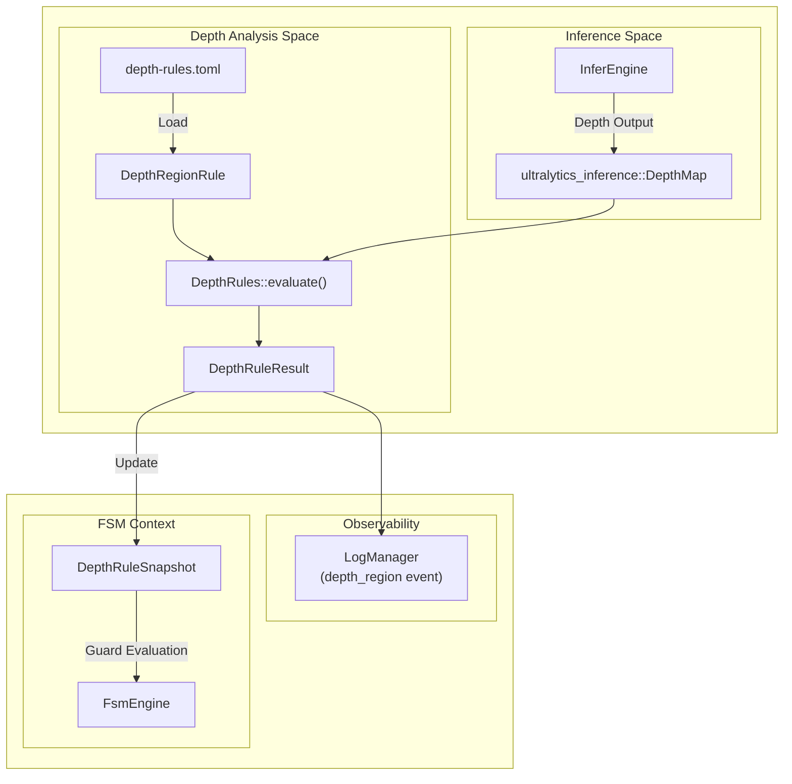
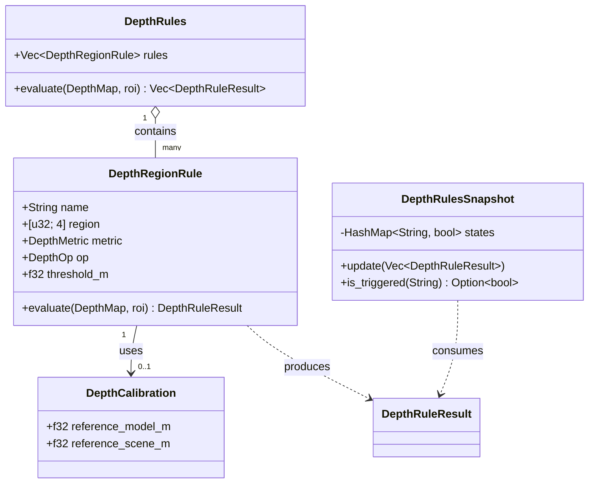

# Depth Analysis

Relevant source files

- 
- 
- 

The Depth Analysis subsystem provides spatial distance awareness by evaluating monocular depth maps against user-defined global regions. Unlike object detection, which focuses on semantic identity, depth analysis evaluates the geometric properties of a scene to determine proximity, such as whether an entity (or the general environment) has entered a specific distance threshold within a 3D volume.

This system is governed by the `DepthRegionRule` [src/depth.rs68-80](src/depth.rs#L68-L80) which allows for robust statistical evaluation (median, percentiles) and metric calibration to convert model-relative units into physical meters.

## Architecture and Data Flow

Depth analysis occurs after the `InferEngine` produces a `DepthMap` [src/depth.rs4](src/depth.rs#L4-L4) The `DepthRules` catalog evaluates this map against a set of spatial regions defined in `depth-rules.toml`.

### Data Flow Diagram

**Sources:** [src/depth.rs177-210](src/depth.rs#L177-L210) [src/depth.rs215-240](src/depth.rs#L215-L240) [config/depth-rules.toml1-20](config/depth-rules.toml#L1-L20)

## Configuration: `depth-rules.toml`

Rules are defined in `config/depth-rules.toml`. Each rule specifies a global coordinate region, a statistical metric to apply to the pixels in that region, and a threshold for triggering.

|Field|Type|Description|
|---|---|---|
|`name`|String|Unique identifier for the rule.|
|`region`|`[u32; 4]`|Global coordinates `[x1, y1, x2, y2]` to evaluate.|
|`metric`|Enum|Statistical method: `min`, `median`, `p10`, `p90`, `max`.|
|`op`|Enum|Comparison operator: `lt` (Less Than) or `gt` (Greater Than).|
|`threshold_m`|f32|Distance threshold in meters (calibrated or model units).|
|`min_valid_ratio`|f32|Minimum percentage of valid depth pixels required in the region.|

**Sources:** [src/depth.rs68-80](src/depth.rs#L68-L80) [config/depth-rules.toml14-20](config/depth-rules.toml#L14-L20)

## Metric Calibration

Monocular depth models typically output values relative to their training set. To obtain physical distances, the `DepthCalibration` [src/depth.rs17-20](src/depth.rs#L17-L20) struct implements a single-point linear scaling:

$$ \text{scene_m} = \text{model_val} \times \left( \frac{\text{reference_scene_m}}{\text{reference_model_m}} \right) $$

The `DepthCalibration::scale()` [src/depth.rs25-27](src/depth.rs#L25-L27) function calculates this factor. If no calibration is provided, the system uses an identity scale (1.0), treating model units as meters [src/depth.rs157](src/depth.rs#L157-L157)

**Sources:** [src/depth.rs9-28](src/depth.rs#L9-L28) [config/depth-rules.toml7-12](config/depth-rules.toml#L7-L12)

## Robust Statistics

To avoid noise from single-pixel outliers, the system uses `DepthRoiStats` to aggregate depth values within the intersection of the rule's `region` and the current inference `ROI` [src/depth.rs146-147](src/depth.rs#L146-L147)

Supported metrics in `DepthMetric` [src/depth.rs31-39](src/depth.rs#L31-L39):

- **Median**: The 50th percentile, highly robust against noise.
- **P10 / P90**: Useful for detecting the "front" or "back" of an object within a volume.
- **Min / Max**: Standard extrema (sensitive to noise).

The `DepthRegionRule::evaluate` [src/depth.rs146-174](src/depth.rs#L146-L174) function calculates these stats and applies the `min_valid_ratio` check. If the intersection between the rule region and the depth map is too small or contains too many invalid pixels, the rule returns `None` to avoid false triggers [src/depth.rs151-153](src/depth.rs#L151-L153)

**Sources:** [src/depth.rs31-51](src/depth.rs#L31-L51) [src/depth.rs146-174](src/depth.rs#L146-L174)

## FSM Integration

The `FsmEngine` does not consume raw `DepthRuleResult` objects directly to avoid coupling the FSM frequency with the inference frequency. Instead, it uses a `DepthRuleSnapshot` [src/depth.rs215-220](src/depth.rs#L215-L220)

### Snapshot Logic

1. **Update**: When new depth evidence is available, `DepthRuleSnapshot::update` [src/depth.rs223-228](src/depth.rs#L223-L228) refreshes the internal map of rule names to their last triggered state.
2. **Query**: The `depth_rule` FSM guard calls `is_triggered(rule_name)` [src/depth.rs231-233](src/depth.rs#L231-L233)
3. **Staleness**: If no depth map has been processed for a period, the snapshot remains valid until the next inference cycle, allowing the FSM to maintain state between frames.

**Sources:** [src/depth.rs215-240](src/depth.rs#L215-L240)

## Implementation Mapping

The following diagram maps the conceptual Depth Analysis components to their specific implementation entities in the `mana-lite` codebase.

**Sources:** [src/depth.rs17-20](src/depth.rs#L17-L20) [src/depth.rs68-80](src/depth.rs#L68-L80) [src/depth.rs178-181](src/depth.rs#L178-L181) [src/depth.rs215-220](src/depth.rs#L215-L220)

