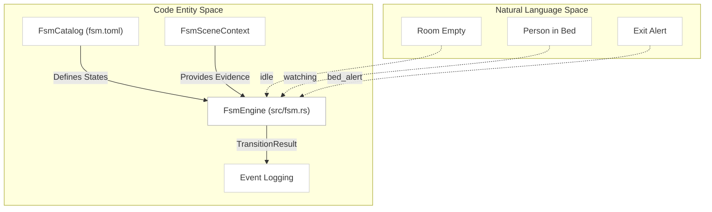
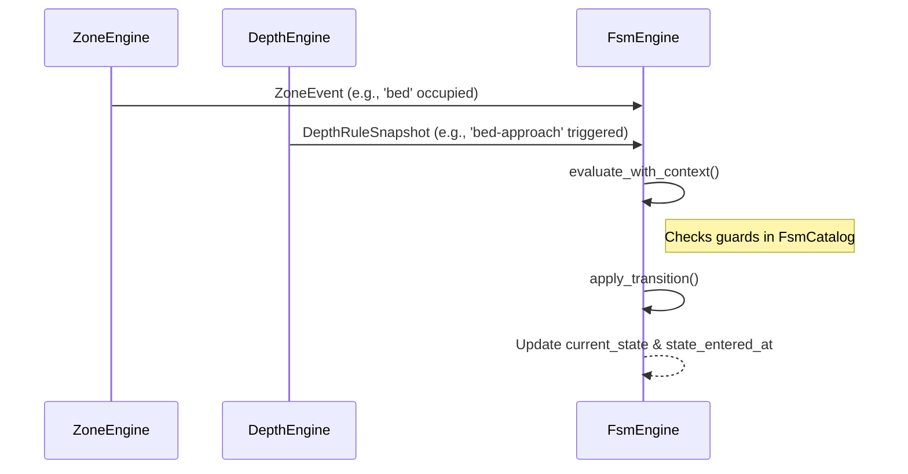

# Finite State Machine (FSM)

Relevant source files

- 
- 
- 

The Finite State Machine (FSM) subsystem is the high-level decision-making layer of the `mana-lite` pipeline. It consumes processed evidence from tracking, occupancy zones, depth rules, and face detection to drive system state transitions. The FSM determines which models are active and generates semantic events (e.g., "Bed Exit Alert") based on configurable rules.

### Purpose and Scope

The FSM allows the system to move beyond raw detections into temporal scene understanding. By defining states like `idle`, `watching`, or `alert`, the system can dynamically adjust its behavior—such as switching between high-speed detection and high-precision pose estimation—based on the current context [config/fsm.toml1-23](https://github.com/ernestovisiona-netizen/kik8/blob/43a92847/config/fsm.toml#L1-L23)

For detailed configuration of guards and transitions, see [FSM Guards and Transitions](https://deepwiki.com/ernestovisiona-netizen/kik8/3.1-fsm-guards-and-transitions). For the specialized implementation used in room monitoring, see [Face Dwell FSM](https://deepwiki.com/ernestovisiona-netizen/kik8/3.2-face-dwell-fsm).

---

### FSM Architecture

The `FsmEngine` is the central struct responsible for maintaining the current state and evaluating transitions against a `FsmCatalog` [src/fsm.rs49-55](https://github.com/ernestovisiona-netizen/kik8/blob/43a92847/src/fsm.rs#L49-L55) It processes `FsmSceneContext` [src/fsm.rs12-20](https://github.com/ernestovisiona-netizen/kik8/blob/43a92847/src/fsm.rs#L12-L20) which aggregates data from various sub-engines.

#### FSM Data Flow

The following diagram illustrates how the `FsmEngine` bridges high-level configuration with real-time frame evidence.

**Sources:** [src/fsm.rs49-70](https://github.com/ernestovisiona-netizen/kik8/blob/43a92847/src/fsm.rs#L49-L70) [src/config/fsm.rs5-15](https://github.com/ernestovisiona-netizen/kik8/blob/43a92847/src/config/fsm.rs#L5-L15) [config/fsm.toml4-23](https://github.com/ernestovisiona-netizen/kik8/blob/43a92847/config/fsm.toml#L4-L23)

---

### State Evaluation and Context

The `FsmEngine` evaluates transitions on every frame where fresh evidence is available. It uses `FsmSceneContext` to capture specific signals required by the guards, such as person cardinality, face presence, and whether a face is currently within a dwell zone [src/fsm.rs12-20](https://github.com/ernestovisiona-netizen/kik8/blob/43a92847/src/fsm.rs#L12-L20)

|Entity|Role|Source|
|---|---|---|
|`FsmState`|Defines a semantic mode and associated models.|[src/config/fsm.rs18-25](https://github.com/ernestovisiona-netizen/kik8/blob/43a92847/src/config/fsm.rs#L18-L25)|
|`FsmTransition`|Defines the path from one state to another.|[src/config/fsm.rs28-35](https://github.com/ernestovisiona-netizen/kik8/blob/43a92847/src/config/fsm.rs#L28-L35)|
|`FsmGuard`|Logical conditions (zones, depth, time) to trigger transitions.|[src/config/fsm.rs39-102](https://github.com/ernestovisiona-netizen/kik8/blob/43a92847/src/config/fsm.rs#L39-L102)|
|`FsmSnapshot`|Exportable view of current FSM status for metrics.|[src/fsm.rs40-47](https://github.com/ernestovisiona-netizen/kik8/blob/43a92847/src/fsm.rs#L40-L47)|

**Sources:** [src/fsm.rs119-151](https://github.com/ernestovisiona-netizen/kik8/blob/43a92847/src/fsm.rs#L119-L151) [src/config/fsm.rs1-102](https://github.com/ernestovisiona-netizen/kik8/blob/43a92847/src/config/fsm.rs#L1-L102)

---

### Core Mechanics

#### Guard Types

Transitions are gated by one or more `FsmGuard` conditions. These include:

- **Zone Guards:** `zone_occupied`, `zone_vacated`, and `all_zones_vacant` based on `ZoneEngine` events [src/config/fsm.rs44-64](https://github.com/ernestovisiona-netizen/kik8/blob/43a92847/src/config/fsm.rs#L44-L64)
- **Temporal Guards:** `dwell` timers that require a condition to be met for a specific duration before transitioning [src/config/fsm.rs34](https://github.com/ernestovisiona-netizen/kik8/blob/43a92847/src/config/fsm.rs#L34-L34)
- **Spatial Guards:** `depth_rule` checks against calibrated 3D regions [src/config/fsm.rs70-75](https://github.com/ernestovisiona-netizen/kik8/blob/43a92847/src/config/fsm.rs#L70-L75)
- **System Health:** `data_stale` guards, often used with wildcard transitions to handle signal loss [src/config/fsm.rs65-66](https://github.com/ernestovisiona-netizen/kik8/blob/43a92847/src/config/fsm.rs#L65-L66)

#### Wildcard Transitions

The FSM supports wildcard transitions (`from = "*"`) which allow the system to jump to a specific state (like `blind` or `error`) from any current state if a critical guard, such as `data_stale`, is triggered [config/fsm.toml26-29](https://github.com/ernestovisiona-netizen/kik8/blob/43a92847/config/fsm.toml#L26-L29)

#### Face Latching

For room-monitoring blueprints, the FSM maintains a `face_was_inside` latch. This boolean tracks if a face was detected within a specific dwell region during the current session, allowing the FSM to distinguish between a clean exit and a tracking loss [src/fsm.rs54](https://github.com/ernestovisiona-netizen/kik8/blob/43a92847/src/fsm.rs#L54-L54) [src/fsm.rs221](https://github.com/ernestovisiona-netizen/kik8/blob/43a92847/src/fsm.rs#L221-L221)

**Sources:** [src/fsm.rs119-151](https://github.com/ernestovisiona-netizen/kik8/blob/43a92847/src/fsm.rs#L119-L151) [src/fsm.rs221-236](https://github.com/ernestovisiona-netizen/kik8/blob/43a92847/src/fsm.rs#L221-L236) [config/fsm.toml57-70](https://github.com/ernestovisiona-netizen/kik8/blob/43a92847/config/fsm.toml#L57-L70)

---

### Child Pages

- **[FSM Guards and Transitions](https://deepwiki.com/ernestovisiona-netizen/kik8/3.1-fsm-guards-and-transitions):** Detailed reference for all guard logic, including `min_duration_ms` hysteresis and `min_confidence` thresholds.
- **[Face Dwell FSM](https://deepwiki.com/ernestovisiona-netizen/kik8/3.2-face-dwell-fsm):** Deep dive into the `detect-room-face` blueprint's FSM logic, state labels, and the recovery logic for exiting persons.

