# Inference Pipeline

> ⚠️ **Página generada, desactualizada.** Se generó contra el commit
> `ad24740d`. Divergencias conocidas al 2026-08-12, específicas de esta
> página:
>
> - **La compuerta de la cascada se borró del código.** Había una condición hardcodeada en `src/app/inference.rs` (`presence_track_count != 1`) que decidía si corría un modelo hijo. Duplicaba `requires_exact_count = 1` del blueprint contra otra fuente de datos y sin estar declarada en ningún catálogo. Desde el 2026-08-12 la condición vive **sólo** en las reglas del blueprint y la resuelve `cascade.rs`.
>
> No se corrige a mano: es un archivo **generado** y una corrección manual se
> pierde en la próxima regeneración, además de crear un segundo relato que
> compite con el primero. Lo que corresponde es regenerar contra `HEAD`.
>
> Fuentes autorizadas mientras tanto: [ARCHITECTURE.md](../../ARCHITECTURE.md)
> sobre ejecución, [HANDOFF.md](../../HANDOFF.md) y [`docs/adrs/`](../adrs/)
> sobre estado y decisiones, y [`workshop/MANUAL.md`](../../workshop/MANUAL.md)
> sobre cómo se opera y se lee la salida.

El sistema mana-lite utiliza un **pipeline de inferencia** que actúa como un motor de percepción diseñado para convertir transmisiones de video en bruto en **observaciones semánticas de alto nivel**. Este proceso lineal comienza con la **ingesta y decodificación** selectiva de fotogramas clave para reducir la latencia, seguido de una ejecución jerárquica de modelos de IA mediante un **programador en cascada** que analiza desde imágenes completas hasta recortes específicos. Finalmente, el sistema emplea la **consolidación de detecciones** para fusionar datos redundantes y organizar los hallazgos en una estructura coherente, mientras monitorea constantemente el rendimiento mediante **métricas de latencia**. En esencia, el documento detalla la arquitectura técnica que permite a una máquina interpretar visualmente su entorno de manera eficiente y organizada.

Relevant source files

- 
- 
- 
- 
- 
- 
- 

The Inference Pipeline is the perception engine of `mana-lite`. It is responsible for transforming raw RTSP network packets into high-level semantic observations (e.g., "a person is at these coordinates"). The pipeline operates as a multi-stage process triggered by the arrival of video keyframes.

## Pipeline Architecture

The pipeline follows a strict linear execution flow for every processed keyframe. It is managed by the `App::run` loop [src/app/mod.rs73-139](src/app/mod.rs#L73-L139) which coordinates the `IngestEngine`, `FrameDecoder`, and `InferEngine`.

### Data Flow Overview

The following diagram illustrates how video data transitions from the network into the internal representation used by the control system.

**Video to Perception Flow**

```mermaid
%%{init: {
  "theme": "base",
  "themeVariables": {
    "background": "#FFFFFF",
    "primaryColor": "#FFFFFF",
    "primaryTextColor": "#222222",
    "primaryBorderColor": "#8A94A6",
    "lineColor": "#8A94A6",
    "secondaryColor": "#F7F8FA",
    "tertiaryColor": "#FFFFFF",
    "clusterBkg": "#F7F8FA",
    "clusterBorder": "#D5D9E0",
    "fontFamily": "Inter, Arial, sans-serif",
    "fontSize": "13px"
  },
  "flowchart": {
    "curve": "linear",
    "nodeSpacing": 24,
    "rankSpacing": 32
  }
}}%%

flowchart TB

    %% =========================================================
    %% DESIGN SYSTEM
    %% =========================================================

    classDef ingestNode fill:#FFFFFF,stroke:#5B9BEA,stroke-width:2px,color:#222222
    classDef perceptionNode fill:#FFFFFF,stroke:#65B86B,stroke-width:2px,color:#222222
    classDef logicNode fill:#FFFFFF,stroke:#F0B429,stroke-width:2px,color:#222222
    classDef outputNode fill:#FFFFFF,stroke:#A56DE2,stroke-width:2px,color:#222222


    %% =========================================================
    %% INGEST & DECODING
    %% =========================================================

    subgraph INGEST["Ingest & Decoding"]
        direction TB

        RetinaReader["RetinaReader (RTSP)"]:::ingestNode
        AnnexB["Annex-B H.264"]:::ingestNode
        IngestEngine["IngestEngine"]:::ingestNode
        RawKeyframe["RawKeyframe"]:::ingestNode
        FrameDecoder["FrameDecoder"]:::ingestNode
        FrameBuffer["FrameBuffer (RGB)"]:::ingestNode
        InferenceCycle["Inference Cycle"]:::ingestNode

        RetinaReader --> AnnexB
        AnnexB --> IngestEngine
        IngestEngine --> RawKeyframe
        RawKeyframe --> FrameDecoder
        FrameDecoder --> FrameBuffer
        FrameBuffer --> InferenceCycle
    end

    style INGEST fill:#F5F9FF,stroke:#5B9BEA,stroke-width:2px,color:#222222


    %% =========================================================
    %% INFERENCE & CONSOLIDATION
    %% =========================================================

    subgraph INFERENCE["Inference & Consolidation"]
        direction TB

        RootModels["InferEngine (Root Models)"]:::perceptionNode
        Detections["Detections"]:::perceptionNode
        CascadeScheduler["CascadeScheduler"]:::logicNode
        CropRect["CropRect"]:::logicNode
        ChildModels["InferEngine (Child Models)"]:::perceptionNode
        DetectionConsolidator["DetectionConsolidator"]:::logicNode

        RootModels --> Detections
        Detections --> CascadeScheduler
        CascadeScheduler --> CropRect
        CropRect --> ChildModels
        ChildModels --> DetectionConsolidator
    end

    style INFERENCE fill:#F5FBF5,stroke:#65B86B,stroke-width:2px,color:#222222


    %% =========================================================
    %% CROSS-LAYER FLOW
    %% =========================================================

    InferenceCycle --> RootModels

    DetectionConsolidator --> ConsolidatedObservation


    %% =========================================================
    %% CONSOLIDATED OBSERVATION
    %% =========================================================

    ConsolidatedObservation["ConsolidatedObservation"]:::logicNode


    %% =========================================================
    %% OUTPUT
    %% =========================================================

    subgraph OUTPUT["Output"]
        direction TB

        ClinicalSample["ClinicalSample"]:::outputNode
        ManaControl["mana-control<br/>(Tracking/FSM)"]:::logicNode

        ClinicalSample --> ManaControl
    end

    style OUTPUT fill:#FAF5FF,stroke:#A56DE2,stroke-width:2px,color:#222222

    ConsolidatedObservation --> ClinicalSample
```

Sources: [src/app/mod.rs34-57](src/app/mod.rs#L34-L57) [src/app/inference.rs35-69](src/app/inference.rs#L35-L69) [src/ingest.rs50-60](src/ingest.rs#L50-L60)

## Key Stages

### 1. Video Ingest and Decoding

The `IngestEngine` polls the `RetinaReader` to retrieve the freshest IDR keyframe while dropping intermediate P-frames to minimize latency [src/ingest.rs80-127](src/ingest.rs#L80-L127) Once a keyframe is obtained, the `FrameDecoder` uses `ffmpeg-next` to perform a low-delay decode into a raw RGB `FrameBuffer` [src/snapshot.rs23-58](src/snapshot.rs#L23-L58)

- **Key Components**: `RetinaReader`, `IngestEngine`, `SoftwareDecoder`.
- **For details, see [Video Ingest and Decoding](3.1-video-ingest-and-decoding)**.

### 2. Model Execution and Cascade Scheduling

The `InferEngine` manages the lifecycle of multiple YOLO models [src/infer/mod.rs47-49](src/infer/mod.rs#L47-L49) Execution is ordered by the `CascadeScheduler`:

1. **Root Models**: Executed first on the full frame — or on the model's configured static ROI (e.g., `detect-fast` in `config/models/detect.toml:36-40` restricts inference to `[420, 0, 1500, 1080]`) — e.g., a general "person" detector [src/app/inference.rs72-91](src/app/inference.rs#L72-L91)
2. **Child Models**: Executed on dynamic crops based on root detections (e.g., a "face" or "pose" model running only on the detected person's bounding box) — note children only run when exactly one track of the presence class exists [src/app/inference.rs94-118](src/app/inference.rs#L94-L118) [src/app/inference.rs107-110](src/app/inference.rs#L107-L110)

- **Key Components**: `InferEngine`, `YOLOModel`, `CascadeScheduler`, `CropRect`.
- **For details, see [Model Execution and Cascade Scheduling](3.2-model-execution-and-cascade-scheduling)**.

### 3. Detection Consolidation

Because multiple models might detect the same physical object (e.g., a root model and a specialized child model), the `DetectionConsolidator` fuses these results [detection.rs113-117](detection.rs#L113-L117) It uses Intersection-over-Union (IoU) to merge overlapping detections of the same class and attaches sub-components (like faces) to parent objects (like persons) [detection.rs132-200](detection.rs#L132-L200)

- **Key Components**: `DetectionConsolidator`, `ConsolidatedObservation`, `DetectionEvidence`.
- **For details, see [Detection Consolidation and Perception Output](3.3-detection-consolidation-and-perception-output)**.

## Entity Mapping: Code to Logic

The following diagram maps the logical perception stages to the specific Rust entities and data structures that implement them.

**Perception Entity Mapping**

Sources: [src/ingest.rs152-164](src/ingest.rs#L152-L164) [src/app/mod.rs20-25](src/app/mod.rs#L20-L25) [src/app/inference.rs17-31](src/app/inference.rs#L17-L31) [detection.rs89-97](core/mana-perception/src/detection.rs#L89-L97)

## Performance and Monitoring

The pipeline is instrumented via the `MetricsEngine` to track:

- **Decode Latency**: Time spent in `FrameDecoder`, measured as `decode_us` in the `MetricsEngine` pipeline counters [src/app/mod.rs147-162](src/app/mod.rs#L147-L162)
- **Inference Latency**: The per-model time reported by the inference backend (`results.speed.inference`), exposed as `infer_ms`; the actual wall-clock cost of the call is tracked separately as `pipeline_us` [src/infer/mod.rs98-137](src/infer/mod.rs#L98-L137)
- **Pipeline Overruns**: Cycles whose processing exceeded the cycle budget (`health.cycle_budget_ms`, 500 ms in `config/mana.toml`) — the `MetricsEngine::tick_cycle_at` gate; a cycle that only waited on the poll never declares an overrun [src/metrics/mod.rs339-343](src/metrics/mod.rs#L339-L343)

Inference results and frames can be optionally visualized using the `Rerun` integration or saved as local snapshots via the `SnapshotSaver` [src/snapshot.rs112-129](src/snapshot.rs#L112-L129)

Sources: [src/app/mod.rs43-47](src/app/mod.rs#L43-L47) [src/app/inference.rs108-117](src/app/inference.rs#L108-L117) [src/snapshot.rs129-146](src/snapshot.rs#L129-L146)
