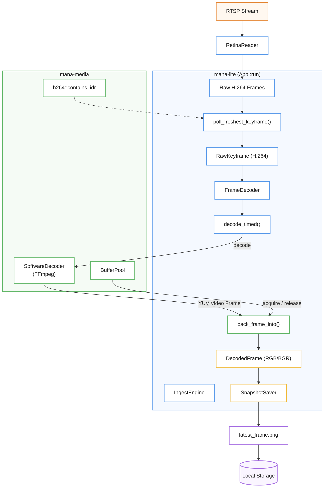
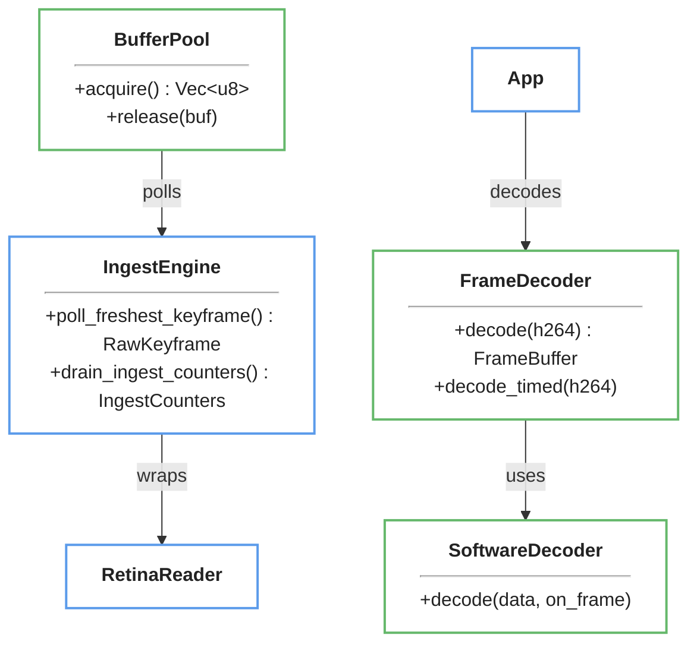

# Video Ingest and Decoding

> ⚠️ **Página generada, desactualizada.** Se generó contra el commit
> `ad24740d`. Divergencias conocidas al 2026-08-12, específicas de esta
> página:
>
> - **El super loop ya no existe.** Se describe una sola task con `tokio::select!` entre ingesta y reloj; desde el 2026-08-11/12 son tres etapas con dueños de ejecución distintos, unidas por slots que no bloquean (ADR-033, ADR-034). Los tipos `PipelineObserver`, `FanoutObserver` y `NullObserver` fueron borrados.
>
> No se corrige a mano: es un archivo **generado** y una corrección manual se
> pierde en la próxima regeneración, además de crear un segundo relato que
> compite con el primero. Lo que corresponde es regenerar contra `HEAD`.
>
> Fuentes autorizadas mientras tanto: [ARCHITECTURE.md](../../ARCHITECTURE.md)
> sobre ejecución, [HANDOFF.md](../../HANDOFF.md) y [`docs/adrs/`](../adrs/)
> sobre estado y decisiones, y [`workshop/MANUAL.md`](../../workshop/MANUAL.md)
> sobre cómo se opera y se lee la salida.

Esta documentación técnica detalla el funcionamiento de un sistema de procesamiento de video diseñado para **ingerir y decodificar flujos RTSP** en tiempo real con una eficiencia optimizada para la inteligencia artificial. El proceso se rige por una **estricta política de selección de fotogramas**, donde el componente IngestEngine descarta datos innecesarios y duplicados para procesar únicamente el **fotograma clave más reciente**, reduciendo así la carga computacional y la latencia. Para garantizar la fluidez y la resiliencia, el sistema utiliza un **lector con recuperación ante errores de red** (reconexión con backoff exponencial y ventana de errores RTP) y un decodificador de baja demora que convierte el video H.264 en mapas de bits listos para el análisis. Nótese que el **pool de memoria reutilizable** de `mana-media` es un artefacto heredado sin consumidores en el pipeline actual: los buffers de píxeles se asignan por fotograma.

Relevant source files

- 
- 
- 
- 
- 
- 
- 
- 
- 
- 

The video ingest and decoding system is responsible for consuming high-bitrate RTSP streams, selecting optimal keyframes for inference, and decoding H.264 NAL units into raw pixel buffers. All polling runs inside the single async `App::run` loop (there is no dedicated background poll thread); the `BufferPool` type exists in `mana-media` but is **not used by the runtime pipeline** — the decode path allocates a fresh buffer per keyframe and the pool has no consumers.

### Data Flow Overview

The ingest pipeline moves data from the network to the inference engine through several layers of abstraction.

1. **RetinaReader**: Manages the RTSP connection, RTP packet reassembly, and network-level error handling.
2. **IngestEngine**: Implements the frame selection policy (keyframe-only, duplicate suppression).
3. **FrameDecoder**: Performs the heavy lifting of H.264 decoding and pixel format conversion (YUV to RGB/BGR).
4. **BufferPool**: Provides reusable memory for decoded pixel data — legacy type in `mana-media` (endeli era) with no consumers in the runtime pipeline.

#### Ingest and Decoding Architecture

**Sources:** [src/ingest.rs50-60](src/ingest.rs#L50-L60) [std/mana-media/src/lib.rs108-132](std/mana-media/src/lib.rs#L108-L132) [src/snapshot.rs23-31](src/snapshot.rs#L23-L31) [src/app/mod.rs73-109](src/app/mod.rs#L73-L109)

---

### IngestEngine and Frame Selection

The `IngestEngine` wraps a `FrameReader` (typically `RetinaReader`) and implements a "freshest keyframe" policy. Because inference is computationally expensive, the engine drains all pending frames from the reader's buffer but only returns the most recent IDR keyframe found in that burst.

- **P-Frame Dropping**: All non-keyframe (P-frame) data is discarded to minimize latency [src/ingest.rs95-97](src/ingest.rs#L95-L97)
- **Duplicate Suppression**: A 64-bit `DefaultHasher` digest is calculated for each keyframe. If a keyframe's content is identical to the previous one, it is suppressed to avoid redundant inference [src/ingest.rs107-111](src/ingest.rs#L107-L111)
- **Keyframe Selection**: If multiple keyframes are present in the buffer during a single `poll_freshest_keyframe` call, only the latest one is kept; others are counted as `keyframes_dropped` [src/ingest.rs89-94](src/ingest.rs#L89-L94)

#### Cancellation Safety

`poll_freshest_keyframe` is polled inside the `tokio::select!` of the main loop, racing against `scan_interval.tick()` [src/app/mod.rs75](src/app/mod.rs#L75-L75). `select!` **drops the losing branch**, so this future must hold no state of its own: the freshest keyframe is staged on the engine (`IngestEngine::staged`) and `pframes_dropped` is accumulated per frame rather than at the end of the loop. Cancelling the drain therefore loses nothing — a keyframe already observed is emitted by the next call.

This is a load-bearing property, not a refinement. The drain loop only terminates when the reader reports exhaustion, i.e. after `poll_timeout_ms` elapses with no frame. On a live stream at ~25 fps with `poll_timeout_ms = 50`, that silence rarely arrives before the 200 ms scan tick, so the loop is cancelled on essentially every cycle — and the bias is worst right after an IDR, when the encoder's p-frame burst makes a gap least likely. While the keyframe lived in a local it was counted in `keyframes_seen` and then discarded without incrementing any drop counter. The observable signature was `0 keyframes processed (N seen)` with `dup` and `kf_dropped` both at zero, driving the FSM to `data_stale` while the transport was perfectly healthy.

Fixed by `ingest::tests::staged_keyframe_survives_cancellation`; reproduced and gated in `workshop/scenarios/01-ingest-only`.

**Sources:** [src/ingest.rs80-127](src/ingest.rs#L80-L127) [src/ingest.rs129-143](src/ingest.rs#L129-L143)

---

### RTSP Consumption via RetinaReader

`RetinaReader` handles the complexities of RTSP via the `retina` crate. It includes logic for network resilience and error monitoring.

- **Reconnect Backoff**: When the stream ends or RTP errors accumulate while polling in `next_frame`, the reader enters a reconnect loop with exponential backoff (`base_ms * 2`, capped at `backoff_max_ms`) plus jitter. An initial `connect()` failure does **not** enter this loop — it returns the error to the caller [src/ingest.rs202-238](src/ingest.rs#L202-L238) [src/ingest.rs324-328](src/ingest.rs#L324-L328)
- **RTP Error Windowing**: It uses an `ErrorWindow` (`rtp_window`) to track RTP errors. If the `record(true)` count exceeds the window threshold, the connection is declared unhealthy and `reconnect()` is triggered (also invoked on an SSRC change) [src/ingest.rs159](src/ingest.rs#L159-L159) [src/ingest.rs306-322](src/ingest.rs#L306-L322)
- **Poll Timeout**: The reader uses a `poll_timeout_ms` to prevent the `IngestEngine` from blocking indefinitely if the network stalls; a timeout increments `timeouts` and yields `None` (= nothing new to process) [src/ingest.rs161](src/ingest.rs#L161-L161) [src/ingest.rs293-297](src/ingest.rs#L293-L297)

**Sources:** [src/ingest.rs152-164](src/ingest.rs#L152-L164) [src/ingest.rs202-238](src/ingest.rs#L202-L238)

---

### Decoding and Buffer Management

Once a `RawKeyframe` is selected, it is passed to the `FrameDecoder`.

#### FrameDecoder and SoftwareDecoder

The `FrameDecoder` uses `ffmpeg-next` to decode H.264 Annex-B NAL units.

- **Low Delay**: The decoder is configured with `LOW_DELAY` and single-threading to eliminate the 1-frame latency typical of B-frame reordering in H.264 [std/mana-media/src/decoder.rs17-22](std/mana-media/src/decoder.rs#L17-L22)
- **Pixel Packing**: The FFmpeg scaler converts YUV→RGB24 (`yuv_to_rgb24` in the app's decode wrapper), then the `pack_frame_into` utility walks the planes row-by-row to produce a tightly packed RGB/BGR buffer, stripping SIMD-aligned stride padding. `pack_frame_into` itself performs no color conversion — it handles packed RGB/BGR and NV12 layouts only [src/snapshot.rs84-102](src/snapshot.rs#L84-L102) [std/mana-media/src/format.rs43-57](std/mana-media/src/format.rs#L43-L57)

#### BufferPool

`mana-media` provides a `BufferPool` (acquire/release, capped at `max_bufs`) to avoid allocating 6MB+ buffers per frame — **however, this type is dead code in the runtime pipeline**: no module outside `buffer_pool.rs` consumes it. The decode path allocates a fresh `Vec` per keyframe (`src/snapshot.rs:104-107`). The type is kept as legacy from the endeli/mana-os ingest design whose background-thread architecture no longer exists.

- **Reuse**: (legacy API) Buffers are acquired before decoding and released back to the pool after the inference cycle completes [std/mana-media/src/buffer_pool.rs74-84](std/mana-media/src/buffer_pool.rs#L74-L84)
- **Boundedness**: The pool is capped at `max_bufs`; excess releases beyond acquired slots are dropped to prevent memory leaks [std/mana-media/src/buffer_pool.rs98-115](std/mana-media/src/buffer_pool.rs#L98-L115)

**Sources:** [src/snapshot.rs23-42](src/snapshot.rs#L23-L42) [std/mana-media/src/decoder.rs31-51](std/mana-media/src/decoder.rs#L31-L51) [std/mana-media/src/buffer_pool.rs61-127](std/mana-media/src/buffer_pool.rs#L61-L127)

---

### Key Entities and Functions

|Entity|Path|Role|
|---|---|---|
|`FrameDecoder`|[src/snapshot.rs23](src/snapshot.rs#L23-L23)|High-level decoder wrapper in the app.|
|`SoftwareDecoder`|[std/mana-media/src/decoder.rs4](std/mana-media/src/decoder.rs#L4-L4)|Low-level FFmpeg codec wrapper.|
|`IngestEngine`|[src/ingest.rs50](src/ingest.rs#L50-L50)|Logic for frame dropping and deduplication.|
|`RetinaReader`|[src/ingest.rs152](src/ingest.rs#L152-L152)|RTSP client implementation.|
|`BufferPool`|[std/mana-media/src/buffer_pool.rs48](std/mana-media/src/buffer_pool.rs#L48-L48)|Legacy memory pool for raw pixels (no runtime consumers).|
|`contains_idr`|[std/mana-media/src/h264.rs1](std/mana-media/src/h264.rs#L1-L1)|Annex-B parser to identify H.264 keyframes.|
|`pack_frame_into`|[std/mana-media/src/format.rs43](std/mana-media/src/format.rs#L43-L43)|Tight row-by-row pixel copying.|

#### Code Entity Mapping

**Sources:** [src/app/mod.rs34-57](src/app/mod.rs#L34-L57) [src/ingest.rs50-60](src/ingest.rs#L50-L60) [src/snapshot.rs23-31](src/snapshot.rs#L23-L31) [std/mana-media/src/decoder.rs4-6](std/mana-media/src/decoder.rs#L4-L6)

