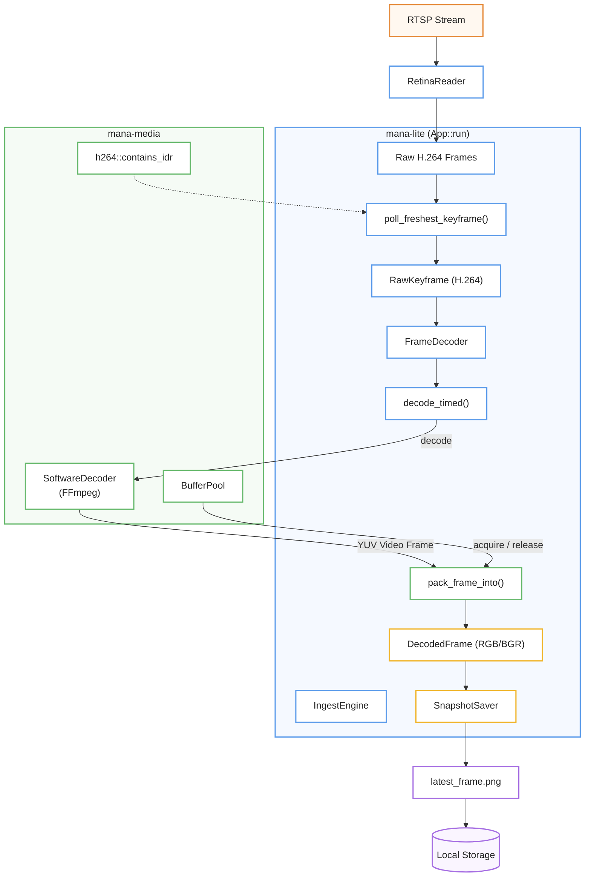
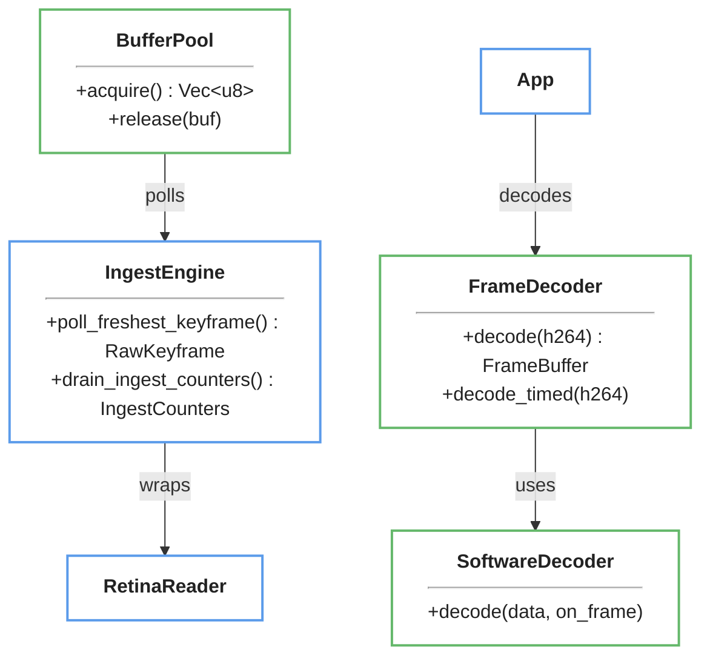

# Video Ingest and Decoding
Esta documentación técnica detalla el funcionamiento de un sistema de procesamiento de video diseñado para **ingerir y decodificar flujos RTSP** en tiempo real con una eficiencia optimizada para la inteligencia artificial. El proceso se rige por una **estricta política de selección de fotogramas**, donde el componente IngestEngine descarta datos innecesarios y duplicados para procesar únicamente el **fotograma clave más reciente**, reduciendo así la carga computacional y la latencia. Para garantizar la fluidez y la resiliencia, el sistema utiliza un **lector con recuperación ante errores de red** y un decodificador de baja demora que convierte el video H.264 en mapas de bits listos para el análisis. Finalmente, la arquitectura emplea un **pool de memoria reutilizable** que evita la creación constante de grandes buffers de datos, asegurando una gestión de recursos extremadamente ligera y veloz.

Relevant source files

- 
- 
- 
- 
- 
- 
- 
- 
- 
- 

The video ingest and decoding system is responsible for consuming high-bitrate RTSP streams, selecting optimal keyframes for inference, and decoding H.264 NAL units into raw pixel buffers. The system is designed for real-time performance, utilizing a background poll loop to drop P-frames and redundant keyframes, and a buffer pool to minimize allocation churn.

### Data Flow Overview

The ingest pipeline moves data from the network to the inference engine through several layers of abstraction.

1. **RetinaReader**: Manages the RTSP connection, RTP packet reassembly, and network-level error handling.
2. **IngestEngine**: Implements the frame selection policy (keyframe-only, duplicate suppression).
3. **FrameDecoder**: Performs the heavy lifting of H.264 decoding and pixel format conversion (YUV to RGB/BGR).
4. **BufferPool**: Provides reusable memory for decoded pixel data.

#### Ingest and Decoding Architecture

**Sources:** [ingest.rs50-60](https://github.com/kerrvisiona-sudo/endeli/blob/ad24740d/ingest.rs#L50-L60) [std/mana-media/src/lib.rs108-132](https://github.com/kerrvisiona-sudo/endeli/blob/ad24740d/std/mana-media/src/lib.rs#L108-L132) [snapshot.rs23-31](https://github.com/kerrvisiona-sudo/endeli/blob/ad24740d/snapshot.rs#L23-L31) [app/mod.rs73-109](https://github.com/kerrvisiona-sudo/endeli/blob/ad24740d/app/mod.rs#L73-L109)

---

### IngestEngine and Frame Selection

The `IngestEngine` wraps a `FrameReader` (typically `RetinaReader`) and implements a "freshest keyframe" policy. Because inference is computationally expensive, the engine drains all pending frames from the reader's buffer but only returns the most recent IDR keyframe found in that burst.

- **P-Frame Dropping**: All non-keyframe (P-frame) data is discarded to minimize latency [ingest.rs95-97](https://github.com/kerrvisiona-sudo/endeli/blob/ad24740d/ingest.rs#L95-L97)
- **Duplicate Suppression**: A 64-bit `DefaultHasher` digest is calculated for each keyframe. If a keyframe's content is identical to the previous one, it is suppressed to avoid redundant inference [ingest.rs107-111](https://github.com/kerrvisiona-sudo/endeli/blob/ad24740d/ingest.rs#L107-L111)
- **Keyframe Selection**: If multiple keyframes are present in the buffer during a single `poll_freshest_keyframe` call, only the latest one is kept; others are counted as `keyframes_dropped` [ingest.rs89-94](https://github.com/kerrvisiona-sudo/endeli/blob/ad24740d/ingest.rs#L89-L94)

**Sources:** [ingest.rs80-127](https://github.com/kerrvisiona-sudo/endeli/blob/ad24740d/ingest.rs#L80-L127) [ingest.rs146-150](https://github.com/kerrvisiona-sudo/endeli/blob/ad24740d/ingest.rs#L146-L150)

---

### RTSP Consumption via RetinaReader

`RetinaReader` handles the complexities of RTSP via the `retina` crate. It includes logic for network resilience and error monitoring.

- **Reconnect Backoff**: If the stream ends or fails to connect, the reader enters a loop with exponential backoff and jitter [ingest.rs202-216](https://github.com/kerrvisiona-sudo/endeli/blob/ad24740d/ingest.rs#L202-L216)
- **RTP Error Windowing**: It uses an `ErrorWindow` to track RTP errors. If errors exceed a threshold within a specific window size, the connection is considered unhealthy [ingest.rs194](https://github.com/kerrvisiona-sudo/endeli/blob/ad24740d/ingest.rs#L194-L194) [ingest.rs242-251](https://github.com/kerrvisiona-sudo/endeli/blob/ad24740d/ingest.rs#L242-L251)
- **Poll Timeout**: The reader uses a `poll_timeout_ms` to prevent the `IngestEngine` from blocking indefinitely if the network stalls [ingest.rs191](https://github.com/kerrvisiona-sudo/endeli/blob/ad24740d/ingest.rs#L191-L191)

**Sources:** [ingest.rs152-164](https://github.com/kerrvisiona-sudo/endeli/blob/ad24740d/ingest.rs#L152-L164) [ingest.rs202-230](https://github.com/kerrvisiona-sudo/endeli/blob/ad24740d/ingest.rs#L202-L230)

---

### Decoding and Buffer Management

Once a `RawKeyframe` is selected, it is passed to the `FrameDecoder`.

#### FrameDecoder and SoftwareDecoder

The `FrameDecoder` uses `ffmpeg-next` to decode H.264 Annex-B NAL units.

- **Low Delay**: The decoder is configured with `LOW_DELAY` and single-threading to eliminate the 1-frame latency typical of B-frame reordering in H.264 [std/mana-media/src/decoder.rs17-22](https://github.com/kerrvisiona-sudo/endeli/blob/ad24740d/std/mana-media/src/decoder.rs#L17-L22)
- **Pixel Packing**: FFmpeg decodes into YUV frames with SIMD-aligned strides. The `pack_frame_into` utility walks these planes row-by-row to produce a tightly packed RGB/BGR buffer, stripping any trailing padding [std/mana-media/src/format.rs43-57](https://github.com/kerrvisiona-sudo/endeli/blob/ad24740d/std/mana-media/src/format.rs#L43-L57)

#### BufferPool

To avoid the overhead of allocating 6MB+ (for 1080p RGB) on every frame, `mana-media` provides a `BufferPool`.

- **Reuse**: Buffers are acquired before decoding and released back to the pool after the inference cycle completes [std/mana-media/src/buffer_pool.rs23-30](https://github.com/kerrvisiona-sudo/endeli/blob/ad24740d/std/mana-media/src/buffer_pool.rs#L23-L30)
- **Boundedness**: The pool is capped at `max_bufs` (usually 2). If more buffers are released than acquired (e.g., during error handling), the excess is dropped to prevent memory leaks [std/mana-media/src/buffer_pool.rs42-47](https://github.com/kerrvisiona-sudo/endeli/blob/ad24740d/std/mana-media/src/buffer_pool.rs#L42-L47)

**Sources:** [snapshot.rs23-42](https://github.com/kerrvisiona-sudo/endeli/blob/ad24740d/snapshot.rs#L23-L42) [std/mana-media/src/decoder.rs31-51](https://github.com/kerrvisiona-sudo/endeli/blob/ad24740d/std/mana-media/src/decoder.rs#L31-L51) [std/mana-media/src/buffer_pool.rs61-127](https://github.com/kerrvisiona-sudo/endeli/blob/ad24740d/std/mana-media/src/buffer_pool.rs#L61-L127)

---

### Key Entities and Functions

|Entity|Path|Role|
|---|---|---|
|`FrameDecoder`|[snapshot.rs23](https://github.com/kerrvisiona-sudo/endeli/blob/ad24740d/snapshot.rs#L23-L23)|High-level decoder wrapper in `app`.|
|`SoftwareDecoder`|[std/mana-media/src/decoder.rs4](https://github.com/kerrvisiona-sudo/endeli/blob/ad24740d/std/mana-media/src/decoder.rs#L4-L4)|Low-level FFmpeg codec wrapper.|
|`IngestEngine`|[ingest.rs50](https://github.com/kerrvisiona-sudo/endeli/blob/ad24740d/ingest.rs#L50-L50)|Logic for frame dropping and deduplication.|
|`RetinaReader`|[ingest.rs152](https://github.com/kerrvisiona-sudo/endeli/blob/ad24740d/ingest.rs#L152-L152)|RTSP client implementation.|
|`BufferPool`|[std/mana-media/src/buffer_pool.rs48](https://github.com/kerrvisiona-sudo/endeli/blob/ad24740d/std/mana-media/src/buffer_pool.rs#L48-L48)|Memory management for raw pixels.|
|`contains_idr`|[std/mana-media/src/h264.rs1](https://github.com/kerrvisiona-sudo/endeli/blob/ad24740d/std/mana-media/src/h264.rs#L1-L1)|Annex-B parser to identify H.264 keyframes.|
|`pack_frame_into`|[std/mana-media/src/format.rs43](https://github.com/kerrvisiona-sudo/endeli/blob/ad24740d/std/mana-media/src/format.rs#L43-L43)|Tight row-by-row pixel copying.|

#### Code Entity Mapping

**Sources:** [app/mod.rs34-57](https://github.com/kerrvisiona-sudo/endeli/blob/ad24740d/app/mod.rs#L34-L57) [ingest.rs50-60](https://github.com/kerrvisiona-sudo/endeli/blob/ad24740d/ingest.rs#L50-L60) [snapshot.rs23-31](https://github.com/kerrvisiona-sudo/endeli/blob/ad24740d/snapshot.rs#L23-L31) [std/mana-media/src/decoder.rs4-6](https://github.com/kerrvisiona-sudo/endeli/blob/ad24740d/std/mana-media/src/decoder.rs#L4-L6)

