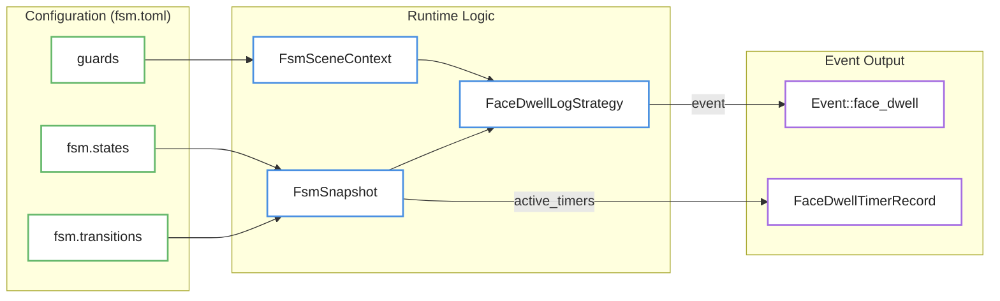
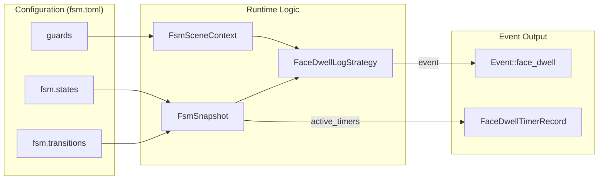

# Face Dwell FSM

Relevant source files

- 
- 
- 

The **Face Dwell FSM** is a specialized state machine configuration used within the `detect-room-face` blueprint. Its purpose is to track the lifecycle of a single person in a room by combining room cardinality (presence) with high-resolution facial detection and spatial ROI (Region of Interest) analysis. It utilizes a "face-was-inside" latch to distinguish between normal exits and transient dropouts.

## Overview and Purpose

The Face Dwell FSM operates when the room occupancy state is `single`. In this state, the pipeline triggers a dynamic crop based on the confirmed person track, which is then processed by the `face-yolo` model [config/blueprints/detect-room-face/README.md7-15](https://github.com/ernestovisiona-netizen/kik8/blob/43a92847/config/blueprints/detect-room-face/README.md?plain=1#L7-L15) The FSM evaluates the spatial relationship between the detected face and specific zones, such as a "dwell" region (e.g., a bed) or the ROI edges [config/blueprints/detect-room-face/README.md17-22](https://github.com/ernestovisiona-netizen/kik8/blob/43a92847/config/blueprints/detect-room-face/README.md?plain=1#L17-L22)

### Key Components

- **Dynamic Cropping**: A 320x320 crop centered on the upper half of the person's bounding box [config/blueprints/detect-room-face/README.md7-10](https://github.com/ernestovisiona-netizen/kik8/blob/43a92847/config/blueprints/detect-room-face/README.md?plain=1#L7-L10)
- **Fixed ROI Zones**: A fixed `face_dwell` zone (typically `[760, 0, 1160, 300]`) used for "in-bed" logic, independent of the inference crop [config/blueprints/detect-room-face/README.md19-21](https://github.com/ernestovisiona-netizen/kik8/blob/43a92847/config/blueprints/detect-room-face/README.md?plain=1#L19-L21)
- **Latch Mechanism**: The `face_was_inside` flag tracks if a face has ever been confirmed in a "stable" state (`detected` or `in_bed`) during the current session [config/blueprints/detect-room-face/README.md38-40](https://github.com/ernestovisiona-netizen/kik8/blob/43a92847/config/blueprints/detect-room-face/README.md?plain=1#L38-L40)

## State Definitions

The FSM transitions through the following states as defined in the `fsm.toml` configuration:

|State|Label|Description|
|---|---|---|
|`idle`|Face idle|No active person session or multiple people present [config/blueprints/detect-room-face/fsm.toml7-9](https://github.com/ernestovisiona-netizen/kik8/blob/43a92847/config/blueprints/detect-room-face/fsm.toml#L7-L9)|
|`searching`|Buscando cara|Single person confirmed, but face not yet detected or localized [config/blueprints/detect-room-face/fsm.toml11-13](https://github.com/ernestovisiona-netizen/kik8/blob/43a92847/config/blueprints/detect-room-face/fsm.toml#L11-L13)|
|`detected`|Cara detectada|Face confirmed outside the dwell ROI and away from the edges [config/blueprints/detect-room-face/fsm.toml15-17](https://github.com/ernestovisiona-netizen/kik8/blob/43a92847/config/blueprints/detect-room-face/fsm.toml#L15-L17)|
|`in_bed`|Persona en cama|Face detected within the `face_dwell` ROI [config/blueprints/detect-room-face/fsm.toml23-25](https://github.com/ernestovisiona-netizen/kik8/blob/43a92847/config/blueprints/detect-room-face/fsm.toml#L23-L25)|
|`edge`|Persona en el borde|Face detected near the boundary of the parent detection ROI [config/blueprints/detect-room-face/fsm.toml27-29](https://github.com/ernestovisiona-netizen/kik8/blob/43a92847/config/blueprints/detect-room-face/fsm.toml#L27-L29)|
|`other`|Persona presente sin cara visible|Person present but face absent for longer than the search timeout [config/blueprints/detect-room-face/fsm.toml19-21](https://github.com/ernestovisiona-netizen/kik8/blob/43a92847/config/blueprints/detect-room-face/fsm.toml#L19-L21)|
|`exiting`|Saliendo|Person absent after having previously been "inside" (latched) [config/blueprints/detect-room-face/fsm.toml31-33](https://github.com/ernestovisiona-netizen/kik8/blob/43a92847/config/blueprints/detect-room-face/fsm.toml#L31-L33)|

Sources: [config/blueprints/detect-room-face/fsm.toml7-34](https://github.com/ernestovisiona-netizen/kik8/blob/43a92847/config/blueprints/detect-room-face/fsm.toml#L7-L34) [config/blueprints/detect-room-face/README.md29-37](https://github.com/ernestovisiona-netizen/kik8/blob/43a92847/config/blueprints/detect-room-face/README.md?plain=1#L29-L37)

## Transition Logic and Latching

The FSM relies on specific `guards` to move between states. A critical feature is the **Exit Recovery** logic: if a person disappears, the FSM moves to `exiting` only if `face_was_inside` is true [config/blueprints/detect-room-face/fsm.toml127-133](https://github.com/ernestovisiona-netizen/kik8/blob/43a92847/config/blueprints/detect-room-face/fsm.toml#L127-L133) If they return before the exit dwell timer expires, they can resume their previous state [config/blueprints/detect-room-face/fsm.toml300-305](https://github.com/ernestovisiona-netizen/kik8/blob/43a92847/config/blueprints/detect-room-face/fsm.toml#L300-L305)

### FSM State Transition Diagram

This diagram maps the natural language states to the logic defined in `fsm.toml`.

Sources: [config/blueprints/detect-room-face/fsm.toml37-305](https://github.com/ernestovisiona-netizen/kik8/blob/43a92847/config/blueprints/detect-room-face/fsm.toml#L37-L305)

## Data Flow and Logging

The `FaceDwellLogStrategy` in `src/face_dwell.rs` acts as a bridge between the `FsmEngine` and the observability layer. It captures the `FsmSnapshot` and `FsmSceneContext` to produce detailed `Event::face_dwell` logs [src/face_dwell.rs6-65](https://github.com/ernestovisiona-netizen/kik8/blob/43a92847/src/face_dwell.rs#L6-L65)

### Code Entity Association Diagram

This diagram associates the logical FSM concepts with the specific Rust structs and configuration fields.

Sources: [src/face_dwell.rs1-67](https://github.com/ernestovisiona-netizen/kik8/blob/43a92847/src/face_dwell.rs#L1-L67) [config/blueprints/detect-room-face/fsm.toml1-34](https://github.com/ernestovisiona-netizen/kik8/blob/43a92847/config/blueprints/detect-room-face/fsm.toml#L1-L34)

## Implementation Details

### Face Dwell Logging

The `FaceDwellLogStrategy` implements two primary methods for recording state:

1. `log_keyframe`: Called when the FSM processes a standard frame [src/face_dwell.rs10-18](https://github.com/ernestovisiona-netizen/kik8/blob/43a92847/src/face_dwell.rs#L10-L18)
2. `log_wildcard`: Called when a wildcard transition (e.g., an immediate jump to `idle` due to multiple occupancy) occurs [src/face_dwell.rs20-28](https://github.com/ernestovisiona-netizen/kik8/blob/43a92847/src/face_dwell.rs#L20-L28)

The resulting log entry includes:

- **Contextual Data**: `face_confidence`, `face_in_dwell`, `at_edge`, and `face_model_ran` [src/face_dwell.rs58-62](https://github.com/ernestovisiona-netizen/kik8/blob/43a92847/src/face_dwell.rs#L58-L62)
- **State Data**: `state_label`, `state_dwell_ms`, and the `face_was_inside` latch status [src/face_dwell.rs51-61](https://github.com/ernestovisiona-netizen/kik8/blob/43a92847/src/face_dwell.rs#L51-L61)
- **Timer Evidence**: A list of `FaceDwellTimerRecord` objects showing the progress of all candidate transitions [src/face_dwell.rs38-46](https://github.com/ernestovisiona-netizen/kik8/blob/43a92847/src/face_dwell.rs#L38-L46)

### Configuration Format

The `fsm.toml` file defines the behavior using a standard structure:

- **`[fsm]`**: Sets the `initial` state [config/blueprints/detect-room-face/fsm.toml4-5](https://github.com/ernestovisiona-netizen/kik8/blob/43a92847/config/blueprints/detect-room-face/fsm.toml#L4-L5)
- **`[[fsm.transitions]]`**: Defines the source (`from`), destination (`to`), required `dwell` duration, and the list of `guards` that must all evaluate to true [config/blueprints/detect-room-face/fsm.toml75-84](https://github.com/ernestovisiona-netizen/kik8/blob/43a92847/config/blueprints/detect-room-face/fsm.toml#L75-L84)

Sources: [src/face_dwell.rs30-65](https://github.com/ernestovisiona-netizen/kik8/blob/43a92847/src/face_dwell.rs#L30-L65) [config/blueprints/detect-room-face/fsm.toml1-84](https://github.com/ernestovisiona-netizen/kik8/blob/43a92847/config/blueprints/detect-room-face/fsm.toml#L1-L84)
