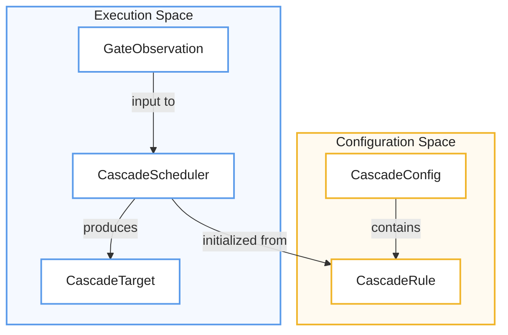
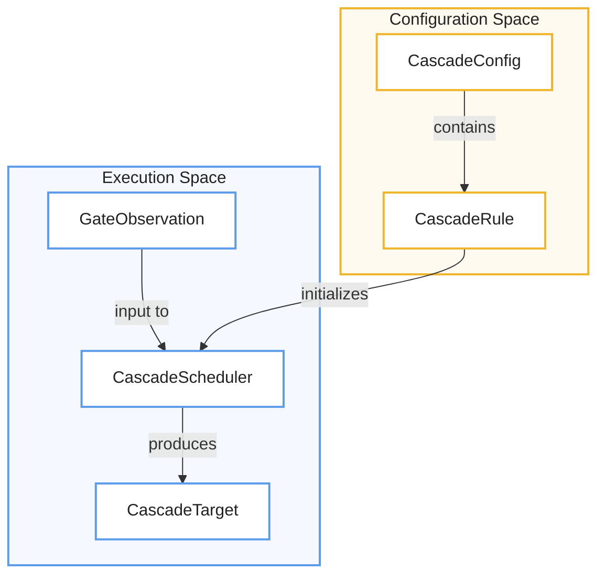
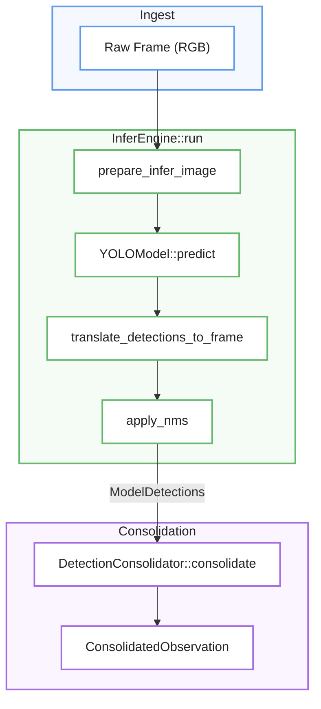

# Model Execution and Cascade Scheduling

> ⚠️ **Página generada, desactualizada.** Se generó contra el commit
> `ad24740d`. Divergencias conocidas al 2026-08-12, específicas de esta
> página:
>
> - **La compuerta de la cascada se borró del código.** Había una condición hardcodeada en `src/app/inference.rs` (`presence_track_count != 1`) que decidía si corría un modelo hijo. Duplicaba `requires_exact_count = 1` del blueprint contra otra fuente de datos y sin estar declarada en ningún catálogo. Desde el 2026-08-12 la condición vive **sólo** en las reglas del blueprint y la resuelve `cascade.rs`.
>
> - **Cambiaron los defaults de observabilidad y hay un contador nuevo.** `fsm_events` y `zone_events` pasaron a `true` en `config/metrics.toml` (son transiciones: 2,1 y 4,6 MB/día); `face_dwell_events` sigue en `false` por costo (175 MB/día). Se agregó `infer_gated` → `apagados:N` en la línea `infer:` y `apagado:N` en la línea por modelo, para distinguir "el estado del FSM no pidió este modelo" de "la regla lo salteó". La línea por modelo pasó de `skip` a `skip:N`.
>
> No se corrige a mano: es un archivo **generado** y una corrección manual se
> pierde en la próxima regeneración, además de crear un segundo relato que
> compite con el primero. Lo que corresponde es regenerar contra `HEAD`.
>
> Fuentes autorizadas mientras tanto: [ARCHITECTURE.md](../../ARCHITECTURE.md)
> sobre ejecución, [HANDOFF.md](../../HANDOFF.md) y [`docs/adrs/`](../adrs/)
> sobre estado y decisiones, y [`workshop/MANUAL.md`](../../workshop/MANUAL.md)
> sobre cómo se opera y se lee la salida.

Este documento técnico detalla el funcionamiento de **mana-lite**, un sistema avanzado de inferencia que organiza la ejecución de modelos de IA mediante una **estructura de cascada**. El proceso es coordinado por el **InferEngine**, el cual gestiona todo el ciclo de vida de los modelos, desde la validación de tareas hasta el **procesamiento de imágenes** mediante recortes estáticos o dinámicos para mejorar la precisión. Un componente esencial es el **Cascade Scheduler**, encargado de activar modelos "hijos" de forma condicional basándose en los hallazgos de los modelos principales, permitiendo análisis profundos solo cuando se detectan entidades específicas. Finalmente, el sistema emplea una **consolidación de detecciones** y filtros de post-procesamiento para fusionar resultados, eliminar duplicados y garantizar una observación final coherente y de alta calidad.

Relevant source files

- 
- 
- 
- 
- 
- 
- 
- 
- 
- 

The inference pipeline in `mana-lite` is a multi-stage process that manages the lifecycle of YOLO models, schedules their execution based on parent-child dependencies (cascades), and processes raw outputs into consolidated detections. The system supports both static ROI (Region of Interest) filtering and dynamic cropping for high-resolution analysis of specific entities.

## InferEngine Lifecycle

The `InferEngine` is the central coordinator for model execution. It abstracts the underlying inference backend — exclusively `ultralytics-inference` (a local path dependency wrapping the `ort` runtime / onnxruntime; no batching, single-image `predict_image`) — and manages the pre-processing, prediction, and post-processing stages.

### Initialization

The engine is initialized via `InferEngine::from_catalog`, which iterates through the `ModelCatalog` to load enabled models [src/infer/mod.rs62-78](src/infer/mod.rs#L62-L78)

- **Model Loading**: Each model is loaded using `YOLOModel::load_with_config` [src/infer/mod.rs182](src/infer/mod.rs#L182-L182)
- **Task Validation**: The engine verifies that the task defined in the catalog (e.g., `Detect`, `Segment`, `Pose`, `Depth`) matches the actual task reported by the ONNX model [src/infer/mod.rs194-200](src/infer/mod.rs#L194-L200)
- **Static ROI**: If a model has a `CropType::Static` configuration, a `CropRect` is pre-calculated and applied to every inference call [src/infer/mod.rs166-179](src/infer/mod.rs#L166-L179)

### Execution Flow (`run`)

The `run` method executes a single inference cycle for a specific model [src/infer/mod.rs84-140](src/infer/mod.rs#L84-L140):

1. **Preparation**: `prepare_infer_image` handles image cropping and coordinate offset calculation [src/infer/mod.rs96-97](src/infer/mod.rs#L96-L97)
2. **Prediction**: The model performs inference, returning raw `ultralytics_inference::Results` [src/infer/mod.rs98](src/infer/mod.rs#L98-L98)
3. **Depth Extraction**: If the model produces depth maps, they are extracted immediately to avoid unnecessary copies [src/infer/mod.rs108](src/infer/mod.rs#L108-L108)
4. **Detection Collection**: Raw boxes, masks, and keypoints are parsed into `Detection` structs [src/infer/mod.rs109-114](src/infer/mod.rs#L109-L114)
5. **Coordinate Translation**: Detections are translated from the crop/ROI space back to the original frame coordinate system [src/infer/mod.rs115](src/infer/mod.rs#L115-L115)
6. **Filtering & NMS**: Detections undergo static ROI filtering, `PostprocessConfig` filtering (confidence, area, class), and Non-Maximum Suppression (NMS) [src/infer/mod.rs116-128](src/infer/mod.rs#L116-L128)

**Sources:** [src/infer/mod.rs47-145](src/infer/mod.rs#L47-L145) [src/infer/run_helpers.rs130-205](src/infer/run_helpers.rs#L130-L205)

## Cascade Scheduling

`mana-lite` uses a cascade system to trigger "child" models based on the output of "root" models. This is commonly used to run a specialized face detector only when a person is detected in the room.

### Scheduling Logic

The `App::run_inference` loop orchestrates the cascade [src/app/inference.rs35-69](src/app/inference.rs#L35-L69):

1. **Root Models**: Models with no `requires` parent are executed first [src/app/inference.rs72-91](src/app/inference.rs#L72-L91)
2. **Child Models**: Models that depend on a parent are executed only if the parent produced a valid target (**and** exactly one track of the presence class currently exists — the presence-count gate at `src/app/inference.rs:107` skips all children otherwise) [src/app/inference.rs94-118](src/app/inference.rs#L94-L118)
3. **Target Resolution**: The `CascadeScheduler` determines the `CropRect` for the child model by looking at parent detections in the current frame or the tracker's current **confirmed** tracks from the last scan cycle (filtered to `is_confirmed && misses == 0`) [src/app/inference.rs130-159](src/app/inference.rs#L130-L159)

### The Cascade Scheduler Entity Map

The following diagram bridges the configuration concepts to the implementation classes.

**Cascade Entity Relationship**

**Sources:** [core/mana-perception/src/cascade.rs20-51](core/mana-perception/src/cascade.rs#L20-L51) [core/mana-perception/src/cascade.rs188-192](core/mana-perception/src/cascade.rs#L188-L192) [src/app/inference.rs130-159](src/app/inference.rs#L130-L159)

## Static vs. Dynamic Cropping

The system employs different cropping strategies to optimize for both performance and accuracy.

|Strategy|Implementation|Use Case|
|---|---|---|
|**Static ROI**|`CropRect` + `apply_static_roi_filter`|Restricting inference to a fixed region (e.g., a doorway) to reduce false positives.|
|**Dynamic Crop**|`extract_crop_frame`|Extracting a sub-region of the frame for high-resolution child inference.|
|**Class ROI**|`compute_largest_class_roi`|Test-only helper that crops around the largest instance of a class. Production "largest-class" targeting is handled inside the `CascadeScheduler` (max-area parent detection / max-area track).|
|**Upper Square**|`compute_upper_square_roi`|Centering a square crop on the upper body/head of a person for face detection.|

### ROI Computation Functions

- **`compute_largest_class_roi`**: Finds the largest detection of a target class and applies a margin [src/infer/crop.rs46-85](src/infer/crop.rs#L46-L85)
- **`compute_upper_square_roi`**: Specifically designed for face cascades. It calculates a square region based on a fraction of the parent bounding box's height to ensure the face is captured even if the person is moving [src/infer/crop.rs136-174](src/infer/crop.rs#L136-L174)
- **`extract_crop_frame`**: Performs the actual pixel-level crop from the RGB buffer [src/infer/crop.rs6-44](src/infer/crop.rs#L6-L44)

**Sources:** [src/infer/crop.rs1-174](src/infer/crop.rs#L1-L174) [core/mana-perception/src/detection.rs11-31](core/mana-perception/src/detection.rs#L11-L31)

## Detection Consolidation and NMS

After all models in the cascade have run, the `DetectionConsolidator` fuses the outputs.

### Consolidation Workflow

1. **Same-Class Merge**: Detections of the same class from different models are merged if their IoU exceeds `same_class_iou` [core/mana-perception/src/detection.rs141-176](core/mana-perception/src/detection.rs#L141-L176)
2. **Component Attachment**: Specialized logic attaches "face" detections to "person" detections based on `face_component_coverage` and vertical positioning (`face_max_center_y_ratio`) [core/mana-perception/src/detection.rs178-199](core/mana-perception/src/detection.rs#L178-L199)
3. **Evidence Tracking**: The final `ConsolidatedObservation` retains a list of `DetectionEvidence` from every model that contributed to it [core/mana-perception/src/detection.rs90-97](core/mana-perception/src/detection.rs#L90-L97)

### Post-Process Filtering

The `PostprocessConfig` (defined in `models.toml`) is applied to filter out low-quality detections before they reach the consolidator:

- **`apply_nms`**: Standard Non-Maximum Suppression — class-aware greedy NMS, sorted by confidence, suppressing boxes whose IoU with a kept box exceeds the model's configured `nms_iou` [src/infer/run_helpers.rs354-391](src/infer/run_helpers.rs#L354-L391)
- **`apply_postprocess_filter`**: Filters by `min_confidence`, `min_area_ratio`, and `max_area_ratio`, plus class rules (`ignore_classes`; see `PostprocessConfig::rejection_reason`), and invokes `apply_nms` when configured [src/infer/run_helpers.rs81-128](src/infer/run_helpers.rs#L81-L128)

**Model Execution Data Flow** 🔵 Ingest → 🟢 Inference → 🟣 Consolidation

**Sources:** [core/mana-perception/src/detection.rs113-200](core/mana-perception/src/detection.rs#L113-L200) [src/infer/run_helpers.rs19-128](src/infer/run_helpers.rs#L19-L128) [src/app/inference.rs162-182](src/app/inference.rs#L162-L182)

