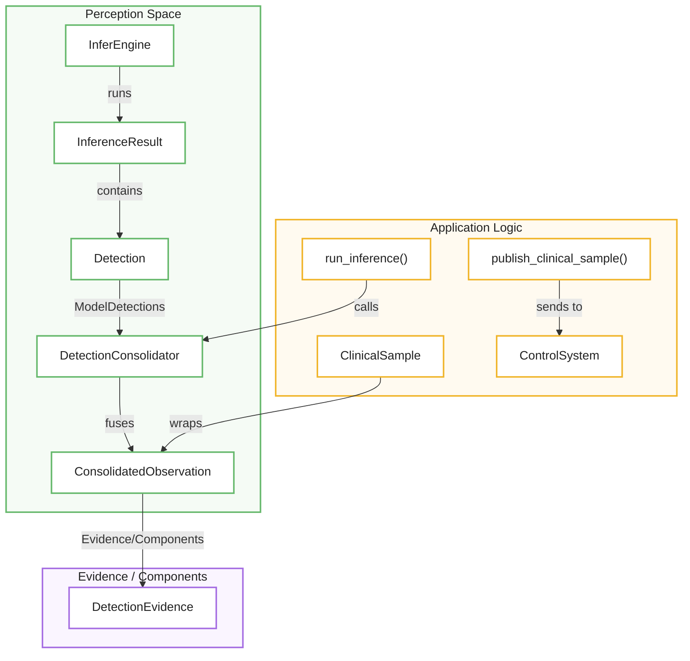
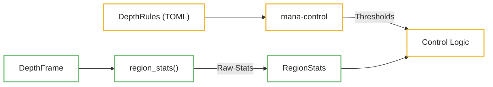

# Detection Consolidation and Perception Output
Este documento técnico detalla la etapa de **Consolidación de Detecciones**, un proceso crítico que unifica los resultados de diversos modelos de inteligencia artificial en una observación coherente antes de enviarla al sistema de control. El flujo de trabajo utiliza un motor lógico para **fusionar detecciones de la misma clase** basadas en su solapamiento espacial y para **vincular subcomponentes**, como rostros, a sus entidades principales basándose en reglas de cobertura y posición vertical. Además de la visión, el sistema integra **estadísticas de profundidad por región** para calcular métricas precisas sobre el entorno físico mediante el análisis de píxeles válidos y percentiles de distancia. Finalmente, toda esta información se empaqueta en una estructura denominada **ClinicalSample**, la cual actúa como el puente informativo final que garantiza que los datos procesados sean útiles para la toma de decisiones del software.

Relevant source files

- 
- 
- 
- 
- 
- 
- 

The **Detection Consolidation** stage is the final phase of the inference pipeline before data is handed off to the control system. Its primary purpose is to fuse outputs from multiple models (e.g., a general room model and a specialized face model) into a single, coherent set of observations. This process handles overlapping detections of the same class and attaches sub-components, such as faces, to their parent entities (persons).

## Perception Data Flow

The following diagram illustrates how raw model outputs are transformed into consolidated observations and eventually projected into clinical samples for the control system.

### Perception to Control Bridge
**🟢 Perception**  
`InferEngine → InferenceResult → Detection → DetectionConsolidator → ConsolidatedObservation`

**🟡 Application Logic**  
`run_inference()` y `publish_clinical_sample()` coordinan el flujo de aplicación.

**🟣 Evidence / Components**  
`ConsolidatedObservation → DetectionEvidence`.

**Sources:** [core/mana-perception/src/detection.rs88-97](https://github.com/kerrvisiona-sudo/endeli/blob/ad24740d/core/mana-perception/src/detection.rs#L88-L97) [app/inference.rs17-24](https://github.com/kerrvisiona-sudo/endeli/blob/ad24740d/app/inference.rs#L17-L24) [app/inference.rs162-182](https://github.com/kerrvisiona-sudo/endeli/blob/ad24740d/app/inference.rs#L162-L182)

## DetectionConsolidator Implementation

The `DetectionConsolidator` is a stateless engine that processes `ModelDetections` in a single cycle [core/mana-perception/src/detection.rs113-117](https://github.com/kerrvisiona-sudo/endeli/blob/ad24740d/core/mana-perception/src/detection.rs#L113-L117) It performs two main types of fusion:

### 1. Same-Class IoU Merging

If multiple models detect the same object (e.g., two different models both detect a "person"), the consolidator merges them into a single `ConsolidatedObservation` if their bounding box Intersection over Union (IoU) exceeds the `same_class_iou` threshold [core/mana-perception/src/detection.rs141-164](https://github.com/kerrvisiona-sudo/endeli/blob/ad24740d/core/mana-perception/src/detection.rs#L141-L164)

- **Primary Model Priority:** If a detection comes from the `primary_model` (defined in the deployment profile), its bounding box coordinates take precedence [core/mana-perception/src/detection.rs167-172](https://github.com/kerrvisiona-sudo/endeli/blob/ad24740d/core/mana-perception/src/detection.rs#L167-L172)
- **Confidence:** The resulting observation takes the maximum confidence score among all merged detections [core/mana-perception/src/detection.rs173](https://github.com/kerrvisiona-sudo/endeli/blob/ad24740d/core/mana-perception/src/detection.rs#L173-L173)

### 2. Face-to-Person Attachment

The system treats faces as components of a person rather than independent entities. A `face` detection is attached to a `person` observation if it satisfies three spatial constraints:

1. **Coverage:** The face box must be largely contained within the person box, exceeding `face_component_coverage` [core/mana-perception/src/detection.rs182-185](https://github.com/kerrvisiona-sudo/endeli/blob/ad24740d/core/mana-perception/src/detection.rs#L182-L185)
2. **Vertical Position:** The face must be in the upper portion of the person's body, governed by `face_max_center_y_ratio` [core/mana-perception/src/detection.rs186-190](https://github.com/kerrvisiona-sudo/endeli/blob/ad24740d/core/mana-perception/src/detection.rs#L186-L190)
3. **Suppression:** Once a face is attached as a component, it is not emitted as a standalone observation [core/mana-perception/src/detection.rs201-203](https://github.com/kerrvisiona-sudo/endeli/blob/ad24740d/core/mana-perception/src/detection.rs#L201-L203)

**Sources:** [core/mana-perception/src/detection.rs132-208](https://github.com/kerrvisiona-sudo/endeli/blob/ad24740d/core/mana-perception/src/detection.rs#L132-L208)

## Data Structures

### ConsolidatedObservation

This structure represents a fused entity. It maintains a list of `DetectionEvidence` (the original raw detections that contributed to this fusion) and `components` (sub-entities like faces).

|Field|Type|Description|
|---|---|---|
|`class`|`String`|The resolved class name (e.g., "person").|
|`confidence`|`f32`|The highest confidence score from all evidence.|
|`bbox`|`[f32; 4]`|The bounding box in global frame coordinates.|
|`primary_model`|`String`|The ID of the model providing the primary geometry.|
|`evidence`|`Vec<DetectionEvidence>`|List of all detections merged into this entity.|
|`components`|`Vec<DetectionEvidence>`|List of sub-components (e.g., faces) attached.|

**Sources:** [core/mana-perception/src/detection.rs89-97](https://github.com/kerrvisiona-sudo/endeli/blob/ad24740d/core/mana-perception/src/detection.rs#L89-L97)

### ClinicalSample

The `ClinicalSample` is the bridge to the control system. It contains the consolidated observations and metadata about the inference cycle's health.

- **`signal_valid`**: Indicates if the primary root model ran successfully [app/inference.rs83-90](https://github.com/kerrvisiona-sudo/endeli/blob/ad24740d/app/inference.rs#L83-L90)
- **`raw_person_count`**: A pre-calculated count of persons used for rapid occupancy checks [app/inference.rs58](https://github.com/kerrvisiona-sudo/endeli/blob/ad24740d/app/inference.rs#L58-L58)
- **`face_model_ran`**: Boolean flag indicating if a specialized face model was executed in this cycle [app/inference.rs48-50](https://github.com/kerrvisiona-sudo/endeli/blob/ad24740d/app/inference.rs#L48-L50)

**Sources:** [app/inference.rs17-24](https://github.com/kerrvisiona-sudo/endeli/blob/ad24740d/app/inference.rs#L17-L24)

## Depth Sensing and Region Statistics

While detections are consolidated, depth data is processed through `region_stats`. This function computes statistics for specific rectangular regions of the `DepthFrame`.

### Depth Processing Logic

The `region_stats` function calculates:

- **Valid Pixels:** Count of pixels with finite, non-zero depth values [core/mana-perception/src/lib.rs50-57](https://github.com/kerrvisiona-sudo/endeli/blob/ad24740d/core/mana-perception/src/lib.rs#L50-L57)
- **Percentiles:** `min`, `max`, `median`, `p10`, and `p90` depth in meters [core/mana-perception/src/lib.rs81-86](https://github.com/kerrvisiona-sudo/endeli/blob/ad24740d/core/mana-perception/src/lib.rs#L81-L86)
- **Valid Ratio:** The percentage of the requested region that contains valid depth data [core/mana-perception/src/lib.rs80](https://github.com/kerrvisiona-sudo/endeli/blob/ad24740d/core/mana-perception/src/lib.rs#L80-L80)

**DepthFrame → region_stats() → RegionStats → Control Logic**
DepthRules (TOML) → mana-control → Thresholds → Control Logic

**Sources:** [core/mana-perception/src/lib.rs16-27](https://github.com/kerrvisiona-sudo/endeli/blob/ad24740d/core/mana-perception/src/lib.rs#L16-L27) [core/mana-perception/src/lib.rs33-87](https://github.com/kerrvisiona-sudo/endeli/blob/ad24740d/core/mana-perception/src/lib.rs#L33-L87)

## Summary of Key Functions

|Function|File|Purpose|
|---|---|---|
|`consolidate`|`detection.rs`|Fuses multi-model detections using IoU and component rules.|
|`region_stats`|`lib.rs`|Computes depth metrics (median, p10, etc.) for a spatial ROI.|
|`run_inference`|`inference.rs`|Orchestrates the sequence: resolve → run → consolidate → publish.|
|`publish_clinical_sample`|`inference.rs`|Transfers perception results to the `mana-control` input port.|

**Sources:** [core/mana-perception/src/detection.rs132](https://github.com/kerrvisiona-sudo/endeli/blob/ad24740d/core/mana-perception/src/detection.rs#L132-L132) [core/mana-perception/src/lib.rs33](https://github.com/kerrvisiona-sudo/endeli/blob/ad24740d/core/mana-perception/src/lib.rs#L33-L33) [app/inference.rs35](https://github.com/kerrvisiona-sudo/endeli/blob/ad24740d/app/inference.rs#L35-L35) [app/inference.rs59](https://github.com/kerrvisiona-sudo/endeli/blob/ad24740d/app/inference.rs#L59-L59)

### On this page

- [Detection Consolidation and Perception Output](https://deepwiki.com/kerrvisiona-sudo/endeli/3.3-detection-consolidation-and-perception-output#detection-consolidation-and-perception-output)
- [Perception Data Flow](https://deepwiki.com/kerrvisiona-sudo/endeli/3.3-detection-consolidation-and-perception-output#perception-data-flow)
- [Perception to Control Bridge](https://deepwiki.com/kerrvisiona-sudo/endeli/3.3-detection-consolidation-and-perception-output#perception-to-control-bridge)
- [DetectionConsolidator Implementation](https://deepwiki.com/kerrvisiona-sudo/endeli/3.3-detection-consolidation-and-perception-output#detectionconsolidator-implementation)
- [1. Same-Class IoU Merging](https://deepwiki.com/kerrvisiona-sudo/endeli/3.3-detection-consolidation-and-perception-output#1-same-class-iou-merging)
- [2. Face-to-Person Attachment](https://deepwiki.com/kerrvisiona-sudo/endeli/3.3-detection-consolidation-and-perception-output#2-face-to-person-attachment)
- [Data Structures](https://deepwiki.com/kerrvisiona-sudo/endeli/3.3-detection-consolidation-and-perception-output#data-structures)
- [ConsolidatedObservation](https://deepwiki.com/kerrvisiona-sudo/endeli/3.3-detection-consolidation-and-perception-output#consolidatedobservation)
- [ClinicalSample](https://deepwiki.com/kerrvisiona-sudo/endeli/3.3-detection-consolidation-and-perception-output#clinicalsample)
- [Depth Sensing and Region Statistics](https://deepwiki.com/kerrvisiona-sudo/endeli/3.3-detection-consolidation-and-perception-output#depth-sensing-and-region-statistics)
- [Depth Processing Logic](https://deepwiki.com/kerrvisiona-sudo/endeli/3.3-detection-consolidation-and-perception-output#depth-processing-logic)
- [Summary of Key Functions](https://deepwiki.com/kerrvisiona-sudo/endeli/3.3-detection-consolidation-and-perception-output#summary-of-key-functions)
