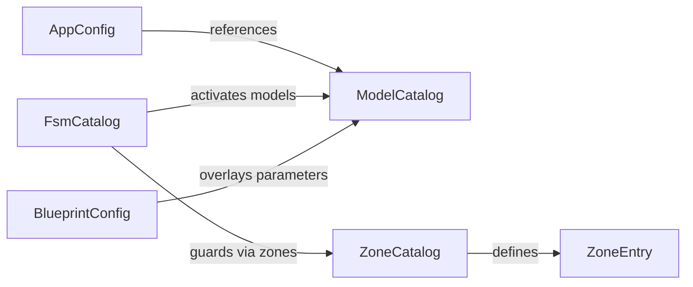

# Configuration System

Relevant source files

- 
- 
- 
- 
- 

The `mana-lite` configuration system is designed for high-performance computer vision pipelines, employing a layered architecture that separates core application settings, model definitions, and scene-specific logic. It utilizes TOML for file-based configuration, environment variables for deployment overrides, and a robust validation layer to ensure consistency across models, zones, and state machines.

### Configuration Architecture Overview

The system resolves configuration through several layers, starting from the base `mana.toml` and extending into specialized catalogs.

1. **Application Configuration**: Defined in `mana.toml`, mapped to the `AppConfig` struct [src/config/app.rs5-29](https://github.com/ernestovisiona-netizen/kik8/blob/43a92847/src/config/app.rs#L5-L29) This covers RTSP sources, health thresholds, and pipeline toggles.
2. **Model Catalog**: Defined in `models.toml`, mapped to `ModelCatalog` [src/config/models.rs28-30](https://github.com/ernestovisiona-netizen/kik8/blob/43a92847/src/config/models.rs#L28-L30) It centralizes all available YOLO models and their inference parameters.
3. **Blueprints**: A composition layer that selects specific models and defines "cascades" (e.g., only run Model B if Model A detects a person).
4. **Scene Logic**: `zones.toml` and `fsm.toml` define spatial regions and the Finite State Machine logic used for behavioral analysis.

**Configuration Data Flow**

Sources: [src/config/loader.rs28-40](https://github.com/ernestovisiona-netizen/kik8/blob/43a92847/src/config/loader.rs#L28-L40) [src/config/env.rs45-68](https://github.com/ernestovisiona-netizen/kik8/blob/43a92847/src/config/env.rs#L45-L68) [src/config/model_loader.rs27](https://github.com/ernestovisiona-netizen/kik8/blob/43a92847/src/config/model_loader.rs#L27-L27)

---

### Layered Overrides and Validation

The system allows for dynamic overrides via environment variables (prefixed with `MANA_`) and model overlays defined within blueprints.

- **Environment Overrides**: The `apply_env_overrides` function [src/config/env.rs45-68](https://github.com/ernestovisiona-netizen/kik8/blob/43a92847/src/config/env.rs#L45-L68) allows runtime modification of sensitive data (like `MANA_SOURCE_PASSWORD`) or deployment-specific paths without changing TOML files.
- **Validation**: Before the pipeline starts, the `validation` module checks for cross-reference integrity. For example, `validate_fsm` ensures that any `FsmGuard` referencing a zone actually exists in the `ZoneCatalog` [src/config/validation.rs6-90](https://github.com/ernestovisiona-netizen/kik8/blob/43a92847/src/config/validation.rs#L6-L90)

**System Integrity Relationships**

Sources: [src/config/validation.rs30-39](https://github.com/ernestovisiona-netizen/kik8/blob/43a92847/src/config/validation.rs#L30-L39) [src/config/validation.rs41-55](https://github.com/ernestovisiona-netizen/kik8/blob/43a92847/src/config/validation.rs#L41-L55) [src/config/model_loader.rs66-93](https://github.com/ernestovisiona-netizen/kik8/blob/43a92847/src/config/model_loader.rs#L66-L93)

---

### Core Configuration Components

#### [Model Catalog](https://deepwiki.com/ernestovisiona-netizen/kik8/4.1-model-catalog)

The Model Catalog defines the technical parameters for inference. Each `ModelEntry` includes the model path, target `imgsz`, confidence thresholds, and `PostprocessConfig` (NMS, area filters). It also supports `CropConfig` for dynamic ROI cropping (e.g., cropping a person's head for a secondary face detection model).

- **For details, see [Model Catalog](https://deepwiki.com/ernestovisiona-netizen/kik8/4.1-model-catalog)**.

#### [Blueprints](https://deepwiki.com/ernestovisiona-netizen/kik8/4.2-blueprints)

Blueprints orchestrate how models interact. A `BlueprintConfig` [src/config/blueprint.rs19-21](https://github.com/ernestovisiona-netizen/kik8/blob/43a92847/src/config/blueprint.rs#L19-L21) defines the active model set and the `CascadeRule` logic. Cascades allow the system to skip expensive inference tasks unless specific triggers (like a `SemanticRegion` detection) are met.

- **For details, see [Blueprints](https://deepwiki.com/ernestovisiona-netizen/kik8/4.2-blueprints)**.

#### [Zones and Spatial Regions](https://deepwiki.com/ernestovisiona-netizen/kik8/4.3-zones-and-spatial-regions)

Spatial awareness is configured via `zones.toml`. The `ZoneCatalog` [src/config/zones.rs37](https://github.com/ernestovisiona-netizen/kik8/blob/43a92847/src/config/zones.rs#L37-L37) defines named rectangular areas (e.g., "bed", "door") and their `hysteresis_ms` settings. These zones are used by the `ZoneEngine` to provide occupancy signals to the FSM.

- **For details, see [Zones and Spatial Regions](https://deepwiki.com/ernestovisiona-netizen/kik8/4.3-zones-and-spatial-regions)**.

---

### Summary Table: Primary Config Files

|File|Code Struct|Responsibility|
|---|---|---|
|`mana.toml`|`AppConfig`|Source URL, Ingest settings, Pipeline toggles, Viz settings.|
|`models.toml`|`ModelCatalog`|Master list of all YOLO models, imgsz, and post-processing.|
|`blueprint.toml`|`BlueprintConfig`|Active model selection, cascade rules, model overlays.|
|`zones.toml`|`ZoneCatalog`|Spatial occupancy zones and hysteresis settings.|
|`fsm.toml`|`FsmCatalog`|State definitions, transitions, and guard logic.|

Sources: [src/config/mod.rs14-37](https://github.com/ernestovisiona-netizen/kik8/blob/43a92847/src/config/mod.rs#L14-L37) [src/config/app.rs5-29](https://github.com/ernestovisiona-netizen/kik8/blob/43a92847/src/config/app.rs#L5-L29) [src/config/blueprint.rs19-21](https://github.com/ernestovisiona-netizen/kik8/blob/43a92847/src/config/blueprint.rs#L19-L21)
