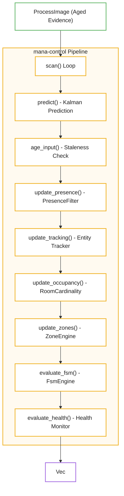
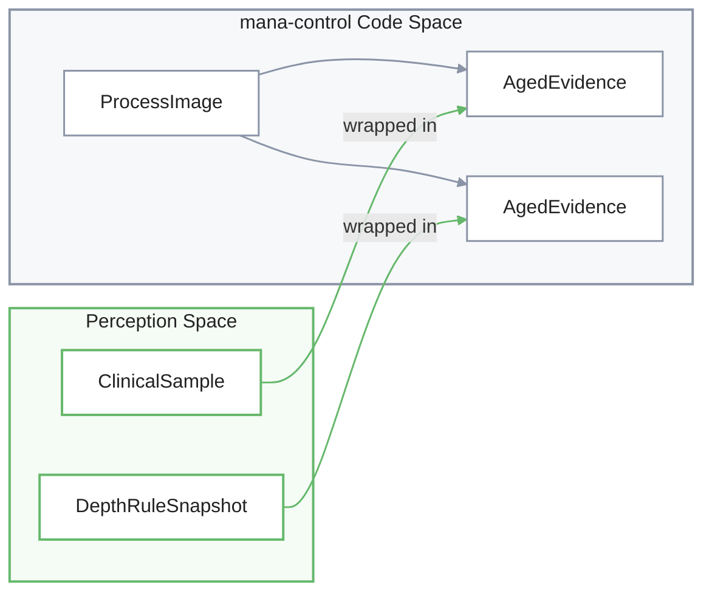
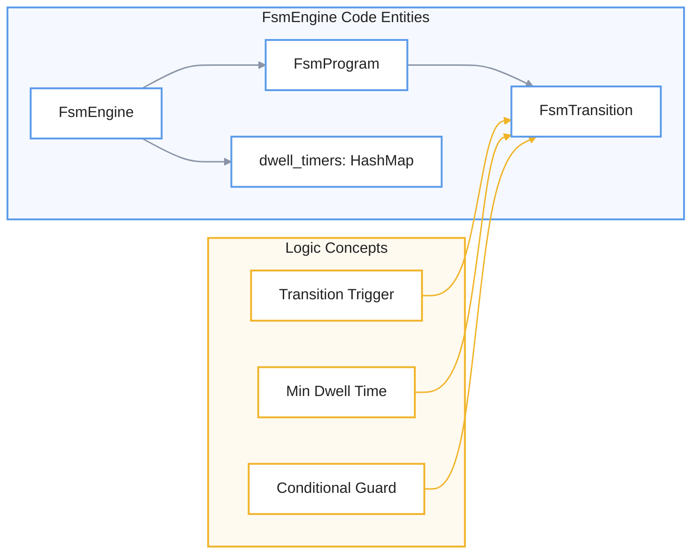

# Control System (mana-control)

> ⚠️ **Página generada, desactualizada.** Se generó contra el commit
> `ad24740d`. Divergencias conocidas al 2026-08-12, específicas de esta
> página:
>
> - **El tracker cuenta en mediciones, no en scans.** `misses` y `hit_streak` se incrementaban una vez por tick del lazo; como el lazo tica más rápido que la evidencia, eso inventaba fallos de detección y ningún track llegaba a confirmarse. Desde el 2026-08-12 la asociación corre sólo cuando hay medición nueva y los scans sin medición usan `Tracker::age_at`, que envejece la vida del track sin contarla como fallo. `max_age_ms` y `tentative_max_age_ms` siguen en tiempo de pared.
>
> No se corrige a mano: es un archivo **generado** y una corrección manual se
> pierde en la próxima regeneración, además de crear un segundo relato que
> compite con el primero. Lo que corresponde es regenerar contra `HEAD`.
>
> Fuentes autorizadas mientras tanto: [ARCHITECTURE.md](../../ARCHITECTURE.md)
> sobre ejecución, [HANDOFF.md](../../HANDOFF.md) y [`docs/adrs/`](../adrs/)
> sobre estado y decisiones, y [`workshop/MANUAL.md`](../../workshop/MANUAL.md)
> sobre cómo se opera y se lee la salida.

El componente **mana-control** actúa como el núcleo de toma de decisiones de la aplicación, operando mediante un **bucle de control de cadencia fija** que garantiza un comportamiento determinista y predecible. A diferencia del sistema de percepción, esta arquitectura procesa imágenes de datos estables cada 200 ms para gestionar de manera precisa el **rastreo de entidades** y el estado de ocupación de un espacio. El sistema integra diversos motores especializados, como una **máquina de estados finitos (FSM)** para la lógica transicional y un motor de zonas que evalúa la presencia de objetos en regiones geométricas específicas. En última instancia, este diseño permite transformar observaciones sensoriales crudas en **decisiones lógicas estructuradas**, utilizando temporizadores y filtros de Kalman para mantener la estabilidad frente al ruido o las oclusiones del entorno.

Relevant source files

- 
- 
- 
- 

The `mana-control` crate serves as the decision-making core of the application. It operates on a fixed-cadence control loop, consuming "frozen" process images from the perception system to drive entity tracking, occupancy logic, spatial zone evaluation, and a Finite State Machine (FSM) engine.

### System Architecture

The control system is decoupled from the variable-rate inference pipeline. While inference runs as fast as hardware allows or as keyframes arrive, `mana-control` ticks at a steady interval (typically 200ms) to ensure deterministic behavior for dwell timers and state transitions.

#### Control System Flow
ProcessImage → scan → prediction → staleness → presence → tracking → occupancy → zones → FSM → health → Vec

**Sources:** [core/mana-control/src/scan.rs123-154](core/mana-control/src/scan.rs#L123-L154) [core/mana-control/src/lib.rs86-131](core/mana-control/src/lib.rs#L86-L131)

---

### Key Subsystems

#### 1. Scan Loop and Control State

The `scan()` function is the entry point for every control tick. It utilizes a `ScanTimeline` to ensure that all time-based decisions (dwells, aging, Kalman prediction) are based on a monotonic clock specific to the control loop, rather than the system wall clock. It manages the `ControlState`, which holds the long-lived state for all sub-engines.

For details, see [Scan Loop and Control State](4.1-scan-loop-and-control-state).

**Sources:** [core/mana-control/src/scan.rs63-76](core/mana-control/src/scan.rs#L63-L76) [core/mana-control/src/scan.rs123-154](core/mana-control/src/scan.rs#L123-L154)

#### 2. Entity Tracking and Occupancy

This subsystem converts raw `SceneObservation` data into stable `Track` entities. It uses a Kalman-filter-based `Tracker` to handle occlusions and noisy detections. The `OccupancyStateMachine` then evaluates these tracks to determine the `RoomCardinality` (e.g., `Empty`, `SingleOccupancy`, `MultipleOccupancy`).

For details, see [Entity Tracking and Occupancy](4.2-entity-tracking-and-occupancy).

**Sources:** [core/mana-control/src/track.rs1-20](core/mana-control/src/track.rs#L1-L20) [core/mana-control/src/occupancy.rs1-30](core/mana-control/src/occupancy.rs#L1-L30)

#### 3. Finite State Machine (FSM) Engine

The `FsmEngine` executes the logic defined in the deployment's FSM program. It evaluates `FsmGuard` conditions—such as zone occupancy, signal values, or depth rules—to trigger state transitions. It supports dwell timers to prevent rapid "flickering" between states and features a `face_was_inside` latch for specific clinical workflows.

For details, see [Finite State Machine Engine](4.3-finite-state-machine-engine).

**Sources:** [core/mana-control/src/fsm/engine.rs55-61](core/mana-control/src/fsm/engine.rs#L55-L61) [core/mana-control/src/fsm/engine.rs214-250](core/mana-control/src/fsm/engine.rs#L214-L250)

#### 4. Zone Engine and Spatial Signals

The `ZoneEngine` tracks entities relative to geometric regions defined in the configuration. It handles hysteresis for `Occupied` and `Vacated` events. Parallel to this, the `SceneSignals` system aggregates various boolean and numeric metrics (e.g., person counts, signal validity) into a `SignalTable` used by the FSM and logging systems.

For details, see [Zone Engine and Spatial Signals](4.4-zone-engine-and-spatial-signals).

**Sources:** [core/mana-control/src/zones.rs1-20](core/mana-control/src/zones.rs#L1-L20) [core/mana-control/src/signals/mod.rs1-20](core/mana-control/src/signals/mod.rs#L1-L20)

---

### Data Structures

The following table associates high-level control concepts with their corresponding code entities:

|Concept|Code Entity|Purpose|
|---|---|---|
|**Input Evidence**|`ProcessImage`|Container for aged observations and depth data.|
|**Observation**|`SceneObservation`|Normalized detection data (BBox, Class, Confidence).|
|**Control Tick**|`scan()`|The main execution function for the control logic.|
|**State Stamp**|`ControlStamp`|Metadata linking a control decision to a specific frame and age.|
|**Health**|`Health`|Tracks system vitals like "Stale" (laggy data) or "Blind" (no data) states. Panics are tracked separately by the app-level `ErrorWindow` and lead to shutdown, not `HealthTransition`.|

**Sources:** [core/mana-control/src/lib.rs86-91](core/mana-control/src/lib.rs#L86-L91) [core/mana-control/src/lib.rs27-34](core/mana-control/src/lib.rs#L27-L34) [core/mana-control/src/scan.rs32-38](core/mana-control/src/scan.rs#L32-L38)

### Bridge: Natural Language to Code Space

#### Control Input Mapping

This diagram shows how external perception data is mapped into the `ProcessImage` consumed by `mana-control`.

**Sources:** [core/mana-control/src/lib.rs86-91](core/mana-control/src/lib.rs#L86-L91) [core/mana-control/src/lib.rs45-52](core/mana-control/src/lib.rs#L45-L52)

#### FSM Evaluation Mapping

This diagram maps FSM logic concepts to the internal engine structures.
**conceptos lógicos**:

- 🔵 **FsmEngine Code Entities**
    - `FsmEngine`
    - `FsmProgram`
    - `dwell_timers: HashMap`
    - `FsmTransition`

- 🟡 **Logic Concepts**
    - `Transition Trigger`
    - `Min Dwell Time`
    - `Conditional Guard`

**Sources:** [core/mana-control/src/fsm/engine.rs55-61](core/mana-control/src/fsm/engine.rs#L55-L61) [core/mana-control/src/fsm/engine.rs29-36](core/mana-control/src/fsm/engine.rs#L29-L36)

### On this page

- [Control System (mana-control)](4-control-system-\(mana-control\)#control-system-mana-control)
- [System Architecture](4-control-system-\(mana-control\)#system-architecture)
- [Control System Flow](4-control-system-\(mana-control\)#control-system-flow)
- [Key Subsystems](4-control-system-\(mana-control\)#key-subsystems)
- [1. Scan Loop and Control State](4-control-system-\(mana-control\)#1-scan-loop-and-control-state)
- [2. Entity Tracking and Occupancy](4-control-system-\(mana-control\)#2-entity-tracking-and-occupancy)
- [3. Finite State Machine (FSM) Engine](4-control-system-\(mana-control\)#3-finite-state-machine-fsm-engine)
- [4. Zone Engine and Spatial Signals](4-control-system-\(mana-control\)#4-zone-engine-and-spatial-signals)
- [Data Structures](4-control-system-\(mana-control\)#data-structures)
- [Bridge: Natural Language to Code Space](4-control-system-\(mana-control\)#bridge-natural-language-to-code-space)
- [Control Input Mapping](4-control-system-\(mana-control\)#control-input-mapping)
- [FSM Evaluation Mapping](4-control-system-\(mana-control\)#fsm-evaluation-mapping)
