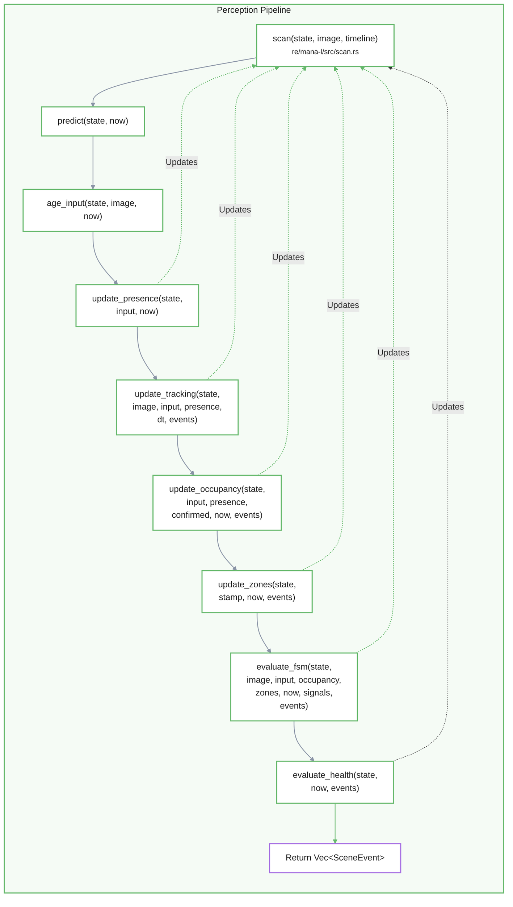
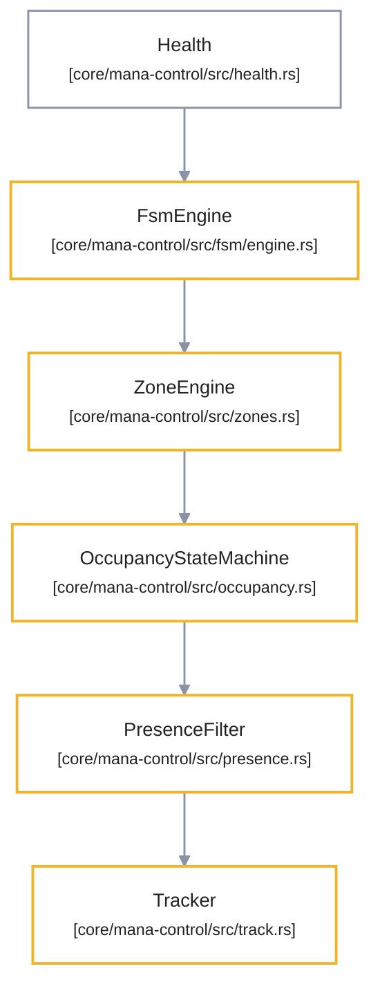
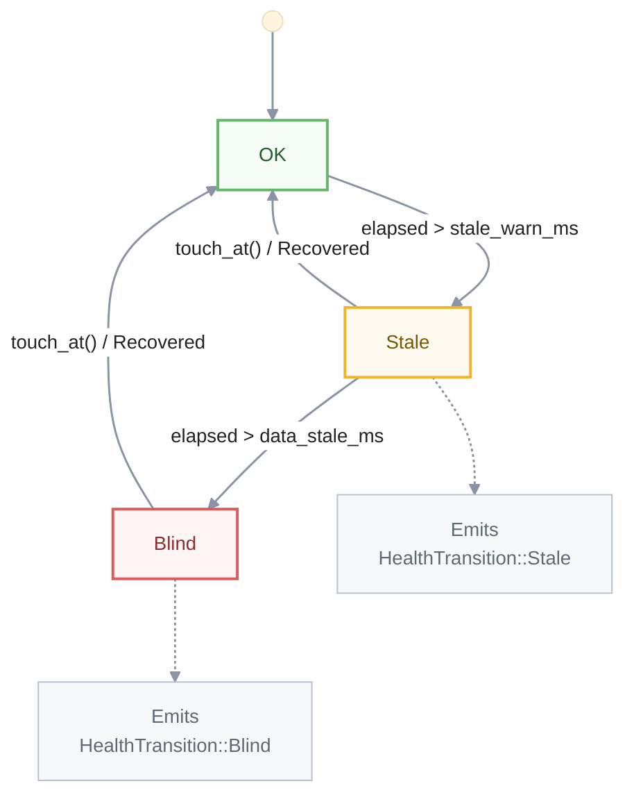

# Scan Loop and Control State
El sistema utiliza una función denominada **scan()** que actúa como un motor de decisiones de cadencia fija, permitiendo que el control sea independiente de las demoras variables en el procesamiento visual. Mediante el uso de una **ScanTimeline**, el software garantiza una **consistencia temporal** estricta, evitando errores de sincronización al procesar datos sobre el seguimiento de personas, la ocupación de espacios y las transiciones de estados lógicos. El flujo de trabajo sigue una **secuencia ordenada** que comienza con la validación de la frescura de los datos, continúa con el filtrado de ruidos para confirmar presencias reales y culmina en la evaluación de una **máquina de estados finitos (FSM)**. Finalmente, el diseño integra un monitoreo de **salud del sistema** y utilidades de cronometraje especializadas para asegurar que las acciones automáticas solo se ejecuten basándose en información estable y actualizada.

Relevant source files

- [](https://github.com/kerrvisiona-sudo/endeli/blob/ad24740d/app/cycle.rs)
- [](https://github.com/kerrvisiona-sudo/endeli/blob/ad24740d/core/mana-control/src/fsm/engine.rs)
- [](https://github.com/kerrvisiona-sudo/endeli/blob/ad24740d/core/mana-control/src/health.rs)
- [](https://github.com/kerrvisiona-sudo/endeli/blob/ad24740d/core/mana-control/src/scan.rs)
- [](https://github.com/kerrvisiona-sudo/endeli/blob/ad24740d/core/mana-control/src/timing.rs)
- [](https://github.com/kerrvisiona-sudo/endeli/blob/ad24740d/core/mana-control/src/window.rs)
- [](https://github.com/kerrvisiona-sudo/endeli/blob/ad24740d/pipeline.rs)

The `scan()` function serves as the fixed-cadence decision engine for the control system. It operates on a frozen `ProcessImage` (the output of the perception pipeline) to advance the state of entity tracking, room occupancy, spatial zones, and the Finite State Machine (FSM). By decoupling perception frequency from control frequency, the system ensures deterministic state transitions and stable signal evaluation regardless of variable inference latencies.

## Scan Timeline and Clock Abstraction

To ensure temporal consistency and prevent the control loop from reading directly from the system wall clock (which could lead to non-deterministic behavior during replays or multi-loop execution), `mana-control` utilizes a `ScanTimeline` [core/mana-control/src/scan.rs119-122](https://github.com/kerrvisiona-sudo/endeli/blob/ad24740d/core/mana-control/src/scan.rs#L119-L122)

- **`ScanInstant`**: A wrapper around `Instant` that can only originate from a `ScanTimeline` [core/mana-control/src/scan.rs19-24](https://github.com/kerrvisiona-sudo/endeli/blob/ad24740d/core/mana-control/src/scan.rs#L19-L24)
- **`LoopId`**: Every `ControlState` is bound to a specific `LoopId`. The `scan()` function verifies that the provided `ScanTimeline` belongs to the correct loop before proceeding [core/mana-control/src/scan.rs128-132](https://github.com/kerrvisiona-sudo/endeli/blob/ad24740d/core/mana-control/src/scan.rs#L128-L132)
- **`ControlStamp`**: A structure capturing the temporal context of a specific scan cycle, including the sequence number, the source frame ID, and the age of the underlying observations [core/mana-control/src/scan.rs33-38](https://github.com/kerrvisiona-sudo/endeli/blob/ad24740d/core/mana-control/src/scan.rs#L33-L38)

### Control State Flow

The following diagram maps the logical flow of the `scan()` function to the internal code entities and state updates.

```
Perception Pipeline
        │
        ▼
     scan
        │
        ▼
    predict
        │
        ▼
   age_input
        │
        ▼
update_presence
        │
        ▼
update_tracking
        │
        ▼
update_occupancy
        │
        ▼
 update_zones
        │
        ▼
 evaluate_fsm
        │
        ▼
evaluate_health
        │
        ▼
Vec<SceneEvent>
```

```
┌───────────────┐      ┌──────────────────┐      ┌──────────────────────┐
│    Tracker    │  ←   │ PresenceFilter   │  ←   │ OccupancyStateMachine│
└───────────────┘      └──────────────────┘      └──────────────────────┘
                                                            ↑
                                                            │
                                                    ┌───────────────┐
                                                    │  ZoneEngine   │
                                                    └───────────────┘
                                                            ↑
                                                            │
                                                    ┌───────────────┐
                                                    │   FsmEngine   │
                                                    └───────────────┘
                                                            ↑
                                                            │
                                                    ┌───────────────┐
                                                    │    Health     │
                                                    └───────────────┘
```




**Sources:** [core/mana-control/src/scan.rs123-154](https://github.com/kerrvisiona-sudo/endeli/blob/ad24740d/core/mana-control/src/scan.rs#L123-L154) [core/mana-control/src/scan.rs63-76](https://github.com/kerrvisiona-sudo/endeli/blob/ad24740d/core/mana-control/src/scan.rs#L63-L76)

---

## The Ordered Pipeline

The `scan()` function executes a strictly ordered sequence of operations to transform raw observations into high-level scene events.

### 1. Predict and Age Input

The cycle begins by calculating the time delta (`dt`) since the last scan and advancing the Kalman filters in the `Tracker` to the current `now` [core/mana-control/src/scan.rs168-177](https://github.com/kerrvisiona-sudo/endeli/blob/ad24740d/core/mana-control/src/scan.rs#L168-L177) Simultaneously, `age_input` checks the freshness of the `ProcessImage`. If the observations are older than `data_stale_ms`, the input is marked as invalid [core/mana-control/src/scan.rs179-198](https://github.com/kerrvisiona-sudo/endeli/blob/ad24740d/core/mana-control/src/scan.rs#L179-L198)

### 2. Presence and Tracking

- **`update_presence`**: Filters raw person detections through the `PresenceFilter` to determine if a person is truly present in the room, bypassing transient noise [core/mana-control/src/scan.rs200-209](https://github.com/kerrvisiona-sudo/endeli/blob/ad24740d/core/mana-control/src/scan.rs#L200-L209)
- **`update_tracking`**: Associates new observations with existing `Track` objects. If the presence state is `Ambiguous`, tracking is suppressed to avoid creating "ghost" tracks from noise [core/mana-control/src/scan.rs211-224](https://github.com/kerrvisiona-sudo/endeli/blob/ad24740d/core/mana-control/src/scan.rs#L211-L224)

### 3. Occupancy and Zones

- **`update_occupancy`**: Drives the `OccupancyStateMachine` to determine if the room is `Empty`, has a `Single` occupant, or `Multiple` occupants [core/mana-control/src/scan.rs239-250](https://github.com/kerrvisiona-sudo/endeli/blob/ad24740d/core/mana-control/src/scan.rs#L239-L250)
- **`update_zones`**: The `ZoneEngine` checks track positions against geometric boundaries (polygons/rects) and emits `ZoneOccupied` or `ZoneVacated` events based on hysteresis [core/mana-control/src/scan.rs268-278](https://github.com/kerrvisiona-sudo/endeli/blob/ad24740d/core/mana-control/src/scan.rs#L268-L278)

### 4. FSM and Health Evaluation

- **`evaluate_fsm`**: Aggregates the `FsmSceneContext` (presence, face confidence, zone status) and evaluates FSM transitions. It checks both state-specific transitions and global wildcard transitions [core/mana-control/src/fsm/engine.rs184-214](https://github.com/kerrvisiona-sudo/endeli/blob/ad24740d/core/mana-control/src/fsm/engine.rs#L184-L214)
- **`evaluate_health`**: Monitors the internal state of the pipeline. It transitions the system to `Stale` or `Blind` if frame ingestion stops or becomes too laggy [core/mana-control/src/health.rs54-84](https://github.com/kerrvisiona-sudo/endeli/blob/ad24740d/core/mana-control/src/health.rs#L54-L84)

---

## PipelineState and Health Monitoring

The `PipelineState` struct (managed in the main application loop) tracks the high-level operational status of the perception-to-control pipeline.

|Component|Role|File Reference|
|---|---|---|
|`ErrorWindow`|A density-based error tracker that triggers alerts if a threshold of cycles (e.g., panics or RTP errors) is exceeded within a sliding window.|[core/mana-control/src/window.rs14-19](https://github.com/kerrvisiona-sudo/endeli/blob/ad24740d/core/mana-control/src/window.rs#L14-L19)|
|`on_panic` / `on_ok`|Methods to record the success or failure of a processing cycle into the `panic_window`.|[pipeline.rs36-47](https://github.com/kerrvisiona-sudo/endeli/blob/ad24740d/pipeline.rs#L36-L47)|
|`mark_health_fresh`|Resets the `Health` status to `Recovered` when a valid keyframe is successfully decoded.|[pipeline.rs82-86](https://github.com/kerrvisiona-sudo/endeli/blob/ad24740d/pipeline.rs#L82-L86)|
|`Health`|Manages the `Blind` and `Stale` flags used by FSM guards to prevent decisions based on outdated data.|[core/mana-control/src/health.rs23-29](https://github.com/kerrvisiona-sudo/endeli/blob/ad24740d/core/mana-control/src/health.rs#L23-L29)|

### Health State Transitions

The `Health` component determines the validity of the signal for decision-making. It is not for telemetry, but for control logic [core/mana-control/src/health.rs1-6](https://github.com/kerrvisiona-sudo/endeli/blob/ad24740d/core/mana-control/src/health.rs#L1-L6)



**Sources:** [core/mana-control/src/health.rs54-84](https://github.com/kerrvisiona-sudo/endeli/blob/ad24740d/core/mana-control/src/health.rs#L54-L84) [pipeline.rs82-86](https://github.com/kerrvisiona-sudo/endeli/blob/ad24740d/pipeline.rs#L82-L86)

---

## Key Timing Primitives

The control system relies on specialized timing utilities to handle hysteresis and confirmation delays without relying on raw `Instant` math in business logic.

- **`Debouncer`**: Implements rising/falling edge debouncing. Used for signals that must remain stable for `on_ms` before engaging and `off_ms` before disengaging [core/mana-control/src/timing.rs19-23](https://github.com/kerrvisiona-sudo/endeli/blob/ad24740d/core/mana-control/src/timing.rs#L19-L23)
- **`Dwell`**: Tracks how long a specific condition has been continuously met. Used by the FSM to implement `dwell_min_ms` requirements for states [core/mana-control/src/timing.rs81-83](https://github.com/kerrvisiona-sudo/endeli/blob/ad24740d/core/mana-control/src/timing.rs#L81-L83)
- **`elapsed_ms`**: A robust helper that calculates the difference between two `Instant` values, saturating at `u64::MAX` to prevent overflow errors in long-running deployments [core/mana-control/src/timing.rs13-15](https://github.com/kerrvisiona-sudo/endeli/blob/ad24740d/core/mana-control/src/timing.rs#L13-L15)

**Sources:** [core/mana-control/src/timing.rs1-113](https://github.com/kerrvisiona-sudo/endeli/blob/ad24740d/core/mana-control/src/timing.rs#L1-L113)

