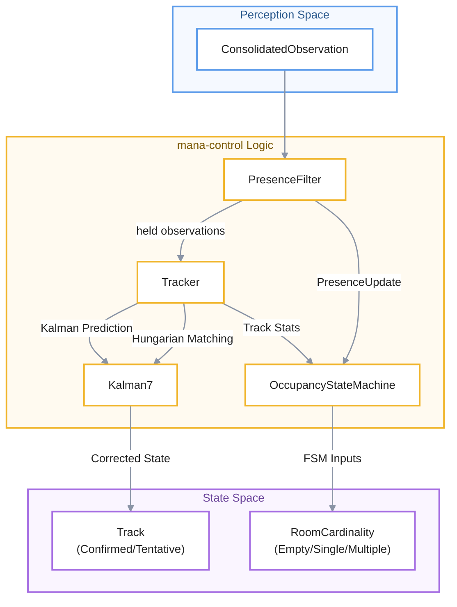

# Entity Tracking and Occupancy
Este documento detalla el funcionamiento de **mana-control**, un sistema diseñado para convertir detecciones visuales intermitentes en un registro estable de **identidad de entidades y ocupación de espacios**. A través de una arquitectura que utiliza el **filtro de Kalman** y el **Algoritmo Húngaro**, el software logra predecir el movimiento de las personas y mantener la continuidad de los sujetos incluso ante fallos temporales del sensor. El flujo de datos culmina en una **máquina de estados de ocupación**, la cual determina de forma inteligente si una habitación está vacía o habitada por múltiples individuos basándose en el historial de rastreo. Finalmente, el texto describe las **herramientas geométricas** subyacentes, como el cálculo de solapamiento y máscaras compactas, que garantizan la precisión y eficiencia computacional de todo el proceso de monitoreo.

Relevant source files

- [](core/mana-control/src/assignment.rs)
- [](core/mana-control/src/kalman.rs)
- [](core/mana-control/src/occupancy.rs)
- [](core/mana-control/src/presence.rs)
- [](core/mana-control/src/track.rs)
- [](std/mana-geometry/src/bbox.rs)
- [](std/mana-geometry/src/compact_mask.rs)
- [](std/mana-geometry/src/iou.rs)

This section describes the temporal logic and spatial reasoning systems within `mana-control`. The system transforms discrete, frame-by-frame consolidated detections into stable, tracked identities and high-level room occupancy states.

## System Architecture

The tracking and occupancy pipeline operates as a sequence of filters and state machines within the main scan loop. It is designed to handle detector dropouts, bounding box jitter, and complex multi-person scenarios using a combination of Kalman filters, Mahalanobis-gated Hungarian data association, and clinical occupancy policies.

### Data Flow and Entity Mapping

The following diagram illustrates how raw detections are transformed into tracked entities and occupancy signals.

**Tracking and Occupancy Logic Flow**



**🔵 Perception Space**

`ConsolidatedObservation`

→ representa información que viene del dominio de percepción.

**🟡 mana-control Logic**

`PresenceFilter` → `Tracker` / `OccupancyStateMachine` → `Kalman7`

→ representa la lógica interna y procesamiento.

**🟣 State Space**

`Track` / `RoomCardinality`

→ representa el estado que queda expuesto como resultado.

```
                 PERCEPTION
                     │
                     ▼
              ConsolidatedObservation
                     │
                     ▼
              ┌───────────────┐
              │  mana-control │
              │     Logic     │
              │               │
              │ PresenceFilter│
              │      │        │
              │   Tracker     │
              │    │   │      │
              │ Kalman  FSM   │
              └────┬────┬─────┘
                   │    │
                   ▼    ▼
             STATE SPACE
             Track   RoomCardinality
```

**Sources:** [core/mana-control/src/presence.rs56-61](core/mana-control/src/presence.rs#L56-L61) [core/mana-control/src/track.rs148-160](core/mana-control/src/track.rs#L148-L160) [core/mana-control/src/occupancy.rs159-170](core/mana-control/src/occupancy.rs#L159-L170)

---

## Entity Tracking

The `Tracker` class manages a collection of `Track` objects, using a constant velocity motion model to bridge gaps in detection.

### Kalman Filter (Kalman7)

The system implements a 7-dimensional Kalman filter (`Kalman7`) based on the SORT algorithm [core/mana-control/src/kalman.rs1-6](core/mana-control/src/kalman.rs#L1-L6)

- **State Vector ($x$):** $[cx, cy, s, r, \dot{cx}, \dot{cy}, \dot{s}]$ where $s$ is area (scale) and $r$ is aspect ratio [core/mana-control/src/kalman.rs3-5](core/mana-control/src/kalman.rs#L3-L5)
- **Process Noise:** Scaled by `nominal_dt_s` to ensure consistency across different scan cadences [core/mana-control/src/kalman.rs141-152](core/mana-control/src/kalman.rs#L141-L152)
- **Mahalanobis Distance:** Used to gate associations by calculating the squared distance between the predicted state and the new measurement [core/mana-control/src/kalman.rs119-127](core/mana-control/src/kalman.rs#L119-L127)

### Assignment Algorithm

Data association is performed using the **Hungarian Algorithm** (Kuhn-Munkres) implemented in `hungarian_min` [core/mana-control/src/assignment.rs17-20](core/mana-control/src/assignment.rs#L17-L20)

1. **Cost Matrix:** Constructed from the squared Mahalanobis distance between each confirmed track's predicted state and the new observation candidates. IoU is **not** part of the association cost; it is used only for "good box" filtering during observation enrichment ([track.rs220-237](core/mana-control/src/track.rs#L220-L237)) [core/mana-control/src/track.rs262-284](core/mana-control/src/track.rs#L262-L284)
2. **Optimization:** Finds the global minimum cost assignment to prevent greedy matching from stealing detections from better-fitting tracks [core/mana-control/src/assignment.rs139-155](core/mana-control/src/assignment.rs#L139-L155)
3. **Gating:** Matches are rejected if they exceed the `mahalanobis_threshold`. (`iou_threshold` exists in `TrackerConfig` but does not gate matching.) [core/mana-control/src/track.rs80-81](core/mana-control/src/track.rs#L80-L81) [core/mana-control/src/track.rs278-284](core/mana-control/src/track.rs#L278-L284)

### Lifecycle Management

Tracks transition through three lifecycle stages based on `TrackerConfig` [core/mana-control/src/track.rs75-87](core/mana-control/src/track.rs#L75-L87):

- **Tentative:** New tracks requiring `min_hits` to become confirmed.
- **Confirmed:** Active identities used for occupancy and FSM logic.
- **Ghosting:** Confirmed tracks that have lost their detection but are being extrapolated by the Kalman filter until `max_age_ms` or `ghost_max_ms` is reached [core/mana-control/src/track.rs93-97](core/mana-control/src/track.rs#L93-L97)

---

## Presence and Occupancy

While the `Tracker` maintains identity, the `PresenceFilter` and `OccupancyStateMachine` determine the clinical state of the room.

### PresenceFilter

The `PresenceFilter` acts as a high-level debouncer for the "Person" class. It handles "Ambiguous" states where multiple people are detected but identity is not yet certain [core/mana-control/src/presence.rs7-11](core/mana-control/src/presence.rs#L7-L11)

- **Bypass/Hold:** During short detector dropouts, the filter can "hold" the last known observation to prevent the tracker from timing out prematurely [core/mana-control/src/presence.rs152-163](core/mana-control/src/presence.rs#L152-L163)
- **State Transitions:** Transitions between `Absent`, `Present`, and `Ambiguous` based on `PresencePoiPolicy` (on/off timers) [core/mana-control/src/presence.rs125-131](core/mana-control/src/presence.rs#L125-L131)

### Occupancy State Machine

The `OccupancyStateMachine` consumes `OccupancyEvidence` to produce a `RoomCardinality` [core/mana-control/src/occupancy.rs6-10](core/mana-control/src/occupancy.rs#L6-L10)

|State|Condition|
|---|---|
|**Empty**|No persons detected and exit timers expired.|
|**Single**|Exactly one person confirmed or held by presence.|
|**Multiple**|Two or more persons confirmed for at least `multiple_confirm_ms`.|

**Sources:** [core/mana-control/src/occupancy.rs134-142](core/mana-control/src/occupancy.rs#L134-L142) [core/mana-control/src/occupancy.rs170-186](core/mana-control/src/occupancy.rs#L170-L186)

### Evidence Building Logic

The function `build_evidence` merges presence signals and track counts into a unified evidence structure [core/mana-control/src/occupancy.rs89-122](core/mana-control/src/occupancy.rs#L89-L122) This logic allows the system to maintain a "Single" occupancy state even if the tracker momentarily loses a box, provided the `PresenceFilter` is still "holding" the person [core/mana-control/src/occupancy.rs103-111](core/mana-control/src/occupancy.rs#L103-L111)

---

## Geometry Utilities

Tracking and occupancy rely on robust spatial primitives defined in `mana-geometry`.

### Bounding Box Operations

`std/mana-geometry/src/bbox.rs` provides utilities for coordinate transformation:

- **Formats:** Conversion between corner-format `(x1, y1, x2, y2)` and center-format `(cx, cy, w, h)` [std/mana-geometry/src/bbox.rs8-16](std/mana-geometry/src/bbox.rs#L8-L16)
- **Normalization:** Most operations occur in normalized `[0, 1]` space, but `denormalize_boxes` allows scaling to pixel coordinates for specific model inputs [std/mana-geometry/src/bbox.rs78-88](std/mana-geometry/src/bbox.rs#L78-L88)
- **Clamping:** `clamp_box` ensures entities remain within the frame boundaries [std/mana-geometry/src/bbox.rs117-123](std/mana-geometry/src/bbox.rs#L117-L123)

### Overlap Metrics (IoU/IOS)

`std/mana-geometry/src/iou.rs` implements the Intersection over Union (IoU) and Intersection over Smallest (IOS) metrics [std/mana-geometry/src/iou.rs7-11](std/mana-geometry/src/iou.rs#L7-L11)

- **Where IoU is actually used:** class-aware NMS in the inference stage (`src/infer/run_helpers.rs:369`), detection merging and face-to-person attachment in the perception consolidator (`core/mana-perception/src/detection.rs:145-160`), and good-box filtering in `enrich_observations` (`track.rs:237`).
- **Not used by the tracker:** the assignment cost in `match_detections` is Mahalanobis-only. The `box_overlap_batch` and `with_zone` helpers in `iou.rs` have no call sites in the runtime pipeline (they are exercised only by unit tests), and zone occupancy never consults the IoU module.

### Compact Masks

For segmentation-based tracking, `CompactMask` provides a memory-efficient RLE (Run-Length Encoding) storage format [std/mana-geometry/src/compact_mask.rs42-48](std/mana-geometry/src/compact_mask.rs#L42-L48) It stores masks relative to their bounding box offsets rather than the full frame, significantly reducing memory bandwidth during inter-process communication [std/mana-geometry/src/compact_mask.rs4-5](std/mana-geometry/src/compact_mask.rs#L4-L5)

**Sources:** [std/mana-geometry/src/bbox.rs](std/mana-geometry/src/bbox.rs) [std/mana-geometry/src/iou.rs](std/mana-geometry/src/iou.rs) [std/mana-geometry/src/compact_mask.rs](std/mana-geometry/src/compact_mask.rs)


### On this page

- [Entity Tracking and Occupancy](4.2-entity-tracking-and-occupancy#entity-tracking-and-occupancy)
- [System Architecture](4.2-entity-tracking-and-occupancy#system-architecture)
- [Data Flow and Entity Mapping](4.2-entity-tracking-and-occupancy#data-flow-and-entity-mapping)
- [Entity Tracking](4.2-entity-tracking-and-occupancy#entity-tracking)
- [Kalman Filter (Kalman7)](4.2-entity-tracking-and-occupancy#kalman-filter-kalman7)
- [Assignment Algorithm](4.2-entity-tracking-and-occupancy#assignment-algorithm)
- [Lifecycle Management](4.2-entity-tracking-and-occupancy#lifecycle-management)
- [Presence and Occupancy](4.2-entity-tracking-and-occupancy#presence-and-occupancy)
- [PresenceFilter](4.2-entity-tracking-and-occupancy#presencefilter)
- [Occupancy State Machine](4.2-entity-tracking-and-occupancy#occupancy-state-machine)
- [Evidence Building Logic](4.2-entity-tracking-and-occupancy#evidence-building-logic)
- [Geometry Utilities](4.2-entity-tracking-and-occupancy#geometry-utilities)
- [Bounding Box Operations](4.2-entity-tracking-and-occupancy#bounding-box-operations)
- [Overlap Metrics (IoU/IOS)](4.2-entity-tracking-and-occupancy#overlap-metrics-iouios)
- [Compact Masks](4.2-entity-tracking-and-occupancy#compact-masks)
