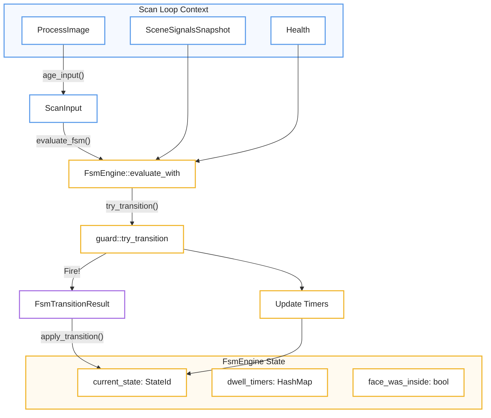
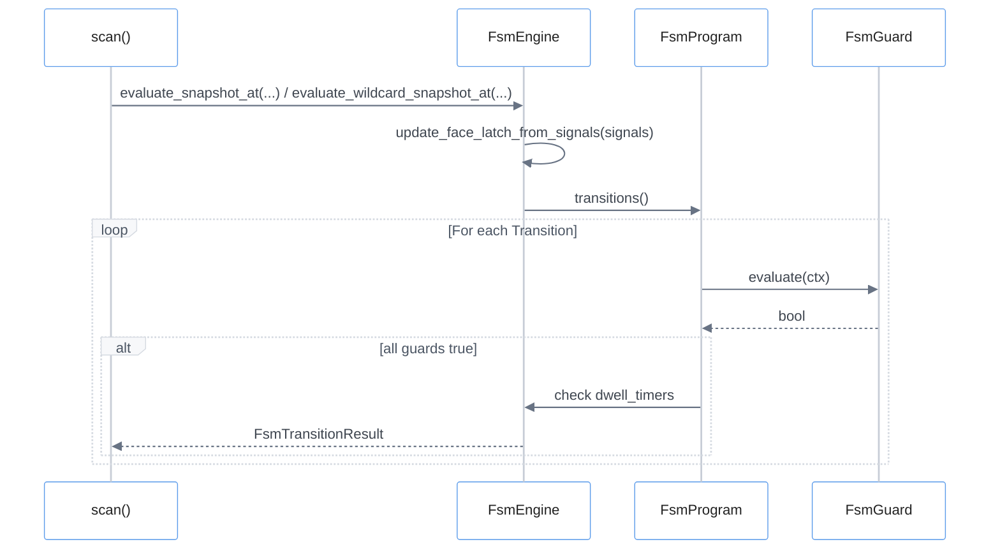
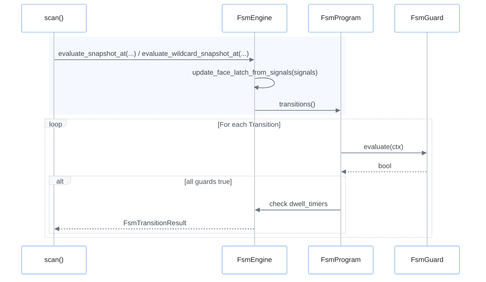

# Finite State Machine Engine
El motor de la **Máquina de Estados Finitos (FSM)** actúa como el cerebro analítico del sistema, transformando señales de percepción complejas en decisiones lógicas mediante un riguroso proceso de **compilación y validación**. Para garantizar la estabilidad operativa, el motor utiliza **temporizadores de permanencia (dwell timers)** y cierres de seguridad que evitan cambios de estado erráticos causados por ruidos en los datos o breves interrupciones visuales. La ejecución se basa en la evaluación constante de **transiciones protegidas por guardias**, las cuales validan condiciones específicas como la ocupación de zonas o la vigencia de la información antes de permitir un movimiento. Finalmente, el sistema incluye protocolos de **control de ciclo de vida y emergencia** que fuerzan estados seguros en caso de fallos, asegurando que la infraestructura mantenga siempre un comportamiento predecible y resiliente.

Relevant source files

- 
- 
- 
- 
- 
- 
- 
- 
- 
- 
- 
- 
- 
- 
- 
- 

The Finite State Machine (FSM) engine is the decision-making core of the control system. It consumes high-level perception signals (tracking, zones, occupancy, depth, and health) to drive transitions between logical states defined in a deployment blueprint. The engine ensures that transitions are validated, debounced via dwell timers, and resilient to data staleness.

## Compilation and Validation

Before the engine runs, the `FsmCatalog` (loaded from `fsm.toml`) is compiled into a validated runtime representation called `FsmProgram`. This process ensures that all references to states, zones, and models are consistent across the various configuration files.

### The Compilation Pipeline

1. **Identifier Resolution**: Converts string-based names for states and zones into type-safe `StateId` and `ZoneId` [core/mana-control/src/fsm/program.rs165-172](core/mana-control/src/fsm/program.rs#L165-L172)
2. **Reference Validation**: Validates that models requested by states exist in the `ModelCatalog` and zones used in guards exist in the `ZoneCatalog` [core/mana-control/src/fsm/program.rs281-335](core/mana-control/src/fsm/program.rs#L281-L335)
3. **Signal Guard Validation**: Every `type = "signal"` guard is validated at compile time against the static signal catalog: the tag must be declared, the operator must be compatible with the signal kind (e.g., `Ratio` rejects `==`/`!=`), and label values must belong to the closed label set. A guard that can never evaluate correctly is rejected with a diagnostic instead of being silently accepted [core/mana-control/src/fsm/program.rs337-437](core/mana-control/src/fsm/program.rs#L337-L437)
4. **Dwell Parsing**: Converts human-readable duration strings (e.g., "500ms", "2s") into millisecond integers via `parse_dwell`, rejecting negative and non-finite values [core/mana-control/src/fsm/guard.rs110-136](core/mana-control/src/fsm/guard.rs#L110-L136) [core/mana-control/src/fsm/tests/dwell.rs14-33](core/mana-control/src/fsm/tests/dwell.rs#L14-L33)
5. **Structural Checks**: Ensures the presence of mandatory roles (`initial`, `safe`, `reset`) and verifies that every state has at least one exit path, unless lenient compilation is requested for tests [core/mana-control/src/fsm/program.rs174-225](core/mana-control/src/fsm/program.rs#L174-L225)

### Natural Language to Code Entity Space: Compilation

|System Concept|Code Entity|Source|
|---|---|---|
|State Machine Config|`FsmCatalog`|[core/mana-control/src/config.rs5-7](core/mana-control/src/config.rs#L5-L7)|
|Runtime Program|`FsmProgram`|[core/mana-control/src/fsm/program.rs129-135](core/mana-control/src/fsm/program.rs#L129-L135)|
|Compilation Logic|`FsmProgram::compile`|[core/mana-control/src/fsm/program.rs142-144](core/mana-control/src/fsm/program.rs#L142-L144)|
|Guard Resolution|`FsmProgram::resolve_guard`|[core/mana-control/src/fsm/program.rs337](core/mana-control/src/fsm/program.rs#L337-L337)|

**Sources:** [core/mana-control/src/fsm/program.rs127-225](core/mana-control/src/fsm/program.rs#L127-L225) [core/mana-control/src/fsm/tests/dwell.rs14-33](core/mana-control/src/fsm/tests/dwell.rs#L14-L33)

## Engine Execution

The `FsmEngine` maintains the current state and manages the lifecycle of transitions during the `scan()` loop.

### Transition Evaluation

The engine evaluates transitions in two phases:

1. **Wildcard Transitions**: Evaluates global transitions (defined with `from = "*"`) such as emergency "DataStale" triggers [core/mana-control/src/fsm/engine.rs119-150](core/mana-control/src/fsm/engine.rs#L119-L150)
2. **State-Specific Transitions**: Evaluates transitions originating from the `current_state` [core/mana-control/src/fsm/engine.rs230-245](core/mana-control/src/fsm/engine.rs#L230-L245)

### Guard Types

Transitions are gated by `ProgramGuard` conditions. All guards in a transition must return `true` for the transition to fire. The deserializable `FsmGuard` enum (TOML) has eight variants; each compiles into the corresponding `ProgramGuard` [core/mana-control/src/fsm/guard.rs20-65](core/mana-control/src/fsm/guard.rs#L20-L65)

|Guard Type|Logic|Source|
|---|---|---|
|`ZonePresent`|True if the `ZoneEngine` reports the zone is currently occupied.|[core/mana-control/src/fsm/guard.rs23-24](core/mana-control/src/fsm/guard.rs#L23-L24)|
|`ZoneOccupied`|Event-driven; fires when a `ZoneEvent::Occupied` occurs with sufficient confidence and duration.|[core/mana-control/src/fsm/guard.rs25-32](core/mana-control/src/fsm/guard.rs#L25-L32)|
|`ZoneVacated`|Event-driven; fires on a `ZoneEvent::Vacated`. Its `min_confidence` is rejected at compile time because a `Vacated` event carries no confidence.|[core/mana-control/src/fsm/guard.rs33-43](core/mana-control/src/fsm/guard.rs#L33-L43)|
|`AllZonesVacant`|True if every configured zone reports vacant; used e.g. in `config/fsm.toml:48`.|[core/mana-control/src/fsm/guard.rs44-48](core/mana-control/src/fsm/guard.rs#L44-L48)|
|`DataStale`|True if `Health` indicates perception data has exceeded `data_stale_ms`.|`guard.rs:49-50` / [core/mana-control/src/fsm/tests/lifecycle.rs88-98](core/mana-control/src/fsm/tests/lifecycle.rs#L88-L98)|
|`DataFresh`|True while the control loop is not blind; used to recover from a "blind" state.|[core/mana-control/src/fsm/guard.rs51-52](core/mana-control/src/fsm/guard.rs#L51-L52)|
|`DepthRule`|Matches against `DepthRuleSnapshot` triggers (e.g., "bed-approach").|[core/mana-control/src/fsm/tests/depth.rs12-25](core/mana-control/src/fsm/tests/depth.rs#L12-L25)|
|`Signal`|Evaluates a typed signal (`tag`, `op`, `value`) against the `SceneSignalsSnapshot` — e.g. `{ type = "signal", tag = "ocupacion.cardinalidad", op = "==", value = "single" }`. The tag/op/value combination is validated at compile time against the signal catalog v1.|[core/mana-control/src/fsm/guard.rs59-64](core/mana-control/src/fsm/guard.rs#L59-L64)|

**Sources:** [core/mana-control/src/fsm/engine.rs156-163](core/mana-control/src/fsm/engine.rs#L156-L163) [core/mana-control/src/fsm/program.rs98-125](core/mana-control/src/fsm/program.rs#L98-L125) [core/mana-control/src/fsm/program.rs400-437](core/mana-control/src/fsm/program.rs#L400-L437)

## Dwell Timers and Latches

To prevent rapid oscillation ("chatter") between states, the engine implements two types of time-based gating.

### State Dwell and Transition Dwell

- **State Dwell (`dwell_min_ms`)**: A minimum time the engine _must_ remain in a state before **any** transition — including wildcard (`from = "*"`) transitions — can fire. The `state_dwell_satisfied` gate runs first on every evaluation path (`evaluate_at` 152, `evaluate_with_signals_at` 216, `evaluate_snapshot_at` 280, `evaluate_wildcard_snapshot_at` 340) [core/mana-control/src/fsm/engine.rs413-420](core/mana-control/src/fsm/engine.rs#L413-L420)
- **Transition Dwell (`dwell`)**: A duration a transition's guards must remain continuously `true` before the transition actually fires. The engine tracks these via `dwell_timers` [core/mana-control/src/fsm/engine.rs59](core/mana-control/src/fsm/engine.rs#L59-L59) [core/mana-control/src/fsm/tests/face_dwell.rs72-86](core/mana-control/src/fsm/tests/face_dwell.rs#L72-L86)

### Face Inside Latch

The `face_was_inside` latch is a boolean flag that persists even if a face momentarily disappears. It is updated every cycle by `update_face_latch_from_signals` based on the `cara.presente` signal and the room cardinality, and is used by specific guards (`cara.estuvo_dentro`) to maintain state continuity [core/mana-control/src/fsm/engine.rs60](core/mana-control/src/fsm/engine.rs#L60-L60) [core/mana-control/src/fsm/engine.rs382-400](core/mana-control/src/fsm/engine.rs#L382-L400)

### Natural Language to Code Entity Space: Runtime

**🔵 Scan Loop Context**

→ `ProcessImage`  
→ `SceneSignalsSnapshot`  
→ `Health`

↓

**🔵 ScanInput**

↓ `evaluate_fsm()`

**🟡 FSM evaluation**

→ `FsmEngine::evaluate_with`  
→ `guard::try_transition`

y desde ahí:

- `Fire!` → **🟣 `FsmTransitionResult`** → `apply_transition()`
- `Update Timers` → estado

Finalmente:

**🟡 FsmEngine State**

- `current_state: StateId`
- `dwell_timers: HashMap`
- `face_was_inside: bool`
**Sources:** [core/mana-control/src/scan.rs322-380](core/mana-control/src/scan.rs#L322-L380) [core/mana-control/src/fsm/engine.rs55-61](core/mana-control/src/fsm/engine.rs#L55-L61) [core/mana-control/src/fsm/guard.rs167-251](core/mana-control/src/fsm/guard.rs#L167-L251)

## Emergency and Lifecycle Control

The engine provides mechanisms to handle system-level events:

- **`force_safe_state`**: Immediately moves the engine to the state defined in `roles.safe` (usually a "blind" or "offline" state where no models run) [core/mana-control/src/fsm/tests/lifecycle.rs13-32](core/mana-control/src/fsm/tests/lifecycle.rs#L13-L32)
- **Wildcard Recovery**: Transitions with `from = "*"` and `DataFresh` guards allow the machine to recover from a "blind" state as soon as the ingest pipeline recovers [core/mana-control/src/fsm/tests/lifecycle.rs123-155](core/mana-control/src/fsm/tests/lifecycle.rs#L123-L155)

### FSM Engine Data Flow

- 🔵 **Azul** → execution/application (`scan`, `FsmEngine`)
- 🟡 **Amarillo** → FSM logic/state (`FsmProgram`)
- 🟢 **Verde** → perception/guard cuando el guard dependa de señales
- 🟣 **Violeta** → resultados/eventos (`FsmTransitionResult`)
- 🔴 **Rojo** → únicamente errores/failures
**Sources:** [core/mana-control/src/scan.rs322-380](core/mana-control/src/scan.rs#L322-L380) [core/mana-control/src/fsm/engine.rs205-248](core/mana-control/src/fsm/engine.rs#L205-L248) [core/mana-control/src/fsm/engine.rs270-350](core/mana-control/src/fsm/engine.rs#L270-L350)

### On this page

- [Finite State Machine Engine](4.3-finite-state-machine-engine#finite-state-machine-engine)
- [Compilation and Validation](4.3-finite-state-machine-engine#compilation-and-validation)
- [The Compilation Pipeline](4.3-finite-state-machine-engine#the-compilation-pipeline)
- [Natural Language to Code Entity Space: Compilation](4.3-finite-state-machine-engine#natural-language-to-code-entity-space-compilation)
- [Engine Execution](4.3-finite-state-machine-engine#engine-execution)
- [Transition Evaluation](4.3-finite-state-machine-engine#transition-evaluation)
- [Guard Types](4.3-finite-state-machine-engine#guard-types)
- [Dwell Timers and Latches](4.3-finite-state-machine-engine#dwell-timers-and-latches)
- [State Dwell and Transition Dwell](4.3-finite-state-machine-engine#state-dwell-and-transition-dwell)
- [Face Inside Latch](4.3-finite-state-machine-engine#face-inside-latch)
- [Natural Language to Code Entity Space: Runtime](4.3-finite-state-machine-engine#natural-language-to-code-entity-space-runtime)
- [Emergency and Lifecycle Control](4.3-finite-state-machine-engine#emergency-and-lifecycle-control)
- [FSM Engine Data Flow](4.3-finite-state-machine-engine#fsm-engine-data-flow)

