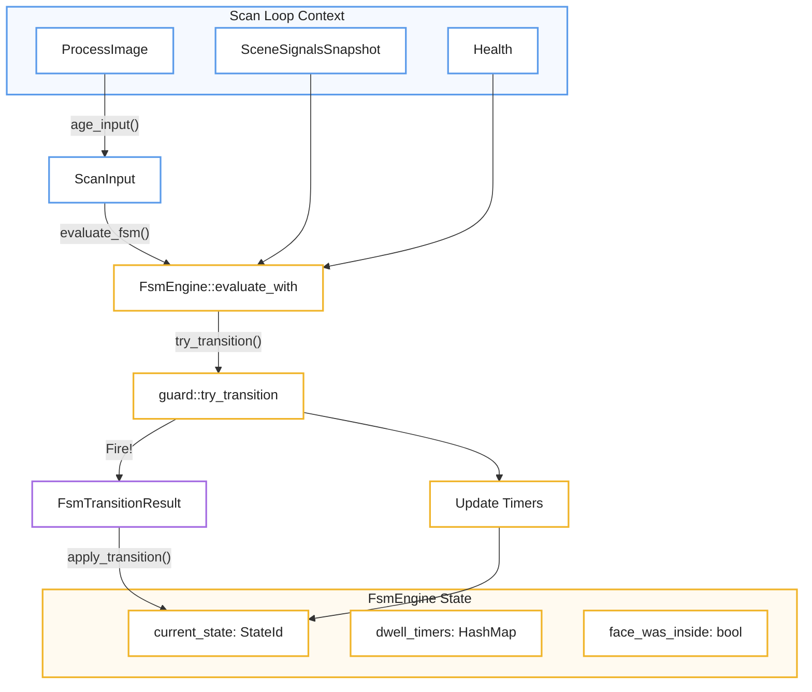
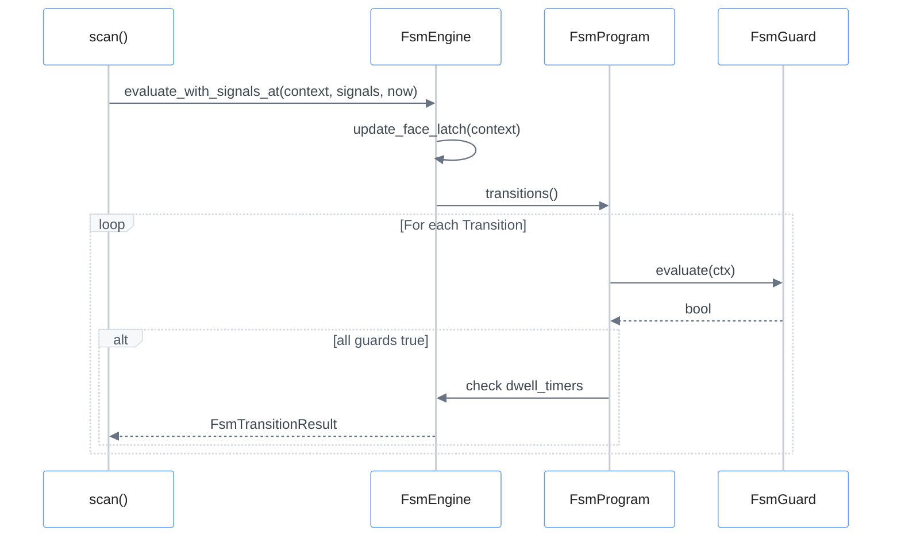
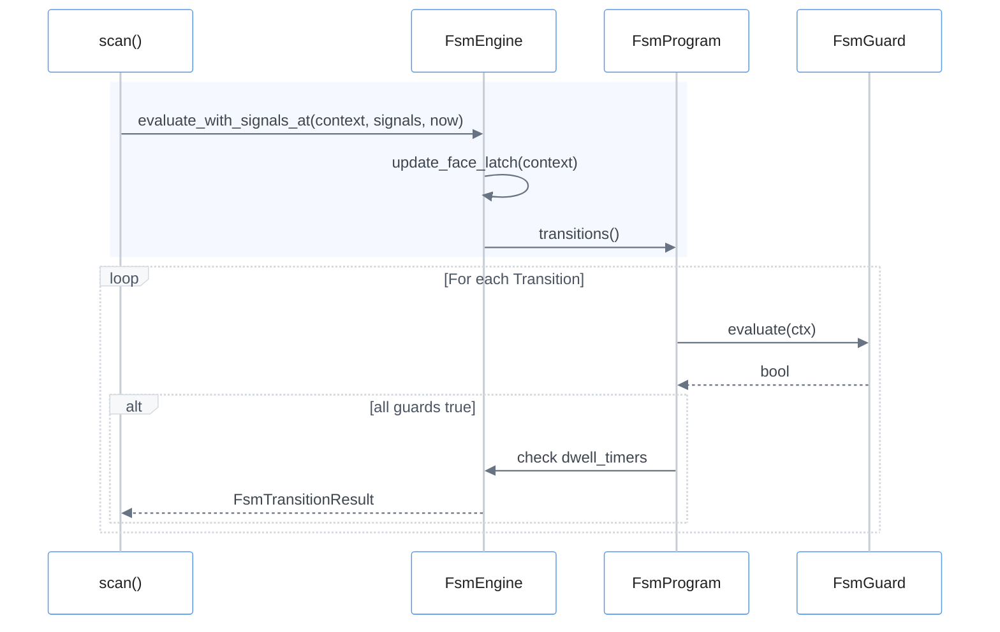

# Finite State Machine Engine
El motor de la **Máquina de Estados Finitos (FSM)** actúa como el cerebro analítico del sistema, transformando señales de percepción complejas en decisiones lógicas mediante un riguroso proceso de **compilación y validación**. Para garantizar la estabilidad operativa, el motor utiliza **temporizadores de permanencia (dwell timers)** y cierres de seguridad que evitan cambios de estado erráticos causados por ruidos en los datos o breves interrupciones visuales. La ejecución se basa en la evaluación constante de **transiciones protegidas por guardias**, las cuales validan condiciones específicas como la ocupación de zonas o la vigencia de la información antes de permitir un movimiento. Finalmente, el sistema incluye protocolos de **control de ciclo de vida y emergencia** que fuerzan estados seguros en caso de fallos, asegurando que la infraestructura mantenga siempre un comportamiento predecible y resiliente.

Relevant source files

- 
- 
- 
- 
- 
- 
- 
- 
- 
- 
- 
- 
- 
- 
- 
- 

The Finite State Machine (FSM) engine is the decision-making core of the control system. It consumes high-level perception signals (tracking, zones, occupancy, depth, and health) to drive transitions between logical states defined in a deployment blueprint. The engine ensures that transitions are validated, debounced via dwell timers, and resilient to data staleness.

## Compilation and Validation

Before the engine runs, the `FsmCatalog` (loaded from `fsm.toml`) is compiled into a validated runtime representation called `FsmProgram`. This process ensures that all references to states, zones, and models are consistent across the various configuration files.

### The Compilation Pipeline

1. **Identifier Resolution**: Converts string-based names for states and zones into type-safe `StateId` and `ZoneId` [core/mana-control/src/fsm/program.rs165-172](https://github.com/kerrvisiona-sudo/endeli/blob/ad24740d/core/mana-control/src/fsm/program.rs#L165-L172)
2. **Reference Validation**: Validates that models requested by states exist in the `ModelCatalog` and zones used in guards exist in the `ZoneCatalog` [core/mana-control/src/fsm/program.rs142-151](https://github.com/kerrvisiona-sudo/endeli/blob/ad24740d/core/mana-control/src/fsm/program.rs#L142-L151)
3. **Dwell Parsing**: Converts human-readable duration strings (e.g., "500ms", "2s") into millisecond integers [core/mana-control/src/fsm/tests/dwell.rs17-21](https://github.com/kerrvisiona-sudo/endeli/blob/ad24740d/core/mana-control/src/fsm/tests/dwell.rs#L17-L21)
4. **Structural Checks**: Ensures the presence of mandatory roles (`initial`, `safe`, `reset`) and verifies that every state has at least one exit path, unless lenient compilation is requested for tests [core/mana-control/src/fsm/program.rs174-225](https://github.com/kerrvisiona-sudo/endeli/blob/ad24740d/core/mana-control/src/fsm/program.rs#L174-L225)

### Natural Language to Code Entity Space: Compilation

|System Concept|Code Entity|Source|
|---|---|---|
|State Machine Config|`FsmCatalog`|[core/mana-control/src/fsm/program.rs5](https://github.com/kerrvisiona-sudo/endeli/blob/ad24740d/core/mana-control/src/fsm/program.rs#L5-L5)|
|Runtime Program|`FsmProgram`|[core/mana-control/src/fsm/program.rs129](https://github.com/kerrvisiona-sudo/endeli/blob/ad24740d/core/mana-control/src/fsm/program.rs#L129-L129)|
|Compilation Logic|`FsmProgram::compile`|[core/mana-control/src/fsm/program.rs142](https://github.com/kerrvisiona-sudo/endeli/blob/ad24740d/core/mana-control/src/fsm/program.rs#L142-L142)|
|Guard Resolution|`FsmProgram::resolve_guard`|[core/mana-control/src/fsm/program.rs192](https://github.com/kerrvisiona-sudo/endeli/blob/ad24740d/core/mana-control/src/fsm/program.rs#L192-L192)|

**Sources:** [core/mana-control/src/fsm/program.rs127-225](https://github.com/kerrvisiona-sudo/endeli/blob/ad24740d/core/mana-control/src/fsm/program.rs#L127-L225) [core/mana-control/src/fsm/tests/dwell.rs14-33](https://github.com/kerrvisiona-sudo/endeli/blob/ad24740d/core/mana-control/src/fsm/tests/dwell.rs#L14-L33)

## Engine Execution

The `FsmEngine` maintains the current state and manages the lifecycle of transitions during the `scan()` loop.

### Transition Evaluation

The engine evaluates transitions in two phases:

1. **Wildcard Transitions**: Evaluates global transitions (defined with `from = "*"`) such as emergency "DataStale" triggers [core/mana-control/src/fsm/engine.rs119-150](https://github.com/kerrvisiona-sudo/endeli/blob/ad24740d/core/mana-control/src/fsm/engine.rs#L119-L150)
2. **State-Specific Transitions**: Evaluates transitions originating from the `current_state` [core/mana-control/src/fsm/engine.rs230-245](https://github.com/kerrvisiona-sudo/endeli/blob/ad24740d/core/mana-control/src/fsm/engine.rs#L230-L245)

### Guard Types

Transitions are gated by `ProgramGuard` conditions. All guards in a transition must return `true` for the transition to fire [core/mana-control/src/fsm/tests/guards.rs136-156](https://github.com/kerrvisiona-sudo/endeli/blob/ad24740d/core/mana-control/src/fsm/tests/guards.rs#L136-L156)

|Guard Type|Logic|Source|
|---|---|---|
|`ZonePresent`|True if the `ZoneEngine` reports the zone is occupied.|[core/mana-control/src/fsm/tests/zones.rs36-46](https://github.com/kerrvisiona-sudo/endeli/blob/ad24740d/core/mana-control/src/fsm/tests/zones.rs#L36-L46)|
|`ZoneOccupied`|Event-driven; fires when a `ZoneEvent::Occupied` occurs with sufficient confidence.|[core/mana-control/src/fsm/tests/guards.rs48-62](https://github.com/kerrvisiona-sudo/endeli/blob/ad24740d/core/mana-control/src/fsm/tests/guards.rs#L48-L62)|
|`DataStale`|True if `Health` indicates perception data has exceeded `data_stale_ms`.|[core/mana-control/src/fsm/tests/lifecycle.rs88-98](https://github.com/kerrvisiona-sudo/endeli/blob/ad24740d/core/mana-control/src/fsm/tests/lifecycle.rs#L88-L98)|
|`DepthRule`|Matches against `DepthRuleSnapshot` triggers (e.g., "bed-approach").|[core/mana-control/src/fsm/tests/depth.rs12-25](https://github.com/kerrvisiona-sudo/endeli/blob/ad24740d/core/mana-control/src/fsm/tests/depth.rs#L12-L25)|
|`Signal`|Evaluates arbitrary signals (e.g., `cara.en_dwell == true`) against the `SceneSignalsSnapshot`.|[core/mana-control/src/fsm/tests/face_dwell.rs13-27](https://github.com/kerrvisiona-sudo/endeli/blob/ad24740d/core/mana-control/src/fsm/tests/face_dwell.rs#L13-L27)|

**Sources:** [core/mana-control/src/fsm/engine.rs156-163](https://github.com/kerrvisiona-sudo/endeli/blob/ad24740d/core/mana-control/src/fsm/engine.rs#L156-L163) [core/mana-control/src/fsm/program.rs98-125](https://github.com/kerrvisiona-sudo/endeli/blob/ad24740d/core/mana-control/src/fsm/program.rs#L98-L125)

## Dwell Timers and Latches

To prevent rapid oscillation ("chatter") between states, the engine implements two types of time-based gating.

### State Dwell and Transition Dwell

- **State Dwell (`dwell_min_ms`)**: A minimum time the engine _must_ remain in a state before any non-wildcard transition can be considered [core/mana-control/src/fsm/tests/dwell.rs36-46](https://github.com/kerrvisiona-sudo/endeli/blob/ad24740d/core/mana-control/src/fsm/tests/dwell.rs#L36-L46)
- **Transition Dwell (`dwell`)**: A duration a transition's guards must remain continuously `true` before the transition actually fires. The engine tracks these via `dwell_timers` [core/mana-control/src/fsm/engine.rs59](https://github.com/kerrvisiona-sudo/endeli/blob/ad24740d/core/mana-control/src/fsm/engine.rs#L59-L59) [core/mana-control/src/fsm/tests/face_dwell.rs72-86](https://github.com/kerrvisiona-sudo/endeli/blob/ad24740d/core/mana-control/src/fsm/tests/face_dwell.rs#L72-L86)

### Face Inside Latch

The `face_was_inside` latch is a boolean flag that persists even if a face momentarily disappears. It is updated every cycle based on the `FsmSceneContext` and is used by specific guards to maintain state continuity [core/mana-control/src/fsm/engine.rs79-81](https://github.com/kerrvisiona-sudo/endeli/blob/ad24740d/core/mana-control/src/fsm/engine.rs#L79-L81) [core/mana-control/src/fsm/engine.rs215](https://github.com/kerrvisiona-sudo/endeli/blob/ad24740d/core/mana-control/src/fsm/engine.rs#L215-L215)

### Natural Language to Code Entity Space: Runtime

**🔵 Scan Loop Context**

→ `ProcessImage`  
→ `SceneSignalsSnapshot`  
→ `Health`

↓

**🔵 ScanInput**

↓ `evaluate_fsm()`

**🟡 FSM evaluation**

→ `FsmEngine::evaluate_with`  
→ `guard::try_transition`

y desde ahí:

- `Fire!` → **🟣 `FsmTransitionResult`** → `apply_transition()`
- `Update Timers` → estado

Finalmente:

**🟡 FsmEngine State**

- `current_state: StateId`
- `dwell_timers: HashMap`
- `face_was_inside: bool`
**Sources:** [core/mana-control/src/scan.rs123-154](https://github.com/kerrvisiona-sudo/endeli/blob/ad24740d/core/mana-control/src/scan.rs#L123-L154) [core/mana-control/src/fsm/engine.rs55-61](https://github.com/kerrvisiona-sudo/endeli/blob/ad24740d/core/mana-control/src/fsm/engine.rs#L55-L61) [core/mana-control/src/fsm/guard.rs12-13](https://github.com/kerrvisiona-sudo/endeli/blob/ad24740d/core/mana-control/src/fsm/guard.rs#L12-L13)

## Emergency and Lifecycle Control

The engine provides mechanisms to handle system-level events:

- **`force_safe_state`**: Immediately moves the engine to the state defined in `roles.safe` (usually a "blind" or "offline" state where no models run) [core/mana-control/src/fsm/tests/lifecycle.rs13-32](https://github.com/kerrvisiona-sudo/endeli/blob/ad24740d/core/mana-control/src/fsm/tests/lifecycle.rs#L13-L32)
- **Wildcard Recovery**: Transitions with `from = "*"` and `DataFresh` guards allow the machine to recover from a "blind" state as soon as the ingest pipeline recovers [core/mana-control/src/fsm/tests/lifecycle.rs123-155](https://github.com/kerrvisiona-sudo/endeli/blob/ad24740d/core/mana-control/src/fsm/tests/lifecycle.rs#L123-L155)

### FSM Engine Data Flow

- 🔵 **Azul** → execution/application (`scan`, `FsmEngine`)
- 🟡 **Amarillo** → FSM logic/state (`FsmProgram`)
- 🟢 **Verde** → perception/guard cuando el guard dependa de señales
- 🟣 **Violeta** → resultados/eventos (`FsmTransitionResult`)
- 🔴 **Rojo** → únicamente errores/failures
**Sources:** [core/mana-control/src/scan.rs142-151](https://github.com/kerrvisiona-sudo/endeli/blob/ad24740d/core/mana-control/src/scan.rs#L142-L151) [core/mana-control/src/fsm/engine.rs205-248](https://github.com/kerrvisiona-sudo/endeli/blob/ad24740d/core/mana-control/src/fsm/engine.rs#L205-L248)

### On this page

- [Finite State Machine Engine](https://deepwiki.com/kerrvisiona-sudo/endeli/4.3-finite-state-machine-engine#finite-state-machine-engine)
- [Compilation and Validation](https://deepwiki.com/kerrvisiona-sudo/endeli/4.3-finite-state-machine-engine#compilation-and-validation)
- [The Compilation Pipeline](https://deepwiki.com/kerrvisiona-sudo/endeli/4.3-finite-state-machine-engine#the-compilation-pipeline)
- [Natural Language to Code Entity Space: Compilation](https://deepwiki.com/kerrvisiona-sudo/endeli/4.3-finite-state-machine-engine#natural-language-to-code-entity-space-compilation)
- [Engine Execution](https://deepwiki.com/kerrvisiona-sudo/endeli/4.3-finite-state-machine-engine#engine-execution)
- [Transition Evaluation](https://deepwiki.com/kerrvisiona-sudo/endeli/4.3-finite-state-machine-engine#transition-evaluation)
- [Guard Types](https://deepwiki.com/kerrvisiona-sudo/endeli/4.3-finite-state-machine-engine#guard-types)
- [Dwell Timers and Latches](https://deepwiki.com/kerrvisiona-sudo/endeli/4.3-finite-state-machine-engine#dwell-timers-and-latches)
- [State Dwell and Transition Dwell](https://deepwiki.com/kerrvisiona-sudo/endeli/4.3-finite-state-machine-engine#state-dwell-and-transition-dwell)
- [Face Inside Latch](https://deepwiki.com/kerrvisiona-sudo/endeli/4.3-finite-state-machine-engine#face-inside-latch)
- [Natural Language to Code Entity Space: Runtime](https://deepwiki.com/kerrvisiona-sudo/endeli/4.3-finite-state-machine-engine#natural-language-to-code-entity-space-runtime)
- [Emergency and Lifecycle Control](https://deepwiki.com/kerrvisiona-sudo/endeli/4.3-finite-state-machine-engine#emergency-and-lifecycle-control)
- [FSM Engine Data Flow](https://deepwiki.com/kerrvisiona-sudo/endeli/4.3-finite-state-machine-engine#fsm-engine-data-flow)

