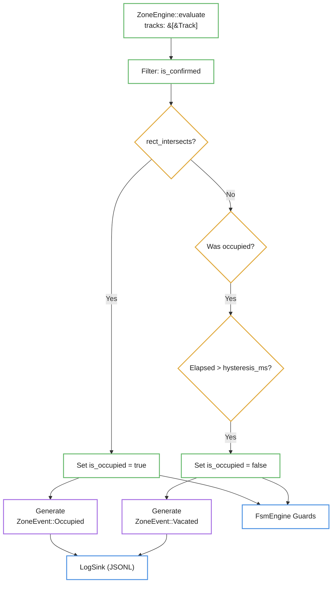
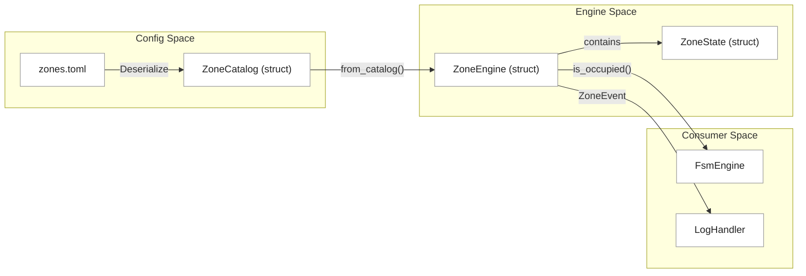

# Zones and Spatial Regions

Relevant source files

- 
- 
- 

Zones in `kik8` define semantic rectangular areas within the camera's field of view used to monitor person occupancy. Unlike raw detections, zones provide a stable, hysteresis-backed state that informs Finite State Machine (FSM) transitions and generates structured occupancy events.

## Configuration and Data Structures

Zones are defined in the `config/zones.toml` file [config/zones.toml1-44](https://github.com/ernestovisiona-netizen/kik8/blob/43a92847/config/zones.toml#L1-L44) This file maps unique zone names (e.g., `bed`, `door`) to their spatial coordinates and behavior parameters.

### Zone Definition

The `ZoneEntry` struct represents the configuration for a single region:

- **Coordinates**: `x1, y1, x2, y2` defining the rectangle in the source frame coordinate space [src/config/zones.rs14-17](https://github.com/ernestovisiona-netizen/kik8/blob/43a92847/src/config/zones.rs#L14-L17)
- **Label**: An optional human-readable name used for logging [src/config/zones.rs19](https://github.com/ernestovisiona-netizen/kik8/blob/43a92847/src/config/zones.rs#L19-L19)
- **Hysteresis**: `hysteresis_ms` defines the delay required before a zone is considered "vacated" after tracks stop intersecting with it [src/config/zones.rs21](https://github.com/ernestovisiona-netizen/kik8/blob/43a92847/src/config/zones.rs#L21-L21)

### Zone Catalog

The `ZoneCatalog` acts as the container for all defined regions, including a specialized (optional) `face_dwell` zone often used for face-tracking logic [src/config/zones.rs5-10](https://github.com/ernestovisiona-netizen/kik8/blob/43a92847/src/config/zones.rs#L5-L10)

|Zone Type|Description|
|---|---|
|`zones`|A map of general occupancy regions (e.g., bed, chair, floor) [src/config/zones.rs7](https://github.com/ernestovisiona-netizen/kik8/blob/43a92847/src/config/zones.rs#L7-L7)|
|`face_dwell`|A specialized region typically used by the Face Dwell FSM to trigger high-confidence face searching [src/config/zones.rs9](https://github.com/ernestovisiona-netizen/kik8/blob/43a92847/src/config/zones.rs#L9-L9)|

**Sources:** [config/zones.toml1-44](https://github.com/ernestovisiona-netizen/kik8/blob/43a92847/config/zones.toml#L1-L44) [src/config/zones.rs4-28](https://github.com/ernestovisiona-netizen/kik8/blob/43a92847/src/config/zones.rs#L4-L28)

---

## ZoneEngine Implementation

The `ZoneEngine` is responsible for evaluating the intersection between active tracks and configured zones. It maintains the internal state of each zone to apply temporal smoothing.

### Spatial Evaluation Logic

For every frame, the engine performs the following:

1. **Track Filtering**: Only tracks marked as `is_confirmed` are considered for occupancy [src/zones.rs71](https://github.com/ernestovisiona-netizen/kik8/blob/43a92847/src/zones.rs#L71-L71)
2. **Intersection**: The engine uses AABB (Axis-Aligned Bounding Box) intersection to check if a `Track` overlaps with a `ZoneState` rectangle [src/zones.rs133-135](https://github.com/ernestovisiona-netizen/kik8/blob/43a92847/src/zones.rs#L133-L135)
3. **State Transition**:
    - **Occupied**: Triggered immediately when at least one confirmed track intersects the zone [src/zones.rs76-80](https://github.com/ernestovisiona-netizen/kik8/blob/43a92847/src/zones.rs#L76-L80)
    - **Vacated**: Triggered only after the zone has been empty for a duration exceeding `hysteresis_ms` [src/zones.rs94-99](https://github.com/ernestovisiona-netizen/kik8/blob/43a92847/src/zones.rs#L94-L99)

### Zone State Management

The `ZoneState` struct tracks the real-time status of a region:

- `is_occupied`: Boolean flag for the current state [src/zones.rs31](https://github.com/ernestovisiona-netizen/kik8/blob/43a92847/src/zones.rs#L31-L31)
- `occupied_by`: A list of `track_id`s currently inside the zone [src/zones.rs32](https://github.com/ernestovisiona-netizen/kik8/blob/43a92847/src/zones.rs#L32-L32)
- `vacated_since`: A timestamp used to calculate hysteresis elapsed time [src/zones.rs33](https://github.com/ernestovisiona-netizen/kik8/blob/43a92847/src/zones.rs#L33-L33)

### Entity Mapping: Logic to Code

This diagram maps the logical flow of track evaluation to the internal `ZoneEngine` methods.

**Zone Evaluation Flow**

**Sources:** [src/zones.rs27-62](https://github.com/ernestovisiona-netizen/kik8/blob/43a92847/src/zones.rs#L27-L62) [src/zones.rs64-114](https://github.com/ernestovisiona-netizen/kik8/blob/43a92847/src/zones.rs#L64-L114) [src/zones.rs133-135](https://github.com/ernestovisiona-netizen/kik8/blob/43a92847/src/zones.rs#L133-L135)

---

## Integration with FSM and Metrics

Zones serve as primary inputs for the system's decision-making and observability layers.

### FSM Guards

The `ZoneEngine` provides helper methods that the `FsmEngine` calls during guard evaluation:

- `is_occupied(zone_name)`: Returns true if the named zone is currently active [src/zones.rs120-122](https://github.com/ernestovisiona-netizen/kik8/blob/43a92847/src/zones.rs#L120-L122) This supports the `zone_occupied` and `zone_vacated` FSM guards.
- `all_vacant()`: Returns true if no zones in the catalog are occupied [src/zones.rs116-118](https://github.com/ernestovisiona-netizen/kik8/blob/43a92847/src/zones.rs#L116-L118) This supports the `all_zones_vacant` guard.

### Event Logging

When a zone state changes, the engine produces `ZoneEvent` variants [src/zones.rs9-25](https://github.com/ernestovisiona-netizen/kik8/blob/43a92847/src/zones.rs#L9-L25) These are converted into structured `Event` logs via `zone_event_to_log` [src/zones.rs137-159](https://github.com/ernestovisiona-netizen/kik8/blob/43a92847/src/zones.rs#L137-L159)

**Data Flow: Configuration to FSM**

### Metrics and Labels

Each zone event includes the `class` (e.g., "person") and `confidence` of the track that triggered the occupancy [src/zones.rs125-131](https://github.com/ernestovisiona-netizen/kik8/blob/43a92847/src/zones.rs#L125-L131) This allows downstream analytics to distinguish between different types of occupancy and the reliability of the trigger.

**Sources:** [src/zones.rs116-123](https://github.com/ernestovisiona-netizen/kik8/blob/43a92847/src/zones.rs#L116-L123) [src/zones.rs137-159](https://github.com/ernestovisiona-netizen/kik8/blob/43a92847/src/zones.rs#L137-L159) [src/zones.rs9-25](https://github.com/ernestovisiona-netizen/kik8/blob/43a92847/src/zones.rs#L9-L25)

