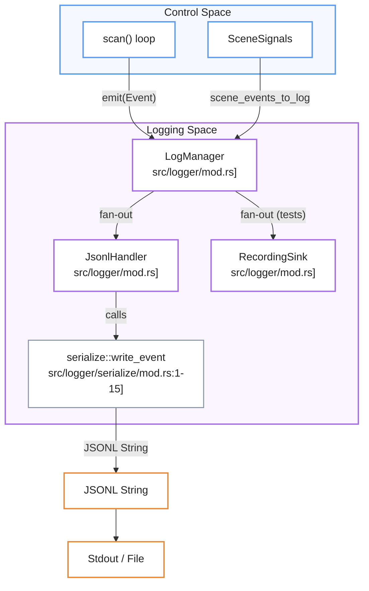
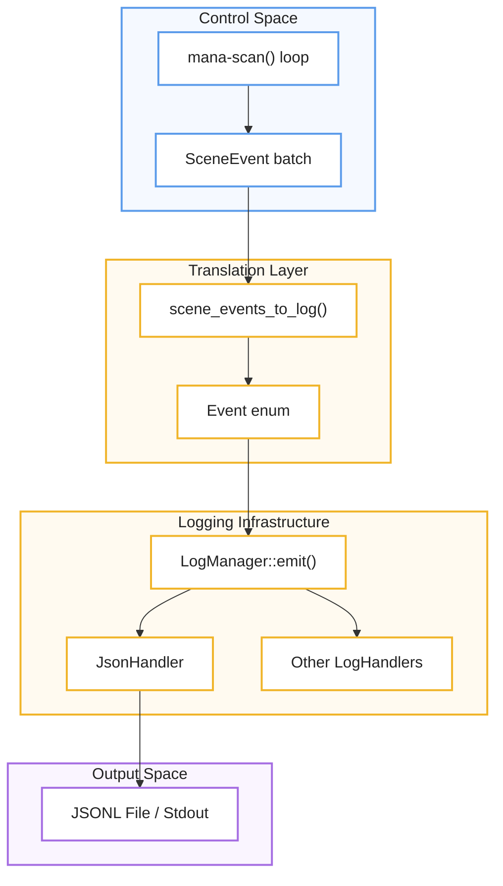
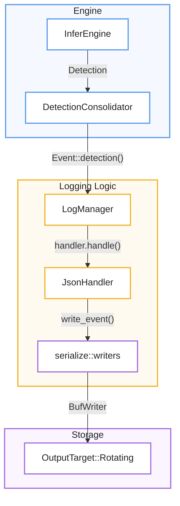

# Logging and Telemetry
Este sistema de registro y telemetría utiliza un **diseño de distribución centralizado** para monitorear el estado interno y el rendimiento de un proceso técnico mediante una **taxonomía de eventos estructurada**. El núcleo de la arquitectura emplea un gestor que reparte datos a múltiples destinos simultáneos, garantizando una alta eficiencia mediante **estrategias de serialización manual** que evitan el consumo excesivo de memoria. Su propósito principal es facilitar el análisis detallado de métricas de percepción, control y salud del sistema a través de un **formato JSONL versionado**, optimizado específicamente para entornos de baja latencia. En conjunto, el documento detalla cómo la infraestructura transforma sucesos complejos del dominio en información analítica precisa sin comprometer la **velocidad de ejecución del ciclo principal**.

Relevant source files

- [](core/mana-control/src/signals/mod.rs)
- [](src/logger/mod.rs)
- [](src/logger/serialize/control.rs)
- [](src/logger/tests.rs)

The logging and telemetry system provides a structured, high-performance mechanism for capturing the internal state, decisions, and performance metrics of the pipeline. It is designed around a central `Event` taxonomy that decouples domain logic from specific output formats or storage backends.

## System Architecture

The architecture uses a fan-out pattern where a central manager distributes structured events to one or more handlers. This allows simultaneous logging to standard output, rotating files, and in-memory buffers for testing.

### Event Fan-out and Management

The `LogManager` serves as the primary implementation of the `LogSink` trait [src/logger/mod.rs19-23](src/logger/mod.rs#L19-L23) It maintains a collection of `LogHandler` implementations [src/logger/mod.rs55-61](src/logger/mod.rs#L55-L61) When an event is emitted, the `LogManager` clones it for each handler, ensuring the final handler in the chain takes ownership of the event to minimize unnecessary allocations [src/logger/mod.rs122-133](src/logger/mod.rs#L122-L133)

### Natural Language to Code Entity Mapping

|System Concept|Code Entity|Role|
|---|---|---|
|**Event Sink**|`LogSink` [src/logger/mod.rs19](src/logger/mod.rs#L19-L19)|Interface for components to emit events.|
|**Manager**|`LogManager` [src/logger/mod.rs63](src/logger/mod.rs#L63-L63)|Orchestrates event distribution to handlers.|
|**Output Handler**|`JsonlHandler` [src/logger/mod.rs68](src/logger/mod.rs#L68-L68)|Serializes events to JSONL for files or stdout.|
|**Telemetry Line**|`Event` [src/logger/event/mod.rs:21](src/logger/event/mod.rs#L21-L21)|Enum representing all loggable domain occurrences.|

### Component Interaction Diagram


```
🔵 Control Space
   │
   │ Event
   ▼
🟣 Logging Space
   │
   ├── JsonlHandler ──► serialize::write_event
   │                         │
   │                         ▼
   │                    JSONL String
   │                         │
   │                         ▼
   │                    🟠 Stdout / File
   │
   └── RecordingSink
          (tests)
```

**Sources:** [src/logger/mod.rs63-83](src/logger/mod.rs#L63-L83) [src/logger/mod.rs122-133](src/logger/mod.rs#L122-L133) [src/logger/serialize/mod.rs1-15](src/logger/serialize/mod.rs#L1-L15)

---

## Event Taxonomy

All telemetry is typed via the `Event` enum. This ensures that every log line follows a strict schema, facilitating downstream analysis and visualization.

- **Perception Events**: Detections, depth measurements, and tracking updates.
- **Control Events**: Presence state changes, zone occupancy, and FSM transitions.
- **System Events**: Health status, metadata (startup/shutdown), and performance metrics.
- **Signal Snapshots**: The complete state of the `SceneSignals` system for a specific cycle.

For a complete list of event types and their constructors, see **[Event Model and LogManager](5.1-event-model-and-logmanager)**.

---

## JSONL Serialization

To maximize performance and minimize latency jitter in the high-frequency control loop, the system avoids generic reflection-based serialization (like `serde-json`). Instead, it uses a manual, buffer-oriented serialization strategy.

### Schema Versioning

The system implements a versioned schema (currently `JSONL_SCHEMA_VERSION = 2`) [src/logger/event/mod.rs:18](src/logger/event/mod.rs#L18-L18) This allows the log format to evolve while maintaining compatibility with ingestion tools.

### Serialization Strategy

- **Zero-Allocation Paths**: Frequent events like `Detection` and `Entity` use pre-allocated buffers and specialized writers for floats and integers [src/logger/serialize/writers.rs:55-109](src/logger/serialize/writers.rs#L55-L109)
- **RLE Masking**: Segmentation masks are serialized using a Run-Length Encoding (RLE) approach (`CompactMask`) to keep log sizes manageable [src/logger/serialize/detection.rs:78-126](src/logger/serialize/detection.rs#L78-L126)
- **Null Handling**: Optional scalar and depth fields are kept present in the schema and written as `null` when unavailable [src/logger/serialize/writers.rs:51-93](src/logger/serialize/writers.rs#L51-L93); absent scene signals are marked `"absent":true` rather than dropped [src/logger/serialize/control.rs:283](src/logger/serialize/control.rs#L283-L283) [src/logger/tests.rs142-163](src/logger/tests.rs#L142-L163)

For technical details on the serialization implementation, see **[JSONL Serialization](5.2-jsonl-serialization)**.

---

## Metrics and Performance Tracking

The `MetricsEngine` aggregates timing and counter data across the pipeline. It tracks:

- **Inference Latency**: Per-model execution time and post-processing overhead.
- **Ingest Health**: Keyframe selection rates, RTP errors, and decoder lag.
- **Cycle Timing**: Total duration of the `scan()` loop and detection of overruns.

These metrics are periodically flushed as dedicated `Event::Metrics` (`"type":"metrics"`) lines via `PipelineState::emit_metrics` [src/pipeline.rs:91-96](src/pipeline.rs#L91-L96), gated by `enable_metrics`/`set_jsonl_config` settings [src/logger/mod.rs:107-111](src/logger/mod.rs#L107-L111)

For details on metrics collection and reporting intervals, see **[Metrics Engine](5.3-metrics-engine)**.

---

## Child Pages

- **[Event Model and LogManager](5.1-event-model-and-logmanager)**: Details on the `Event` enum, the `LogManager` lifecycle, and event filtering levels (`Debug`, `Info`, `Quiet`).
- **[JSONL Serialization](5.2-jsonl-serialization)**: Deep dive into the manual serialization logic, buffer management, and the `CompactMask` format.
- **[Metrics Engine](5.3-metrics-engine)**: Overview of the `MetricsEngine`, performance counters, and periodic telemetry reporting.

**Sources:**

- [src/logger/mod.rs1-160](src/logger/mod.rs#L1-L160)
- [src/logger/serialize/control.rs1-240](src/logger/serialize/control.rs#L1-L240)
- [src/logger/tests.rs47-191](src/logger/tests.rs#L47-L191)
- [core/mana-control/src/signals/mod.rs1-16](core/mana-control/src/signals/mod.rs#L1-L16)


### On this page

- [Logging and Telemetry](5-logging-and-telemetry#logging-and-telemetry)
- [System Architecture](5-logging-and-telemetry#system-architecture)
- [Event Fan-out and Management](5-logging-and-telemetry#event-fan-out-and-management)
- [Natural Language to Code Entity Mapping](5-logging-and-telemetry#natural-language-to-code-entity-mapping)
- [Component Interaction Diagram](5-logging-and-telemetry#component-interaction-diagram)
- [Event Taxonomy](5-logging-and-telemetry#event-taxonomy)
- [JSONL Serialization](5-logging-and-telemetry#jsonl-serialization)
- [Schema Versioning](5-logging-and-telemetry#schema-versioning)
- [Serialization Strategy](5-logging-and-telemetry#serialization-strategy)
- [Metrics and Performance Tracking](5-logging-and-telemetry#metrics-and-performance-tracking)
- [Child Pages](5-logging-and-telemetry#child-pages)
# Event Model and LogManager
Este documento técnico describe un **sistema de telemetría de alto rendimiento** diseñado para capturar y procesar eventos provenientes de los procesos de percepción y control de una aplicación. El núcleo de esta arquitectura es el **modelo de eventos estructurado**, el cual organiza diversas ocurrencias del sistema —como detecciones de objetos, estados de salud y transiciones lógicas— mediante una taxonomía clara y etiquetas de sincronización denominadas **ControlStamp**. La distribución de estos datos es gestionada por el **LogManager**, un componente central que utiliza un diseño de abanico para repartir la información hacia múltiples controladores o **LogHandlers** especializados. Finalmente, el sistema garantiza la eficiencia operativa mediante un **proceso de filtrado y serialización manual** en formato JSONL, permitiendo que solo la información relevante sea almacenada o transmitida sin comprometer la velocidad del procesamiento principal.

Relevant source files

- [](core/mana-control/src/signals/mod.rs)
- [](core/mana-control/src/zones.rs)
- [](src/logger/event/constructors.rs)
- [](src/logger/event/mod.rs)
- [](src/logger/event/records.rs)
- [](src/logger/event/scene.rs)
- [](src/logger/mod.rs)
- [](src/logger/serialize/control.rs)
- [](src/logger/serialize/detection.rs)
- [](src/logger/tests.rs)

The `logger` module provides a structured, high-performance telemetry system designed to capture domain events from both the perception pipeline and the control system. It utilizes a fan-out architecture where a central `LogManager` distributes events to multiple `LogHandler` implementations, such as JSONL file writers or diagnostic streams [src/logger/mod.rs53-61](src/logger/mod.rs#L53-L61)

## The Event Model

The system centers around the `Event` enum, which represents all observable occurrences within the application [src/logger/event/mod.rs21-158](src/logger/event/mod.rs#L21-L158) Every event is categorized by a `JsonlLevel` (Debug, Info, or Quiet) to facilitate filtering [src/logger/event/mod.rs160-166](src/logger/event/mod.rs#L160-L166)

### Event Taxonomy

The `Event` enum contains several variants, each with specialized constructors in `logger/event/constructors.rs`:

|Event Variant|Purpose|Key Data Fields|
|---|---|---|
|`Meta`|System lifecycle and configuration.|`event` (startup/shutdown), `version`, `config` [src/logger/event/mod.rs22-26](src/logger/event/mod.rs#L22-L26)|
|`Health`|Heartbeats and component staleness.|`cycle_us`, `message`, `frame_id` [src/logger/event/mod.rs27-32](src/logger/event/mod.rs#L27-L32)|
|`Detection`|Raw model output per frame.|`model`, `infer_ms`, `detections: Vec<DetRecord>`, `crop` [src/logger/event/mod.rs39-49](src/logger/event/mod.rs#L39-L49)|
|`Depth`|Depth sensing results (v2).|`roi`, `valid_ratio`, `min_depth_m`, `max_depth_m` [src/logger/event/mod.rs50-63](src/logger/event/mod.rs#L50-L63)|
|`Entity`|Tracked objects in the scene.|`track_id`, `class`, `bbox`, `ControlStamp` [src/logger/event/mod.rs85-94](src/logger/event/mod.rs#L85-L94)|
|`Zone`|Spatial occupancy changes.|`zone`, `event` (occupied/vacated), `confidence` [src/logger/event/mod.rs95-105](src/logger/event/mod.rs#L95-L105)|
|`Fsm`|State machine transitions.|`from`, `to`, `trigger`, `dwell_ms` [src/logger/event/mod.rs106-113](src/logger/event/mod.rs#L106-L113)|
|`Presence`|Occupancy logic results.|`state`, `poi_state`, `confirmed_count`, `held` [src/logger/event/mod.rs114-132](src/logger/event/mod.rs#L114-L132)|
|`SceneSignals`|System-wide signal snapshot.|`ControlStamp`, `SceneSignalsSnapshot` [src/logger/event/mod.rs133-136](src/logger/event/mod.rs#L133-L136)|

**Sources:** [src/logger/event/mod.rs21-158](src/logger/event/mod.rs#L21-L158) [src/logger/event/constructors.rs6-250](src/logger/event/constructors.rs#L6-L250)

## LogManager and Handlers

The `LogManager` implements the `LogSink` trait, serving as the primary entry point for emitting events [src/logger/mod.rs122-152](src/logger/mod.rs#L122-L152) It manages a collection of `Box<dyn LogHandler>` and handles the distribution of events, ensuring the last handler in the chain takes ownership of the event to avoid unnecessary cloning [src/logger/mod.rs123-133](src/logger/mod.rs#L123-L133)

### Key Functions

- `emit(event)`: Dispatches an event to all registered handlers [src/logger/mod.rs123-133](src/logger/mod.rs#L123-L133)
- `with_handlers(handlers)`: Constructs a manager with specific backends [src/logger/mod.rs100-105](src/logger/mod.rs#L100-L105)
- `set_jsonl_config(config)`: Dynamically updates filtering rules (e.g., enabling/disabling specific event types like `depth` or `frame`) for all handlers [src/logger/mod.rs107-111](src/logger/mod.rs#L107-L111)
- `shutdown(reason)`: Emits a final `Meta` event with uptime stats and flushes all handlers [src/logger/mod.rs141-151](src/logger/mod.rs#L141-L151)

### LogHandler Trait

Any output backend must implement the `LogHandler` trait [src/logger/mod.rs55-61](src/logger/mod.rs#L55-L61):

- `handle(&mut self, event: Event)`: Process a single event.
- `flush(&mut self)`: Commit buffered events to the underlying storage.
- `configure_jsonl(&mut self, config: MetricsJsonlConfig)`: Apply fine-grained event filtering.

**Sources:** [src/logger/mod.rs19-23](src/logger/mod.rs#L19-L23) [src/logger/mod.rs55-158](src/logger/mod.rs#L55-L158)

## Data Flow: Perception to Log

The system translates internal control and perception structures into the `Event` model using a dedicated translation layer.

### Scene Event Translation

The `scene_events_to_log` function acts as a bridge, converting a batch of `SceneEvent` objects (generated by the `mana-control` scan loop) into `Event` variants [src/logger/event/scene.rs112-141](src/logger/event/scene.rs#L112-L141)

### ControlStamp Synchronization 🔵 Input → 🟡 Translation/Logic → 🟣 Observability → 🟣 Output

Events generated during the control cycle (Entity, Zone, Presence, FSM) are synchronized using a `ControlStamp`. This structure ensures that downstream consumers can correlate events with the specific scan sequence and the evidence frame that triggered the logic [src/logger/event/scene.rs52-72](src/logger/event/scene.rs#L52-L72)



```
🔵 Control Space
   mana-scan() loop
          ↓
   SceneEvent batch
          ↓
🟡 Translation Layer
   scene_events_to_log()
          ↓
   Event enum
          ↓
🟡 Logging Infrastructure
   LogManager::emit()
       ↙          ↘
 JsonHandler   Other LogHandlers
      ↓
🟣 Output Space
 JSONL File / Stdout
```
🔵 Input → 🟡 Translation/Logic → 🟣 Observability → 🟣 Output
**Sources:** [src/logger/event/scene.rs112-141](src/logger/event/scene.rs#L112-L141) [src/logger/event/constructors.rs167-226](src/logger/event/constructors.rs#L167-L226)

## JSONL Serialization and Filtering

The `JsonlHandler` performs the actual serialization. It uses a manual, buffer-oriented approach (via `serialize/mod.rs`) to avoid the overhead of generic serialization frameworks while maintaining a versioned schema (`JSONL_SCHEMA_VERSION = 2`) [src/logger/event/mod.rs18](src/logger/event/mod.rs#L18-L18) [src/logger/serialize/mod.rs9](src/logger/serialize/mod.rs#L9-L9)

### Level and Type Filtering

Events are filtered twice before being buffered for writing:

1. **Level Filter**: The `JsonlLevel` (Debug, Info, Quiet) must be allowed by the handler's configured level [src/logger/mod.rs213-217](src/logger/mod.rs#L213-L217)
2. **Config Filter**: The `MetricsJsonlConfig` (provided via `AppConfig`) allows users to toggle specific high-volume event types, such as `depth` or `frame` ingest events [src/logger/mod.rs214](src/logger/mod.rs#L214-L214)

### Data Flow Diagram: Code Entities

This diagram maps the code entities involved in moving a detection from the engine to the final log file.



**🔵 Engine**
`InferEngine → DetectionConsolidator`
Produce:
`Event::detection()`
↓
**🟡 Logging Logic**
`LogManager → JsonHandler → serialize::writers`
↓
**🟣 Storage**
`BufWriter → OutputTarget::Rotating`

**Sources:** [src/logger/mod.rs174-211](src/logger/mod.rs#L174-L211) [src/logger/mod.rs213-232](src/logger/mod.rs#L213-L232) [src/logger/serialize/detection.rs6-53](src/logger/serialize/detection.rs#L6-L53) [src/logger/serialize/control.rs6-122](src/logger/serialize/control.rs#L6-L122)


### On this page

- [Event Model and LogManager](5.1-event-model-and-logmanager#event-model-and-logmanager)
- [The Event Model](5.1-event-model-and-logmanager#the-event-model)
- [Event Taxonomy](5.1-event-model-and-logmanager#event-taxonomy)
- [LogManager and Handlers](5.1-event-model-and-logmanager#logmanager-and-handlers)
- [Key Functions](5.1-event-model-and-logmanager#key-functions)
- [LogHandler Trait](5.1-event-model-and-logmanager#loghandler-trait)
- [Data Flow: Perception to Log](5.1-event-model-and-logmanager#data-flow-perception-to-log)
- [Scene Event Translation](5.1-event-model-and-logmanager#scene-event-translation)
- [ControlStamp Synchronization](5.1-event-model-and-logmanager#controlstamp-synchronization)
- [JSONL Serialization and Filtering](5.1-event-model-and-logmanager#jsonl-serialization-and-filtering)
- [Level and Type Filtering](5.1-event-model-and-logmanager#level-and-type-filtering)
- [Data Flow Diagram: Code Entities](5.1-event-model-and-logmanager#data-flow-diagram-code-entities)
