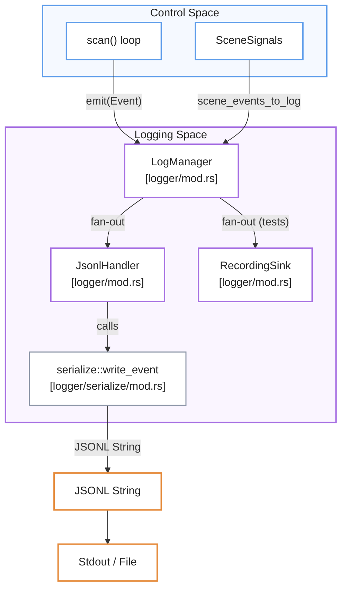

# Logging and Telemetry
Este sistema de registro y telemetría utiliza un **diseño de distribución centralizado** para monitorear el estado interno y el rendimiento de un proceso técnico mediante una **taxonomía de eventos estructurada**. El núcleo de la arquitectura emplea un gestor que reparte datos a múltiples destinos simultáneos, garantizando una alta eficiencia mediante **estrategias de serialización manual** que evitan el consumo excesivo de memoria. Su propósito principal es facilitar el análisis detallado de métricas de percepción, control y salud del sistema a través de un **formato JSONL versionado**, optimizado específicamente para entornos de baja latencia. En conjunto, el documento detalla cómo la infraestructura transforma sucesos complejos del dominio en información analítica precisa sin comprometer la **velocidad de ejecución del ciclo principal**.

Relevant source files

- [](https://github.com/kerrvisiona-sudo/endeli/blob/ad24740d/core/mana-control/src/signals/mod.rs)
- [](https://github.com/kerrvisiona-sudo/endeli/blob/ad24740d/logger/mod.rs)
- [](https://github.com/kerrvisiona-sudo/endeli/blob/ad24740d/logger/serialize/control.rs)
- [](https://github.com/kerrvisiona-sudo/endeli/blob/ad24740d/logger/tests.rs)

The logging and telemetry system provides a structured, high-performance mechanism for capturing the internal state, decisions, and performance metrics of the pipeline. It is designed around a central `Event` taxonomy that decouples domain logic from specific output formats or storage backends.

## System Architecture

The architecture uses a fan-out pattern where a central manager distributes structured events to one or more handlers. This allows simultaneous logging to standard output, rotating files, and in-memory buffers for testing.

### Event Fan-out and Management

The `LogManager` serves as the primary implementation of the `LogSink` trait [logger/mod.rs19-23](https://github.com/kerrvisiona-sudo/endeli/blob/ad24740d/logger/mod.rs#L19-L23) It maintains a collection of `LogHandler` implementations [logger/mod.rs55-61](https://github.com/kerrvisiona-sudo/endeli/blob/ad24740d/logger/mod.rs#L55-L61) When an event is emitted, the `LogManager` clones it for each handler, ensuring the final handler in the chain takes ownership of the event to minimize unnecessary allocations [logger/mod.rs122-133](https://github.com/kerrvisiona-sudo/endeli/blob/ad24740d/logger/mod.rs#L122-L133)

### Natural Language to Code Entity Mapping

|System Concept|Code Entity|Role|
|---|---|---|
|**Event Sink**|`LogSink` [logger/mod.rs19](https://github.com/kerrvisiona-sudo/endeli/blob/ad24740d/logger/mod.rs#L19-L19)|Interface for components to emit events.|
|**Manager**|`LogManager` [logger/mod.rs63](https://github.com/kerrvisiona-sudo/endeli/blob/ad24740d/logger/mod.rs#L63-L63)|Orchestrates event distribution to handlers.|
|**Output Handler**|`JsonlHandler` [logger/mod.rs68](https://github.com/kerrvisiona-sudo/endeli/blob/ad24740d/logger/mod.rs#L68-L68)|Serializes events to JSONL for files or stdout.|
|**Telemetry Line**|`Event` [logger/event.rs15](https://github.com/kerrvisiona-sudo/endeli/blob/ad24740d/logger/event.rs#L15-L15)|Enum representing all loggable domain occurrences.|

### Component Interaction Diagram


```
🔵 Control Space
   │
   │ Event
   ▼
🟣 Logging Space
   │
   ├── JsonlHandler ──► serialize::write_event
   │                         │
   │                         ▼
   │                    JSONL String
   │                         │
   │                         ▼
   │                    🟠 Stdout / File
   │
   └── RecordingSink
          (tests)
```

**Sources:** [logger/mod.rs63-83](https://github.com/kerrvisiona-sudo/endeli/blob/ad24740d/logger/mod.rs#L63-L83) [logger/mod.rs122-133](https://github.com/kerrvisiona-sudo/endeli/blob/ad24740d/logger/mod.rs#L122-L133) [logger/serialize/mod.rs1-15](https://github.com/kerrvisiona-sudo/endeli/blob/ad24740d/logger/serialize/mod.rs#L1-L15)

---

## Event Taxonomy

All telemetry is typed via the `Event` enum. This ensures that every log line follows a strict schema, facilitating downstream analysis and visualization.

- **Perception Events**: Detections, depth measurements, and tracking updates.
- **Control Events**: Presence state changes, zone occupancy, and FSM transitions.
- **System Events**: Health status, metadata (startup/shutdown), and performance metrics.
- **Signal Snapshots**: The complete state of the `SceneSignals` system for a specific cycle.

For a complete list of event types and their constructors, see **[Event Model and LogManager](https://deepwiki.com/kerrvisiona-sudo/endeli/5.1-event-model-and-logmanager)**.

---

## JSONL Serialization

To maximize performance and minimize latency jitter in the high-frequency control loop, the system avoids generic reflection-based serialization (like `serde-json`). Instead, it uses a manual, buffer-oriented serialization strategy.

### Schema Versioning

The system implements a versioned schema (currently `JSONL_SCHEMA_VERSION = 2`) [logger/serialize/mod.rs17](https://github.com/kerrvisiona-sudo/endeli/blob/ad24740d/logger/serialize/mod.rs#L17-L17) This allows the log format to evolve while maintaining compatibility with ingestion tools.

### Serialization Strategy

- **Zero-Allocation Paths**: Frequent events like `Detection` and `Entity` use pre-allocated buffers and specialized writers for floats and integers [logger/serialize/writers.rs1-20](https://github.com/kerrvisiona-sudo/endeli/blob/ad24740d/logger/serialize/writers.rs#L1-L20)
- **RLE Masking**: Segmentation masks are serialized using a Run-Length Encoding (RLE) approach (`CompactMask`) to keep log sizes manageable [logger/serialize/perception.rs105-120](https://github.com/kerrvisiona-sudo/endeli/blob/ad24740d/logger/serialize/perception.rs#L105-L120)
- **Null Handling**: The schema explicitly handles absent signals and optional depth data by writing `null` rather than omitting keys [logger/tests.rs142-163](https://github.com/kerrvisiona-sudo/endeli/blob/ad24740d/logger/tests.rs#L142-L163)

For technical details on the serialization implementation, see **[JSONL Serialization](https://deepwiki.com/kerrvisiona-sudo/endeli/5.2-jsonl-serialization)**.

---

## Metrics and Performance Tracking

The `MetricsEngine` aggregates timing and counter data across the pipeline. It tracks:

- **Inference Latency**: Per-model execution time and post-processing overhead.
- **Ingest Health**: Keyframe selection rates, RTP errors, and decoder lag.
- **Cycle Timing**: Total duration of the `scan()` loop and detection of overruns.

These metrics are periodically flushed as specialized `Event::Meta` or `Event::SceneSignals` lines depending on configuration [logger/mod.rs107-111](https://github.com/kerrvisiona-sudo/endeli/blob/ad24740d/logger/mod.rs#L107-L111)

For details on metrics collection and reporting intervals, see **[Metrics Engine](https://deepwiki.com/kerrvisiona-sudo/endeli/5.3-metrics-engine)**.

---

## Child Pages

- **[Event Model and LogManager](https://deepwiki.com/kerrvisiona-sudo/endeli/5.1-event-model-and-logmanager)**: Details on the `Event` enum, the `LogManager` lifecycle, and event filtering levels (`Debug`, `Info`, `Quiet`).
- **[JSONL Serialization](https://deepwiki.com/kerrvisiona-sudo/endeli/5.2-jsonl-serialization)**: Deep dive into the manual serialization logic, buffer management, and the `CompactMask` format.
- **[Metrics Engine](https://deepwiki.com/kerrvisiona-sudo/endeli/5.3-metrics-engine)**: Overview of the `MetricsEngine`, performance counters, and periodic telemetry reporting.

**Sources:**

- [logger/mod.rs1-160](https://github.com/kerrvisiona-sudo/endeli/blob/ad24740d/logger/mod.rs#L1-L160)
- [logger/serialize/control.rs1-240](https://github.com/kerrvisiona-sudo/endeli/blob/ad24740d/logger/serialize/control.rs#L1-L240)
- [logger/tests.rs47-191](https://github.com/kerrvisiona-sudo/endeli/blob/ad24740d/logger/tests.rs#L47-L191)
- [core/mana-control/src/signals/mod.rs1-16](https://github.com/kerrvisiona-sudo/endeli/blob/ad24740d/core/mana-control/src/signals/mod.rs#L1-L16)


### On this page

- [Logging and Telemetry](https://deepwiki.com/kerrvisiona-sudo/endeli/5-logging-and-telemetry#logging-and-telemetry)
- [System Architecture](https://deepwiki.com/kerrvisiona-sudo/endeli/5-logging-and-telemetry#system-architecture)
- [Event Fan-out and Management](https://deepwiki.com/kerrvisiona-sudo/endeli/5-logging-and-telemetry#event-fan-out-and-management)
- [Natural Language to Code Entity Mapping](https://deepwiki.com/kerrvisiona-sudo/endeli/5-logging-and-telemetry#natural-language-to-code-entity-mapping)
- [Component Interaction Diagram](https://deepwiki.com/kerrvisiona-sudo/endeli/5-logging-and-telemetry#component-interaction-diagram)
- [Event Taxonomy](https://deepwiki.com/kerrvisiona-sudo/endeli/5-logging-and-telemetry#event-taxonomy)
- [JSONL Serialization](https://deepwiki.com/kerrvisiona-sudo/endeli/5-logging-and-telemetry#jsonl-serialization)
- [Schema Versioning](https://deepwiki.com/kerrvisiona-sudo/endeli/5-logging-and-telemetry#schema-versioning)
- [Serialization Strategy](https://deepwiki.com/kerrvisiona-sudo/endeli/5-logging-and-telemetry#serialization-strategy)
- [Metrics and Performance Tracking](https://deepwiki.com/kerrvisiona-sudo/endeli/5-logging-and-telemetry#metrics-and-performance-tracking)
- [Child Pages](https://deepwiki.com/kerrvisiona-sudo/endeli/5-logging-and-telemetry#child-pages)
