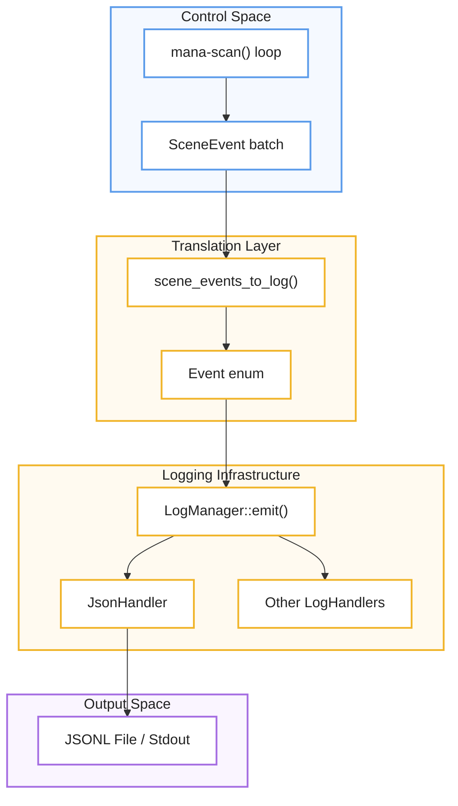
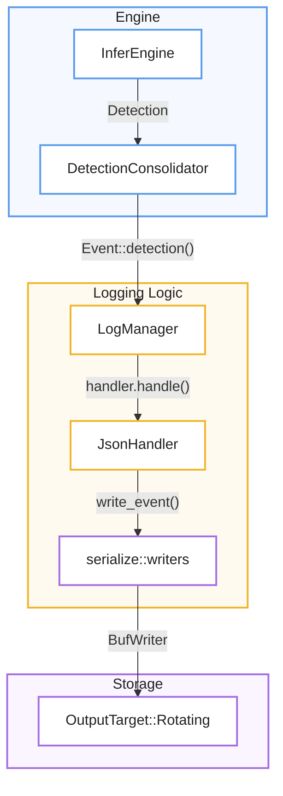

# Event Model and LogManager
Este documento técnico describe un **sistema de telemetría de alto rendimiento** diseñado para capturar y procesar eventos provenientes de los procesos de percepción y control de una aplicación. El núcleo de esta arquitectura es el **modelo de eventos estructurado**, el cual organiza diversas ocurrencias del sistema —como detecciones de objetos, estados de salud y transiciones lógicas— mediante una taxonomía clara y etiquetas de sincronización denominadas **ControlStamp**. La distribución de estos datos es gestionada por el **LogManager**, un componente central que utiliza un diseño de abanico para repartir la información hacia múltiples controladores o **LogHandlers** especializados. Finalmente, el sistema garantiza la eficiencia operativa mediante un **proceso de filtrado y serialización manual** en formato JSONL, permitiendo que solo la información relevante sea almacenada o transmitida sin comprometer la velocidad del procesamiento principal.

Relevant source files

- [](https://github.com/kerrvisiona-sudo/endeli/blob/ad24740d/core/mana-control/src/signals/mod.rs)
- [](https://github.com/kerrvisiona-sudo/endeli/blob/ad24740d/core/mana-control/src/zones.rs)
- [](https://github.com/kerrvisiona-sudo/endeli/blob/ad24740d/logger/event/constructors.rs)
- [](https://github.com/kerrvisiona-sudo/endeli/blob/ad24740d/logger/event/mod.rs)
- [](https://github.com/kerrvisiona-sudo/endeli/blob/ad24740d/logger/event/records.rs)
- [](https://github.com/kerrvisiona-sudo/endeli/blob/ad24740d/logger/event/scene.rs)
- [](https://github.com/kerrvisiona-sudo/endeli/blob/ad24740d/logger/mod.rs)
- [](https://github.com/kerrvisiona-sudo/endeli/blob/ad24740d/logger/serialize/control.rs)
- [](https://github.com/kerrvisiona-sudo/endeli/blob/ad24740d/logger/serialize/detection.rs)
- [](https://github.com/kerrvisiona-sudo/endeli/blob/ad24740d/logger/tests.rs)

The `logger` module provides a structured, high-performance telemetry system designed to capture domain events from both the perception pipeline and the control system. It utilizes a fan-out architecture where a central `LogManager` distributes events to multiple `LogHandler` implementations, such as JSONL file writers or diagnostic streams [logger/mod.rs53-61](https://github.com/kerrvisiona-sudo/endeli/blob/ad24740d/logger/mod.rs#L53-L61)

## The Event Model

The system centers around the `Event` enum, which represents all observable occurrences within the application [logger/event/mod.rs21-158](https://github.com/kerrvisiona-sudo/endeli/blob/ad24740d/logger/event/mod.rs#L21-L158) Every event is categorized by a `JsonlLevel` (Debug, Info, or Quiet) to facilitate filtering [logger/event/mod.rs160-166](https://github.com/kerrvisiona-sudo/endeli/blob/ad24740d/logger/event/mod.rs#L160-L166)

### Event Taxonomy

The `Event` enum contains several variants, each with specialized constructors in `logger/event/constructors.rs`:

|Event Variant|Purpose|Key Data Fields|
|---|---|---|
|`Meta`|System lifecycle and configuration.|`event` (startup/shutdown), `version`, `config` [logger/event/mod.rs22-26](https://github.com/kerrvisiona-sudo/endeli/blob/ad24740d/logger/event/mod.rs#L22-L26)|
|`Health`|Heartbeats and component staleness.|`cycle_us`, `message`, `frame_id` [logger/event/mod.rs27-32](https://github.com/kerrvisiona-sudo/endeli/blob/ad24740d/logger/event/mod.rs#L27-L32)|
|`Detection`|Raw model output per frame.|`model`, `infer_ms`, `detections: Vec<DetRecord>`, `crop` [logger/event/mod.rs39-49](https://github.com/kerrvisiona-sudo/endeli/blob/ad24740d/logger/event/mod.rs#L39-L49)|
|`Depth`|Depth sensing results (v2).|`roi`, `valid_ratio`, `min_depth_m`, `max_depth_m` [logger/event/mod.rs50-63](https://github.com/kerrvisiona-sudo/endeli/blob/ad24740d/logger/event/mod.rs#L50-L63)|
|`Entity`|Tracked objects in the scene.|`track_id`, `class`, `bbox`, `ControlStamp` [logger/event/mod.rs85-94](https://github.com/kerrvisiona-sudo/endeli/blob/ad24740d/logger/event/mod.rs#L85-L94)|
|`Zone`|Spatial occupancy changes.|`zone`, `event` (occupied/vacated), `confidence` [logger/event/mod.rs95-105](https://github.com/kerrvisiona-sudo/endeli/blob/ad24740d/logger/event/mod.rs#L95-L105)|
|`Fsm`|State machine transitions.|`from`, `to`, `trigger`, `dwell_ms` [logger/event/mod.rs106-113](https://github.com/kerrvisiona-sudo/endeli/blob/ad24740d/logger/event/mod.rs#L106-L113)|
|`Presence`|Occupancy logic results.|`state`, `poi_state`, `confirmed_count`, `held` [logger/event/mod.rs114-132](https://github.com/kerrvisiona-sudo/endeli/blob/ad24740d/logger/event/mod.rs#L114-L132)|
|`SceneSignals`|System-wide signal snapshot.|`ControlStamp`, `SceneSignalsSnapshot` [logger/event/mod.rs133-136](https://github.com/kerrvisiona-sudo/endeli/blob/ad24740d/logger/event/mod.rs#L133-L136)|

**Sources:** [logger/event/mod.rs21-158](https://github.com/kerrvisiona-sudo/endeli/blob/ad24740d/logger/event/mod.rs#L21-L158) [logger/event/constructors.rs6-250](https://github.com/kerrvisiona-sudo/endeli/blob/ad24740d/logger/event/constructors.rs#L6-L250)

## LogManager and Handlers

The `LogManager` implements the `LogSink` trait, serving as the primary entry point for emitting events [logger/mod.rs122-152](https://github.com/kerrvisiona-sudo/endeli/blob/ad24740d/logger/mod.rs#L122-L152) It manages a collection of `Box<dyn LogHandler>` and handles the distribution of events, ensuring the last handler in the chain takes ownership of the event to avoid unnecessary cloning [logger/mod.rs123-133](https://github.com/kerrvisiona-sudo/endeli/blob/ad24740d/logger/mod.rs#L123-L133)

### Key Functions

- `emit(event)`: Dispatches an event to all registered handlers [logger/mod.rs123-133](https://github.com/kerrvisiona-sudo/endeli/blob/ad24740d/logger/mod.rs#L123-L133)
- `with_handlers(handlers)`: Constructs a manager with specific backends [logger/mod.rs100-105](https://github.com/kerrvisiona-sudo/endeli/blob/ad24740d/logger/mod.rs#L100-L105)
- `set_jsonl_config(config)`: Dynamically updates filtering rules (e.g., enabling/disabling specific event types like `depth` or `frame`) for all handlers [logger/mod.rs107-111](https://github.com/kerrvisiona-sudo/endeli/blob/ad24740d/logger/mod.rs#L107-L111)
- `shutdown(reason)`: Emits a final `Meta` event with uptime stats and flushes all handlers [logger/mod.rs141-151](https://github.com/kerrvisiona-sudo/endeli/blob/ad24740d/logger/mod.rs#L141-L151)

### LogHandler Trait

Any output backend must implement the `LogHandler` trait [logger/mod.rs55-61](https://github.com/kerrvisiona-sudo/endeli/blob/ad24740d/logger/mod.rs#L55-L61):

- `handle(&mut self, event: Event)`: Process a single event.
- `flush(&mut self)`: Commit buffered events to the underlying storage.
- `configure_jsonl(&mut self, config: MetricsJsonlConfig)`: Apply fine-grained event filtering.

**Sources:** [logger/mod.rs19-23](https://github.com/kerrvisiona-sudo/endeli/blob/ad24740d/logger/mod.rs#L19-L23) [logger/mod.rs55-158](https://github.com/kerrvisiona-sudo/endeli/blob/ad24740d/logger/mod.rs#L55-L158)

## Data Flow: Perception to Log

The system translates internal control and perception structures into the `Event` model using a dedicated translation layer.

### Scene Event Translation

The `scene_events_to_log` function acts as a bridge, converting a batch of `SceneEvent` objects (generated by the `mana-control` scan loop) into `Event` variants [logger/event/scene.rs112-141](https://github.com/kerrvisiona-sudo/endeli/blob/ad24740d/logger/event/scene.rs#L112-L141)

### ControlStamp Synchronization 🔵 Input → 🟡 Translation/Logic → 🟣 Observability → 🟣 Output

Events generated during the control cycle (Entity, Zone, Presence, FSM) are synchronized using a `ControlStamp`. This structure ensures that downstream consumers can correlate events with the specific scan sequence and the evidence frame that triggered the logic [logger/event/scene.rs52-72](https://github.com/kerrvisiona-sudo/endeli/blob/ad24740d/logger/event/scene.rs#L52-L72)



```
🔵 Control Space
   mana-scan() loop
          ↓
   SceneEvent batch
          ↓
🟡 Translation Layer
   scene_events_to_log()
          ↓
   Event enum
          ↓
🟡 Logging Infrastructure
   LogManager::emit()
       ↙          ↘
 JsonHandler   Other LogHandlers
      ↓
🟣 Output Space
 JSONL File / Stdout
```
🔵 Input → 🟡 Translation/Logic → 🟣 Observability → 🟣 Output
**Sources:** [logger/event/scene.rs112-141](https://github.com/kerrvisiona-sudo/endeli/blob/ad24740d/logger/event/scene.rs#L112-L141) [logger/event/constructors.rs167-226](https://github.com/kerrvisiona-sudo/endeli/blob/ad24740d/logger/event/constructors.rs#L167-L226)

## JSONL Serialization and Filtering

The `JsonlHandler` performs the actual serialization. It uses a manual, buffer-oriented approach (via `serialize/mod.rs`) to avoid the overhead of generic serialization frameworks while maintaining a versioned schema (`JSONL_SCHEMA_VERSION = 2`) [logger/event/mod.rs18](https://github.com/kerrvisiona-sudo/endeli/blob/ad24740d/logger/event/mod.rs#L18-L18) [logger/serialize/mod.rs9](https://github.com/kerrvisiona-sudo/endeli/blob/ad24740d/logger/serialize/mod.rs#L9-L9)

### Level and Type Filtering

Events are filtered twice before being buffered for writing:

1. **Level Filter**: The `JsonlLevel` (Debug, Info, Quiet) must be allowed by the handler's configured level [logger/mod.rs213-217](https://github.com/kerrvisiona-sudo/endeli/blob/ad24740d/logger/mod.rs#L213-L217)
2. **Config Filter**: The `MetricsJsonlConfig` (provided via `AppConfig`) allows users to toggle specific high-volume event types, such as `depth` or `frame` ingest events [logger/mod.rs214](https://github.com/kerrvisiona-sudo/endeli/blob/ad24740d/logger/mod.rs#L214-L214)

### Data Flow Diagram: Code Entities

This diagram maps the code entities involved in moving a detection from the engine to the final log file.



**🔵 Engine**
`InferEngine → DetectionConsolidator`
Produce:
`Event::detection()`
↓
**🟡 Logging Logic**
`LogManager → JsonHandler → serialize::writers`
↓
**🟣 Storage**
`BufWriter → OutputTarget::Rotating`

**Sources:** [logger/mod.rs174-211](https://github.com/kerrvisiona-sudo/endeli/blob/ad24740d/logger/mod.rs#L174-L211) [logger/mod.rs213-232](https://github.com/kerrvisiona-sudo/endeli/blob/ad24740d/logger/mod.rs#L213-L232) [logger/serialize/detection.rs6-53](https://github.com/kerrvisiona-sudo/endeli/blob/ad24740d/logger/serialize/detection.rs#L6-L53) [logger/serialize/control.rs6-122](https://github.com/kerrvisiona-sudo/endeli/blob/ad24740d/logger/serialize/control.rs#L6-L122)


### On this page

- [Event Model and LogManager](https://deepwiki.com/kerrvisiona-sudo/endeli/5.1-event-model-and-logmanager#event-model-and-logmanager)
- [The Event Model](https://deepwiki.com/kerrvisiona-sudo/endeli/5.1-event-model-and-logmanager#the-event-model)
- [Event Taxonomy](https://deepwiki.com/kerrvisiona-sudo/endeli/5.1-event-model-and-logmanager#event-taxonomy)
- [LogManager and Handlers](https://deepwiki.com/kerrvisiona-sudo/endeli/5.1-event-model-and-logmanager#logmanager-and-handlers)
- [Key Functions](https://deepwiki.com/kerrvisiona-sudo/endeli/5.1-event-model-and-logmanager#key-functions)
- [LogHandler Trait](https://deepwiki.com/kerrvisiona-sudo/endeli/5.1-event-model-and-logmanager#loghandler-trait)
- [Data Flow: Perception to Log](https://deepwiki.com/kerrvisiona-sudo/endeli/5.1-event-model-and-logmanager#data-flow-perception-to-log)
- [Scene Event Translation](https://deepwiki.com/kerrvisiona-sudo/endeli/5.1-event-model-and-logmanager#scene-event-translation)
- [ControlStamp Synchronization](https://deepwiki.com/kerrvisiona-sudo/endeli/5.1-event-model-and-logmanager#controlstamp-synchronization)
- [JSONL Serialization and Filtering](https://deepwiki.com/kerrvisiona-sudo/endeli/5.1-event-model-and-logmanager#jsonl-serialization-and-filtering)
- [Level and Type Filtering](https://deepwiki.com/kerrvisiona-sudo/endeli/5.1-event-model-and-logmanager#level-and-type-filtering)
- [Data Flow Diagram: Code Entities](https://deepwiki.com/kerrvisiona-sudo/endeli/5.1-event-model-and-logmanager#data-flow-diagram-code-entities)
