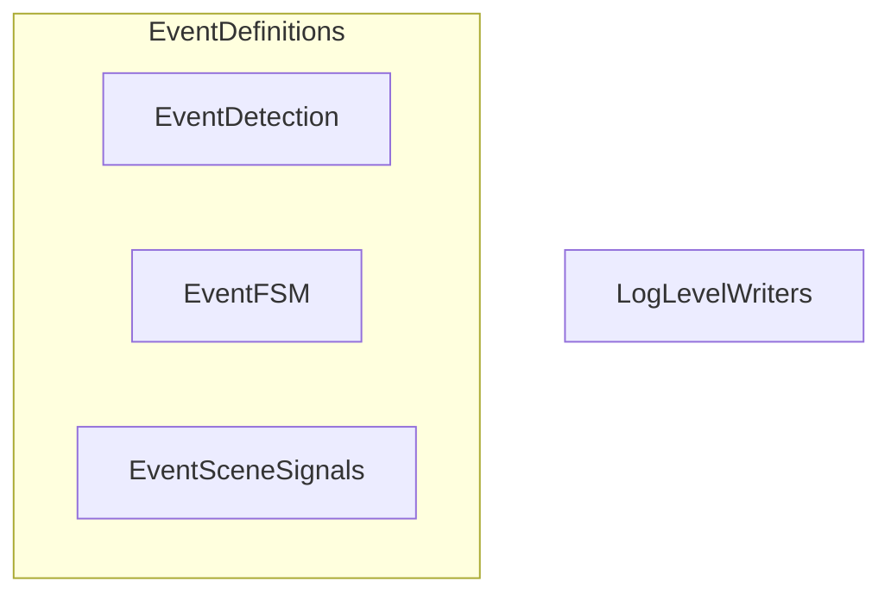

# JSONL Serialization

> ⚠️ **Página generada, desactualizada.** Se generó contra el commit
> `ad24740d`. Divergencias conocidas al 2026-08-12, específicas de esta
> página:
>
> - **Cambiaron los defaults de qué se serializa.** `fsm_events` y `zone_events`
>   pasaron a `true` en `config/metrics.toml`; `face_dwell_events` sigue en
>   `false` por costo. Los tres estaban apagados, y por eso un escenario podía
>   declarar un criterio de aceptación sobre el JSONL que su propia
>   configuración volvía inverificable.
>
> - **El contador `gated` existe en la línea de texto y no en el JSONL.** Se
>   agregó `apagados:N` / `apagado:N` al reporte por stdout para distinguir "el
>   estado del FSM no pidió este modelo" de "la regla lo salteó", pero la
>   serialización por modelo sigue emitiendo sólo `skips`. Está registrado como
>   pendiente: el JSONL es un contrato y ampliarlo es una decisión.
>
> No se corrige a mano: es un archivo **generado** y una corrección manual se
> pierde en la próxima regeneración, además de crear un segundo relato que
> compite con el primero. Lo que corresponde es regenerar contra `HEAD`.
>
> Fuentes autorizadas mientras tanto: [ARCHITECTURE.md](../../ARCHITECTURE.md)
> sobre ejecución, [HANDOFF.md](../../HANDOFF.md) y [`docs/adrs/`](../adrs/)
> sobre estado y decisiones, y [`workshop/MANUAL.md`](../../workshop/MANUAL.md)
> sobre cómo se opera y se lee la salida.

Este documento técnico describe el sistema de registro de datos de **mana-lite**, el cual utiliza una estrategia de **serialización manual y orientada a buffers** para generar logs en formato **JSONL**. A diferencia de las librerías automáticas, este enfoque prioriza el rendimiento al **minimizar la sobrecarga de asignación de memoria** y permitir un control absoluto sobre la representación binaria de datos complejos, como las máscaras de segmentación codificadas mediante **RLE (Run-Length Encoding)**. El sistema se rige por un **esquema de versiones estricto** que asegura la compatibilidad con herramientas externas, integrando mecanismos robustos para el **manejo de valores nulos** y la sanitización de números de punto flotante. En última instancia, la arquitectura centraliza diversas funciones especializadas para transformar eventos de detección, señales de escena y estados de máquinas de procesos en una **salida de datos estructurada y eficiente**.

Relevant source files

- 
- 
- 
- 
- 
- 
- 
- 
- 
- 
- 

The `mana-lite` logging system employs a manual, buffer-oriented serialization strategy to generate structured JSONL (JSON Lines) logs. This approach bypasses standard reflection-based serialization libraries (like `serde`) to minimize allocation overhead and provide precise control over the binary representation of events, such as RLE-encoded masks and versioned schema fields.

### Serialization Architecture

The serialization logic is centralized in the `src/logger/serialize/` directory and operates directly on a `Vec<u8>` buffer [src/logger/serialize/mod.rs:20-42](src/logger/serialize/mod.rs#L20-L42) The primary entry point is `write_event`, which dispatches to specific writers based on the `Event` variant.

#### Data Flow: Event to JSONL

The following diagram illustrates the flow from a domain event to a serialized JSON line.

**Event Serialization Pipeline**

**Sources:** [src/logger/serialize/mod.rs:20-42](src/logger/serialize/mod.rs#L20-L42) [src/logger/event/mod.rs:21-158](src/logger/event/mod.rs#L21-L158)

---

### Core Serialization Functions

The system uses specialized functions to write different event types, ensuring that timestamps and common metadata are handled consistently.

|Function|Event Type|Key Fields Serialized|
|---|---|---|
|`write_detection_event`|`Detection`|`frame_id`, `model`, `infer_ms`, `detections` (bboxes + masks), `per_class` stats.|
|`write_fsm_event`|`Fsm`|`from`, `to`, `trigger`, `dwell_ms`.|
|`write_presence_event`|`Presence`|`state`, `poi_state`, `raw_count`, `confirmed_count`, `timers`.|
|`write_scene_signals_event`|`SceneSignals`|Iterates through `SignalTable`, writing `value` or `"absent":true` for missing signals.|
|`write_entity_event`|`Entity`|`track_id`, `class`, `bbox`, `sources`.|
|`write_depth_region_event`|`DepthRegion`|`rule`, `region`, `metric`, `value`, `triggered`, `calibration`.|

**Sources:** [src/logger/serialize/detection.rs:6-53](src/logger/serialize/detection.rs#L6-L53) [src/logger/serialize/control.rs:90-122](src/logger/serialize/control.rs#L90-L122) [src/logger/serialize/control.rs:124-181](src/logger/serialize/control.rs#L124-L181) [src/logger/serialize/control.rs:235-240](src/logger/serialize/control.rs#L235-L240) [src/logger/serialize/control.rs:6-48](src/logger/serialize/control.rs#L6-L48) [src/logger/serialize/detection.rs:234-275](src/logger/serialize/detection.rs#L234-L275)

---

### Mask and RLE Serialization

Segmentation masks are stored using a Run-Length Encoding (RLE) scheme to save space. The `MaskRecord` struct is serialized by `write_det_mask` [src/logger/serialize/detection.rs:78-126](src/logger/serialize/detection.rs#L78-L126)

- **RLE Array**: An array of integers representing alternating counts of transparent and opaque pixels.
- **Polygons**: Contour polygons normalized to the full frame coordinate space.
- **Dimensions**: `mask_dims` and `origin` to map the local mask back to the global frame coordinate space.

**Sources:** [src/logger/serialize/detection.rs:78-126](src/logger/serialize/detection.rs#L78-L126) [src/logger/event/records.rs:32-38](src/logger/event/records.rs#L32-L38)

---

### Versioned Schema (JSONL_SCHEMA_VERSION=2)

The system enforces a versioned schema to maintain compatibility with downstream consumers (e.g., T3 or Rerun).

- **Global Schema**: `JSONL_SCHEMA_VERSION = 2` [src/logger/event/mod.rs:18](src/logger/event/mod.rs#L18-L18)
- **Depth Schema**: `DEPTH_EVENT_VERSION = 2` [src/logger/event/mod.rs:14](src/logger/event/mod.rs#L14-L14)

In Version 2, control events (Entity, Zone, Presence) carry a `ControlStamp` instead of simple perception coordinates. This stamp includes `scan_seq`, `evidence_frame_id`, `observations_age_ms`, and `depth_age_ms` [src/logger/serialize/writers.rs:35-53](src/logger/serialize/writers.rs#L35-L53)

**Sources:** [src/logger/event/mod.rs:12-18](src/logger/event/mod.rs#L12-L18) [src/logger/serialize/writers.rs:35-53](src/logger/serialize/writers.rs#L35-L53)

---

### Null Handling and Absent Signals

The manual writers explicitly handle optional data to ensure valid JSON output:

1. **Null Marking**: Fields like `depth_age_ms` or `valid_ratio` use `write_u64` or `write_f32` wrappers that output `null` if the value is `None` [src/logger/serialize/writers.rs:49-52](src/logger/serialize/writers.rs#L49-L52) [src/logger/serialize/detection.rs:206-210](src/logger/serialize/detection.rs#L206-L210)
2. **Absent Signals**: When writing `SceneSignals`, the system iterates the signal snapshot; when a signal value is missing it emits `"absent":true` instead of a value [src/logger/serialize/control.rs:282-283](src/logger/serialize/control.rs#L282-L283)
3. **Float Sanitization**: `write_f32` and `write_f64` check for `NaN`, `infinite`, or `subnormal` values, writing `null` to prevent invalid JSON [src/logger/serialize/writers.rs:72-75](src/logger/serialize/writers.rs#L72-L75) [src/logger/serialize/writers.rs:92-95](src/logger/serialize/writers.rs#L92-L95)

**Sources:** [src/logger/serialize/writers.rs:49-52](src/logger/serialize/writers.rs#L49-L52) [src/logger/serialize/control.rs:282-283](src/logger/serialize/control.rs#L282-L283) [src/logger/serialize/writers.rs:71-109](src/logger/serialize/writers.rs#L71-L109)

---

### Serialization Logic Mapping

The following diagram bridges the high-level event types to the specific low-level writer utilities.

**Writer Logic Mapping**

**Sources:** [src/logger/serialize/detection.rs:21-32](src/logger/serialize/detection.rs#L21-L32) [src/logger/serialize/control.rs:118-121](src/logger/serialize/control.rs#L118-L121) [src/logger/serialize/control.rs:235-240](src/logger/serialize/control.rs#L235-L240) [src/logger/serialize/writers.rs:1-109](src/logger/serialize/writers.rs#L1-L109)

### On this page

- [JSONL Serialization](5.2-jsonl-serialization#jsonl-serialization)
- [Serialization Architecture](5.2-jsonl-serialization#serialization-architecture)
- [Data Flow: Event to JSONL](5.2-jsonl-serialization#data-flow-event-to-jsonl)
- [Core Serialization Functions](5.2-jsonl-serialization#core-serialization-functions)
- [Mask and RLE Serialization](5.2-jsonl-serialization#mask-and-rle-serialization)
- [Versioned Schema (JSONL_SCHEMA_VERSION=2)](5.2-jsonl-serialization#versioned-schema-jsonl_schema_version2)
- [Null Handling and Absent Signals](5.2-jsonl-serialization#null-handling-and-absent-signals)
- [Serialization Logic Mapping](5.2-jsonl-serialization#serialization-logic-mapping)
