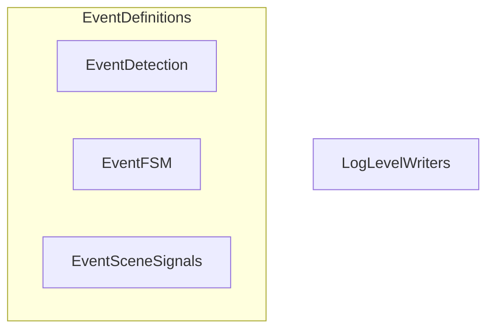

# JSONL Serialization
Este documento técnico describe el sistema de registro de datos de **mana-lite**, el cual utiliza una estrategia de **serialización manual y orientada a buffers** para generar logs en formato **JSONL**. A diferencia de las librerías automáticas, este enfoque prioriza el rendimiento al **minimizar la sobrecarga de asignación de memoria** y permitir un control absoluto sobre la representación binaria de datos complejos, como las máscaras de segmentación codificadas mediante **RLE (Run-Length Encoding)**. El sistema se rige por un **esquema de versiones estricto** que asegura la compatibilidad con herramientas externas, integrando mecanismos robustos para el **manejo de valores nulos** y la sanitización de números de punto flotante. En última instancia, la arquitectura centraliza diversas funciones especializadas para transformar eventos de detección, señales de escena y estados de máquinas de procesos en una **salida de datos estructurada y eficiente**.

Relevant source files

- 
- 
- 
- 
- 
- 
- 
- 
- 
- 
- 

The `mana-lite` logging system employs a manual, buffer-oriented serialization strategy to generate structured JSONL (JSON Lines) logs. This approach bypasses standard reflection-based serialization libraries (like `serde`) to minimize allocation overhead and provide precise control over the binary representation of events, such as RLE-encoded masks and versioned schema fields.

### Serialization Architecture

The serialization logic is centralized in the `logger/serialize/` directory and operates directly on a `Vec<u8>` buffer [logger/serialize/mod.rs20-42](https://github.com/kerrvisiona-sudo/endeli/blob/ad24740d/logger/serialize/mod.rs#L20-L42) The primary entry point is `write_event`, which dispatches to specific writers based on the `Event` variant.

#### Data Flow: Event to JSONL

The following diagram illustrates the flow from a domain event to a serialized JSON line.

**Event Serialization Pipeline**

**Sources:** [logger/serialize/mod.rs20-42](https://github.com/kerrvisiona-sudo/endeli/blob/ad24740d/logger/serialize/mod.rs#L20-L42) [logger/event/mod.rs21-158](https://github.com/kerrvisiona-sudo/endeli/blob/ad24740d/logger/event/mod.rs#L21-L158)

---

### Core Serialization Functions

The system uses specialized functions to write different event types, ensuring that timestamps and common metadata are handled consistently.

|Function|Event Type|Key Fields Serialized|
|---|---|---|
|`write_detection_event`|`Detection`|`frame_id`, `model`, `infer_ms`, `detections` (bboxes + masks), `per_class` stats.|
|`write_fsm_event`|`Fsm`|`from`, `to`, `trigger`, `dwell_ms`.|
|`write_presence_event`|`Presence`|`state`, `poi_state`, `raw_count`, `confirmed_count`, `timers`.|
|`write_scene_signals_event`|`SceneSignals`|Iterates through `SignalTable`, writing `value` or `null` for absent signals.|
|`write_entity_event`|`Entity`|`track_id`, `class`, `bbox`, `sources`.|
|`write_depth_region_event`|`DepthRegion`|`rule`, `region`, `metric`, `value`, `triggered`, `calibration`.|

**Sources:** [logger/serialize/detection.rs6-53](https://github.com/kerrvisiona-sudo/endeli/blob/ad24740d/logger/serialize/detection.rs#L6-L53) [logger/serialize/control.rs90-122](https://github.com/kerrvisiona-sudo/endeli/blob/ad24740d/logger/serialize/control.rs#L90-L122) [logger/serialize/control.rs124-181](https://github.com/kerrvisiona-sudo/endeli/blob/ad24740d/logger/serialize/control.rs#L124-L181) [logger/serialize/control.rs235-240](https://github.com/kerrvisiona-sudo/endeli/blob/ad24740d/logger/serialize/control.rs#L235-L240) [logger/serialize/control.rs6-48](https://github.com/kerrvisiona-sudo/endeli/blob/ad24740d/logger/serialize/control.rs#L6-L48) [logger/serialize/detection.rs234-275](https://github.com/kerrvisiona-sudo/endeli/blob/ad24740d/logger/serialize/detection.rs#L234-L275)

---

### Mask and RLE Serialization

Segmentation masks are stored using a Run-Length Encoding (RLE) scheme to save space. The `MaskRecord` struct is serialized by `write_det_mask` [logger/serialize/detection.rs78-126](https://github.com/kerrvisiona-sudo/endeli/blob/ad24740d/logger/serialize/detection.rs#L78-L126)

- **RLE Array**: An array of integers representing alternating counts of transparent and opaque pixels.
- **Polygons**: Optional Douglas-Peucker simplified polygons derived from the mask for visualization.
- **Dimensions**: `mask_dims` and `origin` to map the local mask back to the global frame coordinate space.

**Sources:** [logger/serialize/detection.rs78-126](https://github.com/kerrvisiona-sudo/endeli/blob/ad24740d/logger/serialize/detection.rs#L78-L126) [logger/event/records.rs1-20](https://github.com/kerrvisiona-sudo/endeli/blob/ad24740d/logger/event/records.rs#L1-L20)

---

### Versioned Schema (JSONL_SCHEMA_VERSION=2)

The system enforces a versioned schema to maintain compatibility with downstream consumers (e.g., T3 or Rerun).

- **Global Schema**: `JSONL_SCHEMA_VERSION = 2` [logger/event/mod.rs18](https://github.com/kerrvisiona-sudo/endeli/blob/ad24740d/logger/event/mod.rs#L18-L18)
- **Depth Schema**: `DEPTH_EVENT_VERSION = 2` [logger/event/mod.rs14](https://github.com/kerrvisiona-sudo/endeli/blob/ad24740d/logger/event/mod.rs#L14-L14)

In Version 2, control events (Entity, Zone, Presence) carry a `ControlStamp` instead of simple perception coordinates. This stamp includes `scan_seq`, `evidence_frame_id`, `observations_age_ms`, and `depth_age_ms` [logger/serialize/writers.rs35-53](https://github.com/kerrvisiona-sudo/endeli/blob/ad24740d/logger/serialize/writers.rs#L35-L53)

**Sources:** [logger/event/mod.rs12-18](https://github.com/kerrvisiona-sudo/endeli/blob/ad24740d/logger/event/mod.rs#L12-L18) [logger/serialize/writers.rs35-53](https://github.com/kerrvisiona-sudo/endeli/blob/ad24740d/logger/serialize/writers.rs#L35-L53)

---

### Null Handling and Absent Signals

The manual writers explicitly handle optional data to ensure valid JSON output:

1. **Null Marking**: Fields like `depth_age_ms` or `valid_ratio` use `write_u64` or `write_f32` wrappers that output `null` if the value is `None` [logger/serialize/writers.rs49-52](https://github.com/kerrvisiona-sudo/endeli/blob/ad24740d/logger/serialize/writers.rs#L49-L52) [logger/serialize/detection.rs206-210](https://github.com/kerrvisiona-sudo/endeli/blob/ad24740d/logger/serialize/detection.rs#L206-L210)
2. **Absent Signals**: When writing `SceneSignals`, the system checks the `SignalPresence`. If a signal is `Absent`, it writes `null` for the value [logger/serialize/control.rs248-255](https://github.com/kerrvisiona-sudo/endeli/blob/ad24740d/logger/serialize/control.rs#L248-L255)
3. **Float Sanitization**: `write_f32` and `write_f64` check for `NaN`, `infinite`, or `subnormal` values, writing `null` to prevent invalid JSON [logger/serialize/writers.rs72-75](https://github.com/kerrvisiona-sudo/endeli/blob/ad24740d/logger/serialize/writers.rs#L72-L75) [logger/serialize/writers.rs92-95](https://github.com/kerrvisiona-sudo/endeli/blob/ad24740d/logger/serialize/writers.rs#L92-L95)

**Sources:** [logger/serialize/writers.rs49-52](https://github.com/kerrvisiona-sudo/endeli/blob/ad24740d/logger/serialize/writers.rs#L49-L52) [logger/serialize/control.rs248-255](https://github.com/kerrvisiona-sudo/endeli/blob/ad24740d/logger/serialize/control.rs#L248-L255) [logger/serialize/writers.rs71-109](https://github.com/kerrvisiona-sudo/endeli/blob/ad24740d/logger/serialize/writers.rs#L71-L109)

---

### Serialization Logic Mapping

The following diagram bridges the high-level event types to the specific low-level writer utilities.

**Writer Logic Mapping**

**Sources:** [logger/serialize/detection.rs21-32](https://github.com/kerrvisiona-sudo/endeli/blob/ad24740d/logger/serialize/detection.rs#L21-L32) [logger/serialize/control.rs118-121](https://github.com/kerrvisiona-sudo/endeli/blob/ad24740d/logger/serialize/control.rs#L118-L121) [logger/serialize/control.rs235-240](https://github.com/kerrvisiona-sudo/endeli/blob/ad24740d/logger/serialize/control.rs#L235-L240) [logger/serialize/writers.rs1-109](https://github.com/kerrvisiona-sudo/endeli/blob/ad24740d/logger/serialize/writers.rs#L1-L109)

### On this page

- [JSONL Serialization](https://deepwiki.com/kerrvisiona-sudo/endeli/5.2-jsonl-serialization#jsonl-serialization)
- [Serialization Architecture](https://deepwiki.com/kerrvisiona-sudo/endeli/5.2-jsonl-serialization#serialization-architecture)
- [Data Flow: Event to JSONL](https://deepwiki.com/kerrvisiona-sudo/endeli/5.2-jsonl-serialization#data-flow-event-to-jsonl)
- [Core Serialization Functions](https://deepwiki.com/kerrvisiona-sudo/endeli/5.2-jsonl-serialization#core-serialization-functions)
- [Mask and RLE Serialization](https://deepwiki.com/kerrvisiona-sudo/endeli/5.2-jsonl-serialization#mask-and-rle-serialization)
- [Versioned Schema (JSONL_SCHEMA_VERSION=2)](https://deepwiki.com/kerrvisiona-sudo/endeli/5.2-jsonl-serialization#versioned-schema-jsonl_schema_version2)
- [Null Handling and Absent Signals](https://deepwiki.com/kerrvisiona-sudo/endeli/5.2-jsonl-serialization#null-handling-and-absent-signals)
- [Serialization Logic Mapping](https://deepwiki.com/kerrvisiona-sudo/endeli/5.2-jsonl-serialization#serialization-logic-mapping)
