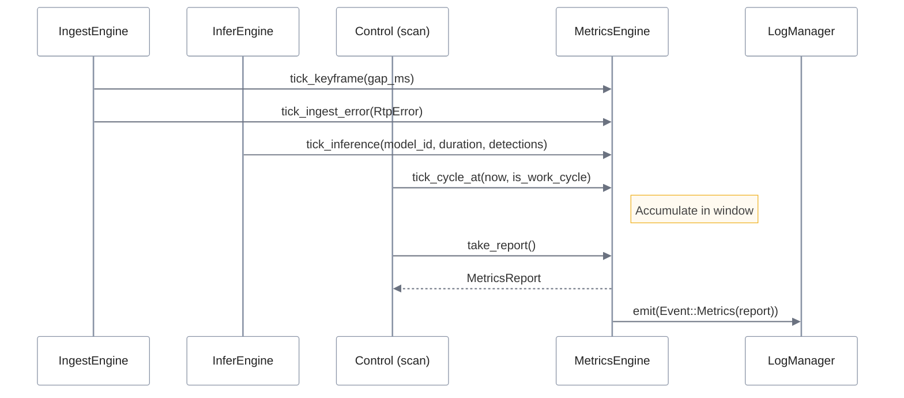
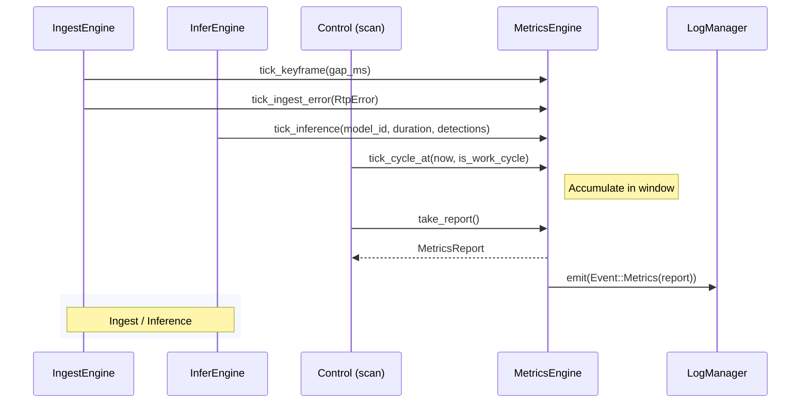

# Metrics Engine
El **MetricsEngine** actúa como el núcleo centralizado para la **telemetría y el monitoreo de rendimiento** dentro de un sistema de procesamiento visual, encargándose de recolectar datos críticos sobre la salud del flujo de video y la eficiencia de la inteligencia artificial. A través de un ciclo de **acumulación de estado y reporte periódico**, el sistema rastrea estadísticas detalladas que incluyen la **latencia de inferencia por modelo**, el cumplimiento de los tiempos de procesamiento y la calidad de la profundidad detectada. Esta infraestructura utiliza una metodología de **"recolectar, agregar y reportar"** para transformar señales técnicas de bajo nivel, como errores de red o caídas de cuadros, en informes estructurados y registros de texto legibles. Finalmente, la integración de estos datos permite una **supervisión proactiva de la salud del sistema**, facilitando transiciones automáticas de estado cuando se detectan fallos persistentes o una degradación en el rendimiento operativo.

Relevant source files

- [](https://github.com/kerrvisiona-sudo/endeli/blob/ad24740d/config/metrics-face-dwell-transition.toml)
- [](https://github.com/kerrvisiona-sudo/endeli/blob/ad24740d/config/metrics-room-transition.toml)
- [](https://github.com/kerrvisiona-sudo/endeli/blob/ad24740d/config/metrics.toml)
- [](https://github.com/kerrvisiona-sudo/endeli/blob/ad24740d/core/mana-control/src/fsm/engine.rs)
- [](https://github.com/kerrvisiona-sudo/endeli/blob/ad24740d/core/mana-control/src/scan.rs)
- [](https://github.com/kerrvisiona-sudo/endeli/blob/ad24740d/metrics/mod.rs)
- [](https://github.com/kerrvisiona-sudo/endeli/blob/ad24740d/metrics/tests.rs)
- [](https://github.com/kerrvisiona-sudo/endeli/blob/ad24740d/pipeline.rs)

The `MetricsEngine` is the centralized telemetry and performance monitoring subsystem for the perception pipeline. It aggregates per-model inference statistics, cycle timing distributions (p95 latency, overruns), ingest health (RTP errors, SSRC changes, frame drops), and depth sensing quality metrics.

### System Overview and Data Flow

The `MetricsEngine` operates as a stateful accumulator that is "ticked" by various engine components (Ingest, Infer, Control) and periodically flushed to produce a `MetricsReport`.

#### Natural Language to Code Entity Mapping

The following diagram maps high-level telemetry concepts to the specific Rust structs and functions that implement them.

**Diagram: Metrics Entity Mapping**

```mermaid
flowchart TD

    %% =========================================================
    %% Observability / Reporting Capabilities
    %% =========================================================

    subgraph CAPABILITIES["Observability Capabilities"]

        INFERENCE["Inference Performance"]
        INGEST["Ingest Health"]
        CONTROL["Control Loop Timing"]
        REPORTING["Periodic Reporting"]

    end


    %% =========================================================
    %% Code Entity Space
    %% =========================================================

    subgraph CODE["Code Entity Space"]

        PER_MODEL["PerModelMetrics"]
        TICK_INFERENCE["tick_inference()"]

        TICK_INGEST["tick_ingest_error()"]
        TICK_KEYFRAME["tick_keyframe()"]

        TICK_CYCLE["tick_cycle_at()"]
        OVERRUNS["cycle_overruns"]

        TAKE_REPORT["take_report()"]
        METRICS_REPORT["MetricsReport"]

    end


    %% =========================================================
    %% Source Locations
    %% =========================================================

    PER_MODEL_SRC["metrics/mod.rs:54-72"]
    TICK_INFERENCE_SRC["metrics/mod.rs:374-411"]
    TICK_CYCLE_SRC["metrics/mod.rs:326-347"]
    METRICS_REPORT_SRC["metrics/mod.rs:197-266"]


    %% =========================================================
    %% Capability → Code Entity
    %% =========================================================

    INFERENCE --> PER_MODEL
    INFERENCE --> TICK_INFERENCE

    INGEST --> TICK_INGEST
    INGEST --> TICK_KEYFRAME

    CONTROL --> TICK_CYCLE
    CONTROL --> OVERRUNS

    REPORTING --> TAKE_REPORT
    REPORTING --> METRICS_REPORT


    %% =========================================================
    %% Code Entity → Source
    %% =========================================================

    PER_MODEL -->|stores| PER_MODEL_SRC
    TICK_INFERENCE -->|defined in| TICK_INFERENCE_SRC

    TICK_CYCLE -->|defined in| TICK_CYCLE_SRC
    METRICS_REPORT -->|stores| METRICS_REPORT_SRC


    %% =========================================================
    %% Node classes
    %% =========================================================

    classDef capabilityNode fill:#FFFFFF,stroke:#A56DE2,stroke-width:2px,color:#222
    classDef codeNode fill:#FFFFFF,stroke:#F0B429,stroke-width:2px,color:#222
    classDef sourceNode fill:#FFFFFF,stroke:#8A94A6,stroke-width:1.5px,color:#444


    %% =========================================================
    %% Node assignment
    %% =========================================================

    class INFERENCE,INGEST,CONTROL,REPORTING capabilityNode

    class PER_MODEL,TICK_INFERENCE,TICK_INGEST,TICK_KEYFRAME,TICK_CYCLE,OVERRUNS,TAKE_REPORT,METRICS_REPORT codeNode

    class PER_MODEL_SRC,TICK_INFERENCE_SRC,TICK_CYCLE_SRC,METRICS_REPORT_SRC sourceNode


    %% =========================================================
    %% Container styling
    %% =========================================================

    style CAPABILITIES fill:#FAF5FF,stroke:#A56DE2,stroke-width:2px,color:#222
    style CODE fill:#FFFAF0,stroke:#F0B429,stroke-width:2px,color:#222
```



```
🟣 Observability Capabilities
│
├── Inference Performance
│       ├── PerModelMetrics
│       │       └── stores → metrics/mod.rs:54-72
│       └── tick_inference()
│               └── defined in → metrics/mod.rs:374-411
│
├── Ingest Health
│       ├── tick_ingest_error()
│       └── tick_keyframe()
│
├── Control Loop Timing
│       ├── tick_cycle_at()
│       │       └── defined in → metrics/mod.rs:326-347
│       └── cycle_overruns
│
└── Periodic Reporting
        ├── take_report()
        └── MetricsReport
                └── stores → metrics/mod.rs:197-266
```

**Sources:** [metrics/mod.rs54-72](https://github.com/kerrvisiona-sudo/endeli/blob/ad24740d/metrics/mod.rs#L54-L72) [metrics/mod.rs197-266](https://github.com/kerrvisiona-sudo/endeli/blob/ad24740d/metrics/mod.rs#L197-L266) [metrics/mod.rs374-411](https://github.com/kerrvisiona-sudo/endeli/blob/ad24740d/metrics/mod.rs#L374-L411) [metrics/mod.rs326-347](https://github.com/kerrvisiona-sudo/endeli/blob/ad24740d/metrics/mod.rs#L326-L347)

---

### Core Components

#### MetricsEngine

The `MetricsEngine` struct [metrics/mod.rs292-297](https://github.com/kerrvisiona-sudo/endeli/blob/ad24740d/metrics/mod.rs#L292-L297) maintains the current accumulation window. It is initialized with a `report_interval_s` and a `cycle_budget_ms`. The budget is used to calculate `cycle_overruns`—cycles where the actual processing time exceeded the expected cadence [metrics/mod.rs339-343](https://github.com/kerrvisiona-sudo/endeli/blob/ad24740d/metrics/mod.rs#L339-L343)

#### PerModelMetrics

Every model in the `ModelCatalog` has an entry in the `model_metrics` HashMap [metrics/mod.rs129](https://github.com/kerrvisiona-sudo/endeli/blob/ad24740d/metrics/mod.rs#L129-L129) This tracks:

- **Inference Latency:** Min, max, and total microseconds [metrics/mod.rs57-58](https://github.com/kerrvisiona-sudo/endeli/blob/ad24740d/metrics/mod.rs#L57-L58)
- **Detection Stats:** Total detections, empty frames, and sum of confidence/area for averaging [metrics/mod.rs59-65](https://github.com/kerrvisiona-sudo/endeli/blob/ad24740d/metrics/mod.rs#L59-L65)
- **Depth Stats:** Valid pixel counts and min/max depth values in meters [metrics/mod.rs67-72](https://github.com/kerrvisiona-sudo/endeli/blob/ad24740d/metrics/mod.rs#L67-L72)

#### ClassFrameStat

Transient statistics computed per-frame, per-class (e.g., "person", "face") to provide high-resolution visibility into detection quality before they are aggregated into the window [metrics/mod.rs9-16](https://github.com/kerrvisiona-sudo/endeli/blob/ad24740d/metrics/mod.rs#L9-L16)

**Sources:** [metrics/mod.rs9-16](https://github.com/kerrvisiona-sudo/endeli/blob/ad24740d/metrics/mod.rs#L9-L16) [metrics/mod.rs54-72](https://github.com/kerrvisiona-sudo/endeli/blob/ad24740d/metrics/mod.rs#L54-L72) [metrics/mod.rs129](https://github.com/kerrvisiona-sudo/endeli/blob/ad24740d/metrics/mod.rs#L129-L129) [metrics/mod.rs292-297](https://github.com/kerrvisiona-sudo/endeli/blob/ad24740d/metrics/mod.rs#L292-L297) [metrics/mod.rs339-343](https://github.com/kerrvisiona-sudo/endeli/blob/ad24740d/metrics/mod.rs#L339-L343)

---

### Telemetry Pipeline

The metrics lifecycle follows a "Collect -> Aggregate -> Report" pattern.

**Diagram: Metrics Data Flow**

IngestEngine / InferEngine / Control → MetricsEngine → LogManager




**Sources:** [metrics/mod.rs326-347](https://github.com/kerrvisiona-sudo/endeli/blob/ad24740d/metrics/mod.rs#L326-L347) [metrics/mod.rs374-411](https://github.com/kerrvisiona-sudo/endeli/blob/ad24740d/metrics/mod.rs#L374-L411) [pipeline.rs88-96](https://github.com/kerrvisiona-sudo/endeli/blob/ad24740d/pipeline.rs#L88-L96)

#### Performance Percentiles

The engine calculates p95 latency for both the `cycle_samples` (control loop execution) and `keyframe_gap_samples` (ingest jitter) [metrics/mod.rs192-196](https://github.com/kerrvisiona-sudo/endeli/blob/ad24740d/metrics/mod.rs#L192-L196) This is implemented using an unstable sort on the sample vectors followed by a `percentile_us` lookup [metrics/mod.rs170-180](https://github.com/kerrvisiona-sudo/endeli/blob/ad24740d/metrics/mod.rs#L170-L180)

#### Ingest Counters

The engine tracks several low-level stream health indicators:

- `ssrc_changes`: Detects if the RTSP source switched streams [metrics/mod.rs120](https://github.com/kerrvisiona-sudo/endeli/blob/ad24740d/metrics/mod.rs#L120-L120)
- `rtp_errors`: Tracks packet loss or sequence breaks reported by the reader [metrics/mod.rs121](https://github.com/kerrvisiona-sudo/endeli/blob/ad24740d/metrics/mod.rs#L121-L121)
- `ingest_dup_keyframes`: Counts frames suppressed by the H.264 digest deduplicator [metrics/mod.rs125](https://github.com/kerrvisiona-sudo/endeli/blob/ad24740d/metrics/mod.rs#L125-L125)

**Sources:** [metrics/mod.rs120-125](https://github.com/kerrvisiona-sudo/endeli/blob/ad24740d/metrics/mod.rs#L120-L125) [metrics/mod.rs170-180](https://github.com/kerrvisiona-sudo/endeli/blob/ad24740d/metrics/mod.rs#L170-L180) [metrics/mod.rs192-196](https://github.com/kerrvisiona-sudo/endeli/blob/ad24740d/metrics/mod.rs#L192-L196)

---

### Configuration and JSONL Toggles

The behavior of the metrics engine and the verbosity of its output are controlled via `MetricsLogConfig`.

#### MetricsJsonlConfig

Located in the application config, these toggles determine which granular events are serialized to the `.jsonl` log files. Diagnostic profiles like `metrics-room-transition.toml` or `metrics-face-dwell-transition.toml` use these to isolate specific signals.

|Toggle|Description|
|---|---|
|`frame_events`|Emits `Event::frame_ingest` for every keyframe [config/metrics.toml23](https://github.com/kerrvisiona-sudo/endeli/blob/ad24740d/config/metrics.toml#L23-L23)|
|`presence_events`|Logs `RoomCardinality` changes [config/metrics-room-transition.toml25](https://github.com/kerrvisiona-sudo/endeli/blob/ad24740d/config/metrics-room-transition.toml#L25-L25)|
|`scene_signals_events`|Logs the full `SceneSignalsSnapshot` [config/metrics.toml27](https://github.com/kerrvisiona-sudo/endeli/blob/ad24740d/config/metrics.toml#L27-L27)|
|`depth_events`|Logs depth region statistics [config/metrics.toml34](https://github.com/kerrvisiona-sudo/endeli/blob/ad24740d/config/metrics.toml#L34-L34)|

#### MetricsTextConfig

Controls the periodic summary lines printed to `stdout/stderr` via `log::info!`.

- **Cycle Line:** Summarizes Hz, p95 latency, and overruns [pipeline.rs114-126](https://github.com/kerrvisiona-sudo/endeli/blob/ad24740d/pipeline.rs#L114-L126)
- **Ingest Line:** Summarizes keyframe processing rate and decode latency [pipeline.rs128-180](https://github.com/kerrvisiona-sudo/endeli/blob/ad24740d/pipeline.rs#L128-L180)
- **Infer Line:** Summarizes inference calls and total detections [pipeline.rs182-211](https://github.com/kerrvisiona-sudo/endeli/blob/ad24740d/pipeline.rs#L182-L211)

**Sources:** [config/metrics.toml22-35](https://github.com/kerrvisiona-sudo/endeli/blob/ad24740d/config/metrics.toml#L22-L35) [config/metrics-room-transition.toml22-35](https://github.com/kerrvisiona-sudo/endeli/blob/ad24740d/config/metrics-room-transition.toml#L22-L35) [pipeline.rs114-211](https://github.com/kerrvisiona-sudo/endeli/blob/ad24740d/pipeline.rs#L114-L211)

---

### Health Integration

The `PipelineState` uses the `MetricsEngine` to drive high-level health monitoring. The `on_keyframe` function updates the engine with decode latency and keyframe gaps [pipeline.rs49-75](https://github.com/kerrvisiona-sudo/endeli/blob/ad24740d/pipeline.rs#L49-L75) If the `ErrorWindow` (managed by `PipelineState`) detects a sustained density of panics or ingest failures, it triggers a `HealthTransition` [pipeline.rs33-47](https://github.com/kerrvisiona-sudo/endeli/blob/ad24740d/pipeline.rs#L33-L47)

**Sources:** [pipeline.rs33-47](https://github.com/kerrvisiona-sudo/endeli/blob/ad24740d/pipeline.rs#L33-L47) [pipeline.rs49-75](https://github.com/kerrvisiona-sudo/endeli/blob/ad24740d/pipeline.rs#L49-L75)


### On this page

- [Metrics Engine](https://deepwiki.com/kerrvisiona-sudo/endeli/5.3-metrics-engine#metrics-engine)
- [System Overview and Data Flow](https://deepwiki.com/kerrvisiona-sudo/endeli/5.3-metrics-engine#system-overview-and-data-flow)
- [Natural Language to Code Entity Mapping](https://deepwiki.com/kerrvisiona-sudo/endeli/5.3-metrics-engine#natural-language-to-code-entity-mapping)
- [Core Components](https://deepwiki.com/kerrvisiona-sudo/endeli/5.3-metrics-engine#core-components)
- [MetricsEngine](https://deepwiki.com/kerrvisiona-sudo/endeli/5.3-metrics-engine#metricsengine)
- [PerModelMetrics](https://deepwiki.com/kerrvisiona-sudo/endeli/5.3-metrics-engine#permodelmetrics)
- [ClassFrameStat](https://deepwiki.com/kerrvisiona-sudo/endeli/5.3-metrics-engine#classframestat)
- [Telemetry Pipeline](https://deepwiki.com/kerrvisiona-sudo/endeli/5.3-metrics-engine#telemetry-pipeline)
- [Performance Percentiles](https://deepwiki.com/kerrvisiona-sudo/endeli/5.3-metrics-engine#performance-percentiles)
- [Ingest Counters](https://deepwiki.com/kerrvisiona-sudo/endeli/5.3-metrics-engine#ingest-counters)
- [Configuration and JSONL Toggles](https://deepwiki.com/kerrvisiona-sudo/endeli/5.3-metrics-engine#configuration-and-jsonl-toggles)
- [MetricsJsonlConfig](https://deepwiki.com/kerrvisiona-sudo/endeli/5.3-metrics-engine#metricsjsonlconfig)
- [MetricsTextConfig](https://deepwiki.com/kerrvisiona-sudo/endeli/5.3-metrics-engine#metricstextconfig)
- [Health Integration](https://deepwiki.com/kerrvisiona-sudo/endeli/5.3-metrics-engine#health-integration)

