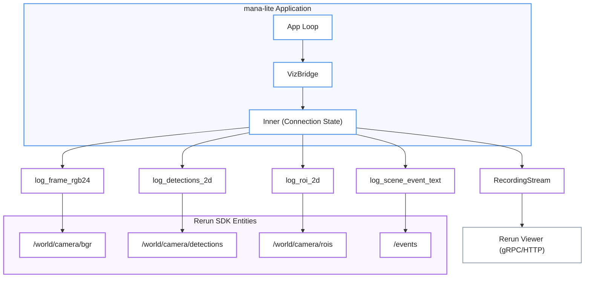
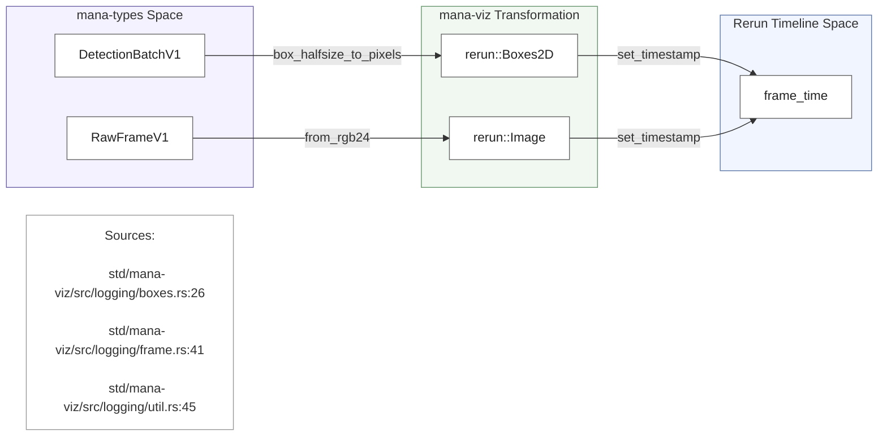

# Rerun Visualization

Relevant source files

- [](https://github.com/ernestovisiona-netizen/kik8/blob/43a92847/config/rerun.toml)
- [](https://github.com/ernestovisiona-netizen/kik8/blob/43a92847/config/viz.toml)
- [](https://github.com/ernestovisiona-netizen/kik8/blob/43a92847/src/viz.rs)
- [](https://github.com/ernestovisiona-netizen/kik8/blob/43a92847/std/mana-viz/src/lib.rs)
- [](https://github.com/ernestovisiona-netizen/kik8/blob/43a92847/std/mana-viz/src/logging/boxes.rs)
- [](https://github.com/ernestovisiona-netizen/kik8/blob/43a92847/std/mana-viz/src/logging/event.rs)
- [](https://github.com/ernestovisiona-netizen/kik8/blob/43a92847/std/mana-viz/src/logging/frame.rs)
- [](https://github.com/ernestovisiona-netizen/kik8/blob/43a92847/std/mana-viz/src/logging/mod.rs)
- [](https://github.com/ernestovisiona-netizen/kik8/blob/43a92847/std/mana-viz/src/logging/text.rs)
- [](https://github.com/ernestovisiona-netizen/kik8/blob/43a92847/std/mana-viz/src/logging/util.rs)

The Rerun Visualization subsystem provides real-time observability into the computer vision pipeline by streaming data to a [Rerun.io](https://rerun.io/) viewer. This allows developers to inspect raw video frames, model detections, tracking state, and FSM transitions in a synchronized temporal view.

## VizBridge Architecture

The `VizBridge` struct acts as the primary interface between the `mana-lite` application and the Rerun SDK. It manages the connection lifecycle, handles exponential backoff during disconnections, and dispatches data to the appropriate Rerun entities.

### Connection Management

`VizBridge` implements a state machine to handle the network connection to the Rerun server:

- **Connected**: Actively streaming data via a `rerun::RecordingStream` [src/viz.rs19-22](https://github.com/ernestovisiona-netizen/kik8/blob/43a92847/src/viz.rs#L19-L22)
- **Disconnected**: Attempting reconnection with an initial backoff of 1 second, doubling up to 30 seconds [src/viz.rs23-107](https://github.com/ernestovisiona-netizen/kik8/blob/43a92847/src/viz.rs#L23-L107)
- **Disabled**: Visualization is inactive based on configuration [src/viz.rs28](https://github.com/ernestovisiona-netizen/kik8/blob/43a92847/src/viz.rs#L28-L28)

### Data Flow and Entity Mapping

The system maps internal data structures to a hierarchical entity path structure within Rerun:

|Data Type|Rerun Entity Path|Code Reference|
|---|---|---|
|**Main Video Frame**|`/world/camera/bgr`|[src/viz.rs214](https://github.com/ernestovisiona-netizen/kik8/blob/43a92847/src/viz.rs#L214-L214)|
|**Detections**|`/world/camera/detections/{class_id}/{index}`|[std/mana-viz/src/logging/boxes.rs29](https://github.com/ernestovisiona-netizen/kik8/blob/43a92847/std/mana-viz/src/logging/boxes.rs#L29-L29)|
|**Model Crops**|`/world/camera/crops/{model_name}/bgr`|[src/viz.rs221-224](https://github.com/ernestovisiona-netizen/kik8/blob/43a92847/src/viz.rs#L221-L224)|
|**Occupancy Zones**|`/world/camera/zones/{zone_name}`|[std/mana-viz/src/logging/boxes.rs43](https://github.com/ernestovisiona-netizen/kik8/blob/43a92847/std/mana-viz/src/logging/boxes.rs#L43-L43)|
|**Room State**|`/pipeline/state/room`|[config/rerun.toml8](https://github.com/ernestovisiona-netizen/kik8/blob/43a92847/config/rerun.toml#L8-L8)|
|**Depth Maps**|`/world/camera/depth`|[src/viz.rs252](https://github.com/ernestovisiona-netizen/kik8/blob/43a92847/src/viz.rs#L252-L252)|

### VizBridge Entity Relationship

The following diagram illustrates how the `VizBridge` interacts with the Rerun SDK and the internal pipeline entities.

**VizBridge Logic Flow**


```
                  ┌─────────────────────────────┐
                  │      mana-lite Application  │
                  │                             │
                  │ App Loop                    │
                  │    ↓                        │
                  │ VizBridge                   │
                  │    ↓                        │
                  │ Inner (Connection State)    │
                  └─────────────┬───────────────┘
                                │
             ┌──────────────────┼───────────────────┐
             ↓                  ↓                   ↓
       log_frame...       log_detections...    log_roi...
             │                  │                   │
             ↓                  ↓                   ↓
      /world/camera/bgr   /world/camera/...   /world/camera/rois
```
**Sources:** [src/viz.rs18-41](https://github.com/ernestovisiona-netizen/kik8/blob/43a92847/src/viz.rs#L18-L41) [src/viz.rs159-202](https://github.com/ernestovisiona-netizen/kik8/blob/43a92847/src/viz.rs#L159-L202) [std/mana-viz/src/logging/boxes.rs9-46](https://github.com/ernestovisiona-netizen/kik8/blob/43a92847/std/mana-viz/src/logging/boxes.rs#L9-L46) [std/mana-viz/src/logging/frame.rs6-11](https://github.com/ernestovisiona-netizen/kik8/blob/43a92847/std/mana-viz/src/logging/frame.rs#L6-L11)

## Configuration

Visualization behavior is controlled by two configuration files: `viz.toml` for data selection and `rerun.toml` for UI layout.

### viz.toml

This file defines the connection address and toggles for specific data streams [config/viz.toml1-25](https://github.com/ernestovisiona-netizen/kik8/blob/43a92847/config/viz.toml#L1-L25)

- `rerun_addr`: The address of the Rerun server (default `127.0.0.1:9876`) [config/viz.toml3](https://github.com/ernestovisiona-netizen/kik8/blob/43a92847/config/viz.toml#L3-L3)
- `send.frames`: Toggle for the full-resolution BGR frame [config/viz.toml6](https://github.com/ernestovisiona-netizen/kik8/blob/43a92847/config/viz.toml#L6-L6)
- `send.masks`: Toggle for segmentation masks [config/viz.toml9](https://github.com/ernestovisiona-netizen/kik8/blob/43a92847/config/viz.toml#L9-L9)
- `send.depth`: Toggle for depth map visualization, supporting modes like `disparity` [config/viz.toml22-23](https://github.com/ernestovisiona-netizen/kik8/blob/43a92847/config/viz.toml#L22-L23)

### rerun.toml

Defines the default blueprint for the Rerun viewer, including how panels and timelines are organized [config/rerun.toml1-10](https://github.com/ernestovisiona-netizen/kik8/blob/43a92847/config/rerun.toml#L1-L10)

- `auto_views`: Automatically generate views if not specified [config/rerun.toml3](https://github.com/ernestovisiona-netizen/kik8/blob/43a92847/config/rerun.toml#L3-L3)
- `state_timeline`: Configures the "Room state" timeline derived from `/pipeline/state/room` [config/rerun.toml5-9](https://github.com/ernestovisiona-netizen/kik8/blob/43a92847/config/rerun.toml#L5-L9)

**Sources:** [config/viz.toml1-25](https://github.com/ernestovisiona-netizen/kik8/blob/43a92847/config/viz.toml#L1-L25) [config/rerun.toml1-10](https://github.com/ernestovisiona-netizen/kik8/blob/43a92847/config/rerun.toml#L1-L10)

## The mana-viz Crate

The `mana-viz` crate provides low-level logging utilities that wrap the Rerun SDK to ensure consistent timestamping and coordinate handling.

### Logging Modules

- **`logging::frame`**: Handles conversion and logging of `RawFrameV1` to `rerun::Image`. It ensures pixel data is correctly padded if the buffer is shorter than expected [std/mana-viz/src/logging/frame.rs6-29](https://github.com/ernestovisiona-netizen/kik8/blob/43a92847/std/mana-viz/src/logging/frame.rs#L6-L29)
- **`logging::boxes`**: Converts detection batches and zones into `rerun::Boxes2D`. It uses `bbox::box_halfsize_to_pixels` to map normalized coordinates to pixel space [std/mana-viz/src/logging/boxes.rs9-33](https://github.com/ernestovisiona-netizen/kik8/blob/43a92847/std/mana-viz/src/logging/boxes.rs#L9-L33)
- **`logging::event`**: Logs textual events (like FSM state changes) to a `rerun::TextLog` entity [std/mana-viz/src/logging/event.rs5-19](https://github.com/ernestovisiona-netizen/kik8/blob/43a92847/std/mana-viz/src/logging/event.rs#L5-L19)
- **`logging::util`**: Contains `FrameSize` helpers and generic `log_at` functions that set the `frame_time` timeline for every log call [std/mana-viz/src/logging/util.rs3-47](https://github.com/ernestovisiona-netizen/kik8/blob/43a92847/std/mana-viz/src/logging/util.rs#L3-L47)

### Data Transformation Logic



**Sources:** [std/mana-viz/src/lib.rs1-8](https://github.com/ernestovisiona-netizen/kik8/blob/43a92847/std/mana-viz/src/lib.rs#L1-L8) [std/mana-viz/src/logging/boxes.rs9-33](https://github.com/ernestovisiona-netizen/kik8/blob/43a92847/std/mana-viz/src/logging/boxes.rs#L9-L33) [std/mana-viz/src/logging/frame.rs6-44](https://github.com/ernestovisiona-netizen/kik8/blob/43a92847/std/mana-viz/src/logging/frame.rs#L6-L44) [std/mana-viz/src/logging/util.rs29-61](https://github.com/ernestovisiona-netizen/kik8/blob/43a92847/std/mana-viz/src/logging/util.rs#L29-L61)

## Key Implementation Details

### Timelines

`mana-lite` uses two primary timelines in Rerun:

1. **`frame_time`**: A `TimestampNs` timeline based on the frame's capture time [src/viz.rs52](https://github.com/ernestovisiona-netizen/kik8/blob/43a92847/src/viz.rs#L52-L52) [std/mana-viz/src/logging/util.rs45](https://github.com/ernestovisiona-netizen/kik8/blob/43a92847/std/mana-viz/src/logging/util.rs#L45-L45)
2. **`frame_nr`**: A sequence-based timeline for frame-by-frame stepping [src/viz.rs51](https://github.com/ernestovisiona-netizen/kik8/blob/43a92847/src/viz.rs#L51-L51)

### ROI and Crop Visualization

When a model uses a specific Region of Interest (ROI), `VizBridge` logs the ROI boundary as a `rerun::Boxes2D` or `rerun::LineStrips2D` (for trapezoidal bed regions) [std/mana-viz/src/logging/boxes.rs69-118](https://github.com/ernestovisiona-netizen/kik8/blob/43a92847/std/mana-viz/src/logging/boxes.rs#L69-L118) This allows the user to see exactly what the inference engine is "looking at" relative to the full frame.

### Mask Palette

For instance segmentation, `VizBridge` uses a fixed palette (`PALETTE`) to assign consistent colors to different detection classes based on their `class_id` [src/viz.rs109-119](https://github.com/ernestovisiona-netizen/kik8/blob/43a92847/src/viz.rs#L109-L119)

**Sources:** [src/viz.rs51-52](https://github.com/ernestovisiona-netizen/kik8/blob/43a92847/src/viz.rs#L51-L52) [src/viz.rs109-119](https://github.com/ernestovisiona-netizen/kik8/blob/43a92847/src/viz.rs#L109-L119) [std/mana-viz/src/logging/boxes.rs48-122](https://github.com/ernestovisiona-netizen/kik8/blob/43a92847/std/mana-viz/src/logging/boxes.rs#L48-L122) [std/mana-viz/src/logging/util.rs45](https://github.com/ernestovisiona-netizen/kik8/blob/43a92847/std/mana-viz/src/logging/util.rs#L45-L45)