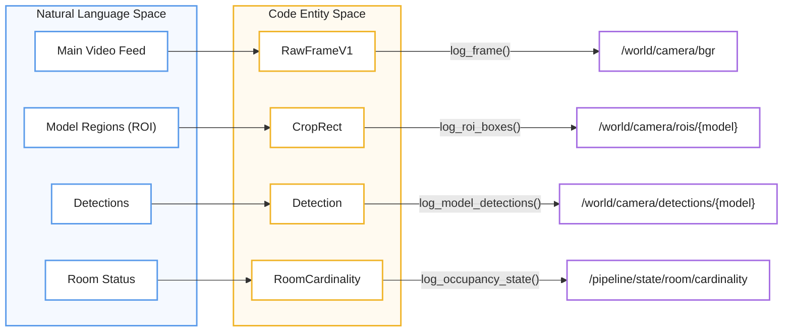
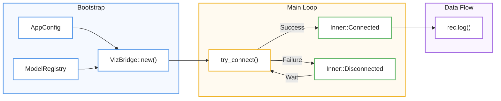

# Visualization (Rerun Integration)
Esta documentación técnica describe el **VizBridge**, un componente esencial diseñado para integrar el sistema de inferencia con el SDK de **Rerun**, permitiendo una **observación en tiempo real** de los procesos de visión artificial. El sistema garantiza una operatividad fluida mediante una **gestión de conexión asíncrona** que utiliza reintentos exponenciales, evitando así que fallos en el servidor de visualización bloqueen el flujo principal de procesamiento. La arquitectura organiza la información en **rutas de entidades** que separan los datos espaciales, como imágenes y detecciones, de los datos temporales, como los cambios de estado del sistema y métricas de rendimiento. En última instancia, este módulo actúa como un **traductor de estructuras internas**, convirtiendo datos complejos de modelos y lógica de control en representaciones visuales claras y configurables para los desarrolladores.

Relevant source files

- 
- 
- 
- 
- 
- 
- 
- 
- 

The visualization layer provides a real-time, feature-gated observation window into the inference pipeline and control system using the [Rerun](https://rerun.io/) SDK. It allows developers to inspect raw frames, model crops, detection outputs (bounding boxes, masks, poses), and the internal state transitions of the Finite State Machine (FSM).

The core of this system is the `VizBridge`, which manages the connection to a Rerun server and translates internal data structures into Rerun archetypes.

### Connection Management

`VizBridge` implements an asynchronous connection strategy with exponential backoff to ensure that the main inference pipeline is not blocked if the Rerun server is unavailable; `try_connect` (attempt + backoff doubling) lives in `src/viz/connection.rs` [src/viz/connection.rs:8-60](src/viz/connection.rs#L8-L60)

- **What `Connected` means**: the gRPC sink connects lazily — `connect_grpc_opts` returns `Ok` with no viewer listening — so creating a sink proves nothing. `Inner::Connected` means only "there is somewhere to write"; liveness is established by the first flush that returns `Ok`, which is also when `viz: connected` is logged. Sink creation itself is logged at `debug`.
- **Backpressure is not disconnection**: `flush_with_timeout` returns `SinkFlushError::Timeout` (the link is alive but did not drain in the probe window) or `SinkFlushError::Failed` (no viewer). `Failed` drops the sink immediately; `Timeout` is counted, and only a run of `MAX_FLUSH_TIMEOUTS` consecutive ones drops it. Collapsing the two made a large frame on a slow link read as a drop, which re-sent the viewer blueprint and reset the state-dedup caches every couple of seconds.
- **Backoff Logic**: the retry delay lives on `VizBridge`, not inside `Inner::Disconnected`. Because creating a sink always succeeds, a backoff scoped to the disconnected state was reset on every retry and never grew. It starts at `INITIAL_BACKOFF_MS` (1 s), doubles each time the sink is dropped up to `MAX_BACKOFF_MS` (30 s), and is reset only by a flush that actually reaches a viewer [src/viz/mod.rs:64-65](src/viz/mod.rs#L64-L65)
- **State Configuration**: Upon a successful connection, the bridge initializes the Rerun viewer with a default blueprint and pre-configured state categories for room occupancy and face dwell states [src/viz/connection.rs:148-175](src/viz/connection.rs#L148-L175)
- **Toggles**: Data emission is strictly controlled by `VizSendToggles`, allowing specific streams (e.g., depth, masks, or latency) to be enabled or disabled via configuration [src/config/observability.rs:44](src/config/observability.rs#L44-L44)

### Frame Encoding and Link Budget

A 1080p RGB24 frame is 6,220,800 bytes. At one keyframe per second the bridge sustains ~50 Mbit/s, which is what makes a 100 ms flush probe unrealistic. Two orthogonal knobs under `[viz]` reduce it, and they compose:

|Mode|`image_format`|Result|Payload|Cost|
|---|---|---|---|---|
|Native (default)|`raw`|1920x1080|6,220,800 B|—|
|**Compressed**|`jpeg`|1920x1080|~195,000 B|~40 ms|

Measured on a high-frequency synthetic pattern — the worst case for JPEG — by `viz::frame::tests`.

Compression is the only lever offered, and that is a deliberate choice. Downscaling the frame would cut the payload too, but boxes, ROIs and masks are logged in **native pixel coordinates**: shrinking the image while leaving overlays at full resolution misaligns them. JPEG keeps the pixel dimensions, so nothing needs compensating — and it reduces more than decimation would.

Encoding runs on the pipeline thread, so the ~40 ms JPEG cost is charged against the scan cycle budget; at one keyframe per second that is well inside the 500 ms budget.

### Data Stream Architecture

The visualization system organizes data into two primary entity paths: `/world/camera/` for spatial data and `/pipeline/` for temporal and state-based data.

|Entity Path|Data Type|Description|
|---|---|---|
|`/world/camera/bgr`|`rerun::Image` or `rerun::EncodedImage`|The main video frame. Wire encoding is set by `[viz] image_format` (`raw`/`jpeg`); see Frame Encoding below [src/viz/frame.rs:92](src/viz/frame.rs#L92-L92)|
|`/world/camera/crops/{model}/bgr`|`rerun::Image`|Sub-regions extracted for cascaded model inference [src/viz/frame.rs:106](src/viz/frame.rs#L106-L106)|
|`/world/camera/entities`|`rerun::Boxes2D`|Tracked entities with color-coded boxes and labels [src/viz/boxes.rs:92](src/viz/boxes.rs#L92-L92)|
|`/pipeline/state/room/*`|`rerun::StateChange`|Occupancy, second person, and signal validity states [src/viz/state.rs:31-45](src/viz/state.rs#L31-L45)|
|`/pipeline/infer/{model}/hz`|`rerun::Scalars`|Real-time inference frequency per model [src/viz/state.rs:99](src/viz/state.rs#L99-L99)|

#### Visualization Entity Mapping

The following diagram maps the high-level visualization concepts to the internal code entities and Rerun paths.

**VizBridge Entity Mapping**

|Concepto|Entidad|Logging|Output|
|---|---|---|---|
|Main Video Feed|`RawFrameV1`|`log_frame()`|`/world/camera/bgr`|
|Model Regions (ROI)|`CropRect`|`log_roi_boxes()`|`/world/camera/rois/{model}`|
|Detections|`Detection`|`log_model_detections()`|`/world/camera/detections/{model}`|
|Room Status|`RoomCardinality`|`log_occupancy_state()`|`/pipeline/state/room/cardinality`|
Sources: [src/viz/frame.rs:87-96](src/viz/frame.rs#L87-L96) [src/viz/rois.rs:26-55](src/viz/rois.rs#L26-L55) [src/viz/boxes.rs:152-202](src/viz/boxes.rs#L152-L202) [src/viz/state.rs:19-51](src/viz/state.rs#L19-L51)

### VizBridge Initialization

The `VizBridge` is instantiated during the perception bootstrap phase. It receives the `ModelRegistry` to understand the semantics (roles) of different models, allowing it to automatically route data to the correct Rerun archetypes (e.g., using `Boxes2D` for box models vs `Points2D` for skeletons).

**VizBridge Lifecycle**

Sources: [src/viz/mod.rs:92-123](src/viz/mod.rs#L92-L123) [src/viz/connection.rs:8-51](src/viz/connection.rs#L8-L51) [src/app/bootstrap/observers.rs:89-101](src/app/bootstrap/observers.rs#L89-L101)

---

## Child Pages

- **[Frame and Detection Rendering](6.1-frame-and-detection-rendering)**: Details on how pixels are logged, how bounding boxes are translated from crop-space to frame-space, and the generation of segmentation mask overlays.
- **[Pipeline State Visualization](6.2-pipeline-state-visualization)**: Details on tracking FSM states, keyframe selection logic, and performance metrics like decode latency and inference rate.

### On this page

- [Visualization (Rerun Integration)](6-visualization-\(rerun-integration\)#visualization-rerun-integration)
- [Connection Management](6-visualization-\(rerun-integration\)#connection-management)
- [Data Stream Architecture](6-visualization-\(rerun-integration\)#data-stream-architecture)
- [Visualization Entity Mapping](6-visualization-\(rerun-integration\)#visualization-entity-mapping)
- [VizBridge Initialization](6-visualization-\(rerun-integration\)#vizbridge-initialization)
- [Child Pages](6-visualization-\(rerun-integration\)#child-pages)

