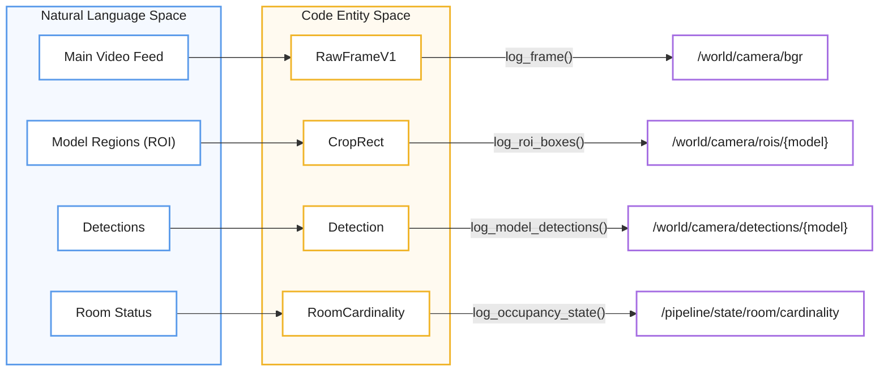
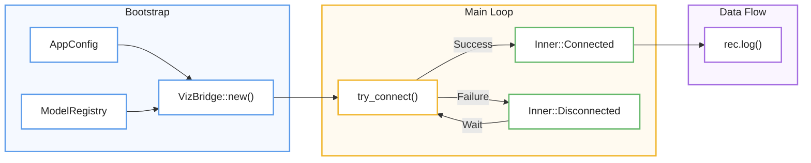

# Visualization (Rerun Integration)
Esta documentación técnica describe el **VizBridge**, un componente esencial diseñado para integrar el sistema de inferencia con el SDK de **Rerun**, permitiendo una **observación en tiempo real** de los procesos de visión artificial. El sistema garantiza una operatividad fluida mediante una **gestión de conexión asíncrona** que utiliza reintentos exponenciales, evitando así que fallos en el servidor de visualización bloqueen el flujo principal de procesamiento. La arquitectura organiza la información en **rutas de entidades** que separan los datos espaciales, como imágenes y detecciones, de los datos temporales, como los cambios de estado del sistema y métricas de rendimiento. En última instancia, este módulo actúa como un **traductor de estructuras internas**, convirtiendo datos complejos de modelos y lógica de control en representaciones visuales claras y configurables para los desarrolladores.

Relevant source files

- 
- 
- 
- 
- 
- 
- 
- 
- 

The visualization layer provides a real-time, feature-gated observation window into the inference pipeline and control system using the [Rerun](https://rerun.io/) SDK. It allows developers to inspect raw frames, model crops, detection outputs (bounding boxes, masks, poses), and the internal state transitions of the Finite State Machine (FSM).

The core of this system is the `VizBridge`, which manages the connection to a Rerun server and translates internal data structures into Rerun archetypes.

### Connection Management

`VizBridge` implements an asynchronous connection strategy with exponential backoff to ensure that the main inference pipeline is not blocked if the Rerun server is unavailable [viz/mod.rs27-38](https://github.com/kerrvisiona-sudo/endeli/blob/ad24740d/viz/mod.rs#L27-L38)

- **Backoff Logic**: Connections start with a 1-second delay (`INITIAL_BACKOFF_MS`), doubling on failure up to a maximum of 30 seconds (`MAX_BACKOFF_MS`) [viz/mod.rs64-65](https://github.com/kerrvisiona-sudo/endeli/blob/ad24740d/viz/mod.rs#L64-L65)
- **State Configuration**: Upon a successful connection, the bridge initializes the Rerun viewer with a default blueprint and pre-configured state categories for room occupancy and face dwell states [viz/connection.rs148-175](https://github.com/kerrvisiona-sudo/endeli/blob/ad24740d/viz/connection.rs#L148-L175)
- **Toggles**: Data emission is strictly controlled by `VizSendToggles`, allowing specific streams (e.g., depth, masks, or latency) to be enabled or disabled via configuration [viz/mod.rs43](https://github.com/kerrvisiona-sudo/endeli/blob/ad24740d/viz/mod.rs#L43-L43)

### Data Stream Architecture

The visualization system organizes data into two primary entity paths: `/world/camera/` for spatial data and `/pipeline/` for temporal and state-based data.

|Entity Path|Data Type|Description|
|---|---|---|
|`/world/camera/bgr`|`rerun::Image`|The full-resolution raw video frame [viz/frame.rs92](https://github.com/kerrvisiona-sudo/endeli/blob/ad24740d/viz/frame.rs#L92-L92)|
|`/world/camera/crops/{model}/bgr`|`rerun::Image`|Sub-regions extracted for cascaded model inference [viz/frame.rs106](https://github.com/kerrvisiona-sudo/endeli/blob/ad24740d/viz/frame.rs#L106-L106)|
|`/world/camera/entities/{id}`|`rerun::Boxes2D`|Tracked entities with unique IDs and color-coded status [viz/boxes.rs104](https://github.com/kerrvisiona-sudo/endeli/blob/ad24740d/viz/boxes.rs#L104-L104)|
|`/pipeline/state/room/*`|`rerun::StateChange`|Occupancy, second person, and signal validity states [viz/state.rs31-49](https://github.com/kerrvisiona-sudo/endeli/blob/ad24740d/viz/state.rs#L31-L49)|
|`/pipeline/infer/{model}/hz`|`rerun::Scalars`|Real-time inference frequency per model [viz/state.rs99](https://github.com/kerrvisiona-sudo/endeli/blob/ad24740d/viz/state.rs#L99-L99)|

#### Visualization Entity Mapping

The following diagram maps the high-level visualization concepts to the internal code entities and Rerun paths.

**VizBridge Entity Mapping**

|Concepto|Entidad|Logging|Output|
|---|---|---|---|
|Main Video Feed|`RawFrameV1`|`log_frame()`|`/world/camera/bgr`|
|Model Regions (ROI)|`CropRect`|`log_roi_boxes()`|`/world/camera/rois/{model}`|
|Detections|`Detection`|`log_model_detections()`|`/world/camera/detections/{model}`|
|Room Status|`RoomCardinality`|`log_occupancy_state()`|`/pipeline/state/room/cardinality`|
Sources: [viz/frame.rs87-96](https://github.com/kerrvisiona-sudo/endeli/blob/ad24740d/viz/frame.rs#L87-L96) [viz/rois.rs26-55](https://github.com/kerrvisiona-sudo/endeli/blob/ad24740d/viz/rois.rs#L26-L55) [viz/boxes.rs152-202](https://github.com/kerrvisiona-sudo/endeli/blob/ad24740d/viz/boxes.rs#L152-L202) [viz/state.rs19-51](https://github.com/kerrvisiona-sudo/endeli/blob/ad24740d/viz/state.rs#L19-L51)

### VizBridge Initialization

The `VizBridge` is instantiated during the perception bootstrap phase. It receives the `ModelRegistry` to understand the semantics (roles) of different models, allowing it to automatically route data to the correct Rerun archetypes (e.g., using `Boxes2D` for box models vs `Points2D` for skeletons).

**VizBridge Lifecycle**

Sources: [viz/mod.rs92-123](https://github.com/kerrvisiona-sudo/endeli/blob/ad24740d/viz/mod.rs#L92-L123) [viz/connection.rs8-51](https://github.com/kerrvisiona-sudo/endeli/blob/ad24740d/viz/connection.rs#L8-L51) [app/bootstrap/perception.rs18-29](https://github.com/kerrvisiona-sudo/endeli/blob/ad24740d/app/bootstrap/perception.rs#L18-L29)

---

## Child Pages

- **[Frame and Detection Rendering](https://deepwiki.com/kerrvisiona-sudo/endeli/6.1-frame-and-detection-rendering)**: Details on how pixels are logged, how bounding boxes are translated from crop-space to frame-space, and the generation of segmentation mask overlays.
- **[Pipeline State Visualization](https://deepwiki.com/kerrvisiona-sudo/endeli/6.2-pipeline-state-visualization)**: Details on tracking FSM states, keyframe selection logic, and performance metrics like decode latency and inference rate.

### On this page

- [Visualization (Rerun Integration)](https://deepwiki.com/kerrvisiona-sudo/endeli/6-visualization-\(rerun-integration\)#visualization-rerun-integration)
- [Connection Management](https://deepwiki.com/kerrvisiona-sudo/endeli/6-visualization-\(rerun-integration\)#connection-management)
- [Data Stream Architecture](https://deepwiki.com/kerrvisiona-sudo/endeli/6-visualization-\(rerun-integration\)#data-stream-architecture)
- [Visualization Entity Mapping](https://deepwiki.com/kerrvisiona-sudo/endeli/6-visualization-\(rerun-integration\)#visualization-entity-mapping)
- [VizBridge Initialization](https://deepwiki.com/kerrvisiona-sudo/endeli/6-visualization-\(rerun-integration\)#vizbridge-initialization)
- [Child Pages](https://deepwiki.com/kerrvisiona-sudo/endeli/6-visualization-\(rerun-integration\)#child-pages)

