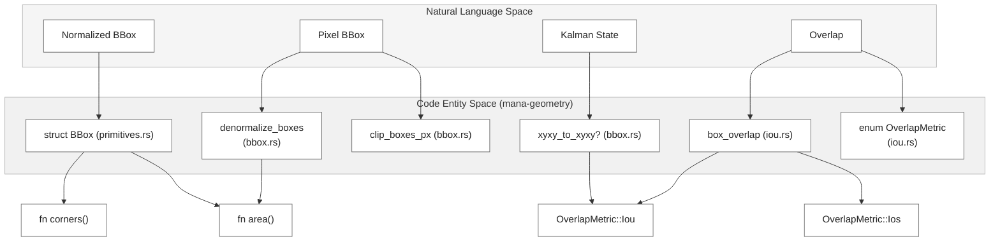
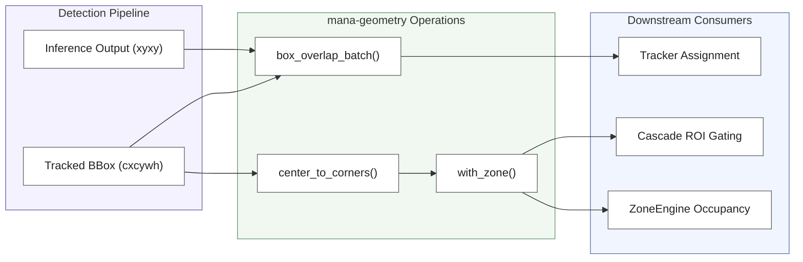

# Bounding Boxes and IoU

Relevant source files

- [](std/mana-geometry/src/bbox.rs)
- [](std/mana-geometry/src/iou.rs)
- [](std/mana-geometry/src/primitives.rs)

The `mana-geometry` crate provides the fundamental spatial primitives and overlap metrics used throughout the pipeline. Bounding boxes are the primary data structure for object localization, serving as the input for Kalman-based tracking and the basis for spatial logic in zone occupancy and model cascading.

## BBox Data Structures

The codebase utilizes two primary representations for bounding boxes: **Corner Format** and **Center Format**.

### Corner Format (`xyxy`)

Represented as a tuple `(x1, y1, x2, y2)`, where `(x1, y1)` is the top-left corner and `(x2, y2)` is the bottom-right corner [std/mana-geometry/src/bbox.rs6-16](std/mana-geometry/src/bbox.rs#L6-L16) This format is typically used for:

- Input/Output of inference engines.
- Clipping and padding operations [std/mana-geometry/src/bbox.rs52-75](std/mana-geometry/src/bbox.rs#L52-L75)
- Calculation of overlap metrics like IoU [std/mana-geometry/src/iou.rs13-18](std/mana-geometry/src/iou.rs#L13-L18)

### Center Format (`cxcywh`)

Represented by the `BBox` struct [std/mana-geometry/src/primitives.rs34-39](std/mana-geometry/src/primitives.rs#L34-L39)

- `cx`, `cy`: Center coordinates.
- `w`, `h`: Width and height.

This format is the standard for internal geometry algebra and is converted to `xcycarh` (center-x, center-y, aspect-ratio, height) for the SORT/DeepSORT Kalman filter measurement space [std/mana-geometry/src/bbox.rs108-118](std/mana-geometry/src/bbox.rs#L108-L118)

### Coordinate Spaces

All internal geometry operations use **Normalized Coordinates** (0.0 to 1.0) relative to the frame dimensions [std/mana-geometry/src/bbox.rs3-4](std/mana-geometry/src/bbox.rs#L3-L4) Conversions to pixel space are performed only for visualization or final output [std/mana-geometry/src/bbox.rs18-22](std/mana-geometry/src/bbox.rs#L18-L22)

## BBox Operations Mapping

The following diagram maps the geometric operations defined in `mana-geometry` to their respective code entities.

**Geometry Operations Map**




**Sources:** [std/mana-geometry/src/bbox.rs1-126](std/mana-geometry/src/bbox.rs#L1-L126) [std/mana-geometry/src/iou.rs7-18](std/mana-geometry/src/iou.rs#L7-L18) [std/mana-geometry/src/primitives.rs33-85](std/mana-geometry/src/primitives.rs#L33-L85)

## Intersection over Union (IoU)

The system supports two primary overlap metrics via `OverlapMetric` [std/mana-geometry/src/iou.rs7-11](std/mana-geometry/src/iou.rs#L7-L11):

1. **IoU (Intersection over Union):** The standard metric for object detection, calculated as `Area(A ∩ B) / Area(A ∪ B)` [std/mana-geometry/src/iou.rs33](std/mana-geometry/src/iou.rs#L33-L33)
2. **IoS (Intersection over Smaller):** Calculated as `Area(A ∩ B) / min(Area(A), Area(B))` [std/mana-geometry/src/iou.rs34](std/mana-geometry/src/iou.rs#L34-L34) This is useful for detecting containment where one box is significantly smaller than the other.

### Batch Processing

For efficiency during tracking assignment, `box_overlap_batch` computes a pairwise overlap matrix between two sets of boxes, returning a row-major flat vector [std/mana-geometry/src/iou.rs46-61](std/mana-geometry/src/iou.rs#L46-L61)

## Integration in Tracking and Cascades

Bounding box logic is critical for two major system behaviors:

### 1. Tracking Assignment

The `Tracker` uses IoU to associate new detections with existing tracks. The overlap matrix generated by `box_overlap_batch` is passed to the Hungarian algorithm to minimize the cost of assignment.

### 2. Cascade Gating

In "cascade" configurations (e.g., detecting a body, then cropping to detect a face), the system uses `with_zone` to determine if a detection falls within a specific region of interest (ROI) [std/mana-geometry/src/iou.rs66-75](std/mana-geometry/src/iou.rs#L66-L75)

**Spatial Logic Data Flow**


```
Inference Output (xyxy)
          │
          ▼
   box_overlap_batch()
          │
          ▼
   Tracker Assignment


Tracked BBox (cxcywh)
          │
          ├──────────────► box_overlap_batch()
          │
          ▼
   center_to_corners()
          │
          ▼
       with_zone()
        │       │
        ▼       ▼
 Cascade ROI   ZoneEngine
   Gating       Occupancy
```



**Sources:** [std/mana-geometry/src/iou.rs46-97](std/mana-geometry/src/iou.rs#L46-L97) [std/mana-geometry/src/bbox.rs6-10](std/mana-geometry/src/bbox.rs#L6-L10)

### Key Functions Reference

|Function|Purpose|File|
|---|---|---|
|`center_to_corners`|Converts `cx, cy, w, h` to `x1, y1, x2, y2`.|[bbox.rs8](bbox.rs#L8-L8)|
|`clamp_box`|Ensures a box stays within `[0, 1]` by shrinking it if necessary.|[bbox.rs133](bbox.rs#L133-L133)|
|`box_overlap`|Calculates IoU/IoS between two boxes.|[iou.rs18](iou.rs#L18-L18)|
|`with_zone`|Specialized IoU between a center-format box and a corner-format zone.|[iou.rs66](iou.rs#L66-L66)|
|`scale_boxes_px`|Resizes boxes around their center by a scale factor.|[bbox.rs80](bbox.rs#L80-L80)|

**Sources:** [std/mana-geometry/src/bbox.rs1-145](std/mana-geometry/src/bbox.rs#L1-L145) [std/mana-geometry/src/iou.rs1-97](std/mana-geometry/src/iou.rs#L1-L97)

