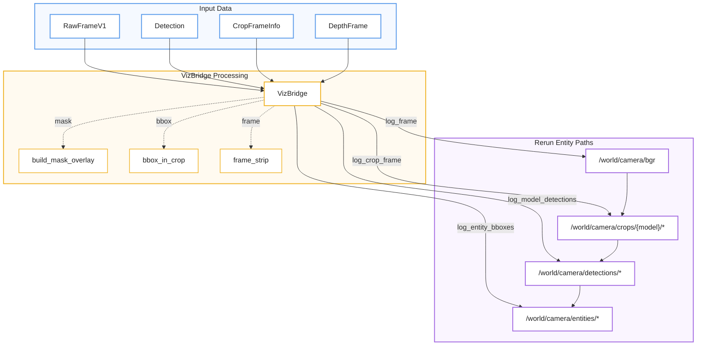
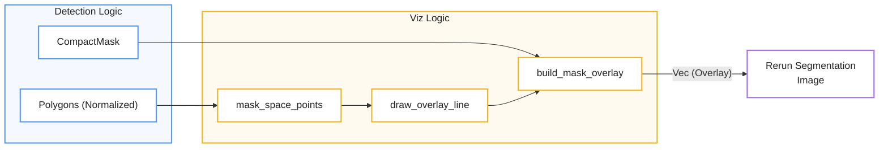

# Frame and Detection Rendering
La documentación detalla el funcionamiento del **VizBridge**, un componente esencial diseñado para **visualizar el estado interno** de un pipeline de inferencia mediante la integración con la herramienta Rerun. El sistema organiza el flujo de datos a través de diversos módulos que permiten **renderizar marcos de video**, detectar objetos mediante cuadros delimitadores y generar **máscaras de segmentación** detalladas con transformaciones de coordenadas precisas. Además de los aspectos visuales, el puente gestiona la **reconstrucción de posturas** mediante puntos clave y monitorea el rendimiento del sistema a través de **métricas de latencia y frecuencia** de procesamiento. En esencia, el texto sirve como una guía técnica para **mapear conceptos lógicos a entidades de código**, garantizando una transmisión eficiente y estructurada de la telemetría visual hacia el servidor de visualización.

Relevant source files

- [](https://github.com/kerrvisiona-sudo/endeli/blob/ad24740d/infer/run_helpers.rs)
- [](https://github.com/kerrvisiona-sudo/endeli/blob/ad24740d/viz/boxes.rs)
- [](https://github.com/kerrvisiona-sudo/endeli/blob/ad24740d/viz/connection.rs)
- [](https://github.com/kerrvisiona-sudo/endeli/blob/ad24740d/viz/frame.rs)
- [](https://github.com/kerrvisiona-sudo/endeli/blob/ad24740d/viz/mask_debug_tests.rs)
- [](https://github.com/kerrvisiona-sudo/endeli/blob/ad24740d/viz/masks.rs)
- [](https://github.com/kerrvisiona-sudo/endeli/blob/ad24740d/viz/mod.rs)

The `VizBridge` provides a comprehensive suite of methods for visualizing the internal state of the inference pipeline using Rerun. This includes rendering raw video frames, model-specific crops, bounding boxes, segmentation masks, and pose keypoints.

## Architecture and Data Flow

Visualization data is logged to a `rerun::RecordingStream` using two primary timelines: `frame_nr` and `frame_time` [viz/mod.rs62-63](https://github.com/kerrvisiona-sudo/endeli/blob/ad24740d/viz/mod.rs#L62-L63) The bridge manages a connection lifecycle with exponential backoff [viz/connection.rs8-51](https://github.com/kerrvisiona-sudo/endeli/blob/ad24740d/viz/connection.rs#L8-L51) and uses a system of toggles (`VizSendToggles`) to control which data types are transmitted to the Rerun server [viz/mod.rs43](https://github.com/kerrvisiona-sudo/endeli/blob/ad24740d/viz/mod.rs#L43-L43)

### Natural Language to Code Entity Mapping: Visualization

| Natural Language Concept | Code Entity                           | File Reference                                                                                       |
| ------------------------ | ------------------------------------- | ---------------------------------------------------------------------------------------------------- |
| **Connection Manager**   | `Inner` enum (Connected/Disconnected) | [viz/mod.rs27-38](https://github.com/kerrvisiona-sudo/endeli/blob/ad24740d/viz/mod.rs#L27-L38)       |
| **Main Interface**       | `VizBridge` struct                    | [viz/mod.rs40-52](https://github.com/kerrvisiona-sudo/endeli/blob/ad24740d/viz/mod.rs#L40-L52)       |
| **Rerun Path Sanitizer** | `sanitize_entity_name`                | [viz/mod.rs79-89](https://github.com/kerrvisiona-sudo/endeli/blob/ad24740d/viz/mod.rs#L79-L89)       |
| **Frame Logging**        | `log_frame` / `log_crop_frame`        | [viz/frame.rs87-119](https://github.com/kerrvisiona-sudo/endeli/blob/ad24740d/viz/frame.rs#L87-L119) |
| **Mask Generator**       | `build_mask_overlay`                  | [viz/masks.rs92-145](https://github.com/kerrvisiona-sudo/endeli/blob/ad24740d/viz/masks.rs#L92-L145) |
| **BBox Helper**          | `boxes2d_from_xyxy`                   | [viz/boxes.rs11-28](https://github.com/kerrvisiona-sudo/endeli/blob/ad24740d/viz/boxes.rs#L11-L28)   |

### VizBridge Data Pipeline



**Sources:** [viz/mod.rs40-52](https://github.com/kerrvisiona-sudo/endeli/blob/ad24740d/viz/mod.rs#L40-L52) [viz/frame.rs87-119](https://github.com/kerrvisiona-sudo/endeli/blob/ad24740d/viz/frame.rs#L87-L119) [viz/boxes.rs83-202](https://github.com/kerrvisiona-sudo/endeli/blob/ad24740d/viz/boxes.rs#L83-L202) [viz/masks.rs92-145](https://github.com/kerrvisiona-sudo/endeli/blob/ad24740d/viz/masks.rs#L92-L145)

## Frame and Crop Rendering

The bridge handles both full-resolution frames and the sub-regions (crops) processed by cascaded models.

- **`log_frame`**: Logs the primary RGB24 video stream to `/world/camera/bgr` [viz/frame.rs87-96](https://github.com/kerrvisiona-sudo/endeli/blob/ad24740d/viz/frame.rs#L87-L96)
- **`log_crop_frame`**: Logs model-specific inference crops to `/world/camera/crops/{model}/bgr` [viz/frame.rs98-119](https://github.com/kerrvisiona-sudo/endeli/blob/ad24740d/viz/frame.rs#L98-L119)
- **`log_model_depth`**: Renders depth maps as colorized images (using `Inferno` colormap) and logs depth statistics like min/max distance [viz/frame.rs121-188](https://github.com/kerrvisiona-sudo/endeli/blob/ad24740d/viz/frame.rs#L121-L188)

**Sources:** [viz/frame.rs11-49](https://github.com/kerrvisiona-sudo/endeli/blob/ad24740d/viz/frame.rs#L11-L49) [viz/frame.rs121-188](https://github.com/kerrvisiona-sudo/endeli/blob/ad24740d/viz/frame.rs#L121-L188)

## Detection and Entity Visualization

Detections are visualized as `rerun::Boxes2D` archetypes. The bridge supports three levels of detection logging:

1. **Raw Model Detections**: Logged per-model to `/world/camera/detections/{model}` [viz/boxes.rs152-202](https://github.com/kerrvisiona-sudo/endeli/blob/ad24740d/viz/boxes.rs#L152-L202)
2. **Consolidated Observations**: The output of the `DetectionConsolidator`, logged to `/world/camera/observations` [viz/boxes.rs111-150](https://github.com/kerrvisiona-sudo/endeli/blob/ad24740d/viz/boxes.rs#L111-L150)
3. **Tracked Entities**: The final output of the Kalman filter tracker, logged to `/world/camera/entities/{id}` [viz/boxes.rs84-109](https://github.com/kerrvisiona-sudo/endeli/blob/ad24740d/viz/boxes.rs#L84-L109)

### Detection Labeling

The function `detection_label` generates standardized strings containing the class name, confidence score, and pixel area/ratio metrics [viz/boxes.rs43-55](https://github.com/kerrvisiona-sudo/endeli/blob/ad24740d/viz/boxes.rs#L43-L55)

**Sources:** [viz/boxes.rs11-28](https://github.com/kerrvisiona-sudo/endeli/blob/ad24740d/viz/boxes.rs#L11-L28) [viz/boxes.rs84-109](https://github.com/kerrvisiona-sudo/endeli/blob/ad24740d/viz/boxes.rs#L84-L109) [viz/boxes.rs152-202](https://github.com/kerrvisiona-sudo/endeli/blob/ad24740d/viz/boxes.rs#L152-L202)

## Segmentation Masks and Polygons

The system supports instance segmentation visualization through a combination of raster overlays and vector polygons.

### Mask Overlay Generation

The `build_mask_overlay` function creates a class-id buffer in mask space [viz/masks.rs92-145](https://github.com/kerrvisiona-sudo/endeli/blob/ad24740d/viz/masks.rs#L92-L145):

- **Background**: Value `0`.
- **Instances**: Values `1..8`, mapped via `PALETTE` [viz/mod.rs68-77](https://github.com/kerrvisiona-sudo/endeli/blob/ad24740d/viz/mod.rs#L68-L77)
- **Contours**: Value `0xFF` (255), representing the polygon border drawn on top of the mask fill [viz/masks.rs91](https://github.com/kerrvisiona-sudo/endeli/blob/ad24740d/viz/masks.rs#L91-L91)

### Coordinate Transformations

Because masks are generated in a local coordinate space, several helpers translate these back to frame space:

- **`bbox_in_crop`**: Translates a global bounding box into a local crop's coordinate system [viz/boxes.rs57-64](https://github.com/kerrvisiona-sudo/endeli/blob/ad24740d/viz/boxes.rs#L57-L64)
- **`frame_strip`**: Converts normalized polygon vertices into frame-pixel coordinates and ensures the loop is closed for Rerun rendering [viz/masks.rs48-54](https://github.com/kerrvisiona-sudo/endeli/blob/ad24740d/viz/masks.rs#L48-L54)
- **`polygon_in_roi`**: Filters and clamps polygon vertices to a specific Region of Interest (ROI) [viz/masks.rs12-44](https://github.com/kerrvisiona-sudo/endeli/blob/ad24740d/viz/masks.rs#L12-L44)

### Mask Space Logic



```
🔵 Detection Logic
   ├── CompactMask ──────────────┐
   │                             │
   └── Polygons (Normalized)     │
             ↓                   │
      mask_space_points          │
             ↓                   │
      draw_overlay_line          │
             └───────┐           │
                     ↓           ↓
              🟡 build_mask_overlay
                       │
                       │ Vec (Overlay)
                       ↓
                 🟣 Rerun
```

**Sources:** [viz/masks.rs12-44](https://github.com/kerrvisiona-sudo/endeli/blob/ad24740d/viz/masks.rs#L12-L44) [viz/masks.rs92-145](https://github.com/kerrvisiona-sudo/endeli/blob/ad24740d/viz/masks.rs#L92-L145) [viz/mask_debug_tests.rs27-40](https://github.com/kerrvisiona-sudo/endeli/blob/ad24740d/viz/mask_debug_tests.rs#L27-L40)

## Pose and Keypoints

For models with the `Skeleton` role [viz/mod.rs141-143](https://github.com/kerrvisiona-sudo/endeli/blob/ad24740d/viz/mod.rs#L141-L143) the bridge logs keypoints using `rerun::Points2D`. Keypoints are filtered by a `POSE_KEYPOINT_CONFIDENCE` threshold (default 0.25) and checked for finiteness before rendering [viz/boxes.rs66-68](https://github.com/kerrvisiona-sudo/endeli/blob/ad24740d/viz/boxes.rs#L66-L68) [viz/mod.rs61](https://github.com/kerrvisiona-sudo/endeli/blob/ad24740d/viz/mod.rs#L61-L61)

**Sources:** [viz/boxes.rs204-245](https://github.com/kerrvisiona-sudo/endeli/blob/ad24740d/viz/boxes.rs#L204-L245)

## Metrics and Latency

The bridge tracks pipeline performance via scalar metrics:

- **`log_decode_latency`**: Measures time spent in the video decoder [viz/state.rs207-212](https://github.com/kerrvisiona-sudo/endeli/blob/ad24740d/viz/state.rs#L207-L212)
- **`log_keyframe_gap`**: Tracks the interval between IDR frames [viz/state.rs214-219](https://github.com/kerrvisiona-sudo/endeli/blob/ad24740d/viz/state.rs#L214-L219)
- **`log_infer_rate`**: Calculates the per-model inference frequency [viz/state.rs221-236](https://github.com/kerrvisiona-sudo/endeli/blob/ad24740d/viz/state.rs#L221-L236)

**Sources:** [viz/state.rs207-236](https://github.com/kerrvisiona-sudo/endeli/blob/ad24740d/viz/state.rs#L207-L236)

Dismiss

Refresh this wiki

This wiki was recently refreshed. Please wait 7 days to refresh again.

### On this page

- [Frame and Detection Rendering](https://deepwiki.com/kerrvisiona-sudo/endeli/6.1-frame-and-detection-rendering#frame-and-detection-rendering)
- [Architecture and Data Flow](https://deepwiki.com/kerrvisiona-sudo/endeli/6.1-frame-and-detection-rendering#architecture-and-data-flow)
- [Natural Language to Code Entity Mapping: Visualization](https://deepwiki.com/kerrvisiona-sudo/endeli/6.1-frame-and-detection-rendering#natural-language-to-code-entity-mapping-visualization)
- [VizBridge Data Pipeline](https://deepwiki.com/kerrvisiona-sudo/endeli/6.1-frame-and-detection-rendering#vizbridge-data-pipeline)
- [Frame and Crop Rendering](https://deepwiki.com/kerrvisiona-sudo/endeli/6.1-frame-and-detection-rendering#frame-and-crop-rendering)
- [Detection and Entity Visualization](https://deepwiki.com/kerrvisiona-sudo/endeli/6.1-frame-and-detection-rendering#detection-and-entity-visualization)
- [Detection Labeling](https://deepwiki.com/kerrvisiona-sudo/endeli/6.1-frame-and-detection-rendering#detection-labeling)
- [Segmentation Masks and Polygons](https://deepwiki.com/kerrvisiona-sudo/endeli/6.1-frame-and-detection-rendering#segmentation-masks-and-polygons)
- [Mask Overlay Generation](https://deepwiki.com/kerrvisiona-sudo/endeli/6.1-frame-and-detection-rendering#mask-overlay-generation)
- [Coordinate Transformations](https://deepwiki.com/kerrvisiona-sudo/endeli/6.1-frame-and-detection-rendering#coordinate-transformations)
- [Mask Space Logic](https://deepwiki.com/kerrvisiona-sudo/endeli/6.1-frame-and-detection-rendering#mask-space-logic)
- [Pose and Keypoints](https://deepwiki.com/kerrvisiona-sudo/endeli/6.1-frame-and-detection-rendering#pose-and-keypoints)
- [Metrics and Latency](https://deepwiki.com/kerrvisiona-sudo/endeli/6.1-frame-and-detection-rendering#metrics-and-latency)

...Relevant...

Ask Devin about kerrvisiona-sudo/endeli

Fast

Syntax error in textmermaid version 11.7.0

Syntax error in textmermaid version 11.7.0

Syntax error in textmermaid version 11.7.0

Add to ContextPress Q